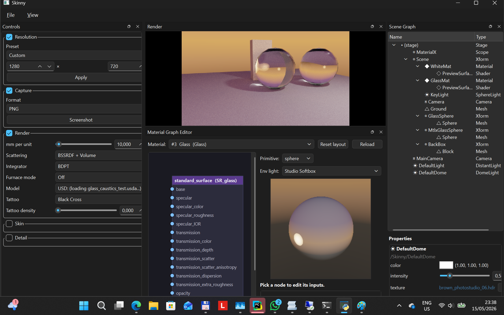
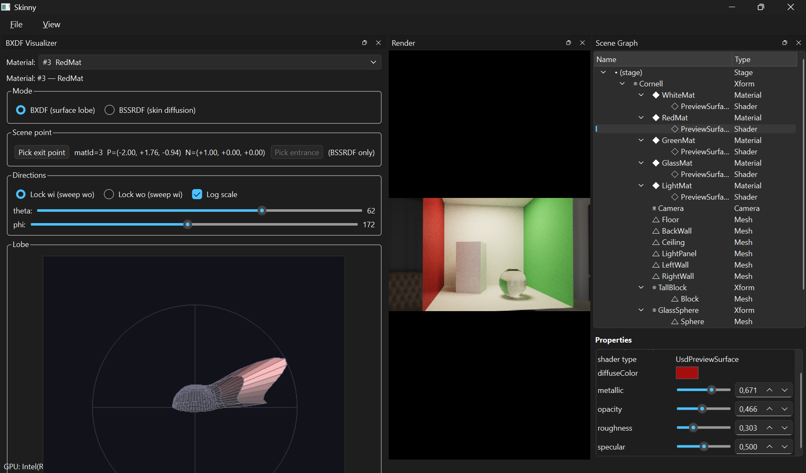
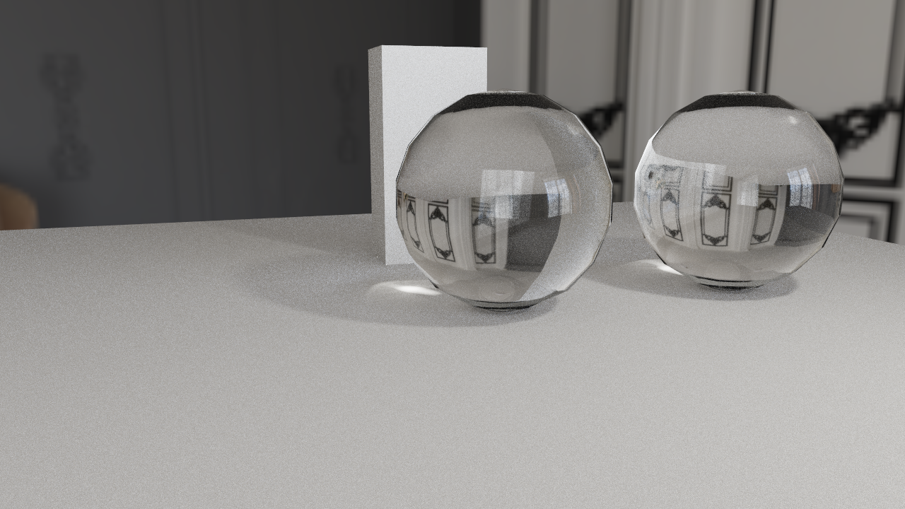

# Skinny

> **Note:** This project is developed with [Claude Code](https://claude.ai/claude-code)
> and serves as a testbed for experimenting with new rendering algorithms.
> The codebase evolves rapidly and stability is not guaranteed.

Skinny is a physically based renderer built on a Vulkan compute shader
pipeline. It started as a human skin rendering testbed -- and retains
first-class skin support -- but the core pipeline handles arbitrary MaterialX
materials, OpenUSD scenes, ray-traced geometry, image-based lighting,
microfacet specular, and energy-conservation checks.

## Gallery

<p align="center">
  
  
  
</p>

## Features

- **Three-layer skin optics** -- epidermis (melanin), dermis (hemoglobin + ink),
  subcutaneous fat, each with independent absorption, scattering, thickness, and
  anisotropy
- **MaterialX material pipeline** -- custom `ND_skinny_skin_*` layer nodedefs
  plus a `ND_skinny_layered_skin_stack` combiner, code-generated to Slang via
  `MaterialXGenSlang`
- **MaterialX nodegraph compute** -- arbitrary MaterialX nodegraphs (marble,
  wood, brass, custom standard_surface authoring) compiled per-material to
  Slang modules through `MaterialXGenSlang` plus a bindless `SamplerTexture2D`
  shim (`mtlx_gen_shim.slang`); SPIR-V cache (mtime-LRU, ~32 entries) skips
  recompilation
- **OpenUSD scene loading** -- meshes, transforms, `UsdShade.Material` bindings,
  lights (`DomeLight`, `DistantLight`, `SphereLight`, `RectLight`), and
  per-prim material assignment
- **Flat material support** -- USD prims bound to `UsdPreviewSurface` or
  MaterialX `standard_surface` render alongside skin materials in the same scene,
  with opacity / refraction, clear coat, and cutout alpha masking
- **MIS path tracing** -- unified bounce loop with per-bounce NEE, Russian
  roulette, and sphere-light MIS; materials provide BSDF sample/evaluate
- **Bidirectional path tracing** -- BDPT integrator with light-tracer splatting
  for caustics on flat materials; Veach §10 MIS weighting
- **Scattering modes** -- BSSRDF + Volume, BSSRDF only, Volume only, or Off,
  selectable per scene
- **Furnace mode** -- unit-sphere + white-environment energy conservation test;
  violations tinted pink; supports per-material furnace probes
- **Realistic lens camera** -- pinhole + PBRT-v3 thick-lens stack
  (`shaders/cameras/`); per-pixel exit-pupil bounding (`lens_optics.py`) so
  small f-stops don't shrink the rendered area; on-screen focus / vignette
  overlays (`L`, `V`)
- **Camera debug viewport** -- second window (or embedded dock) rendering
  frustum, lens rings, focus / DOF planes, mesh wireframes, AABBs, ground
  grid, and a camera-body glyph
- **Rotate gizmo** -- screen-space ring gizmo (`gizmo.py`) for selected mesh
  instance; line list composited by `main_pass.slang`
- **BVH caching** -- zstd-compressed mesh/BVH data cached to disk
  (`~/.skinny/mesh_cache/`) for fast reload
- **Fitzpatrick I--VI presets** -- male/female variants covering the clinical
  skin-colour axis
- **Detail layer** -- statistical pores and vellus hair sheen
- **Tattoo support** -- alpha-driven ink density in the dermis layer
- **Qt desktop UI** -- single-window `skinny-gui` (PySide6) with render
  viewport docked alongside collapsible sidebar, BXDF visualiser, MaterialX
  graph editor, scene graph inspector, and debug viewport docks; sidebar
  open/closed state persists across sessions
- **Web mode** -- Panel (HoloViz) browser UI sharing the same widget-tree
  spec as Qt, with per-user server-side rendering, H264 streaming over
  WebSocket, hardware-accelerated encoding (NVENC / QSV / AMF), and
  WebCodecs decoding in the browser
- **Multi-user sessions** -- up to 4 concurrent browser sessions, each with
  independent renderer, camera, and parameters
- **GPU selection** -- `--gpu {intel,nvidia,amd,discrete,auto}` flag on all
  entry points
- **Persistent settings** -- parameter snapshots saved and restored between
  sessions

## Requirements

- Python 3.11 or newer
- Vulkan 1.2 capable GPU and current graphics driver
- Slang compiler (`slangc`) on `PATH`
- GLFW-compatible desktop environment (only required for the `skinny`
  shader-debug entry; `skinny-gui` runs on Qt and `skinny-web` is headless)

Python dependencies (`pyproject.toml`):

| Package | Purpose |
|---------|---------|
| `numpy` | Linear algebra, mesh processing |
| `slangpy` | Slang shader compilation and reflection |
| `vulkan` | Vulkan API bindings |
| `glfw` | Window creation and input (debug entry) |
| `PySide6` | Qt desktop UI |
| `Pillow` | Image I/O (HDR, textures, tattoos) |
| `imageio[freeimage]` | HDR / EXR screenshot output |
| `MaterialX` | Material definitions and Slang code generation |

Optional:

| Package | Purpose |
|---------|---------|
| `usd-core` | OpenUSD scene loading (`pip install -e ".[usd]"`) |
| `panel` | Web UI framework (`pip install -e ".[web]"`) |
| `bokeh` | Panel dependency (Tornado server) |
| `av` (PyAV) | H264 video encoding via FFmpeg bindings |

## Setup

```powershell
python -m venv .
.\Scripts\python -m pip install --upgrade pip
.\Scripts\python -m pip install -e .
```

For USD scene support:

```powershell
.\Scripts\python -m pip install -e ".[usd]"
```

For web mode (Panel + H264 streaming):

```powershell
.\Scripts\python -m pip install -e ".[web]"
```

For development tools:

```powershell
.\Scripts\python -m pip install -e ".[dev]"
```

Verify the Slang compiler:

```powershell
slangc -version
```

## Running

Three entry points share the renderer core:

| Command | UI | Use case |
|---------|----|----|
| `skinny-gui` | Qt (PySide6) | Primary desktop app — viewport dock, sidebar, tool docks |
| `skinny-web` | Panel + browser | Multi-user H264 streaming over WebSocket |
| `skinny` | GLFW + keyboard | Headless shader-debug loop (no widgets) |

### Qt desktop (`skinny-gui`)

```powershell
.\Scripts\skinny-gui.exe
.\Scripts\skinny-gui.exe assets/demo_head.usda
.\Scripts\skinny-gui.exe --gpu nvidia assets/Usd-Mtlx-Example/scene.usda
```

Layout:

- Central dock: render viewport (mouse drag = orbit, right-drag = pan,
  scroll = zoom)
- Left dock: collapsible parameter sidebar (Render / Skin / Detail /
  Materials sections, generated from the shared widget-tree spec)
- View menu: BXDF visualiser, MaterialX graph editor, scene graph
  inspector, camera debug viewport (each a `QDockWidget`)

Any `.usda` / `.usdc` / `.usdz` file with MaterialX-bound or
`UsdPreviewSurface`-bound materials will load. The renderer has been tested
with the [Usd-Mtlx-Example](https://github.com/pablode/Usd-Mtlx-Example)
repository.

### Web mode (`skinny-web`)

```powershell
.\Scripts\skinny-web.exe --port 8080
.\Scripts\skinny-web.exe --port 8080 --usd assets/Usd-Mtlx-Example/scene.usda
```

Open `http://localhost:8080/skinny` in a browser. Each tab gets an independent
renderer session with its own camera and parameters. Video is H264-encoded
server-side and decoded via WebCodecs in the browser.

| Flag | Default | Description |
|------|---------|-------------|
| `--port` | 8080 | Server port |
| `--gpu` | auto | GPU selection: `intel`, `nvidia`, `amd`, `discrete`, `auto` |
| `--max-sessions` | 4 | Max concurrent browser sessions |
| `--usd` | — | Path to USD scene (alternative to positional arg) |
| `--usdMtlx` | off | Use USD's built-in usdMtlx plugin instead of MaterialX API fallback |

### GLFW shader-debug entry (`skinny`)

```powershell
.\Scripts\skinny.exe assets/demo_head.usda
```

Keyboard-driven loop with no Qt overhead. Useful for fast iteration on Vulkan
or Slang code where the Qt event loop gets in the way.

### Mesh heads (legacy)

Place `.obj` files (with optional normal/roughness/displacement maps) in
`heads/<name>/` directories. They are discovered automatically at startup.

## Controls

Keyboard and mouse controls are shown in the on-screen HUD when running the
GLFW debug entry. Qt and web entries use widget-driven input plus the
shortcuts below forwarded to the viewport.

| Input | Action |
|-------|--------|
| Left drag | Orbit camera (orbit mode) / look around (free mode) |
| Right drag | Pan orbit target |
| Scroll | Zoom (orbit) / adjust speed (free) |
| `C` | Toggle orbit / free camera |
| `W A S D` | Move in free-camera mode |
| `Q / E` | Move down / up in free-camera mode |
| `Tab / Shift+Tab` | Next / previous parameter (debug entry) |
| Arrow keys | Adjust selected parameter (debug entry) |
| `1`--`9` | Jump to parameter (debug entry) |
| `F` | Recenter camera |
| `R` | Reset parameters |
| `P` | Print all parameters |
| `H` | Print help |
| `L` | Toggle lens focus overlay |
| `V` | Toggle lens vignette debug (green=ray valid, red=clipped) |
| `Z` | Arm zoom rectangle (drag in viewport, release to apply) |
| `X` | Reset zoom rectangle |
| `F2` | Toggle camera debug viewport dock / window |
| `Space / F1` | Toggle HUD |
| `Esc` | Quit |

## Assets

### HDR Environments

Radiance `.hdr` (and discovered sibling `.exr` / `.pfm`) files in `hdrs/`. The
helper script `src/skinny/fetch_hdrs.py` documents the curated Poly Haven
HDRIs used for portrait/skin lighting. The Qt and web sidebars expose a
"Load HDR" picker that scans the chosen file's directory for additional
formats.

### Head Models

The analytic fallback is an SDF head based on Loomis-style proportions.
Additional mesh heads are discovered from `heads/`:

- Each subdirectory containing an `.obj` becomes one model
- Loose top-level `.obj` files are also loaded
- Texture maps are matched by filename keyword:
  `normal`/`nrm`/`nor`, `rough`/`roughness`, `displacement`/`disp`/`height`/`bump`

Displacement can be baked into the mesh after midpoint subdivision.

### USD Scenes

Example scenes ship in `assets/`:

| File | Description |
|------|-------------|
| `demo_head.usda` | Head mesh with layered skin material |
| `cornell_box_emissive.usda` | Cornell box with emissive geometry |
| `cornell_box_rectlight.usda` | Cornell box with rect light |
| `cornell_box_sphere.usda` | Cornell box with sphere light |
| `dual_skin_demo.usda` | Two prims with different skin materials |
| `glass_caustics_test.usda` | Glass material refraction / caustics test |
| `mtlx_skin_demo.usda` | MaterialX skin material demo |
| `skin_sphere_light_demo.usda` | Skin under sphere lighting |
| `test_scene.usda` | Multi-material test scene |
| `three_materials_demo.usda` | Marble + wood + brass MaterialX nodegraphs |

### Tattoos

Tattoo images in `tattoos/`. Alpha drives ink density; RGB drives pigment
colour contribution in the dermis.

## Rendering Modes

### Scattering

| Mode | Description |
|------|-------------|
| BSSRDF + Volume | Both subsurface estimators active |
| BSSRDF only | Smooth layered diffuse response |
| Volume only | Delta-tracked transport through layered medium |
| Off | Surface-only shading |

### Sampling

Two integrators selectable at runtime:

| Strategy | Description |
|----------|-------------|
| Path tracing | Unidirectional with MIS; each estimator pairs a primary sampler with a companion via power heuristic |
| BDPT | Bidirectional path tracer with light-tracer splatting for caustics; 4-vertex subpaths, Lambertian connection approximation |

### Furnace Mode

Swaps the scene to a unit sphere under unit-white radiance. Pixels exceeding
energy conservation tolerance are tinted pink. Supports global and
per-material furnace probes.

## MaterialX Skin Model

Skinny defines custom MaterialX nodedefs in `src/skinny/mtlx/`:

### Layer nodedefs (each produces a `scatteringlayer`)

- **`ND_skinny_skin_epidermis`** -- melanin absorption + scattering
- **`ND_skinny_skin_dermis`** -- hemoglobin + blood oxygenation + optional ink
- **`ND_skinny_skin_subcut`** -- fixed-physics fat layer
- **`ND_skinny_scattering_layer`** -- generic escape hatch for non-skin media

### Stack nodedef

- **`ND_skinny_layered_skin_stack`** -- combines three layers into
  `surfaceshader` + `volumeshader` outputs with GGX specular, detail
  (pores/hair), and per-layer volume transport

### Slang implementations

Function-form Slang implementations live in `src/skinny/mtlx/genslang/` and are
referenced by `<implementation target="genslang">` tags in the nodedef files.

## Implementation Map

### Python entry points

| File | Purpose |
|------|---------|
| `app.py` | GLFW shader-debug entry — keyboard + window only |
| `ui/qt/app.py` | `skinny-gui` Qt entry — `MainWindow`, viewport + docks |
| `web_app.py` | Panel web app, per-session renderer, Tornado video WebSocket |

### Renderer + scene

| File | Purpose |
|------|---------|
| `renderer.py` | Vulkan resources, uniforms, environment/mesh/texture upload, frame loop |
| `scene.py` | Scene graph data classes (`MeshInstance`, `Material`, `Light*`, `Scene`) |
| `usd_loader.py` | USD stage to `Scene` conversion (with MaterialX API fallback) |
| `materialx_runtime.py` | MaterialX document loading, Slang code generation, uniform packing |
| `mesh.py` | OBJ loading, normalization, subdivision, displacement, BVH construction |
| `mesh_cache.py` | On-disk BVH cache (zstd-compressed vertex/index/BVH blobs) |
| `environment.py` | Built-in and HDR environment loading |
| `head_textures.py` | Detail map loading (normal, roughness, displacement) at 2048² |
| `presets.py` | Fitzpatrick I--VI presets and user preset save/load |
| `tattoos.py` | Tattoo image loading |
| `params.py` | Shared parameter definitions (`ParamSpec`), get/set helpers |
| `settings.py` | User settings persistence |
| `fetch_hdrs.py` | Poly Haven HDRI download helper |
| `lens_optics.py` | PBRT-v3 thick-lens helpers (CPU exit-pupil bounding) |
| `bxdf_math.py` | CPU BSDF eval + lobe rasterisation for the BXDF visualiser |
| `gizmo.py` | Rotate gizmo math + line-list buffer building |
| `debug_viewport.py` | Second-window camera/lens/wireframe debug renderer |
| `mtlx_graph_view.py` | View-model for MaterialX nodegraph editor |
| `scene_graph.py` | USD prim hierarchy tree model with typed editable properties |

### Backend abstractions

| File | Purpose |
|------|---------|
| `gfx/backend.py` | `Backend` ABC — shader target, caps, device, presenter |
| `gfx/device.py` | Device abstraction over queues / allocators |
| `gfx/presenter.py` | Surface / swapchain abstraction (None for headless) |
| `gfx/vulkan/` | Vulkan implementation of `Backend` / `Device` / `Presenter` |
| `gfx/metal/` | Metal stub (placeholder for future native macOS backend) |
| `vk_context.py` | Vulkan instance, device, queue setup (windowed + headless) |
| `vk_compute.py` | Compute pipeline, descriptor layout, GPU buffer/image helpers |
| `hardware.py` | GPU enumeration, vendor detection, encoder selection |
| `video_encoder.py` | H264/JPEG encoding with hardware-aware fallback chain |

### UI

| File | Purpose |
|------|---------|
| `ui/spec.py` | Pure dataclass widget tree — no Qt / Panel imports |
| `ui/build_app_ui.py` | Builds the shared sidebar tree (used by Qt + Panel) |
| `ui/direction_math.py` | Light-direction picker math (shared math, no UI deps) |
| `ui/qt/backend.py` | Walks the spec tree, instantiates Qt widgets |
| `ui/qt/viewport.py` | `RenderViewport` Qt widget — embeds the renderer's offscreen image |
| `ui/qt/camera_input.py` | Mouse → camera mapping for the viewport |
| `ui/qt/direction_picker.py` | Hemisphere widget |
| `ui/qt/windows/scene_graph.py` | Scene graph inspector dock (tree above, properties below) |
| `ui/qt/windows/material_graph.py` | MaterialX nodegraph editor dock |
| `ui/qt/windows/bxdf.py` | BXDF visualiser dock with material picker |
| `ui/qt/windows/debug_viewport.py` | Camera debug viewport dock |
| `ui/panel/backend.py` | Walks the spec tree, instantiates Panel widgets |
| `ui/panel/windows.py` | Panel ports of scene graph / BXDF / material graph / debug viewport |

### Shaders (Slang)

| File | Purpose |
|------|---------|
| `main_pass.slang` | Primary camera path, progressive accumulation, tone mapping |
| `preview_pass.slang` | Material preview tile renderer |
| `common.slang` | Shared types, `FrameConstants`, `MtlxSkinParams` UBO layout |
| `bindings.slang` | Descriptor set bindings |
| `interfaces.slang` | `ISampler`, `IMaterial`, `ILight`, `IIntegrator` |
| `scene_trace.slang` | TLAS/BLAS ray traversal |
| `scene_lights.slang` | Light sampling (distant, sphere, rect, emissive tri) |
| `mesh_head.slang` | BVH traversal and ray/triangle intersection |
| `sdf_head.slang` | Analytic SDF head |
| `environment.slang` | Environment lookup and furnace fallback |
| `volume_render.slang` | Delta-tracked volume transport through layered medium |
| `mtlx_std_surface.slang` | MaterialX `standard_surface` approximation |
| `mtlx_closures.slang` | MaterialX closure helpers |
| `mtlx_noise.slang` | MaterialX noise functions |
| `mtlx_gen_shim.slang` | Bindless `SamplerTexture2D` shim for generated MaterialX modules |
| `debug_line.slang` | Vertex/fragment pipeline for the debug viewport line list |
| `cameras/pinhole.slang` | Pinhole camera ray gen |
| `cameras/thick_lens.slang` | PBRT-v3 thick-lens ray gen |
| `materials/skin/skin_material.slang` | Skin shading entry point (specular + BSSRDF + volume dispatch) |
| `materials/skin/skin_bssrdf.slang` | Layered skin optics, BSSRDF, GGX specular |
| `materials/skin/skin_shading.slang` | Skin data loading, detail maps, tattoo |
| `materials/skin/skin_direct.slang` | §1 direct + area + emissive light estimator |
| `materials/skin/skin_ibl_specular.slang` | §2 IBL specular estimator |
| `materials/skin/skin_ibl_diffuse.slang` | §3 IBL diffuse estimator |
| `materials/skin/skin_volume.slang` | §4 volume march estimator |
| `materials/skin/skin_transmission.slang` | §5 thin-geometry translucency |
| `materials/skin/skin_hair_sheen.slang` | §6 vellus hair sheen |
| `materials/skin/detail.slang` | Statistical pores and vellus hair sheen helpers |
| `materials/flat/flat_material.slang` | Flat (non-skin) BSDF: sample/evaluate via `IMaterial` |
| `materials/flat/flat_shading.slang` | Flat-material data loading, GGX helpers, procedural color |
| `materials/debug_normal_material.slang` | Normal visualisation `IMaterial` |
| `samplers/{ggx,lambert,uniform_sphere,henyey_greenstein,mis_combine}.slang` | Sampler library + MIS power heuristic |
| `lights/{sphere,emissive_triangle,directional}_light.slang` | `ILight` implementations |
| `integrators/{path,bdpt}.slang` | `IIntegrator` implementations |

## Papers and References

| Area | Files | Reference |
|------|-------|-----------|
| Subsurface transport | `materials/skin/skin_bssrdf.slang` | Jensen, Marschner, Levoy, Hanrahan, "A Practical Model for Subsurface Light Transport", SIGGRAPH 2001 |
| Quantized diffusion | `materials/skin/skin_bssrdf.slang` | d'Eon and Irving, "A Quantized-Diffusion Model for Rendering Translucent Materials", SIGGRAPH/TOG 2011 |
| Normalized diffusion | `materials/skin/skin_bssrdf.slang` | Christensen and Burley, "Approximate Reflectance Profiles for Efficient Subsurface Scattering", Disney/SIGGRAPH 2015 |
| Human skin optics | `materials/skin/skin_bssrdf.slang`, `presets.py` | Donner and Jensen, "A Spectral BSSRDF for Shading Human Skin", EGSR 2006 |
| Real-time skin pipeline | `renderer.py`, `mesh_head.slang`, `sdf_head.slang` | d'Eon and Luebke, "Advanced Techniques for Realistic Real-Time Skin Rendering", GPU Gems 3 Ch. 14, 2007 |
| MIS | `samplers/mis_combine.slang`, `integrators/bdpt.slang`, `volume_render.slang` | Veach, "Robust Monte Carlo Methods for Light Transport Simulation", PhD thesis, 1997 |
| Bidirectional path tracing | `integrators/bdpt.slang` | Veach and Guibas, "Bidirectional Estimators for Light Transport", 1995 |
| Bidirectional path tracing | `integrators/bdpt.slang` | Lafortune and Willems, "Bi-Directional Path Tracing", 1993 |
| GGX microfacet | `materials/skin/skin_bssrdf.slang` | Walter, Marschner, Li, Torrance, "Microfacet Models for Refraction through Rough Surfaces", EGSR 2007 |
| Fresnel approximation | `materials/skin/skin_bssrdf.slang`, `materials/skin/detail.slang` | Schlick, "An Inexpensive BRDF Model for Physically-Based Rendering", 1994 |
| Henyey-Greenstein phase | `volume_render.slang` | Henyey and Greenstein, "Diffuse Radiation in the Galaxy", 1941 |
| Delta/Woodcock tracking | `volume_render.slang` | Woodcock et al., "Techniques Used in the GEM Code for Monte Carlo Neutronics Calculations", 1965 |
| Ray/triangle intersection | `mesh_head.slang` | Moeller and Trumbore, "Fast, Minimum Storage Ray/Triangle Intersection", 1997 |
| Realistic camera | `lens_optics.py`, `shaders/cameras/thick_lens.slang` | Pharr, Jakob, Humphreys, *Physically Based Rendering 3e*, Ch. 6 |

Supporting techniques (ACES tone mapping, PCG hashing, median-split BVH,
Worley noise, Box-Muller sampling, Loomis-style head proportions) are standard
implementation building blocks.

## Testing

The test suite covers shader math, sampling, lighting, volume rendering,
struct layout, MaterialX closures, MaterialX nodegraph compilation, skin
optics, headless rendering, SlangPile transpilation, the shared widget-tree
spec, and the web application. Tests are organized by subsystem with Slang
harness shaders in `tests/harnesses/` and reference kernels in
`tests/kernels/`.

```powershell
.\Scripts\python -m pytest
```

GPU-dependent tests are marked `@pytest.mark.gpu`; statistical Monte Carlo
tests are marked `@pytest.mark.slow`; SlangPile-specific tests are marked
`@pytest.mark.slangpile`.

## Development

Compile Python:

```powershell
.\Scripts\python -m py_compile src\skinny\app.py src\skinny\renderer.py
```

Compile main shader:

```powershell
slangc src\skinny\shaders\main_pass.slang -target spirv -entry mainImage -stage compute -o src\skinny\shaders\main_pass.spv -I src\skinny\shaders
```

## License

MIT
