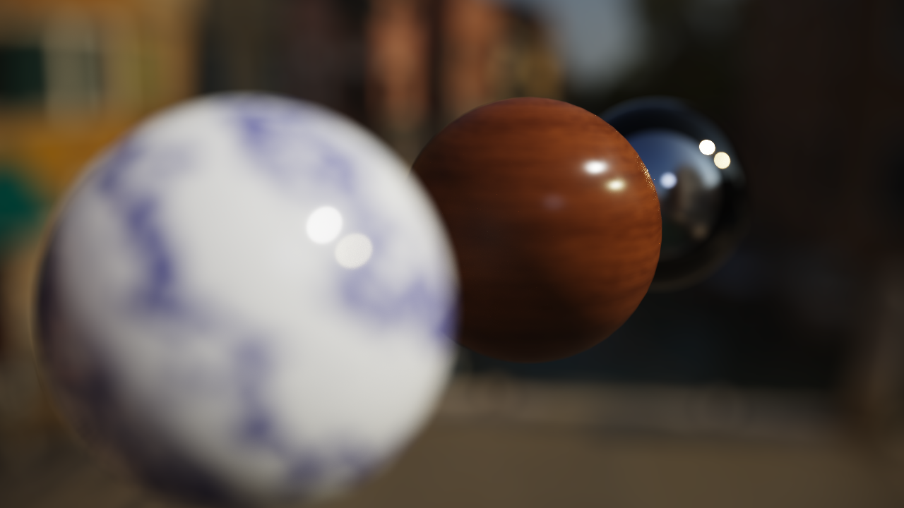
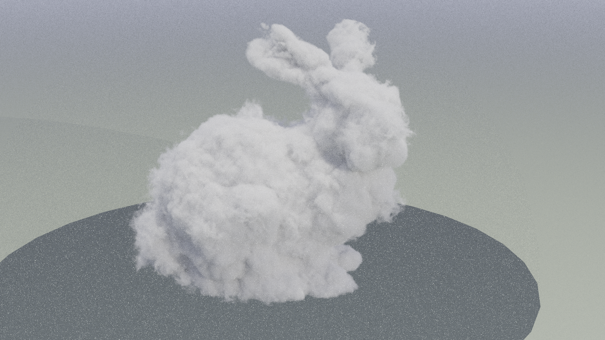
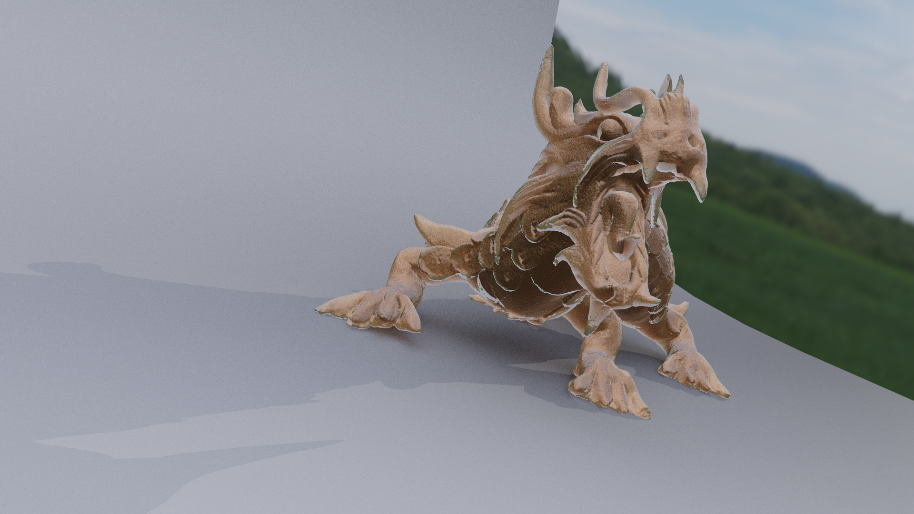
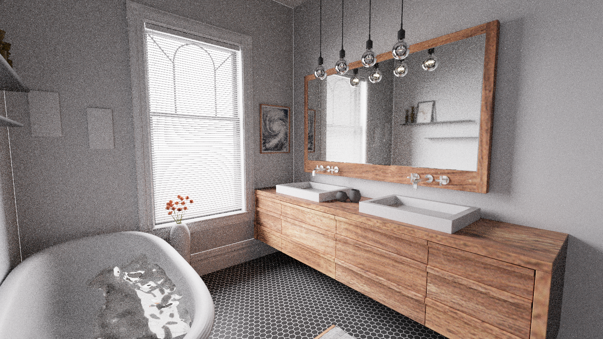
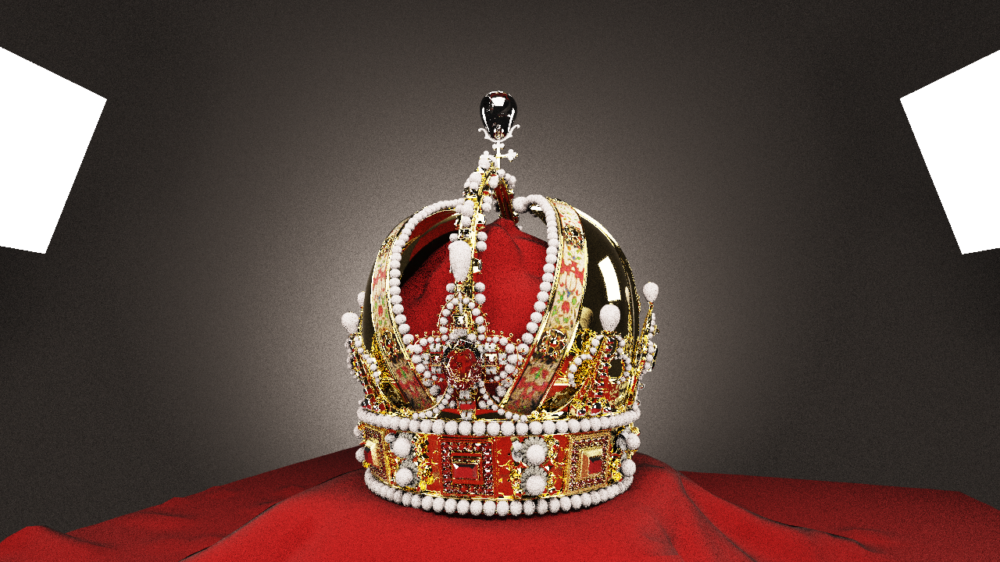
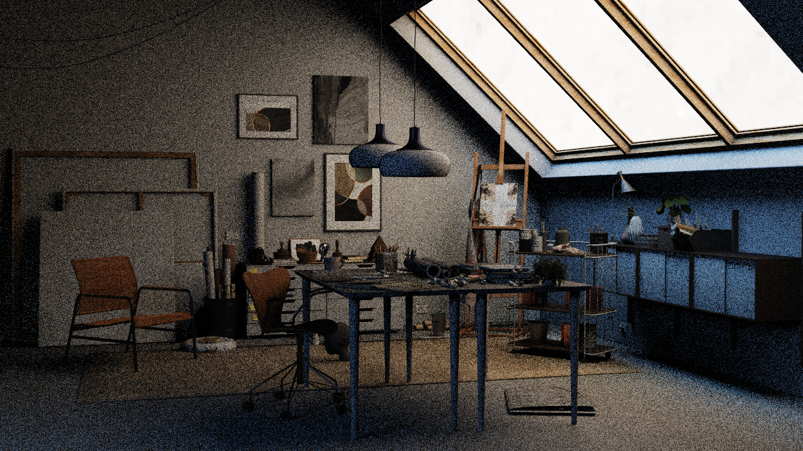
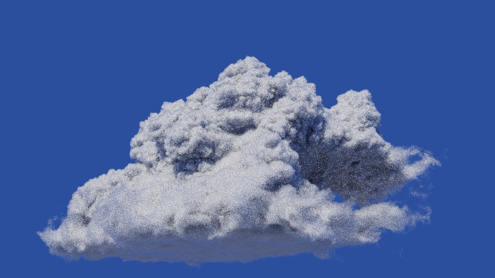

# Skinny

> **Note:** This project is developed with [Claude Code](https://claude.ai/claude-code)
> and serves as a testbed for experimenting with new rendering algorithms.
> The codebase evolves rapidly and stability is not guaranteed.

Skinny is a physically based renderer built on a Vulkan compute shader
pipeline. It started as a human skin rendering testbed -- and retains
first-class skin support -- but the core pipeline handles arbitrary MaterialX
materials, OpenUSD scenes, ray-traced geometry, image-based lighting,
microfacet specular, and energy-conservation checks.

Skin-specific rendering (three-layer optics, scattering modes, MaterialX skin
nodedefs, head geometry, presets, tattoos) is documented separately in
[SkinRendering.md](docs/SkinRendering.md). Renderer internals are in
[Architecture.md](docs/Architecture.md); the two GPU execution modes in
[Megakernel.md](docs/Megakernel.md) / [Wavefront.md](docs/Wavefront.md); ReSTIR
direct-lighting reuse in [ReSTIR.md](docs/ReSTIR.md); the GPU SPPM photon-mapping
integrator in [PhotonMapping.md](docs/PhotonMapping.md); the SplineFlow neural
path guiding proposal in [NeuralGuiding.md](docs/NeuralGuiding.md), with its
first-principles theory companion in [SplineFlows.md](docs/SplineFlows.md);
hero-wavelength spectral rendering in [Spectral.md](docs/Spectral.md); the
public Python API in [PythonAPI.md](docs/PythonAPI.md).

## Gallery

<p align="center">
  
  
  
</p>
<p align="center">
  
</p>
<p align="center">
  These images are rendered from PBRT v4 scenes.
</p>
<p align="center">
  
  
  
</p>
<p align="center">
  
  
  
</p>

## Features

- **Layered skin rendering** -- three-layer biological optics (epidermis /
  dermis / subcutaneous), custom MaterialX skin nodedefs, scattering modes,
  Fitzpatrick presets, detail/pores, and tattoos. See
  [SkinRendering.md](docs/SkinRendering.md)
- **MaterialX nodegraph compute** -- arbitrary MaterialX nodegraphs (marble,
  wood, brass, custom standard_surface authoring) compiled per-material to
  Slang modules through `MaterialXGenSlang` plus a bindless `SamplerTexture2D`
  shim (`mtlx_gen_shim.slang`); SPIR-V cache (mtime-LRU, ~32 entries) skips
  recompilation
- **OpenUSD scene loading** -- meshes, transforms, `UsdShade.Material` bindings,
  lights (`DomeLight`, `DistantLight`, `SphereLight`, `RectLight`), and
  per-prim material assignment
- **USD animation playback** -- time-sampled transform / camera / light tracks
  play in the viewport via a built-in transport (play/pause, scrubber, fps);
  cheap per-frame re-eval (TLAS/​light re-upload, no rebake) with a `usd` camera
  mode that follows an animated USD camera
- **UsdSkel skeletal skinning** -- skinned meshes deform per frame by linear
  blend skinning; on Vulkan a GPU skinning compute pass + GPU BVH refit keep the
  path tracer correct over deformed geometry with no readback (CPU fallback
  elsewhere)
- **USD-driven scene controls** -- a stage declares its own control panel via
  `skinny:ui:*` prims (slider / toggle / combo / color); each control binds to a
  renderer parameter, a material input, or a USD attribute and appears in a
  "Scene Controls" section across the Qt, web, and debug front-ends
- **Flat material support** -- USD prims bound to `UsdPreviewSurface`, MaterialX
  `standard_surface`, or `OpenPBR` render alongside skin materials in the same
  scene, with opacity / refraction, clear coat, and cutout-vs-alpha-blend
  masking. UsdPreviewSurface textures honour per-input channel selection,
  normal-map scale/bias (OpenGL vs DirectX Y), and wrap modes. The flat path now
  also consumes the richer `standard_surface` inputs **colored glass**
  (`transmission_color` tints the refracted delta-transmission branch),
  **tinted speculars** (`specular_color` scales the GGX spec response), and
  **Oren-Nayar diffuse** (`diffuse_roughness` drives a rough-diffuse response,
  `0` ⇒ exact Lambert) — all weight/response-only, so absent inputs reproduce the
  prior render exactly
- **Python-authored materials** -- SlangPile `python_materials/*.py` compile to
  GPU `IMaterial` structs, dispatched as material type 3; editable live in the
  Qt material editor
- **MIS path tracing** -- unified bounce loop with per-bounce NEE, Russian
  roulette, and sphere-light MIS; materials provide BSDF sample/evaluate
- **Environment importance sampling** -- equirect HDR sampled by a
  sin θ-weighted 2D distribution for env NEE + MIS, with VNDF GGX specular
  sampling, killing specular environment fireflies
- **Bidirectional path tracing** -- BDPT integrator with light-tracer splatting
  for caustics on flat materials; connections evaluate the real
  `standard_surface` BSDF, env importance sampling matched to the path tracer;
  Veach §10 MIS weighting
- **Stochastic Progressive Photon Mapping** -- caustic-efficient SPPM integrator
  (`--integrator sppm`): per-pass eye → spatial-hash grid → photon → radius/flux
  update, with the per-pixel estimator persisting across accumulation frames;
  wavefront-only, flat materials, Vulkan now (native Metal is a follow-up). See
  [docs/PhotonMapping.md](docs/PhotonMapping.md)
- **Furnace mode** -- unit-sphere + white-environment energy conservation test;
  violations tinted pink; supports per-material furnace probes
- **Realistic lens camera** -- pinhole + PBRT-v3 thick-lens stack
  (`shaders/cameras/`); per-pixel exit-pupil bounding (`lens_optics.py`) so
  small f-stops don't shrink the rendered area; on-screen focus / vignette
  overlays (`L`, `V`)
- **Camera debug viewport** -- second window (or embedded dock) rendering
  frustum, lens rings, focus / DOF planes, mesh wireframes, AABBs, ground
  grid, and a camera-body glyph
- **Transform gizmo** -- screen-space gizmo (`gizmo.py`) for the selected mesh
  instance: rotate rings or translate arrows, in world or local space, cycled
  with `Space` (a `W`/`L` glyph hints the coordinate space); line list
  composited by `main_pass.slang`
- **Exposure + tonemapping** -- EV-stop exposure and selectable tonemap
  operator (ACES filmic / Reinhard / Hable / linear) as post-process knobs that
  don't reset accumulation; HDR/EXR screenshot export
- **BVH caching** -- zstd-compressed mesh/BVH data cached to disk
  (`~/.skinny/mesh_cache/`) for fast reload
- **Qt desktop UI** -- single-window `skinny-gui` (PySide6) with render
  viewport docked alongside collapsible sidebar, BXDF visualiser, MaterialX
  graph editor, scene graph inspector, and debug viewport docks; sidebar
  open/closed state persists across sessions
- **Web mode** -- Panel (HoloViz) browser UI sharing the same widget-tree
  spec as Qt, with per-user server-side rendering, H264 streaming over
  WebSocket, hardware-accelerated encoding (NVENC / QSV / AMF), and
  WebCodecs decoding in the browser
- **Multi-user sessions** -- up to 4 concurrent browser sessions, each with
  independent renderer, camera, and parameters
- **GPU selection** -- `--gpu {intel,nvidia,amd,discrete,auto}` flag on all
  entry points
- **Persistent settings** -- parameter snapshots saved and restored between
  sessions

## Requirements

- Python 3.11 or newer
- Vulkan 1.2 capable GPU and current graphics driver
- Slang compiler (`slangc`) on `PATH`
- MaterialX **built from source** with the Slang code generator enabled — the
  PyPI wheel does not ship `PyMaterialXGenSlang`. See
  [MaterialX from source (required for the Slang backend)](#materialx-from-source-required-for-the-slang-backend).
- GLFW-compatible desktop environment (only required for the `skinny`
  shader-debug entry; `skinny-gui` runs on Qt and `skinny-web` is headless)

Python dependencies (`pyproject.toml`):

| Package | Purpose |
|---------|---------|
| `numpy` | Linear algebra, mesh processing |
| `slangpy` | Slang shader compilation and reflection |
| `vulkan` | Vulkan API bindings |
| `glfw` | Window creation and input (debug entry) |
| `PySide6` | Qt desktop UI |
| `Pillow` | Image I/O (HDR, textures, tattoos) |
| `imageio[freeimage]` | HDR / EXR screenshot output |
| `MaterialX` | Material definitions and Slang code generation |

Optional:

| Package | Purpose |
|---------|---------|
| `usd-core` | OpenUSD scene loading (`pip install -e ".[usd]"`) |
| `panel` | Web UI framework (`pip install -e ".[web]"`) |
| `bokeh` | Panel dependency (Tornado server) |
| `av` (PyAV) | H264 video encoding via FFmpeg bindings |

## Setup

```powershell
python -m venv .
.\Scripts\python -m pip install --upgrade pip
.\Scripts\python -m pip install -e .
```

For USD scene support:

```powershell
.\Scripts\python -m pip install -e ".[usd]"
```

For web mode (Panel + H264 streaming):

```powershell
.\Scripts\python -m pip install -e ".[web]"
```

For development tools:

```powershell
.\Scripts\python -m pip install -e ".[dev]"
```

### Pre-commit hooks

`.pre-commit-config.yaml` runs `ruff-check` (lint, scoped to `src/`) plus
basic hygiene checks (trailing whitespace, EOF newline, YAML/TOML syntax,
merge conflicts) over the repo minus vendored build output, data/asset dirs,
generated Slang, and the openspec corpus — see the comment atop the config
for the exact exclude list. Install the `[dev]` extra (above), then enable
the git hook:

```bash
.venv/bin/pre-commit install
```

Run it manually against staged changes at any time:

```bash
.venv/bin/pre-commit run
```

If `core.hooksPath` is already customized in this repo (e.g. by another tool's
hook installer), `pre-commit install` refuses rather than clobbering it — run
`pre-commit run` manually in that case, or reconcile the hooks path first.

Verify the Slang compiler:

```powershell
slangc -version
```

### MaterialX from source (required for the Slang backend)

The MaterialX wheel published on PyPI (1.39.x) ships the GLSL, MDL, MSL, and
OSL code generators, but **not** the Slang code generator. Skinny's MaterialX
runtime (`materialx_runtime.py`) imports `PyMaterialXGenSlang` to compile both
the `ND_skinny_layered_skin_stack` skin shader and arbitrary nodegraphs
(`standard_surface`, marble, wood, brass, etc.) into Slang modules at runtime.
Without the Slang generator the renderer fails at import time with
`ImportError: cannot import name 'PyMaterialXGenSlang'`.

**On a supported platform you don't need to do anything below** — `pyproject.toml`
already pulls prebuilt wheels for both packages as base (non-extra) dependencies:

- `materialx-python-standalone` — MaterialX built with `MATERIALX_BUILD_GEN_SLANG=ON`,
  providing `import MaterialX` + `PyMaterialXGenSlang`.
- `openusd-materialx` — OpenUSD (v26.05) built with the `usdMtlx` plugin, providing
  `import pxr`.

Both are published as direct-URL GitHub Release wheels from
[`bilgili/openusd-materialx`](https://github.com/bilgili/openusd-materialx) (not
PyPI — the PyPI `MaterialX`/`usd-core` wheels lack GenSlang/usdMtlx), one entry per
`(python_version, sys_platform, platform_machine)` combination the release ships —
Python 3.12/3.13/3.14 × (`darwin`/`arm64` [Apple Silicon], `linux`/`x86_64`,
`win32`/`AMD64`), matching wheel filename tags `cp312`-`cp314` ×
`macosx_26_0_arm64`/`linux_x86_64`/`win_amd64`. `pip` resolves the matching
entry automatically from the environment markers, so a plain `pip install -e .`
(or `-e ".[dev]"`) installs the Slang- and usdMtlx-capable builds directly —
no compiler, no CMake.

The manual from-source build below is only needed if your platform isn't in that
matrix (e.g. Linux aarch64, Intel macOS) or you need a newer MaterialX than the
pinned `v1.0.11` release provides.

Build and install MaterialX with Python bindings + Slang generator enabled:

```bash
# 1. Clone upstream MaterialX (>= 1.39)
git clone --depth 1 https://github.com/AcademySoftwareFoundation/MaterialX.git
cd MaterialX

# 2. Configure with Python bindings and the Slang generator enabled.
#    Point MATERIALX_PYTHON_EXECUTABLE at the same interpreter you will use
#    to run skinny (your venv's python), so the bindings match its ABI.
cmake -S . -B build \
  -DMATERIALX_BUILD_PYTHON=ON \
  -DMATERIALX_BUILD_GEN_SLANG=ON \
  -DMATERIALX_PYTHON_EXECUTABLE="$(pwd)/../.venv/bin/python" \
  -DCMAKE_BUILD_TYPE=Release \
  -DCMAKE_INSTALL_PREFIX="$(pwd)/install"

# 3. Build and install
cmake --build build --parallel
cmake --install build

# 4. Install the Python package into skinny's venv. The build emits a
#    standard setup.py / pyproject under build/python (or install/python
#    depending on the version) — install it in place, do NOT `pip install
#    MaterialX` afterwards or the wheel will overwrite the source build.
../.venv/bin/pip install ./install/python
```

Verify the Slang generator is available:

```bash
.venv/bin/python -c "from MaterialX import PyMaterialXGenSlang; print(PyMaterialXGenSlang.__file__)"
```

Notes:

- On Windows use the same CMake invocation with the Visual Studio generator
  (`cmake -S . -B build -G "Visual Studio 17 2022" -A x64 ...`) and install
  with `cmake --build build --config Release --target install`.
- If you previously installed the PyPI wheel into the venv, uninstall it first
  (`pip uninstall MaterialX`) before installing the from-source build.
- Keep the MaterialX checkout around — re-installing the venv requires
  re-running step 4 against the same `install/python` tree.

## Running

Three entry points share the renderer core:

| Command | UI | Use case |
|---------|----|----|
| `skinny-gui` | Qt (PySide6) | Primary desktop app — viewport dock, sidebar, tool docks |
| `skinny-web` | Panel + browser | Multi-user H264 streaming over WebSocket |
| `skinny` | GLFW + keyboard | Headless shader-debug loop (no widgets) |

### Qt desktop (`skinny-gui`)

```powershell
.\Scripts\skinny-gui.exe
.\Scripts\skinny-gui.exe assets/demo_head.usda
.\Scripts\skinny-gui.exe --gpu nvidia assets/Usd-Mtlx-Example/scene.usda
```

Layout:

- Central dock: render viewport (mouse drag = orbit, right-drag = pan,
  scroll = zoom)
- Left dock: collapsible parameter sidebar (Render / ReSTIR / Skin / Detail /
  Materials sections, generated from the shared widget-tree spec)
- View menu: BXDF visualiser, MaterialX graph editor, scene graph
  inspector, camera debug viewport (each a `QDockWidget`)

The render viewport owns the renderer session on a Qt worker thread: GPU context
creation, `Renderer` construction, frame rendering, online-training ticks, and
cleanup all happen there. The GUI builds controls against a lightweight proxy
that reads immutable snapshots and posts renderer mutations (camera input,
zoom/focus toggles, scene loads, parameter edits, and render-target resize)
through a command queue. The main Qt thread paints the latest emitted frame and
stays responsive while the renderer is accumulating. Deep inspector docks that
need live renderer internals are gated until their snapshot-backed ports land.

Any `.usda` / `.usdc` / `.usdz` file with MaterialX-bound or
`UsdPreviewSurface`-bound materials will load. The renderer has been tested
with the [Usd-Mtlx-Example](https://github.com/pablode/Usd-Mtlx-Example)
repository.

### Web mode (`skinny-web`)

```powershell
.\Scripts\skinny-web.exe --port 8080
.\Scripts\skinny-web.exe --port 8080 --usd assets/Usd-Mtlx-Example/scene.usda
```

Open `http://localhost:8080/skinny` in a browser. Each tab gets an independent
renderer session with its own camera and parameters. Video is H264-encoded
server-side and decoded via WebCodecs in the browser.

| Flag | Default | Description |
|------|---------|-------------|
| `--port` | 8080 | Server port |
| `--gpu` | auto | GPU selection: `intel`, `nvidia`, `amd`, `discrete`, `auto` |
| `--max-sessions` | 4 | Max concurrent browser sessions |
| `--usd` | — | Path to USD scene (alternative to positional arg) |
| `--usdMtlx` | off | Use USD's built-in usdMtlx plugin instead of MaterialX API fallback |

### GLFW shader-debug entry (`skinny`)

```powershell
.\Scripts\skinny.exe assets/demo_head.usda
```

Keyboard-driven loop with no Qt overhead. Useful for fast iteration on Vulkan
or Slang code where the Qt event loop gets in the way.

### Headless rendering (`skinny-render`)

Render a USD scene to a file (or frame sequence) with no window:

```bash
# Single image — path tracer, 256 samples, PNG
skinny-render assets/cornell_box_sphere.usda -o out/cornell.png \
    --width 1920 --height 1080 --samples 256

# Animation over USD timecodes → PNG frame sequence
skinny-render assets/animated_scene.usda --animate \
    --frames 1:96:1 --outdir out/frames --samples 64 --ext png
```

`skinny.headless.HeadlessRenderer` holds the GPU context across calls so you
can open a `Usd.Stage`, mutate it per frame (move prims, change camera xforms,
set USD time), and call `r.render_to_array(stage)` or `r.render_scene(stage,
path)` for each frame — the pipeline is compiled only once.

See `examples/` for minimal demo scripts. Full Python API reference (headless
interface, `Renderer`, parameters, scene loading, presets) is in
[PythonAPI.md](docs/PythonAPI.md); `skinny.headless` internals are in
[Architecture.md](docs/Architecture.md).

### Importing pbrt v4 scenes (`skinny-import-pbrt`)

Convert a [pbrt v4](https://pbrt.org) text scene into a skinny-loadable USD stage:

```bash
skinny-import-pbrt scene.pbrt -o scene.usda
skinny-render scene.usda -o out/scene.png --samples 256
```

The importer covers triangle/ply/sphere geometry + instancing, the common pbrt
materials/lights, the `perspective` camera, spectrum→RGB, and homogeneous
media/subsurface (best-effort), emitting an exact/approx/skipped report. Image
parity against pbrt v4 is validated by a relMSE/FLIP gate over a checked-in
corpus. See [PbrtImport.md](docs/PbrtImport.md) for the full feature/parity
matrix.

Pass `-mtlx` / `--materialx` to additionally write a portable MaterialX sidecar
(`scene.mtlx`, referenced from the stage) carrying the materials as
`standard_surface` networks:

```bash
skinny-import-pbrt scene.pbrt -o scene.usda -mtlx
```

The sidecar makes the export MaterialX-native for other MaterialX-aware tools and
captures the richer pbrt parameters (`transmission`/`transmission_color`,
separate `coat`/`coat_IOR`, `subsurface_radius`, `specular_anisotropy` from
`uroughness`/`vroughness`, `thin_walled`) that UsdPreviewSurface cannot express.
The production integrators consume the `FlatMaterial` subset of either export, so
for diffuse / conductor / dielectric materials `-mtlx` and the UsdPreviewSurface
output stay pixel-identical. The flat path now also reads
`transmission_color` (colored glass), `specular_color` (tinted speculars), and
`diffuse_roughness` (Oren-Nayar diffuse) from these richer slots, so those
inputs render rather than being dropped (Stage-2 Tier A); `specular_anisotropy`
and rough-glass transmission remain future work.

A pbrt `Material "subsurface"` now imports as a **volumetric subsurface
material** (Stage-2 Ch5) — a smooth dielectric boundary (`eta`) wrapping a
homogeneous interior medium (`σ_a`, `σ_s`, Henyey-Greenstein `g`), transported
by a delta-tracked (Woodcock / null-collision) interior random walk — rather
than being lowered to clear glass. Coefficients follow pbrt precedence (explicit
`sigma_a`/`sigma_s` × `scale` → named preset → `reflectance` + `mfp` via the
Jensen inversion; the `-mtlx` `standard_surface` maps identically). It runs in
**both execution modes** (megakernel + wavefront) and **both backends** (Vulkan
+ native Metal), and is energy-conserving (furnace `σ_a → 0` ≈ unity). pbrt
uses a dipole here, so the random walk is *milky*-matching rather than
bit-parity. Limitation: the walk lights from a single distant light + the
environment; area/emissive lights inside the medium, heterogeneous / NanoVDB
grids, and free-standing `MediumInterface` media are deliberate follow-ups.

### Mesh heads (legacy)

Place `.obj` files (with optional normal/roughness/displacement maps) in
`heads/<name>/` directories. They are discovered automatically at startup.

## Controls

Keyboard and mouse controls are shown in the on-screen HUD when running the
GLFW debug entry. Qt and web entries use widget-driven input plus the
shortcuts below forwarded to the viewport.

| Input | Action |
|-------|--------|
| Left drag | Orbit camera (orbit mode) / look around (free mode) |
| Right drag | Pan orbit target |
| Scroll | Zoom (orbit) / adjust speed (free) |
| `C` | Toggle orbit / free camera |
| `W A S D` | Move in free-camera mode |
| `Q / E` | Move down / up in free-camera mode |
| `Tab / Shift+Tab` | Next / previous parameter (debug entry) |
| Arrow keys | Adjust selected parameter (debug entry) |
| `1`--`9` | Jump to parameter (debug entry) |
| `F` | Recenter camera |
| `R` | Reset parameters |
| `P` | Print all parameters |
| `H` | Print help |
| `L` | Toggle lens focus overlay |
| `V` | Toggle lens vignette debug (green=ray valid, red=clipped) |
| `Z` | Arm zoom rectangle (drag in viewport, release to apply) |
| `X` | Reset zoom rectangle |
| `F2` | Toggle camera debug viewport dock / window |
| `Space` | Cycle transform gizmo mode (rotate/translate × world/local) |
| `F1` | Toggle HUD |
| `Esc` | Quit |

## Assets

### HDR Environments

Radiance `.hdr` (and discovered sibling `.exr` / `.pfm`) files in `hdrs/`. The
helper script `src/skinny/fetch_hdrs.py` documents the curated Poly Haven
HDRIs used for portrait/skin lighting. The Qt and web sidebars expose a
"Load HDR" picker that scans the chosen file's directory for additional
formats.

### Head Models

Head geometry (analytic SDF head + discovered `heads/*.obj` mesh heads with
detail maps) is documented in [SkinRendering.md](docs/SkinRendering.md).

### USD Scenes

Example scenes ship in `assets/`:

| File | Description |
|------|-------------|
| `demo_head.usda` | Head mesh with layered skin material |
| `cornell_box_emissive.usda` | Cornell box with emissive geometry |
| `cornell_box_rectlight.usda` | Cornell box with rect light |
| `cornell_box_sphere.usda` | Cornell box with sphere light |
| `dual_skin_demo.usda` | Two prims with different skin materials |
| `glass_caustics_test.usda` | Glass material refraction / caustics test |
| `mtlx_skin_demo.usda` | MaterialX skin material demo |
| `skin_sphere_light_demo.usda` | Skin under sphere lighting |
| `test_scene.usda` | Multi-material test scene |
| `three_materials_demo.usda` | Marble + wood + brass MaterialX nodegraphs |

## Rendering Modes

### GPU backend (`--backend`)

`--backend {auto,metal,vulkan}` (env `SKINNY_BACKEND`, persisted on the
interactive front-ends) selects the GPU backend for the session, exposed
identically by every front-end from one shared definition. `auto` (the default)
resolves to native **Metal** on a Metal-capable Apple-Silicon host and falls back
to **Vulkan** everywhere else (precedence: `--backend` flag > `SKINNY_BACKEND`
> persisted > `auto`). The native **Metal** backend runs the full renderer at
parity with Vulkan: the megakernel (geometry, shaded color, windowed present)
**and** the wavefront execution mode — staged path + BDPT integrators, ReSTIR DI
reuse, and the neural directional proposal (change `metal-wavefront-parity`).
Both backends compile from the same Slang sources: Metal compiles in-process via
SlangPy (slang-rhi, no MoltenVK), and `vulkan` forces the production path
everywhere (MoltenVK under Vulkan on macOS). An explicit `--backend metal` on a
host with no Metal device fails with a clear message rather than degrading. See
[docs/Architecture.md § Backend selection](docs/Architecture.md#backend-selection)
and [docs/Wavefront.md § Metal wavefront backend](docs/Wavefront.md#metal-wavefront-backend).

### Render resolution (`--width` / `--height`)

`--width` and `--height` (env `SKINNY_WIDTH` / `SKINNY_HEIGHT`) set the
render-area pixel size, exposed from the same shared definition by the
interactive front-ends `skinny` and `skinny-gui`. Both default to **640×480**
(precedence: flag > env > default); a non-positive value is rejected at startup.
On `skinny` (windowed) they size the GLFW window and the GPU render target
together; on `skinny-gui` they size the offscreen render area (the pixels the
renderer computes) while the Qt window and dock layout keep their own size. The
headless `skinny-render` keeps its own `--width` / `--height` (default
`1024×1024`, offline-output size); `skinny-web` does not expose these flags.

### Compatibility matrix

What runs where. Authoritative cross-cutting view of backend × execution mode ×
neural × interop.

**Backend × feature parity** — `--backend metal` is at full parity with
`--backend vulkan` for the renderer; non-renderer GPU work differs.

| Feature | Vulkan | Metal (native, Apple-Silicon) |
|---------|--------|-------------------------------|
| Megakernel execution | ✅ | ✅ |
| Wavefront execution (path / BDPT / ReSTIR DI) | ✅ | ✅ |
| SPPM integrator (wavefront, flat materials) | ✅ | ✅ (`MetalWavefrontSppmPass`; caustic parity matches Vulkan) |
| MLT integrator — PSSMLT over BDPT (wavefront, flat materials) | ✅ (`WavefrontMltPass`) | ✅ (`MetalWavefrontMltPass`; bit-identical to Vulkan at equal budget) |
| pbrt `subsurface` (volumetric interior random walk) | ✅ | ✅ (megakernel + wavefront, all integrators; under wavefront BDPT/SPPM every non-flat first hit — subsurface/skin/volume/python — falls back to the path tracer, parity with the megakernel, with the heavy multi-bounce cases bounded per eye tile on Metal; lights from a single distant light + the environment) |
| Heterogeneous volumes — NanoVDB `MakeNamedMedium` (path integrator, megakernel + wavefront) | ✅ | ✅ (`disney-cloud` / `bunny-cloud`; distant + env NEE; BDPT/SPPM excluded) |
| Procedural `cloud` medium — pbrt `MakeNamedMedium "cloud"` (analytic Perlin-fBm density, path integrator, megakernel + wavefront) | ✅ | ✅ (`clouds`; no grid/texture — `MEDIUM_CLOUD` evaluates pbrt's `CloudMedium::Density` in-shader; BDPT/SPPM excluded) |
| Neural directional proposal (inference) | ✅ | ✅ |
| Spectral rendering (`--spectral`, hero-wavelength) | ✅ (path + bdpt + sppm, megakernel + wavefront, flat) | ✅ (`spectral-rendering`, `spectral-bdpt-megakernel`, `spectral-wavefront`) |
| MaterialX `standard_surface` / `OpenPBR` / skin | ✅ | ✅ |
| Per-lobe BSDF sampler registry | ✅ | ✅ |
| Material Graph dock preview (`preview_pass.slang`) | ✅ (descriptor sets) | ✅ (`PreviewPipelineMetal`, bind-by-name; `metal-tool-dock-render`) |
| Camera Debug viewport | ✅ (graphics rasteriser) | ✅ (`DebugRasterMetal` compute rasteriser; `metal-tool-dock-render`) |
| UsdSkel GPU skinning + GPU BVH refit | ✅ | CPU fallback (deformation only) |
| H264 encoder pool (web mode) | NVENC / QSV / AMF | VideoToolbox |
| GPU indirect dispatch (wavefront slot counts) | ✅ | CPU readback fallback (slang-rhi gap) |

**Neural directional proposal (`--proposals …,neural`)** — cross-cutting
constraints, independent of GPU backend.

| Aspect | Constraint |
|--------|-----------|
| Execution mode | **Wavefront only.** Megakernel strips the neural bit and falls back to its analytic subset (`bsdf` / `bsdf,env` / `env`). |
| Materials | **Flat only** (`UsdPreviewSurface`, `standard_surface`, `OpenPBR`, Python materials). Skin path is untouched. |
| Backends | Vulkan ✅, native Metal ✅ — same Slang sources, same MIS pdf accounting. |
| Inference dtype | fp32 (default), fp16 (mixed on Metal w/ graceful fp32 fallback), fp8 e4m3 (in-shader decode, portable across Vulkan / Metal / MoltenVK). |

**Spectral rendering (`--spectral`)** — hero-wavelength transport instead of
RGB. **Live** (`SPECTRAL_IMPLEMENTED = True`): the megakernel spectral integrators
(`path_spectral.slang`, and `bdpt_spectral.slang` for `--integrator bdpt`) render
the path/bdpt+megakernel+flat envelope on both backends — per-wavelength NEE, the
pbrt sigmoid/D65 upsampling model, exact named-conductor Fresnel, authored +
blackbody illuminant SPDs, and hero-λ glass dispersion — resolving through the
Wyman CMF to the existing RGBA32F accumulation. The same hero-λ transport also
threads all three **wavefront** integrators — path, BDPT, and SPPM (change
`spectral-wavefront`) — wired + CPU-verified + merged (RGB `.spv` byte-identical,
179+ hostless tests); its GPU self-consistency + prism/pbrt-truth gates are now
measured on Metal across the confirming-suite spectral scenes (white-furnace
closure + full-corpus sweep still pending). An in-envelope `--spectral` run is accepted
on every front-end; out-of-envelope combos are still refused at startup (see the
scope below). See [Spectral.md](docs/Spectral.md).

| Aspect | Scope |
|--------|----------|
| Integrator / execution | **Path, BDPT, or SPPM.** Path/BDPT run under megakernel + wavefront; SPPM is wavefront-only (no megakernel photon pass). Megakernel path/BDPT is GPU-validated; wavefront (all three) is CPU-verified + merged, with the GPU self-consistency + prism/pbrt-truth gates now measured on Metal (suite scenes; white-furnace + full-corpus pending). Out-of-envelope combos are refused at startup. |
| Materials | **Flat only** — a skin/subsurface/heterogeneous-volume scene under `--spectral` is refused. |
| Layers | No neural proposal, no ReSTIR reuse (both refused under `--spectral`). |
| Dispersion | Path + BDPT carry hero-λ Cauchy glass dispersion; **SPPM has no dispersion** (v1 limit — it would break the per-pass photon/visible-point wavelength coherence). |
| Samples | 4 hero-rotated wavelengths over 360–830 nm (pbrt visible-λ pdf); CIE film resolve to the existing RGBA32F accumulation. |

**Online training (`--online-training`)** — combinations of
`--neural-trainer` × `--neural-handoff` × host. Loop requires
`--execution-mode wavefront` **and** a neural proposal in the mixture; both
prereqs hard-checked at startup or at the moment a neural proposal is selected
in the GUI.

| Trainer | Vulkan host | Metal host (Apple-Silicon) |
|---------|-------------|----------------------------|
| `cpu` (torch-free numpy oracle) | ✅ on any host | ✅ always available |
| `cuda` (torch) | ✅ when a CUDA GPU is present | n/a (raises) |
| `mlx` (Apple MLX on the Metal GPU, `pip install -e ".[mlx]"`) | n/a (raises) | ✅ — GPU trainer, the recommended Mac default |
| `auto` | → `cuda` if present, else numpy oracle | → `mlx` if the `[mlx]` extra is importable, else numpy oracle |

| Handoff | Vulkan host | Metal host |
|---------|-------------|------------|
| `file` (NFW1 double-buffer) | ✅ any host | ✅ any host — CPU round-trip through disk, portable |
| `shared` (in-process CPU double-buffer) | ✅ any host — RAM, no disk, no extra deps | ✅ any host — RAM, no disk, no extra deps |
| `interop` (GPU-side, no file) | ✅ requires CUDA + `VK_KHR_external_memory` + timeline semaphore (`pip install -e ".[interop]"`) | ✅ unified-memory shared-storage in-place writes, no extra deps |

Train precision is independent of inference precision (training always bakes
fp32 weights; the handoff format is unchanged).

| `--train-precision` | Behavior |
|---------------------|----------|
| `fp32` (default) | always available, every backend / trainer |
| `fp16` | torch autocast on CUDA; float16 compute over fp32 masters on Apple MLX (runtime fall-back to fp32 on a non-finite step); **falls back to fp32** on the numpy oracle |

**Supported Mac (no CUDA) online-training combo:**
`--execution-mode wavefront --proposals bsdf,neural --online-training
--neural-trainer mlx --neural-handoff {file|shared|interop}` — fully single-device
on Apple Silicon, training on the Metal GPU via Apple MLX; `interop` keeps the
weight handoff GPU-side (UMA write-in-place), `shared` hands weights across in
RAM (no disk, no extra deps), and `file` works identically with a CPU round-trip
through disk. Swap `mlx` for `cpu` to use the torch-free numpy oracle instead.

### Sampling

Four integrators selectable via `--integrator {path,bdpt,sppm,mlt}` across the
front-ends:

| Strategy | Description |
|----------|-------------|
| Path tracing (`path`, default) | Unidirectional with MIS; each estimator pairs a primary sampler with a companion via power heuristic |
| BDPT (`bdpt`) | Bidirectional path tracer with light-tracer splatting for caustics; 4-vertex subpaths, connections evaluate the real `standard_surface` BSDF, env importance sampling matched to the path tracer |
| SPPM (`sppm`) | **Stochastic Progressive Photon Mapping** — caustic-efficient eye/grid/photon/update pipeline; **wavefront-only**, **flat materials only**, on both Vulkan and native Metal (caustic parity matches across backends). Runs under wavefront — `--integrator sppm` **auto-selects** `--execution-mode wavefront` (see below), so it needs no second flag; an explicit `--execution-mode megakernel` is refused. One SPPM pass == one accumulation frame; the per-pixel estimator (radius / count / flux) persists across frames. The initial search radius (default ≈ 0.1 % of the scene bbox diagonal) and photons/pass (default one per pixel) are set by the pbrt `sppm` importer; `--sppm-glossy-roughness` (float; SPPM + wavefront only; default tuned ≈ 0.6 in perceptual/USD roughness, reaching pbrt-imported polished metals; `0` = delta-only PM-1 behaviour) is the glossy / near-specular eye-walk continuation threshold, so glossy metals reconstruct sharp reflections (a glossy metal reflecting only the environment is MIS-weighted on escape). See [docs/PhotonMapping.md](docs/PhotonMapping.md). |
| MLT (`mlt`) | **Metropolis Light Transport** — Kelemen primary-sample-space Metropolis (PSSMLT) driving the existing wavefront BDPT estimator (all strategy families, existing MIS weights), so `E[MLT] = E[skinny BDPT]` by construction. Full-sample chains (Kelemen 2002 / Mitsuba PSSMLT), **not** pbrt's per-depth strategy decomposition — skinny's environment transport is deliberately not strategy-partitioned, so a per-depth split would drop env transport per stratum. Thousands of GPU-parallel Markov chains (default 16384) advance one mutation per frame; each frame runs a bootstrap b-normalization at accumulation reset, then mutate (propose → dual splat of proposal and current state by acceptance, uint fixed-point, **never clamped**) → resolve (fold splats × `b/mpp_actual`, film-averaged like SPPM). **Wavefront-only**, **flat materials only**, on both Vulkan (`WavefrontMltPass`) and native Metal (`MetalWavefrontMltPass`, bit-identical at equal budget). Runs under wavefront — `--integrator mlt` **auto-selects** `--execution-mode wavefront` (see below); an explicit `--execution-mode megakernel` is refused. pbrt imports `Integrator "mlt"` (`mutationsperpixel` / `largestepprobability` / `sigma` / `chains` / `bootstrapsamples` / `maxdepth`; pbrt defaults 100 / 0.3 / 0.01 / 1000 / 100000 / 5). MCMC images **"swim"** early as the chains explore, then the progressive film average stabilizes like SPPM. Spectral / neural / ReSTIR / online-training and non-flat scenes are refused at startup (recorded parity skips — no path-fallback inside a Markov chain). See [docs/Wavefront.md § MLT stages](docs/Wavefront.md). |

**Execution mode follows the integrator.** `--execution-mode
{auto,megakernel,wavefront}` (env `SKINNY_EXECUTION_MODE`, default `auto`,
fixed for the session) picks the GPU execution backend. `auto` (the default)
**derives the mode from the startup integrator** — `path` → `megakernel`,
`bdpt` → `megakernel`, `sppm` → `wavefront`, `mlt` → `wavefront` — mirroring
`--backend auto`, so a plain `--integrator sppm` or `--integrator mlt` just
works. An explicit `megakernel`/`wavefront` (flag or env) overrides the derived
default and pins the mode; the impossible combos, `sppm` + explicit
`megakernel` and `mlt` + explicit `megakernel`, are refused at startup. (In a
megakernel-fixed session, cycling the runtime integrator to a wavefront-only
integrator — `sppm` or `mlt` — falls back to the megakernel path tracer, same
safe wart SPPM has today.)

**Per-lobe BSDF samplers.** The flat / `standard_surface` BSDF draws each lobe
(`coat`, `spec`, `diffuse`) from a runtime-selectable importance sampler. Native
is the 2023 spherical-cap VNDF (coat/spec) / cosine (diffuse); the registry also
ships the Heitz-2018 basis-form VNDF (coat/spec) and uniform-hemisphere
(diffuse). Select per lobe in the GUI or on the command line:
`--lobe-samplers coat=basis,spec=basis,diff=uniform` (env
`SKINNY_LOBE_SAMPLERS`). Every strategy shares one pdf between `sample()` and
`evaluate()`, so switching is unbiased — only the noise / variance changes.

**Directional-proposal mixture.** The bounce direction is drawn from a
runtime-selectable mixture of proposals via one-sample MIS:
`--proposals {bsdf,bsdf+env,env,bsdf+neural,neural}` (env `SKINNY_PROPOSALS`) on
`skinny` / `skinny-web` / `skinny-render`; on `skinny-gui` the **Proposals**
combobox owns the selection at runtime (no `--proposals` flag there). Persisted
either way. `bsdf` (default) is the material's own importance sampler —
bit-identical to the classic renderer; `bsdf,env` MIS-mixes an
environment-importance proposal (lower variance on IBL); `env` is env-only;
`bsdf,neural` MIS-mixes a learned, position-conditioned **neural spline-flow**
proposal (frozen, offline-trained per scene; **wavefront-only**, flat materials —
the megakernel strips the neural bit and falls back to its analytic subset). All
proposals report exact solid-angle pdfs, so every mixture is unbiased — only the
variance changes. The neural network's **size and precision are build-time
configurable** (`NeuralBuildConfig`; mixed fp16 on Apple-Silicon Metal with
graceful fp32 fallback) — the default reproduces the shipped net byte-for-byte;
see [docs/Wavefront.md § Neural size & precision](docs/Wavefront.md#neural-size--precision-tuning-neural-precision-size-study).
`--encoding {E0,E1,E3}` (env `SKINNY_ENCODING`, persisted) selects the
conditioner's positional encoding (axis 2): `E0` (default) feeds the raw
condition — byte-identical to the shipped net; `E1` applies a NeRF-γ feature map
to every condition scalar; `E3` is `E1` plus the raw condition appended. It is
Jacobian-free (only the conditioner input changes — `|J|` and the pdf path are
unchanged) and must match the loaded network's encoding — a first-layer-width
mismatch is refused, not rendered mis-conditioned. See
[docs/NeuralGuiding.md § Condition encoding](docs/NeuralGuiding.md#1-condition-encoding).

**Online neural training.** The neural proposal can be trained *continuously*
while the scene animates, so the net adapts instead of staying frozen on an
offline bake. `--neural-handoff {file,shared,interop}` (env `SKINNY_NEURAL_HANDOFF`,
also GUI/persisted) selects how freshly-trained weights are handed from the
async trainer back to the renderer: `file` (default) double-buffers through an
NFW1 file the renderer hot-reloads — a CPU round-trip through disk that works on
**any** platform; `shared` is an in-process CPU double-buffer held in RAM — the
same byte-faithful round-trip without the disk write, no CUDA / unified-memory
device, on **any** platform; `interop` publishes weights + biases GPU-side with no file round-trip,
resolved per backend: on **Vulkan**, CUDA writes the exported weight buffers via
`VK_KHR_external_memory` + an exported timeline semaphore (needs the `interop`
extra, `pip install -e ".[interop]"`); on the native **Metal** backend the
unified-memory shared-storage weight buffers are written in place at the frame
boundary (no extra dependency). It raises a clear error naming the `file`
fallback on hosts with neither path. The renderer swaps in
new weights only at a frame boundary and bumps the per-sample network version, so
an async swap raises variance only, never bias. See
[docs/Architecture.md § Online neural training](docs/Architecture.md#online-neural-training).

`--neural-trainer {cpu,cuda,mlx,auto}` (env `SKINNY_NEURAL_TRAINER`, also
persisted) selects the **training-compute** backend with precedence
`cuda > mlx > cpu`: `auto` (default) uses torch on CUDA when available, else
Apple MLX on an Apple-Silicon Metal host (when the `[mlx]` extra is importable),
else the torch-free **numpy reference oracle**; `cpu` forces the numpy reference
(always available — a torch-free Mac trains for real); `cuda` forces torch on
CUDA (raises if absent); `mlx` forces Apple MLX on the Metal GPU (`pip install
-e ".[mlx]"`; raises off an Apple-Silicon Metal host).
`--train-precision {fp32,fp16}` (env `SKINNY_TRAIN_PRECISION`, persisted)
sets the optimizer precision independently of inference precision — `fp16` uses
torch autocast on CUDA, float16 compute over fp32 masters on Apple MLX (with a
runtime fall-back to fp32 if a step goes non-finite), and fp32 elsewhere.
Training always bakes
fp32 weights, so the handoff format is unchanged. The inference precision adds an
**fp8-storage** (e4m3) mode — quarter-size weights decoded in-shader with no
device feature, portable across Vulkan/Metal/MoltenVK; see
[docs/NeuralGuiding.md § Training backends & the precision matrix](docs/NeuralGuiding.md#training-backends--the-precision-matrix).

`--online-training` (flag, env `SKINNY_ONLINE_TRAINING`, also persisted) is the
switch that actually **starts** the loop on the interactive front-ends (`skinny`
and `skinny-gui`) — the `--neural-handoff` / `--neural-trainer` /
`--train-precision` flags above only *configure* it. It has two prerequisites:
`--execution-mode wavefront` **and** a neural proposal active in the mixture.
It also requires **`--integrator path`**: BDPT does not consume the neural
proposal (it samples directions with native BSDF sampling on every backend), so
`--integrator bdpt` with a neural proposal or `--online-training` is rejected —
the CLI front-ends error-and-exit at startup, the GUI shows the online-training
status as `REFUSED`. The wavefront prerequisite is fixed for the session, so a
non-wavefront mode is refused with a clear one-line message at startup — never a
silent no-op. The
neural-proposal prerequisite is runtime-selectable, so on `skinny-gui` you can
launch with `--online-training` and *then* pick a neural proposal in the
**Proposals** combobox — the loop is armed and starts the moment a neural
proposal becomes active (no `--proposals` flag on the GUI). An unsupported
backend/handoff combo (`--neural-trainer mlx`, or `--neural-handoff interop`
with neither CUDA nor Metal UMA) surfaces its own error. Off by default:
without the flag the renderer is
byte-identical to before. The supported **Mac** combo (no CUDA) is
`--neural-trainer mlx` (or `auto`, which picks MLX there when the `[mlx]` extra
is installed — `cpu`/numpy otherwise) with `--neural-handoff file`; e.g.

```bash
# skinny-gui: launch armed, then select a neural proposal in the combobox.
skinny-gui --execution-mode wavefront \
  --online-training --neural-trainer cpu --neural-handoff file

# skinny (GLFW): the neural proposal is a CLI flag.
skinny --execution-mode wavefront --proposals bsdf,neural \
  --online-training --neural-trainer cpu --neural-handoff file
```

Training runs on a dedicated background thread, so a slow cycle (the numpy
oracle is ~seconds) never stalls the viewport; the renderer drains GPU path
records each frame and the frame-end swap promotes new weights. The whole loop
runs on either GPU backend — on the native Metal backend the wavefront render
emits the records natively (no megakernel) and `--neural-handoff interop`
publishes weights through unified memory, so online training is fully
single-device on Apple Silicon.

Every front-end prints a `[skinny] configuration` matrix at startup (and
reprints it when a selection flips approval) showing each axis's requested vs
resolved value and the online-training row's `OFF`/`REFUSED`/`WAITING`/`APPROVED`
status with its reason — so it's clear at a glance what's selected and whether
training will run. When training actually starts you get a one-time `[neural]
online training ACTIVE …` line, and on stop/exit a `[neural] online training
STOPPED: ran … cycles … steps … final loss=…` summary; `skinny-gui` also shows
the live state in its status bar. See
[docs/NeuralGuiding.md § Running online training](docs/NeuralGuiding.md#running-online-training).

### Furnace Mode

Swaps the scene to a unit sphere under unit-white radiance. Pixels exceeding
energy conservation tolerance are tinted pink. Supports global and
per-material furnace probes.

## Implementation Map

### Python entry points

| File | Purpose |
|------|---------|
| `app.py` | GLFW shader-debug entry — keyboard + window only |
| `ui/qt/app.py` | `skinny-gui` Qt entry — `MainWindow`, viewport + docks |
| `web_app.py` | Panel web app, per-session renderer, Tornado video WebSocket |

### Renderer + scene

| File | Purpose |
|------|---------|
| `renderer.py` | Vulkan resources, uniforms, environment/mesh/texture upload, frame loop |
| `scene.py` | Scene graph data classes (`MeshInstance`, `Material`, `Light*`, `Scene`) |
| `usd_loader.py` | USD stage to `Scene` conversion (with MaterialX API fallback) |
| `materialx_runtime.py` | MaterialX document loading, Slang code generation, uniform packing |
| `mesh.py` | OBJ loading, normalization, subdivision, displacement, BVH construction |
| `mesh_cache.py` | On-disk BVH cache (zstd-compressed vertex/index/BVH blobs) |
| `environment.py` | Built-in and HDR environment loading |
| `head_textures.py` | Detail map loading (normal, roughness, displacement) at 2048² |
| `presets.py` | Fitzpatrick I--VI presets and user preset save/load |
| `tattoos.py` | Tattoo image loading |
| `params.py` | Shared parameter definitions (`ParamSpec`), get/set helpers |
| `settings.py` | User settings persistence |
| `fetch_hdrs.py` | Poly Haven HDRI download helper |
| `lens_optics.py` | PBRT-v3 thick-lens helpers (CPU exit-pupil bounding) |
| `bxdf_math.py` | CPU BSDF eval + lobe rasterisation for the BXDF visualiser |
| `gizmo.py` | Transform gizmo math (rotate/translate × world/local) + line-list buffer building |
| `debug_viewport.py` | Second-window camera/lens/wireframe debug renderer |
| `mtlx_graph_view.py` | View-model for MaterialX nodegraph editor |
| `scene_graph.py` | USD prim hierarchy tree model with typed editable properties |

### Backend abstractions

| File | Purpose |
|------|---------|
| `gfx/backend.py` | `Backend` ABC — shader target, caps, device, presenter |
| `gfx/device.py` | Device abstraction over queues / allocators |
| `gfx/presenter.py` | Surface / swapchain abstraction (None for headless) |
| `gfx/vulkan/` | Vulkan implementation of `Backend` / `Device` / `Presenter` |
| `gfx/metal/` | Metal stub (placeholder for future native macOS backend) |
| `vk_context.py` | Vulkan instance, device, queue setup (windowed + headless) |
| `vk_compute.py` | Compute pipeline, descriptor layout, GPU buffer/image helpers |
| `hardware.py` | GPU enumeration, vendor detection, encoder selection |
| `video_encoder.py` | H264/JPEG encoding with hardware-aware fallback chain |

### UI

| File | Purpose |
|------|---------|
| `ui/spec.py` | Pure dataclass widget tree — no Qt / Panel imports |
| `ui/build_app_ui.py` | Builds the shared sidebar tree (used by Qt + Panel) |
| `ui/direction_math.py` | Light-direction picker math (shared math, no UI deps) |
| `ui/qt/backend.py` | Walks the spec tree, instantiates Qt widgets |
| `ui/qt/viewport.py` | `RenderViewport` Qt widget — embeds the renderer's offscreen image |
| `ui/qt/render_session.py` | Qt render-session config, GUI proxy, immutable snapshots, and command queue |
| `ui/qt/camera_input.py` | Mouse → camera mapping for the viewport |
| `ui/qt/direction_picker.py` | Hemisphere widget |
| `ui/qt/windows/scene_graph.py` | Scene graph inspector dock (tree above, properties below) |
| `ui/qt/windows/material_graph.py` | MaterialX nodegraph editor dock |
| `ui/qt/windows/bxdf.py` | BXDF visualiser dock with material picker |
| `ui/qt/windows/debug_viewport.py` | Camera debug viewport dock |
| `ui/panel/backend.py` | Walks the spec tree, instantiates Panel widgets |
| `ui/panel/windows.py` | Panel ports of scene graph / BXDF / material graph / debug viewport |

### Shaders (Slang)

| File | Purpose |
|------|---------|
| `main_pass.slang` | Primary camera path, progressive accumulation, tone mapping |
| `preview_pass.slang` | Material preview tile renderer |
| `common.slang` | Shared types, `FrameConstants`, `MtlxSkinParams` UBO layout |
| `bindings.slang` | Descriptor set bindings |
| `interfaces.slang` | `ISampler`, `IMaterial`, `ILight`, `IIntegrator` |
| `scene_trace.slang` | TLAS/BLAS ray traversal |
| `scene_lights.slang` | Light sampling (distant, sphere, rect, emissive tri) |
| `environment.slang` | Environment lookup and furnace fallback |
| `mtlx_std_surface.slang` | MaterialX `standard_surface` approximation |
| `mtlx_closures.slang` | MaterialX closure helpers |
| `mtlx_noise.slang` | MaterialX noise functions |
| `mtlx_gen_shim.slang` | Bindless `SamplerTexture2D` shim for generated MaterialX modules |
| `debug_line.slang` | Vertex/fragment pipeline for the debug viewport line list |
| `cameras/pinhole.slang` | Pinhole camera ray gen |
| `cameras/thick_lens.slang` | PBRT-v3 thick-lens ray gen |
| `materials/flat/flat_material.slang` | Flat (non-skin) BSDF: sample/evaluate via `IMaterial` |
| `materials/flat/flat_shading.slang` | Flat-material data loading, GGX helpers, procedural color |
| `materials/debug_normal_material.slang` | Normal visualisation `IMaterial` |
| `samplers/{ggx,lambert,uniform_sphere,henyey_greenstein,mis_combine}.slang` | Sampler library + MIS power heuristic |
| `sampling/{proposal,reuse}.slang` | Scene-sampling seam — directional-proposal mixture + reuse hook |
| `sampling/{neural_flow,neural_proposal}.slang` | Neural directional proposal — spline-flow inference (`neural_flow`) + renderer adapter (`neural_proposal`) |
| `lights/{sphere,emissive_triangle,directional}_light.slang` | `ILight` implementations |
| `integrators/{path,bdpt}.slang` | `IIntegrator` implementations |
| `integrators/{wavefront_sppm,sppm_state}.slang` | GPU SPPM — the 8 per-pass kernels (`wavefront_sppm`) + `VisiblePoint`/`SppmAccum` state and the spatial-hash + reduction helpers (`sppm_state`) |

## Papers and References

| Area | Files | Reference |
|------|-------|-----------|
| MIS | `samplers/mis_combine.slang`, `integrators/bdpt.slang` | Veach, "Robust Monte Carlo Methods for Light Transport Simulation", PhD thesis, 1997 |
| Bidirectional path tracing | `integrators/bdpt.slang` | Veach and Guibas, "Bidirectional Estimators for Light Transport", 1995 |
| Bidirectional path tracing | `integrators/bdpt.slang` | Lafortune and Willems, "Bi-Directional Path Tracing", 1993 |
| Stochastic progressive photon mapping | `integrators/wavefront_sppm.slang`, `integrators/sppm_state.slang` | Hachisuka and Jensen, "Stochastic Progressive Photon Mapping", SIGGRAPH Asia 2009 |
| GGX microfacet | `materials/flat/flat_shading.slang` | Walter, Marschner, Li, Torrance, "Microfacet Models for Refraction through Rough Surfaces", EGSR 2007 |
| Fresnel approximation | `materials/flat/flat_shading.slang` | Schlick, "An Inexpensive BRDF Model for Physically-Based Rendering", 1994 |
| Realistic camera | `lens_optics.py`, `shaders/cameras/thick_lens.slang` | Pharr, Jakob, Humphreys, *Physically Based Rendering 3e*, Ch. 6 |

Skin-, subsurface-, volume-, and head-geometry references live in
[SkinRendering.md](docs/SkinRendering.md). Supporting techniques (ACES tone mapping,
PCG hashing, median-split BVH, Worley noise, Box-Muller sampling) are standard
implementation building blocks.

## Testing

The test suite covers shader math, sampling, lighting, volume rendering,
struct layout, MaterialX closures, MaterialX nodegraph compilation, skin
optics, headless rendering, SlangPile transpilation, the shared widget-tree
spec, and the web application. Tests are organized by subsystem with Slang
harness shaders in `tests/harnesses/` and reference kernels in
`tests/kernels/`.

```powershell
.\Scripts\python -m pytest
```

GPU-dependent tests are marked `@pytest.mark.gpu`; statistical Monte Carlo
tests are marked `@pytest.mark.slow`; SlangPile-specific tests are marked
`@pytest.mark.slangpile`.

## Development

Compile Python:

```powershell
.\Scripts\python -m py_compile src\skinny\app.py src\skinny\renderer.py
```

Compile main shader:

```powershell
slangc src\skinny\shaders\main_pass.slang -target spirv -entry mainImage -stage compute -o src\skinny\shaders\main_pass.spv -I src\skinny\shaders
```

## License

MIT
