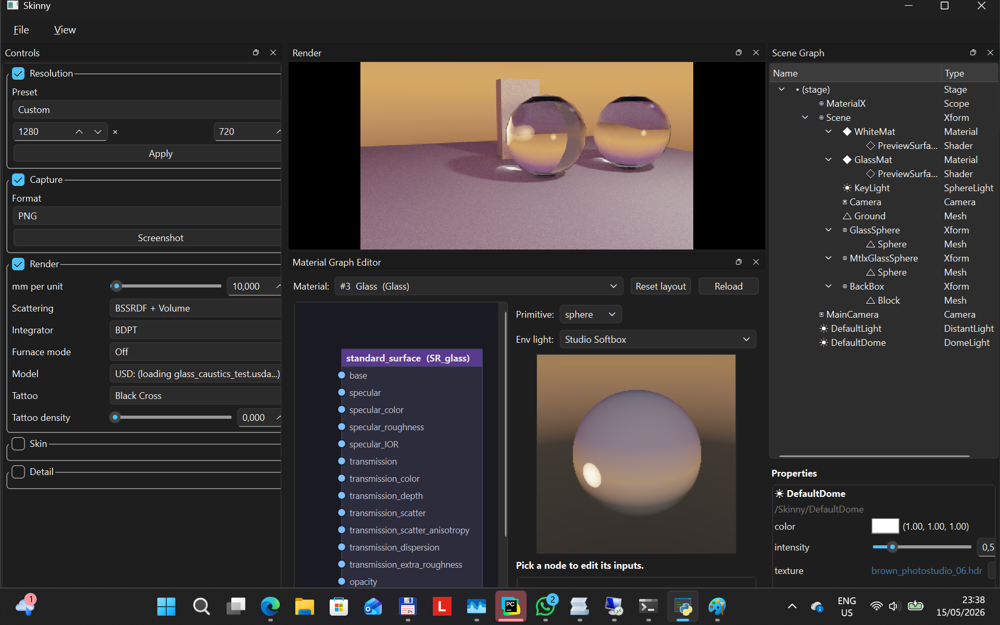
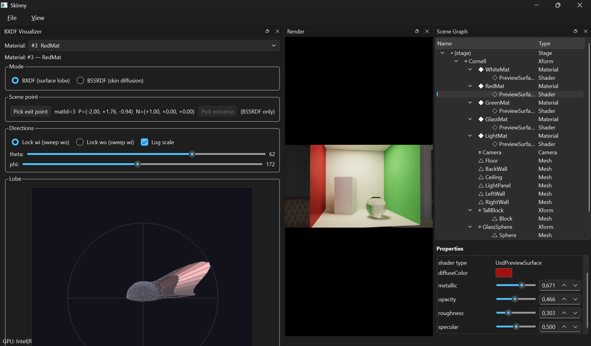
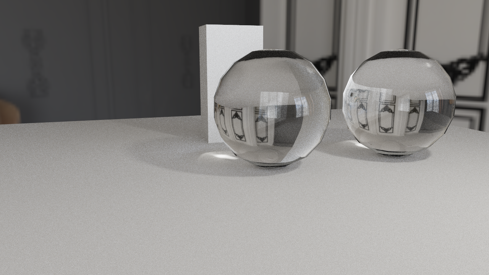
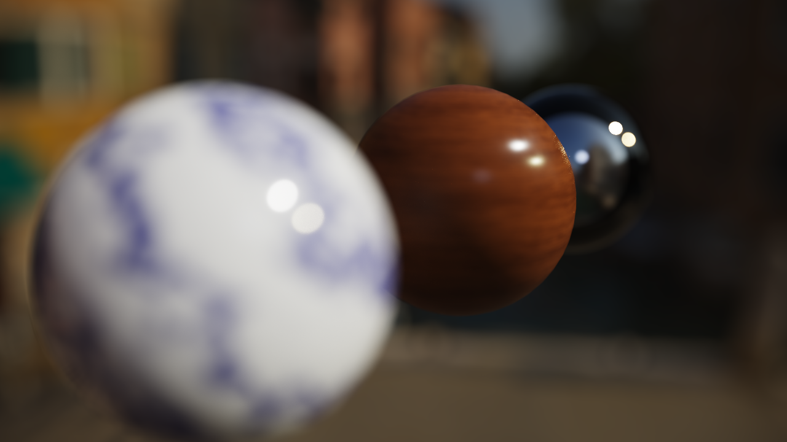
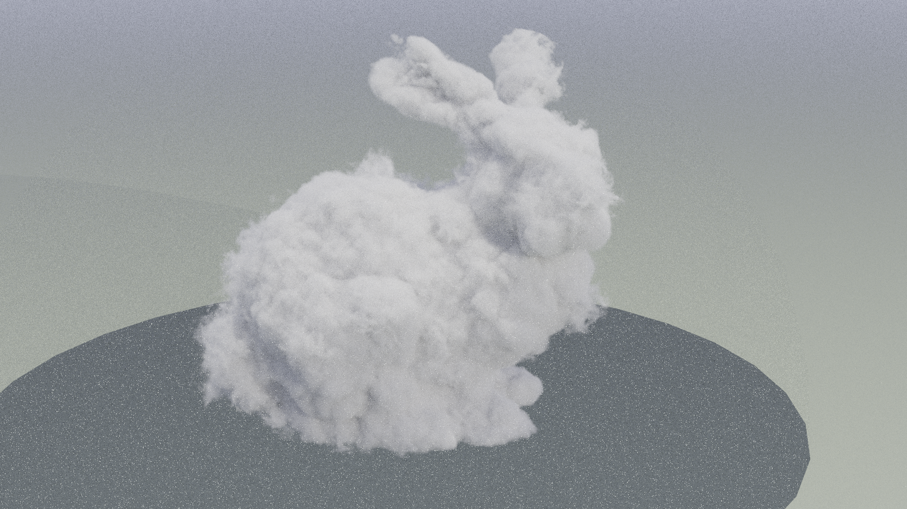
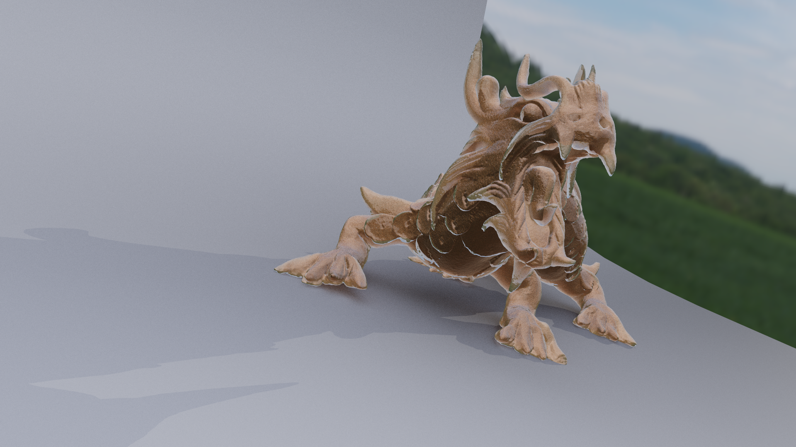
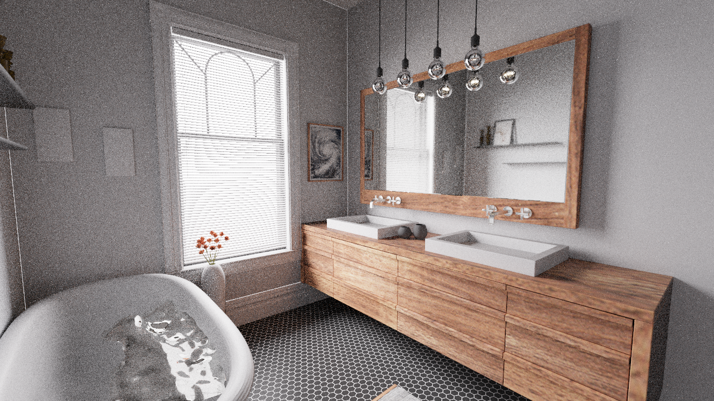
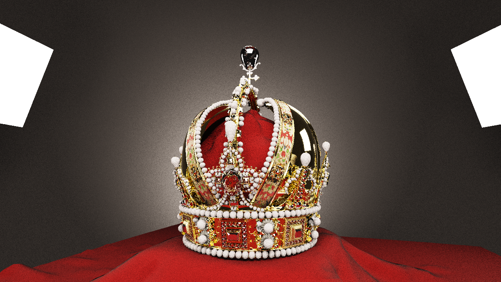
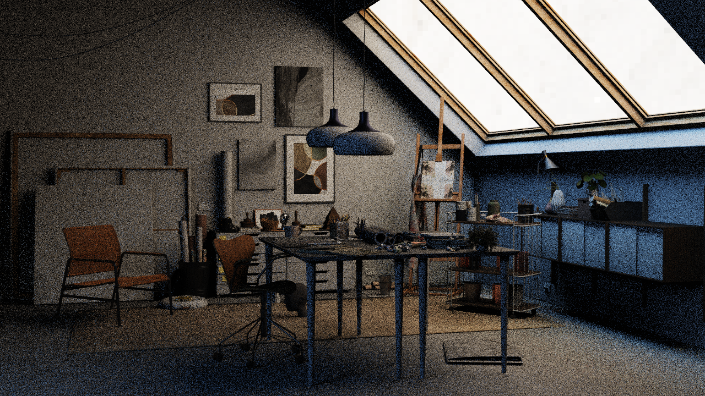
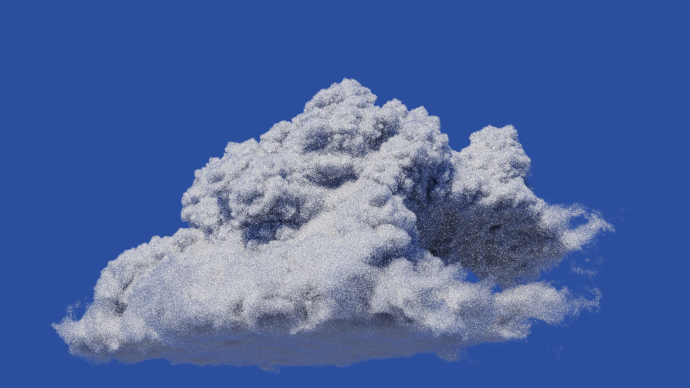

# Skinny

> **Note:** This project is developed with [Claude Code](https://claude.ai/claude-code)
> and serves as a testbed for experimenting with new rendering algorithms.
> The codebase evolves rapidly and stability is not guaranteed.

Skinny is a physically based GPU renderer with Vulkan and native Metal compute
backends compiled from the same Slang shader sources. It started as a human skin
rendering testbed -- and retains first-class skin support -- but the core
pipeline handles arbitrary MaterialX materials, OpenUSD scenes, ray-traced
geometry, image-based lighting, microfacet specular, and energy-conservation
checks.

## Gallery

<p align="center">
  
  
  
</p>
<p align="center">
  
</p>
<p align="center">
  These images are rendered from PBRT v4 scenes.
</p>
<p align="center">
  
  
  
</p>
<p align="center">
  
  
  
</p>

## Features

- **Layered skin rendering** -- three-layer biological optics (epidermis /
  dermis / subcutaneous), custom MaterialX skin nodedefs, scattering modes,
  Fitzpatrick presets, detail/pores, and tattoos. See
  [SkinRendering.md](docs/SkinRendering.md)
- **MaterialX nodegraph compute** -- arbitrary MaterialX nodegraphs (marble,
  wood, brass, custom standard_surface authoring) compiled per-material to
  Slang modules through `MaterialXGenSlang` plus a bindless `SamplerTexture2D`
  shim (`mtlx_gen_shim.slang`); SPIR-V cache (mtime-LRU, ~32 entries) skips
  recompilation
- **OpenUSD scene loading** -- meshes, transforms, `UsdShade.Material` bindings,
  lights (`DomeLight`, `DistantLight`, `SphereLight`, `RectLight`,
  `DiskLight`), and per-prim material assignment
- **USD light authority** -- any active authored USD light or emissive material
  exclusively owns scene lighting. Skinny adds its default DistantLight + IBL
  pair only when the active scene has no authored lighting; the pair's controls
  and synthetic scene-graph nodes are hidden otherwise
- **USD animation playback** -- time-sampled transform / camera / light tracks
  play in the viewport via a built-in transport (play/pause, scrubber, fps);
  cheap per-frame re-eval (TLAS/​light re-upload, no rebake) with a `usd` camera
  mode that follows an animated USD camera
- **UsdSkel skeletal skinning** -- skinned meshes deform per frame by linear
  blend skinning; on Vulkan a GPU skinning compute pass + GPU BVH refit keep the
  path tracer correct over deformed geometry with no readback (CPU fallback
  elsewhere)
- **USD-driven scene controls** -- a stage declares its own control panel via
  `skinny:ui:*` prims (slider / toggle / combo / color); each control binds to a
  renderer parameter, a material input, or a USD attribute and appears in a
  "Scene Controls" section across the Qt, web, and debug front-ends
- **Flat material support** -- USD prims bound to `UsdPreviewSurface`, MaterialX
  `standard_surface`, or `OpenPBR` render alongside skin materials in the same
  scene, with opacity / refraction, clear coat, and cutout-vs-alpha-blend
  masking. UsdPreviewSurface textures honour per-input channel selection,
  normal-map scale/bias (OpenGL vs DirectX Y), and wrap modes. The flat path now
  also consumes the richer `standard_surface` inputs **colored glass**
  (`transmission_color` tints the refracted delta-transmission branch),
  **tinted speculars** (`specular_color` scales the GGX spec response), and
  **Oren-Nayar diffuse** (`diffuse_roughness` drives a rough-diffuse response,
  `0` ⇒ exact Lambert) — all weight/response-only, so absent inputs reproduce the
  prior render exactly
- **Python-authored materials** -- SlangPile `python_materials/*.py` compile to
  GPU `IMaterial` structs, dispatched as material type 3; editable live in the
  Qt material editor
- **MIS path tracing** -- unified bounce loop with per-bounce NEE, Russian
  roulette, and sphere-light MIS; materials provide BSDF sample/evaluate
- **Environment importance sampling** -- equirect HDR sampled by a
  sin θ-weighted 2D distribution for env NEE + MIS, with VNDF GGX specular
  sampling, killing specular environment fireflies
- **Bidirectional path tracing** -- BDPT integrator with light-tracer splatting
  for caustics on flat materials; connections evaluate the real
  `standard_surface` BSDF, env importance sampling matched to the path tracer;
  Veach §10 MIS weighting
- **Stochastic Progressive Photon Mapping** -- caustic-efficient SPPM integrator
  (`--integrator sppm`): per-pass eye → spatial-hash grid → photon → radius/flux
  update, with the per-pixel estimator persisting across accumulation frames;
  wavefront-only, flat materials, supported on both Vulkan and native Metal. See
  [docs/PhotonMapping.md](docs/PhotonMapping.md)
- **Furnace mode** -- unit-sphere + white-environment energy conservation test;
  violations tinted pink; supports per-material furnace probes
- **Realistic lens camera** -- pinhole + PBRT-v3 thick-lens stack
  (`shaders/cameras/`); per-pixel exit-pupil bounding (`lens_optics.py`) so
  small f-stops don't shrink the rendered area; on-screen focus / vignette
  overlays (`L`, `V`)
- **Camera debug viewport** -- second window (or embedded dock) rendering
  frustum, lens rings, focus / DOF planes, mesh wireframes, AABBs, ground
  grid, and a camera-body glyph
- **Transform gizmo** -- screen-space gizmo (`gizmo.py`) for the selected mesh
  instance: rotate rings or translate arrows, in world or local space, cycled
  with `Space` (a `W`/`L` glyph hints the coordinate space); line list
  composited by `main_pass.slang`
- **Scene graph editing** -- add referenced USD models or authored Distant,
  Sphere, Dome, Rect, and Disk lights from the Qt or web scene-graph panel;
  transform and delete prims, then persist the non-destructive edit layer with
  **Save edits**
- **Exposure + tonemapping** -- EV-stop exposure and selectable tonemap
  operator (ACES filmic / Reinhard / Hable / linear) as post-process knobs that
  don't reset accumulation; HDR/EXR screenshot export
- **BVH caching** -- zstd-compressed mesh/BVH data cached to disk
  (`~/.skinny/mesh_cache/`) for fast reload
- **Qt desktop UI** -- single-window `skinny-gui` (PySide6) with render
  viewport docked alongside collapsible sidebar, BXDF visualiser, MaterialX
  graph editor, scene graph inspector, and debug viewport docks; sidebar
  open/closed state persists across sessions
- **Web mode** -- Panel (HoloViz) browser UI sharing the same widget-tree
  spec as Qt, with per-user server-side rendering, H264 streaming over
  WebSocket, hardware-accelerated encoding (NVENC / QSV / AMF), and
  WebCodecs decoding in the browser
- **Multi-user sessions** -- up to 4 concurrent browser sessions, each with
  independent renderer, camera, and parameters
- **GPU selection** -- `--gpu {intel,nvidia,amd,discrete,auto}` flag on all
  entry points
- **Persistent settings** -- parameter snapshots saved and restored between
  sessions

## Quick start

```bash
git clone https://gitlab.kephrenz.nl/root/skinny.git
cd skinny
python3.12 -m venv .venv               # 3.12, 3.13, or 3.14
.venv/bin/pip install -e ".[dev]"      # Windows: .venv\Scripts\pip
.venv/bin/skinny                       # Windows: .venv\Scripts\skinny
```

`pyproject.toml` pulls prebuilt MaterialX (with `PyMaterialXGenSlang`) and
OpenUSD (with `usdMtlx`) wheels for Python 3.12/3.13/3.14 on macOS 26+ Apple
Silicon, Linux x86-64, and Windows AMD64, so there is no CMake step on those
platforms.

Two prerequisites are **external to pip** and vary by platform: a **Vulkan
loader library**, which `skinny.renderer` needs at import time even when
rendering on Metal, and the **Slang compiler `slangc`** for Vulkan rendering,
since no SPIR-V is checked in.
[docs/Install.md](docs/Install.md) is the single source for both — it has the
requirement list, the wheel matrix, and the from-source fallback for a platform
outside it. Check it before reporting a startup failure.

Force a backend with `--backend metal` or `--backend vulkan`; pick an integrator
with `--integrator path|bdpt|sppm|mlt`. [docs/Usage.md](docs/Usage.md) covers the
front ends, headless rendering, and pbrt v4 import;
[docs/RenderingModes.md](docs/RenderingModes.md) covers the shared renderer
options — `--execution-mode`, `--proposals`, `--reuse`, `--spectral` — and which
combinations of them actually run.

## Documentation

Every reference document lives in `docs/` and owns one subject. A change updates
the document that owns what it touched. Each document stays at or below 700
lines; when one grows past that it is split at a subject boundary and registered
here.

**Start here**

| Document | Owns |
|---|---|
| [docs/Install.md](docs/Install.md) | Requirements, virtual environment, the from-source MaterialX fallback |
| [docs/Usage.md](docs/Usage.md) | The front ends, invocation, headless rendering, pbrt v4 import |
| [docs/RenderingModes.md](docs/RenderingModes.md) | Backend, resolution, the compatibility matrix, the sampling modes, furnace mode |
| [docs/Controls.md](docs/Controls.md) | Keyboard and mouse bindings, the camera debug viewport |

**Renderer internals**

| Document | Owns |
|---|---|
| [docs/Architecture.md](docs/Architecture.md) | The hub: high-level pipeline, GPU execution flow, key invariants, the map of these documents |
| [docs/ShaderPipeline.md](docs/ShaderPipeline.md) | Pluggable Slang interfaces, the material and integrator pipeline, MaterialX nodegraph codegen, environment importance sampling, SlangPile |
| [docs/SceneSystem.md](docs/SceneSystem.md) | USD intake, scene graph, instancing, lights, textures, skinning, camera / lens / debug viewport |
| [docs/GpuResources.md](docs/GpuResources.md) | Descriptor binding map, GPU resource inventory, host-mirrored byte layouts, shader variant key, `FrameConstants` layout |
| [docs/HostModules.md](docs/HostModules.md) | Python module map, front-end bring-up, the renderer carve-out pattern, the device-free pure core |
| [docs/Backends.md](docs/Backends.md) | Backend selection, `MetalContext`, the Vulkan path, the `gfx/` abstraction |
| [docs/FrontEnds.md](docs/FrontEnds.md) | Headless render API, web application, display tail (exposure, tone map, tool readback) |
| [docs/ImplementationMap.md](docs/ImplementationMap.md) | The per-file map of the Python package, the shader tree, and the tests |

**Execution modes and integrators**

| Document | Owns |
|---|---|
| [docs/Megakernel.md](docs/Megakernel.md) | The one-dispatch execution mode |
| [docs/Wavefront.md](docs/Wavefront.md) | The staged execution mode: queues, material bucketing, per-stage kernels |
| [docs/ReSTIR.md](docs/ReSTIR.md) | ReSTIR direct-lighting reuse: reservoirs, RIS, GRIS |
| [docs/PhotonMapping.md](docs/PhotonMapping.md) | The GPU SPPM integrator |
| [docs/MetropolisLightTransport.md](docs/MetropolisLightTransport.md) | PSSMLT over BDPT: chains, bootstrap, film splats |
| [docs/Spectral.md](docs/Spectral.md) | Hero-wavelength spectral rendering |

**Materials, skin, and volumes**

| Document | Owns |
|---|---|
| [docs/SkinRendering.md](docs/SkinRendering.md) | The three-layer skin model and the §1–§6 estimator chain |
| [docs/Subsurface.md](docs/Subsurface.md) | Subsurface transport and the interior random walk |
| [docs/Assets.md](docs/Assets.md) | The `hdrs/` and `heads/` asset directories, and USD scene assets |

**Neural guiding**

| Document | Owns |
|---|---|
| [docs/NeuralGuiding.md](docs/NeuralGuiding.md) | The SplineFlow directional proposal: equations, network, precision, verification |
| [docs/SplineFlows.md](docs/SplineFlows.md) | The first-principles theory companion to the guiding model |
| [docs/OnlineTraining.md](docs/OnlineTraining.md) | The online-training loop and the weight handoff |

**Tooling and interoperability**

| Document | Owns |
|---|---|
| [docs/PythonAPI.md](docs/PythonAPI.md) | The public Python surface |
| [docs/PbrtImport.md](docs/PbrtImport.md) | The pbrt v4 scene importer and its feature parity |
| [docs/ParityHarness.md](docs/ParityHarness.md) | The parity matrix, the dual gate, the confirming-scene suite |
| [docs/Contributing.md](docs/Contributing.md) | Running the tests, development conventions |
| [docs/References.md](docs/References.md) | Core transport and shading references; each subject document carries its own |

## License

MIT
