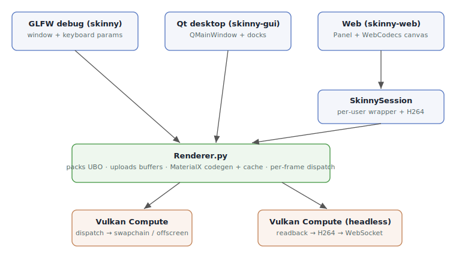
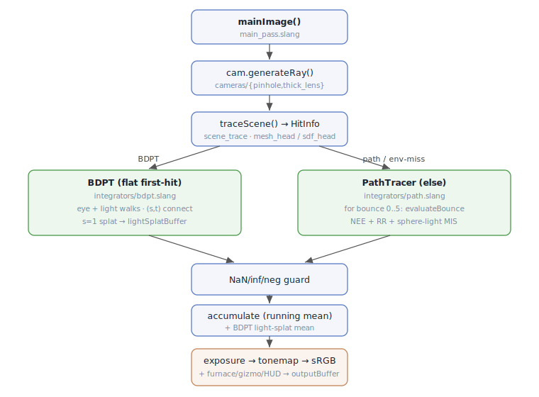
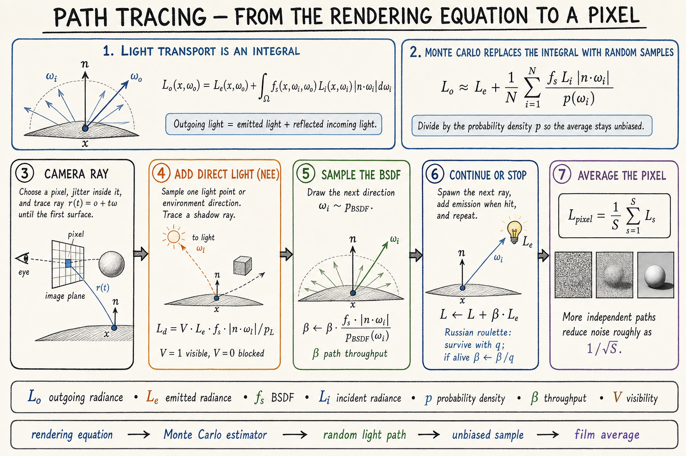
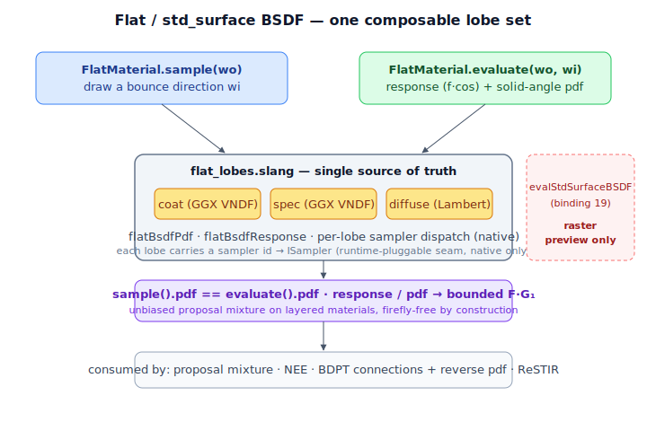
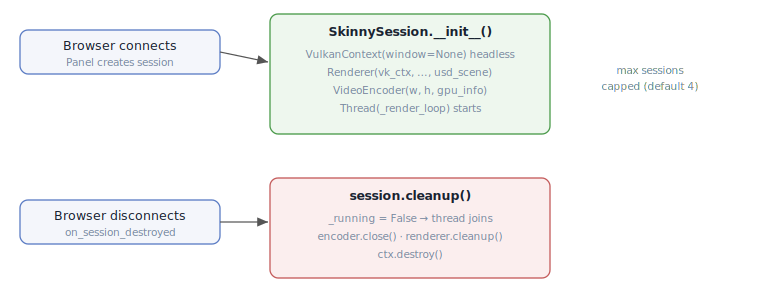

# Skinny — Architecture

Skinny is a GPU path tracer specialised for physically-based human skin
rendering. It combines a three-layer biological skin model (epidermis / dermis /
subcutaneous) with a full MaterialX-based `standard_surface` closure tree plus
arbitrary MaterialX nodegraphs compiled to per-material Slang modules. The same
renderer runs through either a one-dispatch megakernel or a staged wavefront
pipeline, on native Metal or Vulkan.

The skin-specific subsystems (three-layer biological model, §1–§6 estimator
chain, volume transport, head geometry, and MaterialX skin codegen) are
documented in [SkinRendering.md](SkinRendering.md). This file covers the generic
renderer architecture.

The renderer has **two GPU execution modes** for the *same* light-transport
integral, selected once at startup with `--execution-mode megakernel|wavefront`
and fixed for the session. Each has its own technical deep-dive:

- **[Megakernel.md](Megakernel.md)** — the default: one monolithic
  `[numthreads(8,8,1)]` dispatch of `main_pass.slang`, one thread traces a whole
  path in a register-resident bounce loop.
- **[Wavefront.md](Wavefront.md)** — the same estimator torn across many small
  per-stage / per-material kernels connected by GPU queues; better material
  coherence and small enough to compile on MoltenVK.

Both are unbiased and A/B-verified to match; see
[Wavefront.md § Megakernel vs wavefront](Wavefront.md#megakernel-vs-wavefront)
for the side-by-side comparison and the rationale for having both. The section
below describes the megakernel GPU flow in detail.

---

## High-Level Pipeline

Three entry points share the same renderer core:



### Step-by-step architecture sketch

The single overview below keeps the architecture sequence and its two governing
film/dispatch expressions together: front ends feed the renderer, the renderer
packs state, the selected execution mode runs on Metal or Vulkan, and the HDR
film is progressively accumulated and displayed.


`skinny-gui` and `skinny-web` share a **single widget-tree spec**
(`ui/spec.py` + `ui/build_app_ui.py`). The Qt backend
(`ui/qt/backend.py`) and the Panel backend (`ui/panel/backend.py`) walk
the same tree and instantiate their own widgets, so adding a slider in
the spec lights it up in both UIs.

### Per-Frame Render Loop (Qt desktop)

1. `MainWindow` creates a `RenderCommandQueue` plus a `QtRendererProxy`, then
   starts `RenderViewport`. The proxy is the only renderer-shaped object the GUI
   thread reads; it is backed by immutable snapshots and local optimistic state.
2. `RenderViewport` starts a Qt worker thread (`_RenderWorker`). That worker
   constructs the GPU context with `make_context(...)`, constructs `Renderer`,
   applies startup flags/restored settings, and owns cleanup (`disable_online_training`,
   `renderer.cleanup()`, `ctx.destroy()`).
3. Each worker frame drains queued commands, then calls `renderer.update(dt)` →
   online-training tick (when armed) → `renderer.render_headless()`.
4. GUI events post common renderer mutations (camera input, zoom/focus toggles,
   scene loads, parameter edits, and render-target resize) into the command queue
   instead of waiting for a render lock while a frame is in flight. High-rate
   commands such as resize and camera movement are coalesced.
5. `renderer.update(dt)` detects dirty state (camera, params, env, scene graph),
   reuploads affected buffers, and resets accumulation on change.
6. `renderer.render_headless()` packs FrameConstants + SkinParams + light +
   per-material data into the UBO, dispatches `ceil(W/8) × ceil(H/8)`, copies the
   storage image into a readback buffer, and emits raw RGBA bytes plus status
   snapshots. The Qt main thread stores those bytes in a `QImage` and paints the
   latest frame.

All five **View**-menu tool docks — Scene Graph, Material Graph, Python Material
Editor, BXDF Visualizer, and Camera Debug — are proxy-backed under this model
(change `restore-render-thread-tool-docks`): they receive the `QtRendererProxy`,
never the worker-owned `Renderer`. Reads come from a worker-built projection
(`build_scene_state` → `SceneStateSnapshot`, refreshed via `proxy.refresh_scene_state()`),
mutations post to the command queue, and each dock's GPU-producing work runs on
the worker and is marshalled back to the GUI thread by a per-dock `Signal`:
the BXDF/BSSRDF lobe evaluation (`proxy.request_bxdf_eval`), the Material Graph
preview (`proxy.render_material_preview`) and MaterialX-doc topology edits (relocated
into worker closures over `_worker_doc`/`_worker_mtlx_node`), and the Camera Debug
viewport (owned on the worker as `renderer.debug_viewport`, emitting a `DebugFrame`
each frame via `RenderViewport.debug_frame_ready`). No dock issues a GPU call or
blocks on a `Future` from the GUI thread.

### The command queue is front-end-neutral (`render_session.py`)

`RenderCommandQueue` and `QtRendererProxy` live at `src/skinny/render_session.py`,
not under `ui/qt/` — the module never imported Qt, and it now has callers outside
the Qt front-end (`skinny.ui.qt.render_session` re-exports for compatibility).
Two rules follow:

- **The queue executes commands, callers do not.** `run_pending(target, on_error=None)`
  invokes each callback and settles its reply future. `drain()` only removes
  pending commands; a caller that drains and loops the callbacks itself must
  settle every reply, or awaited calls hang to their timeout. Both the Qt worker
  and the GLFW main loop call `run_pending`.
- **Every non-owning thread marshals through it — reads included.** Off-thread
  reads race too: the scene graph is rebuilt on the streaming load thread and
  swapped into `renderer.scene_graph`, so reading it from another thread can
  observe a swap mid-flight.

The GLFW front-end (`app.py`) owns a queue and calls `run_pending` once per
iteration, immediately after `glfw.poll_events()` and before `renderer.update(dt)`
— the same position the Qt worker drains at. The call is unconditional, so
ordering does not depend on optional features being enabled.

### MCP scene control (`mcp_server.py`, `mcp_auth.py`, `mcp_paths.py`)

Opt-in (`--mcp`, off by default), the interactive front-ends (`skinny`, `skinny-gui`
— the two that own a render-thread command queue) host an MCP server on a daemon
thread that exposes the live scene graph to an MCP client: three path-addressed
inspection/property tools, `scene_list` / `scene_get` / `scene_set`; eight
structural tools, `scene_add_model` / `scene_add_primitive` / `scene_add_light` /
`scene_remove` / `scene_save` / `scene_job_status` / `scene_add_material` /
`scene_bind_material`; and one renderer-free discovery tool, `material_list`
(changes `mcp-scene-control`, `mcp-scene-structure`, `mcp-material-authoring`).
It attaches to the running renderer; it never builds one.

The server thread holds only the proxy (Qt) or the bare queue (GLFW) — never the
`Renderer` and never the GPU context, so it cannot extend a `MetalContext`
lifetime. Reads *and* writes are marshalled through the queue and awaited with a
timeout: node resolution, validation, and dispatch all have to run on the render
thread, and the client needs a definitive applied-or-rejected answer. The cost is
that MCP writes do not coalesce (`post_with_reply` takes no `coalesce_key`), so a
client sweep is paced by the round-trip; the dock's own slider drags still
coalesce through the proxy verbs. A request that times out is cancelled, and
`run_pending` skips cancelled commands, so a write cannot land after the client
was told it failed.

Property writes route through `apply_scene_property` in `ui/scene_edit_actions.py`,
**shared with the Scene Graph dock**. Dispatch cannot be derived from a
`(path, property)` pair alone — material parameters live on Shader prims that
carry no `renderer_ref` and resolve by an ancestor walk to the enclosing Material,
and a transform component write recomposes from its sibling components. One
function, two callers, so an agent edit and a dock edit cannot drift. The dock's
file-chooser flows (HDR, lens) are the one exemption — against the proxy those
calls return a `Future`, not a bool, so they keep their own async handling; the
routing decision still lives in the shared function.

Security is four independent layers (`mcp_auth.py`): off by default; loopback bind
asserted at socket creation; `Origin`-bearing requests refused and `Host`
validated; and a persistent bearer token at `~/.skinny/mcp_token` compared
with `hmac.compare_digest`. The token file is `0600` and re-validated per read
(no-follow open, owner/mode checked on the same descriptor) **on POSIX only** —
Windows lacks those primitives, so there the file relies on profile-directory
access control; recorded as a known gap. The socket is created by the front-end, not the server
runtime, which is what makes the loopback assertion and the bind-collision path
reachable before startup reports success. uvicorn's signal handlers are explicitly
suppressed — they would otherwise overwrite `MetalContext`'s chained SIGINT/SIGTERM
teardown (see **Metal dispatch hygiene**).

v1 exposed no save/export tool and no node add/remove; `mcp-scene-structure`
provides both, so only a rendered-image tool remains excluded (an edit resets
progressive accumulation, so an immediate readback would return near-noise).

**Structural tools (`mcp-scene-structure`).** `scene_add_model` /
`scene_add_primitive` / `scene_add_light` author into the renderer's
non-destructive USD edit sublayer (see **usd-scene-editing**) the same way the
Scene Graph dock's add actions do; `scene_add_primitive` additionally authors a
dedicated `UsdShade`/`UsdPreviewSurface` material bound to the new gprim, since
an unbound prim resolves to the protected fallback material slot and could
never be re-colored. `scene_remove` deactivates (non-destructive); `scene_save`
writes the edit layer but — like the dock's own save — captures only
structural edits, not `scene_set` property overrides, which mutate in-memory
render state without touching USD.

**Material authoring (`mcp-material-authoring`).** `material_list` is a
renderer-free discovery call over `mtlx_synthesis`'s catalogs (curated preset
directory listing + gen-reflected editable inputs, model schemas, the node
whitelist, the template registry) — it never touches the render thread, so it
cannot drift from what a spec actually accepts. `scene_add_material` validates
its spec and, for a synthesized document, runs the Slang generator as a
GPU-free dry-run entirely on the MCP thread before any prim or file exists;
only the resulting stage write (typed `UsdShade.Material` holder + `.mtlx`
reference) happens inside a posted closure. A created material's result always
reports `live: false` — participation is binding-driven (design D8): a
material is loaded, rendered, and exposes its editable properties only once
`scene_bind_material` (or `scene_add_primitive`'s `material` argument) binds
it, which replaces rather than merges with any file-authored binding. Adding
the same curated preset twice returns the existing holder instead of a
duplicate (fixed element names cannot resolve to two prims); synthesized and
template materials are never deduped. A synthesized material's first bind
changes the scene's graph-set signature and rebuilds the render pipeline, so
it — more than a plain structural add — is expected to degrade to a pollable
job. `scene_add_primitive` grows an optional `material` argument (a preset/
template name, or an existing `/Materials/...` path) that replaces its inline
seeded material; it is rejected together with `color`/`roughness`/`metallic`.

Every path a structural tool touches is checked against `mcp_paths.py`'s
allowlist (`--mcp-roots` / `SKINNY_MCP_ROOTS`, default: platform temp dirs +
cwd) — a guardrail against a misdirected call within the MCP client's own trust
domain, not a sandbox. For `scene_add_model` the check runs *inside* the
posted render-thread closure, both on the argument and, via an optional
`validate(stage, added_prim)` callback `add_model` invokes post-recompose/
pre-resync, on the layers and asset attributes the reference newly pulls in
(payloads loaded and instance proxies traversed first, so both escape routes
are covered) — a violation rolls the prim back through the renderer's own
rollback path.

A model add can outlast a flat request timeout, and a cancelled-but-already-
running one would leave the client unsure whether the scene changed. Structural
tools instead wait a short (~2s) inline grace period, returning the result
directly if it lands in time or a `job_id` to poll via `scene_job_status`
otherwise — FastMCP runs tool bodies on the event loop with no thread hop, so
this is a deliberate, bounded stall rather than a background task; polling
itself never blocks.

### Per-Frame Render Loop (GLFW debug)

1. `app.main()`: GLFW poll → `commands.run_pending(renderer)` →
   `InputHandler.update(dt)` → `renderer.update(dt)` → `renderer.render()`.
   The drain is unconditional (it does not depend on `--mcp`), and sits before
   input so a command posted by another thread lands in the same frame ordering
   the Qt worker gives it.
2. `renderer.render()` presents directly via the swapchain (windowed mode).

### Per-Frame Render Loop (Web)

1. `SkinnySession._render_loop()`: background thread per session.
2. `renderer.update(dt)`: same as desktop.
3. `renderer.render_headless()`: dispatches compute, copies result to
   `ReadbackBuffer` via staging buffer, returns raw RGBA bytes.
4. `VideoEncoder.encode_h264()`: RGBA → YUV420p → H264 AVCC packets.
5. Packets pushed to `frame_queue` → Tornado `VideoStreamHandler` sends
   binary WebSocket messages → browser decodes via WebCodecs.

---

## GPU Execution Flow



The detailed per-step substructure (furnace/mesh/SDF trace dispatch, BDPT eye/light
walk + (s,t) connections + s=1 splat, the path tracer's per-bounce
`evaluateBounce` → FLAT/SKIN/DEBUG dispatch, Russian roulette, sphere-light MIS):

- **`traceScene`** — furnace → unit sphere; mesh → `marchHeadMesh()`; SDF → `marchHead()`.
- **BDPT** — eye walk (FlatMaterial) + light walk (sphere/emissive/dir) + (s,t)
  connections + light-tracer splat (s=1) → `lightSplatBuffer`.
- **PathTracer** — cutout-transparency skip loop, then `for bounce 0..5`:
  `evaluateBounce` dispatches FLAT (`allLightsNEE` + sample, optional
  `evalSceneGraph`), SKIN (`evalSkinRadiance` §1–§6), or DEBUG (`0.5 + 0.5·N`);
  Russian roulette after bounce 0; sphere-light MIS on the BSDF ray.
- **Post** — NaN/inf/neg guard → running-mean accumulation (+ BDPT light-splat
  mean, Q22.10 → float) → exposure (2^EV) → tonemap → sRGB → furnace overlay →
  gizmo line composite (binding 22) → HUD alpha → `outputBuffer`.

`evalSceneGraph(materialId, hit, ...)` is generated per material into
`shaders/generated/` by `MaterialXGenSlang` and dispatched via tag-switch
in `flat_material.slang`. See **MaterialX Nodegraph Compute Pipeline**
below.

---

## Pluggable Interface Architecture

All interfaces live in `shaders/interfaces.slang`. Per-material furnace
probes use `effectiveFurnaceMode()` from `bindings.slang`. Dispatch
strategies are chosen to avoid existential warp serialisation on GPUs.

### ICamera

Ray generation is split out behind a tiny interface in `interfaces.slang`:

```
generateRay(fc, pixel, rng) → Ray
```

| Implementation | File | Notes |
|---|---|---|
| `PinholeCamera` | `cameras/pinhole.slang` | Standard projective ray gen |
| `ThickLensCamera` | `cameras/thick_lens.slang` | PBRT-v3 RealisticCamera port; per-pixel exit-pupil bounds packed by `lens_optics.py` |

### ISampler

```
sample(float3 wo, float2 uv) → float3
pdf(float3 wi, float3 wo)    → float
```

Tangent-space sampler (N = +Z). Callers transform world↔tangent. Sampler
state (roughness, g, etc.) is stored in struct fields. Generic parameter on
estimators — compile-time monomorphised, zero runtime cost.

| Implementation | File | Purpose |
|---|---|---|
| `GGXSampler` | `samplers/ggx.slang` | Microfacet specular importance sampling — GGX **visible** normals (VNDF, Heitz 2018/2023); weight reduces to F·G₁, killing the grazing-angle spec fireflies of classical D(H) sampling |
| `LambertSampler` | `samplers/lambert.slang` | Cosine-hemisphere diffuse sampling |
| `UniformSphereSampler` | `samplers/uniform_sphere.slang` | MIS companion sampler |
| `HenyeyGreensteinSampler` | `samplers/henyey_greenstein.slang` | Phase-function importance sampling |

MIS utilities in `samplers/mis_combine.slang`: `misPrimaryWeight<TA,TB>`,
`misCompanionWeight<TA,TB>` (power heuristic).

### IMaterial

```
sample(float3 wo, inout RNG rng)  → BSDFSample
evaluate(float3 wo, float3 wi)    → BSDFEval
```

All directions in tangent space (N=+Z). `BSDFSample` carries `wi`, `weight`
(BSDF×cos/pdf), `pdf`, `emission`, `valid`, and `transmitted` (refraction
flag). `BSDFEval` returns `response` (f×cos) and `pdf`. Tag-switch
monomorphisation in `evaluateBounce()` (`integrators/path.slang`). Never
used as existential — divergent material hits in a warp would serialise.

Skin uses its own 6-estimator chain and returns full radiance via
`BounceResult.fullRadiance`; `bsdfSample.valid = false` terminates bouncing.

| Implementation | File | Type Code |
|---|---|---|
| `SkinMaterial` | `materials/skin/skin_material.slang` | 0 (default) — self-integrating, returns full radiance |
| `FlatMaterial` | `materials/flat/flat_material.slang` | 1 — opacity/refraction, coat, spec/diff MIS, optional MaterialX graph eval |
| `DebugNormalMaterial` | `materials/debug_normal_material.slang` | 2 — normal visualisation |
| Python material | `mtlx/genslang/python_materials/*.py` → generated dispatch | 3 — SlangPile-authored `IMaterial`, id in bits 24–31, switch-dispatched by `vk_compute._emit_python_dispatcher` |
| Subsurface (volumetric) | `materials/subsurface/{subsurface_walk.slang, medium.slang}` | 4 — pbrt `subsurface`: dielectric boundary + homogeneous interior medium, self-integrating volumetric random walk (returns full radiance, like skin) |

Material type encoding in `materialTypes[id]` (binding 16):
- bits 0–7: type code (0 skin, 1 flat, 2 debug-normal, 3 python)
- bits 8–9: scatter mode for skin (bit 0 = BSSRDF, bit 1 = volume)
- bit 10: per-material furnace mode (energy-conservation probe)
- bits 16–23: MaterialX graph slot (`MATERIAL_GRAPH_SHIFT`; 0 = none)
- bits 24–31: Python-material id (`MATERIAL_PYMAT_SHIFT`; index into the
  `vk_compute._emit_python_dispatcher` switch, consulted only when
  type == python)

### ILight

```
samplePoint(float3 shadingPos, float2 u) → LightSample
pdfSolidAngle(float3 shadingPos, float3 direction) → float
```

`LightSample` carries: `point`, `normal`, `radiance`, `pdfArea`, `valid`.
Delta lights (directional) set `pdfArea = 0` as a sentinel — callers skip
geometry-term conversion.

| Implementation | File | Notes |
|---|---|---|
| `SphereLightImpl` | `lights/sphere_light.slang` | Uniform surface sample, ray-sphere for `pdfSolidAngle` |
| `EmissiveTriangleLightImpl` | `lights/emissive_triangle_light.slang` | Barycentric sample; **power-weighted** selection PDF `p_i = w_i / Σw` (`w_i = area × Rec.709-luminance(emission)`) drawn via the inline cumulative-power CDF (change `emissive-mesh-nee`) |
| `DirectionalLightImpl` | `lights/directional_light.slang` | Delta distribution adapter |

### IIntegrator

```
estimateRadiance(Ray ray, HitInfo firstHit, inout RNG rng) → float3
```

Four integrators are user-visible through `fc.integratorType`. Path and BDPT
directly implement `IIntegrator`; SPPM is a staged photon-mapping estimator, and
MLT wraps the BDPT target in persistent primary-sample-space Markov chains.

#### Path tracing



- **`PathTracer`** — 6-bounce loop with Russian roulette, cutout
  transparency traversal, per-bounce NEE via generic `allLightsNEE<TM>()`,
  and sphere-light MIS on BSDF-sampled rays. Material dispatch in
  `evaluateBounce()` returns `BounceResult` (direct light + full radiance
  + BSDF sample with world-space direction).
- **`BDPTIntegrator`** — bidirectional path tracer (Veach §10).
  4-vertex eye + light subpaths, connections that evaluate the real
  `standard_surface` BSDF (`FlatMaterial.evaluate`), environment
  importance sampling matched to the path tracer's env NEE, and
  light-tracer splatting (s=1) for caustics via atomic adds to
  `lightSplatBuffer` (binding 21, Q22.10 fixed-point). Eye-side emissive
  NEE (`connectT1`) selects the emissive triangle through the same
  **power-weighted** `sampleEmissiveTriangle` cumulative-power CDF as the
  path tracer's `nee.slang`, so the draw matches the `pSel`-based
  `pdfArea`; selecting uniformly while dividing by that pdf biased the
  indirect emissive *fill* dark on many-triangle meshes (change
  `bdpt-emissive-fill-gap`). Flat materials only; skin hits fall through
  to PathTracer.

#### Bidirectional path tracing


| Implementation | File | Mode |
|---|---|---|
| `PathTracer` | `integrators/path.slang` | `INTEGRATOR_PATH` (0) |
| `BDPTIntegrator` | `integrators/bdpt.slang` | `INTEGRATOR_BDPT` (1) |
| SPPM staged estimator | `integrators/wavefront_sppm.slang` | `INTEGRATOR_SPPM` (2), wavefront only — [PhotonMapping.md](PhotonMapping.md) |
| PSSMLT over BDPT | `wavefront/wavefront_mlt.slang` | `INTEGRATOR_MLT` (3), wavefront only — [MetropolisLightTransport.md](MetropolisLightTransport.md) |

### Adding a New Material (Two-File Add)

1. Create `shaders/materials/my_material.slang` —
   `struct MyMat : IMaterial { sample(), evaluate() }` + `loadMyMat(HitInfo)`.
2. In `integrators/path.slang` — add `import materials.my_material;` and a
   `case` in `evaluateBounce()`.
3. In `renderer.py` — add `MATERIAL_TYPE_MYMAT = N` constant + packing branch.

---

## Material & Integrator Pipeline

The skin material (`SkinMaterial`, type code 0) is self-integrating: a
six-estimator chain over a three-layer biological optics model. Its internals —
the layer model, the §1–§6 estimator order, volume transport, and the MaterialX
skin codegen — are documented in [SkinRendering.md](SkinRendering.md). The flat
material and the bidirectional integrator below are general-purpose.

### Flat Material BSDF (`materials/flat/flat_material.slang` + `flat_lobes.slang`)



Implements `IMaterial` — `sample()` (draw a bounce direction) and `evaluate()`
(response + solid-angle pdf, consumed by NEE, BDPT connections + reverse pdfs,
ReSTIR, and the directional-proposal mixture). Both walk **one** lobe set
(`{coat, spec, diffuse}`) over a single param source, so `sample().pdf ==
evaluate().pdf` structurally and `evaluate().response / evaluate().pdf` reduces to
the bounded native per-lobe weight (`F·G₁` for the GGX lobes, the diffuse albedo
term for Lambert). This makes one canonical BSDF for the path tracer **and** BDPT
in **both** megakernel and wavefront modes. The lobe model lives in
`flat_lobes.slang` (`flatBsdfPdf`, `flatBsdfResponse`, the per-lobe sampler
dispatch); `flat_material.slang` assembles it. BSDF layers:

- Opacity / refraction (Fresnel-weighted reflect/refract split; delta lobe).
  Cutout vs alpha-blend opacity are split: cutout discards below
  `opacityThreshold`, alpha-blend attenuates — matching UsdPreviewSurface
  semantics. The refracted (delta-transmission) branch tints throughput by
  **`transmissionColor`** (colored smooth glass) rather than the base albedo;
  it stays a delta event (`pdf = 0`), so there is no MIS/Jacobian change
- Clear coat (GGX VNDF, coat-color tinting). The coat lobe-selection
  probability `pCoat = coat · fresnelDielectric(NdotV, 1/coatIOR)` takes the
  **entering** relative index (the view ray meets the coat from air), matching
  the opacity/refraction branch (`entering ? 1/ior : ior`) and the subsurface
  boundary. Passing `coatIOR` raw is the coat→air direction and triggers
  spurious total internal reflection past ~42° from normal — `pCoat` saturates
  to 1 and zeroes the base lobes, cratering a coated diffuse to a dark region
  (fixed in `fix-flat-coat-fresnel-eta`)
- Specular / diffuse MIS split (Schlick F0, luminance-weighted probability) —
  GGX specular uses VNDF sampling (`samplers/ggx.slang`), diffuse is Oren-Nayar
  (Lambert when `diffuseRoughness = 0`). The GGX spec response is multiplied by
  **`specularColor`** (a response-only tint; pdf unchanged, white ⇒ no change),
  and the diffuse lobe scales its Lambert response by an Oren-Nayar factor
  (`orenNayarFactor` in `flat_lobes.slang`) driven by **`diffuseRoughness`**.
  The Oren-Nayar term modifies the *response only* — sampling stays cosine, so
  the diffuse pdf (and hence `sample().pdf == evaluate().pdf`) is unchanged.
  These three `standard_surface` inputs were previously dead; consuming them
  fills the existing `{coat, spec, diffuse, delta-transmission}` lobe set
  **without** adding a lobe and **without** calling `evalStdSurfaceBSDF` (still
  preview-only). They are packed into `FlatMaterialParams` (binding 13) with
  back-compat fallbacks in `pack_flat_material` — `transmission_color ←
  diffuseColor`, `specular_color ← white`, `diffuse_roughness ← 0` — so an
  absent input reproduces the prior behavior exactly (pbrt parity corpus and
  existing UsdPreviewSurface renders are byte-unchanged). The flat-bsdf-lobes
  invariants (single pdf, bounded weight, no clamp, unbiased mixture) hold by
  construction since the changes are weight/response-only
- **Per-lobe runtime-pluggable sampler seam** — each lobe resolves a sampler id
  to a draw/density strategy, defaulting to native (2023 spherical-cap VNDF for
  coat/spec, cosine for diffuse). The host registry (`sampling/lobe_samplers.py`)
  also ships the Heitz-2018 basis-form VNDF (coat/spec — a different warp of the
  *same* GGX visible-normal distribution, so its pdf is shared and parity is
  structural) and uniform-hemisphere (diffuse). `sample()` and `evaluate()` read
  the same per-lobe id from `fc.flatLobeSamplers`, so pdf agreement — hence
  unbiasedness and the bounded `F·G₁` weight — holds for *any* registered
  strategy; only `flatLobeSamplers`' diffuse byte changes a pdf (cosine vs
  uniform). Selectable per lobe via `--lobe-samplers` / the GUI. Adding a strategy
  is a dispatch case in `flat_lobes.slang` + a registry entry — `sample()` /
  `evaluate()` stay untouched
- Cutout alpha masking via `isCutoutTransparent()` (in `flat_shading.slang`)
- **UsdPreviewSurface textures** — per-input channel selection (`channelMask`),
  normal-map `scale`/`bias` (`normalScale`/`normalBias`, for OpenGL vs DirectX
  Y convention), and wrap modes flow from each material's `TextureBinding`
  (binding 14 bindless textures)
- **MaterialX graph evaluation** when `materialTypes[id]` packs a graph
  slot — `evalSceneGraphBaseColor(materialId, hit, ...)` (generated module)
  drives the lobe model's albedo before the BSDF math runs

The full MaterialX `std_surface` closure (`evalStdSurfaceBSDF`, binding-19
`StdSurfaceParams`) is **no longer** used by the path-traced / BDPT estimator — it
is retained only for the raster `preview_pass`. Unifying `evaluate()` onto the
same lobe model `sample()` draws from removed the proposal-mixture bias on layered
coat+metal materials (brass under the BSDF+Env / Env presets).

### Python Material (`materials` type code 3)

SlangPile-authored materials (`mtlx/genslang/python_materials/*.py`) compile to
`IMaterial` structs. Their per-material id is packed into bits 24–31 of
`materialTypes[id]`; `vk_compute._emit_python_dispatcher` generates a
switch that routes `pythonMaterialId(matId)` to the right struct. Edited live
through the Qt material editor.

### Bidirectional Path Tracer (`integrators/bdpt.slang`)

Veach §10 BDPT with V1 simplifications for shader compile time:

- **Subpaths**: eye walk + light walk, each capped at 4 vertices
- **Connections**: (s ≥ 1, t ≥ 1) evaluate the real `standard_surface`
  BSDF via `FlatMaterial.evaluate()` (not the earlier Lambertian f ≈
  albedo/π approximation); `FlatMaterial.sample()` drives walk bounces
- **Environment**: env-miss and s=0 contributions use the same
  importance-sampled environment distribution + MIS as the path tracer,
  so BDPT and path-traced IBL converge to the same image
- **Light tracer** (s = 1): non-delta light vertices projected onto camera,
  atomic-added to `lightSplatBuffer` (binding 21, Q22.10 fixed-point per
  R/G/B channel). `main_pass.slang` composites the running mean after
  accumulation
- **Scope**: flat-material first-hit only; skin/debug hits fall through to
  PathTracer
- **MIS**: balance heuristic over all (s, t) strategies per path length;
  `convertSAtoArea()` handles geometry-term conversion

---

## MaterialX Nodegraph Compute Pipeline

> **Build prerequisite:** the Slang generator (`PyMaterialXGenSlang`) is **not**
> in the PyPI MaterialX wheel — you must build MaterialX from source with
> `-DMATERIALX_BUILD_PYTHON=ON -DMATERIALX_BUILD_GEN_SLANG=ON` and install the
> resulting `python/` tree into your venv. The whole pipeline below depends on
> it; see the *MaterialX from source* section in `README.md` for the full
> recipe.

Arbitrary MaterialX nodegraphs (e.g. marble, wood, brass — see
`assets/three_materials_demo.usda`) are compiled to per-material Slang
modules at scene-load time and again whenever a graph signature changes.


Details: filename inputs are replaced with bindless slot indices via `TexturePool`
(binding 14); `evalSceneGraph_<hash>(hit, params)` is switch-dispatched by
`generated_materials.slang`; the SPV cache key is `source hash + entry point`
(≤32 entries); the texture pool is repopulated after each rebuild.

Key invariants:

- **`mtlx_gen_shim.slang`** wraps `SamplerTexture2D` so generated modules
  see `Texture2D + SamplerState`-style methods backed by binding-14
  bindless lookups. Sentinel slot `0xFFFFFFFFu` returns transparent black
  to avoid sampling unbound descriptors.
- **`SampleLevel` only** in generated modules — compute pipelines have no
  derivatives.
- **Slang fallback** on graph compile failure preserves the flat
  base_color so the scene still renders; an infinite slangc retry is
  guarded by skipping rebuilds for known-broken graph signatures.
- **`makeBSDF` + dual-author overrides**: `standard_surface` parameters
  authored both as nodes and as direct inputs are merged so graph-uniform
  sliders in the sidebar drive both code paths.
- **Vertex-input (`vd.*`) rewrite**: `MaterialXGenSlang` reads geometry from a
  `vd` vertex-data struct that the per-material fragment does not have, so
  `_emit_graph_fragment` rewrites each `vd.*` reference to the fragment's
  parameters: `P_in` (position), `N_in` (normal), `T_in` (tangent), and the
  default UV set → `UV_in`. The default UV set appears in two forms — the
  explicit `<geompropvalue geomprop="UVMap">` (`vd.i_geomprop_UVMap`) and the
  default `<texcoord>` (`vd.texcoord_0`, emitted when an `<image>` has no
  explicit texcoord input) — both map to `UV_in`. Any `vd.*` left unhandled
  (secondary UV sets, vertex colors) makes the emitter return no fragment so the
  material falls back to the flat / std_surface path, rather than emitting a
  module with an undefined identifier that aborts compilation.

`MaterialLibrary` (`materialx_runtime.py`) owns the document, the
`MaterialXGenSlang` shadergen instance, the per-material reflection of
the uniform block, and the `pack_material_values()` byte serialiser.

---

## Environment Importance Sampling (`environment.slang`)

A 2D piecewise-constant distribution over the equirect environment map drives
next-event estimation toward bright sky/sun directions instead of relying on a
BSDF ray happening to land on them — the fix for specular environment
fireflies. The distribution is built CPU-side in
`environment.build_env_distribution()` (sin θ-weighted luminance) and uploaded
as **one** combined CDF buffer `envDistCdf` at binding 31 (change
`combine-graph-param-buffers` — folding the former 31/32 pair frees a Metal
buffer slot for the neural + online-training wavefront build):

- elements `[0, ENV_H+1)` — row marginal CDF (`ENV_H + 1` floats)
- elements `[ENV_COND_CDF_BASE, …)` — per-row conditional CDF
  (`H × (W + 1)` floats), where `ENV_COND_CDF_BASE = ENV_H + 1`

`sampleEnvDir(u, intensity)` importance-samples a direction + solid-angle PDF;
`envPdf(dir)` returns the PDF of an arbitrary direction so BSDF-sampled
env-miss hits can be MIS-weighted against env NEE. `ENV_DIST_W = 1024`,
`ENV_DIST_H = 512` must match `ENV_WIDTH`/`ENV_HEIGHT` in `environment.py`.
Both the path tracer and BDPT consume this distribution so their IBL
converges to the same image.

---

## Display: Exposure, Tonemap, and Tool Readback

`main_pass.slang` post-processes the accumulated linear-HDR image:

- **Exposure** — `fc.exposure` (EV stops, applied as `2^EV`) before tonemapping.
- **Tonemap operator** — `fc.tonemapMode`: 0 = ACES filmic (Narkowicz),
  1 = Reinhard, 2 = Hable/Uncharted 2, 3 = Linear clamp. Exposure and tonemap
  are post-process knobs — changing them does **not** reset accumulation.
- **Tool readback** (binding 30, `toolBuffer`) — one-shot probes that write
  per-pixel data back to the CPU: scene pick (`fc.pickArmed` + `fc.pickPixel`
  → `HitInfo`), the BXDF visualiser (`TOOL_MODE_BXDF`), and a BSSRDF probe
  (`TOOL_MODE_BSSRDF`). The CPU clears the arm flag after a single read.

---

## Scene System

Head geometry — the analytic SDF head (`sdf_head.slang`) and the two-level
mesh BVH (`mesh_head.slang`, TLAS/BLAS) that `traceScene()` dispatches to — is
documented in [SkinRendering.md](SkinRendering.md).

### Scene Dispatch (`scene_trace.slang`)

`traceScene()`:
- `furnaceMode` → unit sphere intersection
- `useMesh` → `marchHeadMesh()` (BVH traversal)
- else → `marchHead()` (SDF sphere tracing)

Shadow tests: `visibleSegment()` (point-to-point), `visibleDirectional()`
(point toward infinity). Both traverse up to 8 transparent surfaces
(cutout alpha or refractive) before declaring occlusion.

Transparency helpers (defined in `materials/flat/flat_shading.slang`):
- `isCutoutTransparent(h)` — alpha below `opacityThreshold`
- `isMaterialTransparent(materialId)` — opacity < 1 or opacity texture
- `isShadowTransparent(h)` — cutout or refractive

### USD Loading (`usd_loader.py`)

Walks USD stage for `UsdGeom.Mesh`, `UsdLux` lights (DistantLight,
SphereLight, DomeLight, RectLight, DiskLight), `UsdGeom.Camera`,
`UsdShade.Material` bindings with UsdPreviewSurface, MaterialX, and **OpenPBR**
overrides.
Connected shader inputs are resolved to their authored constant when a node
graph drives them (the OpenPBR / `standard_surface` connection case), so
single-value parameters survive even when authored through a connection.
Converts `metersPerUnit` → `mm_per_unit`. CW-wound triangles (e.g.
`three_materials_demo.usda` quads) are flipped on import so normals are
consistent.

`UsdUVTexture` reads populate a `TextureBinding` (`scene.py`) per material
input — file path plus `inputs:scale`/`inputs:bias` (e.g. DirectX normal maps
author `scale.y = -2`, `bias.y = +1` to flip Y), channel selector
(`rgb`/`r`/`g`/`b`/`a`), `sourceColorSpace`, and `wrapS`/`wrapT`. The renderer
packs scale/bias into `FlatMaterialParams.normalScale`/`normalBias` and the
per-input channel selectors into `channelMask` (4 bits per input), so the
shader fetches the correct channel and applies the right normal-map convention
without per-texture branches.

The `file` value is resolved through `GetValueProducingAttributes`
(`_resolve_texture_binding`), so a `UsdUVTexture.inputs:file` authored as a
*connection* to a Material interface input — the shape Apple's glTF→USD
conversion and many DCC exporters emit (`file <- Material0.baseColorTexture`) —
resolves instead of dropping to flat white (change `glb-asset-import`, spec
`usd-texture-intake`). A `UsdTransform2d` on a texture's `st` chain
(`_resolve_st_transform`) is captured as `TextureBinding.uv_transform` and
**baked into the mesh UVs at load** (`_bake_uv_transform`), applied in raw USD
st-space before the loader's existing USD→skinny V-convention flip: the net
`flip(T(flip(uvs)))` collapses the glTF `scale (1,-1)`/`translation (0,1)`
V-flip and the convention flip back to the raw glTF texcoords. Identity/absent
transform short-circuits (UV output bit-identical); the per-prim build loop
resolves the material and bakes UVs **before** computing the mesh content hash,
so shared geometry under materials with differing transforms keys distinct mesh
cache entries. The converter that produces such assets from a GLB is
`glb_import.py` (pure-Python pygltflib + pxr), reachable one-call through the
`scene_import_glb` MCP tool.

### Default-Light Synthesis Policy (`renderer.py`)

The central `Renderer.uses_default_lights` decision grants lighting authority
to exactly one source set:

- If the active USD scene has any authored Distant, Sphere, Dome, Rect, or Disk
  light, or an emissive material, only authored USD lighting contributes.
  Presence expresses author intent: zero-intensity and runtime-disabled lights
  still suppress fallback; inactive/deactivated prims do not.
- Otherwise Skinny synthesizes its default DistantLight and built-in IBL
  together. Their own controls can disable contributions while fallback
  authority remains active.

The decision is re-evaluated rather than cached, is gated by the active model
(a retained inactive USD scene cannot affect an OBJ/default head), and is
shared by distant-light upload, environment selection, headless options, UI
visibility, and scene-graph projection. Authored mode without a DomeLight uses
a black environment; fallback `env_intensity` and `direct_light_index` cannot
alter authored sources. Stage resync copies or clears the authored environment,
so adding the first light and removing the last light transition both
contributions and controls at runtime. Furnace mode remains an explicit
diagnostic override.

### Runtime Scene-Graph Editing (`renderer.py`)

The loaded `Usd.Stage` is the authoritative scene model; the flat `Scene` +
GPU buffers are a derived cache. `Renderer._attach_edit_layer()` sets the
stage's **session layer** as the edit target (change `session-edit-layer`), so
every runtime edit is authored there and the original file is never written
until `save_edits()`. The session layer is used because it is stronger than the
whole root layer stack — a root *sublayer* (the earlier design) is weaker than
the root layer and so cannot override a file-authored opinion: `set_transform`
on a prim whose `xformOp:transform` lives in the loaded file would raise a
duplicate-op error and any value it authored would be silently ignored.
`set_transform` authors via `_author_local_transform`, which reuses an existing
single non-inverse `xformOp:transform` op with `op.Set()` (a value-over that
wins from the session layer) and falls back to clear+add only for the fresh /
inverse / multi-op cases (`skinny.usd_edit.author_local_transform`). The editing API — `add_model()` (define an
`Xform` + `AddReference`, optional `validate(stage, added_prim)` callback run
post-recompose/pre-resync so a policy layer can veto and roll back before the
resync pays for itself), `add_primitive()` (change `mcp-scene-structure`:
define one of the six analytic gprims `usd_gprims.tessellate_gprim` meshes,
plus a dedicated bound `UsdShade`/`UsdPreviewSurface` material — never authored
bare, since an unbound prim resolves to the protected fallback material slot),
`add_light()` (define one of the five supported `UsdLux` schemas with
editor-friendly defaults, optionally overridden by `intensity`/`color` args so
a caller isn't limited to a post-creation edit that a save wouldn't capture),
`remove_node()` (`SetActive(False)`), `set_transform()` (author
`xformOp:transform`), `save_edits()`, and `list_nodes()` — authors inside a
scoped `Usd.EditContext`. `add_model`'s and `add_light`'s failure/veto rollback
removes not just the authored prim but every parent `Xform` the call itself
created, so a rolled-back add under a not-yet-existing parent path leaves the
edit layer exactly as it was. Add/remove/light/primitive creation trigger a
geometry resync (`_resync_geometry_from_stage`: re-read via
`load_scene_from_stage`, mesh cache keeps unchanged prims free, runtime
`enabled` flags carried by prim path). `set_transform` uses a transform-only
fast path for geometry (`_reupload_instance_transforms`, no re-bake) and a full
light resync for authored light prims so analytic positions/directions refresh.
`MeshInstance.prim_path` + the `_prim_to_instances` index key all edits by USD
prim path; edits reset progressive accumulation via `_material_version`.
Headless callers pass `stage=` to `set_usd_scene`.

The geometry resync also re-reads lights + camera (so deleting a light/camera
prim drops it; `LightDir`/`LightSphere` carry `prim_path` to preserve runtime
`enabled` toggles across the re-read) and rebuilds the derived scene graph
(`build_scene_graph` + default-light injection) while bumping
`_scene_graph_version`, so the scene-graph panels repaint. Both front-ends drive
this from their scene-graph view — the Qt dock (`ui/qt/windows/scene_graph.py`)
and Panel card (`ui/panel/windows.py`) expose Add model / Add light / Delete
node / Save edits and route per-node TRS edits through `set_transform`. The Add
light menu offers DistantLight, SphereLight, DomeLight, RectLight, and DiskLight;
the first authored light naturally switches the existing all-or-nothing light
authority and removes the fallback pair. The decision logic (supported types,
add-parent resolution, deletability, TRS→matrix) lives in pure helpers
(`ui/scene_edit_actions.py`) shared by both and unit-tested without a display.

### USD Animation Playback (`playback.py`, `usd_loader.py`, `renderer.py`)

At load, `build_animation_index(stage)` scans for time-varying prims — transform
tracks (incl. ancestor-driven), animated lights, an animated camera — and
skinned meshes. `build_playback_clock(stage, index)` reads the stage's
`startTimeCode`/`endTimeCode`/`timeCodesPerSecond` into a `PlaybackClock` (pure
time logic: advance, loop, normalized scrub). The renderer keeps the stage alive
(`_usd_stage`) so prims can be re-evaluated at runtime.

Each frame, `Renderer.update(dt)` advances the clock and `_apply_animation_frame`
re-evaluates only the indexed prims at `current_time_code`: animated transforms
recompute the world matrix (`_world_transform`) and re-upload only those TLAS
`instance_buffer` records (no mesh rebake / BVH rebuild); animated lights are
re-extracted; an animated USD camera feeds a follower used in `camera_mode ==
"usd"`. `current_time_code` is folded into `_current_state_hash`, so playback
resets accumulation (1 spp in motion, converges when paused). A built-in
transport (play/pause, normalized scrubber, fps) lives in the shared spec tree,
shown only when the stage has animation.

### UsdSkel Skeletal Skinning (`usd_loader.py`, `vk_skinning.py`, `shaders/skin.slang`, `shaders/bvh_refit.slang`)

`extract_skeletal_bindings(stage)` returns a `SkeletalScene` (retaining the cache
+ stage) with one `SkinnedMeshBinding` per skinned mesh: rest points/normals,
`jointIndices`/`jointWeights`, influences, and the skel/skinning queries.
`compute_joint_matrices(binding, time)` builds per-joint matrices (mapper remap +
geomBindTransform fold), validated against pxr `ComputeSkinnedPoints`; deformed
points live in the authored-points space, so the loader's existing TLAS transform
places them (no identity-TLAS).

On Vulkan, `SkinningPasses` (`vk_skinning.py`) owns two standalone compute
pipelines with their **own descriptor sets** (the main 0–32 binding map is
untouched): `skin.slang` linear-blend-skins rest vertices into the shared vertex
buffer; `bvh_refit.slang` refits each skinned mesh's BVH in place (parallel leaf
AABBs are folded into a single-thread reverse-array-order pass — valid because the
depth-first build emits parents before children). They run as one isolated
submit (skin → barrier → refit) before the frame render — no edit to the shared
render recording, no GPU→CPU readback. Non-Vulkan backends fall back to CPU
skinning + BLAS rebuild.

### USD-Driven Scene Controls (`usd_loader.py`, `ui/build_app_ui.py`)

`extract_ui_controls(stage)` parses any prim with an authored `skinny:ui:type`
into a `ControlSpec` (type, prefix-typed `target`, label, range, choices,
default, order). `resolve_control_binding(renderer, spec)` maps the target prefix
to live get/set closures: `renderer:`/`mtlx:` → `_get_nested`/`_set_nested`;
`material:<name>:<input>` → `apply_material_override`; `usd:<prim>.<attr>` →
attribute `Get`/`Set` + a live-state refresh (lights/transforms/camera). A
data-driven "Scene Controls" `DynamicSection` in `build_main_ui` renders one
widget per control across all front-ends, shown only when the stage declares
controls. Authored `skinny:ui:default` values apply at load.

The shared UI tree (`build_app_ui.py`) has no `IBL` or `Direct Light`
sections — those fallback-light params (`env_index`, `env_intensity`,
`direct_light_index`, `light_*`) are excluded from the Qt/Panel sidebar
entirely (`_group_params` skips any `is_fallback_light_param`); the light
color/direction dedicated widgets were removed along with them. The GLFW
debug host is unaffected — it still filters the same fallback parameters
from its own keyboard/HUD list via `build_visible_params`, conditional on
`Renderer.uses_default_lights`.

### Scene Graph Inspector (`scene_graph.py`, `ui/qt/windows/scene_graph.py`)

Preserves the USD prim hierarchy as a browsable tree with typed,
editable properties on each node. `SceneGraphNode` carries a
`RendererRef` (kind + index) mapping back to the flat renderer arrays
(material, light, instance). Property edits flow through
`apply_material_override` / `apply_light_override` /
`set_transform`. Authored light transforms are editable for all five supported
schemas; analytic-light transforms trigger a USD re-read while geometry keeps
the fast TLAS-only path. Qt presents tree-above-properties inside a
`QDockWidget`; the web UI (`ui/panel/windows.py` + `scene_tree.html`)
serves the same model in a Panel iframe.

---

## Camera, Lens, and Debug Viewport

### Camera ray gen (`shaders/cameras/`)

`pinhole.slang` is the default projective camera. `thick_lens.slang` is a
straight port of PBRT-v3's `RealisticCamera`, with two CPU-side helpers
in `lens_optics.py`:

- `trace_lenses_from_film()` — line-by-line PBRT port for verification.
- `bound_exit_pupil()` — packs per-radius exit-pupil rectangles so the
  shader can sample only directions the lens won't vignette. Without
  this, closing the iris collapses each pixel to a central pinhole and
  shrinks the rendered area.

### Debug viewport (`debug_viewport.py` + `shaders/debug_line.slang`)

Second view that rasterises wireframe visualisations of the render
camera, its lens elements, per-instance world-space AABBs (or full mesh
wireframes), a ground grid, and a small camera-body glyph. Lives in two
places:

- Standalone GLFW window (used by the GLFW debug entry; toggled with
  `F2`). Owns its own surface, swapchain, depth buffer, render pass,
  line-list pipeline, vertex buffer, and per-frame sync — sharing only
  the `VulkanContext` device/queue.
- Embedded Qt dock (`ui/qt/windows/debug_viewport.py`) that renders to
  an offscreen image and blits it via Qt — same pipeline, no GLFW.

Geometry is regenerated from live `Renderer` state every frame.

### Transform gizmo (`gizmo.py`)

`TransformGizmo` tracks one selected scene instance — any baked instance,
including analytic gprims (Sphere/Cube/Cylinder/…) the loader tessellates,
not just `UsdGeom.Mesh` prims — and has four modes —
rotate and translate, each in world or local space — cycled with `Space`
(`(index+1) % 4`, grouped by type). Rotate modes draw three orthogonal
rings, translate modes draw three axis arrows, and a `W`/`L` glyph above
the pivot hints the coordinate space. World modes align to the canonical
X/Y/Z axes; local modes align to the instance's current orientation.
Rotation drag is a true axis-angle rotation about the (world or local)
ring axis composed as a matrix and re-decomposed to Euler; translate drag
projects the mouse onto the screen-projected axis. The renderer rebuilds
the line list per frame and uploads it to binding 22; `main_pass.slang`
draws each segment as an anti-aliased line over the final tonemapped
image. The active mode persists in `~/.skinny/settings.json`.

### BXDF visualiser (`bxdf_math.py` + `ui/qt/windows/bxdf.py`)

CPU-side Lambert + GGX-Smith standard_surface evaluation, hemisphere
lobe rasterisation via Pillow. The Qt dock binds it to a material
picker so any scene material can be inspected in isolation.

### MaterialX graph editor (`mtlx_graph_view.py` + `ui/qt/windows/material_graph.py`)

Pure view-model (`NodeGraphView`, `NodeView`, `PortView`) extracted
from the legacy Tk editor so the Qt port and Panel port can share it.
Edits flow back through `MaterialLibrary` and trigger a graph rebuild
+ pipeline recompile.

---

## Headless Render API (`skinny.headless`)

> Full signatures, return types, and examples for the whole programmatic
> surface are in **[PythonAPI.md](PythonAPI.md)**. This section is the
> architectural overview.

`skinny.headless` is the public offscreen-render interface, driving
`Renderer.set_usd_scene()` + `usd_loader.load_scene_from_stage()` directly
with no window or event loop. Key symbols:

- `HeadlessRenderer(w, h)` — context-manager that owns `VulkanContext` +
  `Renderer`; pipeline compiles once, then `render_to_array(stage)` /
  `render_scene(stage, path)` / `render_animation(stage, outdir)` can be
  called repeatedly with a mutated `Usd.Stage` per frame.
- Module-level `render_scene` / `render_to_array` / `render_animation` —
  convenience wrappers that open and close the GPU context for one-shot calls.
- `skinny-render` CLI entry point wraps the same API; `--animate` renders a
  frame sequence over USD timecodes.

---

## Parity Matrix Harness (`pbrt/parity.py`, `pbrt/metrics.py`, `tests/pbrt/`)

A standing regression that renders every supported renderer **combination**
against a reference and against itself, so adding a feature re-tests all
renderers automatically.

**Validity table (one source of truth).** A `RenderCombo(integrator,
execution_mode, proposals, reuse)` is a point in the matrix; `combo_is_valid`
prunes it per the [Compatibility matrix](../README.md#compatibility-matrix):
SPPM is wavefront-only; the neural directional proposal is wavefront + path +
flat-material only (BDPT ignores it); ReSTIR DI direct-light reuse is path +
wavefront; a scene flagged `megakernel_ok: false` (e.g. the 28.8M-tri dragon,
which OOMs the megakernel) is wavefront-only. Every skip carries an explicit
reason; `enumerate_combos(scene)` yields the valid set, anchor-first. A coverage
meta-test fails if an integrator the app exposes (`renderer.integrator_modes`)
has no table entry — a new integrator without a matrix row breaks the build.

**Dual gate.** Each valid combo renders once (linear-HDR accumulation) and feeds
two gates: **pbrt-truth** (`pbrt_truth_result` — exposure-aligned relMSE/FLIP vs
the checked-in pbrt v4 reference EXR, relaxed to a per-combo `baseline` when a
known mismatch is recorded) and **self-consistency** (`self_consistency_result`
— each combo vs the `(Path, wavefront)` anchor image at a per-axis tolerance:
tight for a pure `megakernel ≡ wavefront` mode change, looser for BDPT/SPPM,
unbiasedness for the neural/ReSTIR axes). Self-consistency never uses a baseline
escape, so a shared material bug (which makes both modes wrong identically) stays
green there while pbrt-truth records the delta. The **spectral axis** keeps the
same axis *class* against the megakernel spectral anchor but consults a separate
tolerance table (`_DEFAULT_SPECTRAL_SELF_CONSISTENCY` + a per-scene
`spectral_self_consistency` override): spectral wavefront is not bit-identical to
the megakernel (it threads the hero wavelengths through the staged records, a
different sample sequence), so mega≡wave is a decorrelated-but-unbiased MC delta
rather than the RGB bit-identity — measured on Metal and recorded harness-first.
The RGB tolerance table is never widened by a spectral override.

**Standard metric battery.** `metrics.compute_metrics(img, ref=None) ->
ImageMetrics` is the single place a number is computed: error vs reference (MSE,
RMSE, MAE, relMSE, PSNR, FLIP) plus single-image stats (variance, Immerkær
noise-σ, firefly outlier fraction). No call-site invents its own error formula.

**Corpus & references.** `tests/pbrt/corpus/manifest.json` lists scenes (pbrt
sources imported at gate time, or `.usda` assets loaded directly for the heavy
bathroom/dragon); `tests/pbrt/regen_refs.py` regenerates the reference EXRs
offline from the pinned pbrt v4. Tiers: `not gpu` (matrix construction + scene
import, runs anywhere), `gpu` (the full sweep), `slow` (higher-spp confirmation).

**Confirming-scene suite (`tests/assets/suite/`, `tests/pbrt/test_suite.py`).**
Minimal per-axis discriminating scenes — one lobe family / transport path /
sampling mode each — that fail *precisely* when their axis breaks, where the
heavy bathroom/dragon scenes would bury the defect in noise. They register in the
same `manifest.json` as `usd:`-source entries (path resolved relative to the repo
root) and are swept by the same validity table + dual gate, plus two suite-only
gate classes:
- **authoring equivalence** (`authoring_equivalence_result`) — every scene is
  authored twice, a plain `UsdPreviewSurface` `.usda` and a MaterialX
  `_mtlx.usda`+`.mtlx`; the two must render within tolerance (they render
  bit-identically in practice). OpenPBR-only PBR-material scenes record an
  equivalence *skip* (no UsdPreviewSurface counterpart).
- **white-furnace closure** (`pbrt/furnace.py`) — a lossless material under
  `furnace_index` must vanish into the constant furnace environment; the gate
  measures spatial **uniformity** (not an absolute `== 1.0`, since the furnace
  env carries its own integrator-dependent radiance constant) with recorded
  baselines, plus a per-material-flag probe.

Scenes are generated by `tests/assets/suite/_gen/` — the pbrt-expressible ones by
writing a tessellated-`trianglemesh` `.pbrt` and importing it through
`import_pbrt` (so the `.pbrt` / plain `.usda` / MaterialX `.usda` are provably the
same scene, and pbrt renders the identical triangles — no analytic-vs-tessellated
mismatch); the OpenPBR PBR-material scenes by extracting `standard_surface`
parameters from the `assets/materialxusd` cards onto a shared shaderball. Suite
reference EXRs regenerate via `regen_refs.py --scene suite`. Coverage meta-tests
in `test_suite.py` fail the build if a suite scene lacks a disposition for any
applicable gate class (pbrt-truth / equivalence / furnace).

---

## Web Application Architecture

### Overview

`skinny-web` serves a Panel (HoloViz) web application with per-user
server-side rendering. Each browser session gets its own Vulkan renderer,
H264 encoder, and render thread. The Panel/Bokeh protocol handles widget sync
and session isolation; a custom Tornado WebSocket streams encoded video.
The sidebar widget tree comes from the same `ui/build_app_ui.build_main_ui`
spec that the Qt app uses.

### Session Lifecycle



Max concurrent sessions capped (default 4) to bound GPU memory.

### Video Streaming Protocol

Binary WebSocket at `/video_ws/<session_id>`:

| Frame type | Byte 0 | Payload |
|------------|--------|---------|
| H264 keyframe | 0 | AVCC-framed NAL units |
| H264 delta | 1 | AVCC-framed NAL units |
| JPEG fallback | 2 | JPEG image |
| AVCC description | 3 | SPS/PPS for decoder init |

Header: `!BI` (1 byte type + 4 byte accum frame number) + payload.

On WebSocket open, stale frames are drained and encoder forced to emit a
keyframe so the browser decoder starts clean.

Browser-side: WebCodecs `VideoDecoder` for H264 → `<canvas>` blit. Falls back
to JPEG `` when WebCodecs unavailable.

### Hardware Abstraction (`hardware.py`)

GPU selection is vendor-aware:

```
enumerate_gpus(vk_instance) → list[GpuInfo]
select_gpu(vk_instance, preference) → GpuInfo
```

`GpuInfo.preferred_h264_encoder` maps vendor → encoder:
- Intel (0x8086) → `h264_qsv`
- NVIDIA (0x10DE) → `h264_nvenc`
- AMD (0x1002) → `h264_amf`
- Fallback → `libx264`

All entry points accept `--gpu {intel,nvidia,amd,discrete,auto}`.

### H264 Encoder (`video_encoder.py`)

Wraps PyAV for H264 encoding with hardware-aware fallback chain:

1. Try `gpu_info.preferred_h264_encoder`
2. Fall back to `libx264`
3. If all fail, JPEG-only mode

Encoder outputs **Annex B** NAL units (PyAV default), converted to **AVCC**
framing for WebCodecs compatibility. AVCC description (SPS+PPS) sent once on
WebSocket open.

Key methods:
- `encode_h264(rgba_bytes)` → list of `(is_key, avcc_data)` tuples
- `encode_jpeg(rgba_bytes, quality)` → JPEG bytes (fallback)
- `force_keyframe()` → next frame forced as IDR (called on param/camera change)

### Headless Vulkan Path

`VulkanContext(window=None)`:
- No GLFW dependency, no surface/swapchain
- Compute queue only (no present queue)
- No surface extensions in instance creation

`Renderer.render_headless()`:
- Dispatches to persistent offscreen `StorageImage` (not swapchain image)
- Barrier → `ReadbackBuffer.record_copy_from()` → fence wait → `read()`
- Returns raw RGBA bytes

The Qt entry (`skinny-gui`) runs in the same headless mode and blits the
readback into a `QImage` via `RenderViewport`.

---

## Backend selection

The active GPU backend is resolved once per session by a single shared resolver
in `backend_select.py`, used by every front-end:

- `select_backend(prefer, *, persisted=None)` applies the precedence **explicit
  `--backend` flag > `SKINNY_BACKEND` env > persisted setting > `auto`**,
  returning `"vulkan"` or `"metal"`. `auto` resolves to native **Metal** on a
  Metal-capable Apple-Silicon host — the native backend is at full parity with
  Vulkan (geometry 6.1, shaded color 6.2, windowed present 6.5) — and falls back to
  **Vulkan** everywhere else. An explicit `--backend metal` returns `"metal"` only
  when the `DeviceType.metal` device constructs, otherwise raising a clear error
  naming the missing requirement.
- `make_context(backend, window, width, height, **kw)` constructs the matching
  context — a `VulkanContext` (`vk_context.py`) or a `MetalContext`
  (`metal_context.py`) — both exposing the same duck-typed surface the renderer
  reads (`width`/`height`, compute/present queues, `swapchain_info`, `gpu_info`,
  `allocate_command_buffers`, `recreate_swapchain`, `destroy`, the
  `backend_name`/`is_metal` predicate, and the capability flags). `gpu_info`
  carries `.name`, `.is_discrete`, and `.preferred_h264_encoder` on both
  backends, so the front-ends' status line and the video encoder stay
  backend-agnostic. The four
  front-ends (`app.py`, `headless.py`, `ui/qt/app.py`, `web_app.py`) call
  `make_context` instead of constructing a context directly; `app.py` and
  `skinny-gui` persist/restore the selected backend like the other render flags.

The renderer builds its GPU resources through whichever sibling module matches
the context, resolved once by `resource_module(ctx)` (keyed on `ctx.is_metal`):
`vk_compute` for a `VulkanContext`, `metal_compute` for a `MetalContext`. Both
expose the **same public API** (`StorageBuffer`, `StorageImage`, `SampledImage`,
`UniformBuffer`, `HostStorageBuffer`, `ComputePipeline`, …), so the construction
sites stay backend-agnostic (`self._gpu = resource_module(self.ctx)`); imports are
deferred so the Metal path never imports `vulkan`. The few genuinely
backend-specific spots are gated on `is_metal`: the MSL uniform pack
(`_pack_uniforms_msl`), the bind-by-name megakernel dispatch (no Vulkan descriptor
sets), and the teardown drain (the backend-neutral `ctx.wait_idle()` seam).

### MetalContext (`metal_context.py`, `metal_compute.py`)

`MetalContext` stands up a **native** Metal device through SlangPy's
`DeviceType.metal` (slang-rhi — no MoltenVK, no raw PyObjC) and mirrors the
`VulkanContext` surface. The present path uses the slang-rhi `Surface`
(`configure` / `acquire_next_image` / `present`) bridged to a GLFW window via its
Cocoa `NSWindow` pointer (`WindowHandle(nswindow=…)` from `glfw.get_cocoa_window`)
— no manual `CAMetalLayer`. `metal_compute.py` provides the full resource layer at
API parity with `vk_compute`, including the megakernel `ComputePipeline`: it runs
`emit_megakernel_sources` then compiles `main_pass.slang` (`mainImage`) to Metal
**in-process** (no `slangc` shell-out, no `.metallib`) with
`SKINNY_COMPUTE_PIPELINE=1` + `SKINNY_METAL=1`, reflects the global binding map,
and dispatches by **binding resources by name** (the renderer's binding map drives
the same logical slots). Pipeline parameters are bound as whole resources or via
`set_data` byte blobs, **never per-field cursor writes** (a scalar cursor write
around an open Metal encoder can leave the GPU fence un-signalled). Megakernel
entry is `mainImage`; trivial/foundation kernels name their entry `computeMain`,
never `main` (Slang's Metal target reserves `main` and the rename breaks pipeline
creation).

**Metal-target shader adaptations** (gated `#if defined(SKINNY_METAL)`, Vulkan
SPIR-V byte-unchanged): the combined `Sampler2D` pool exceeds Apple's compute
argument limits and slang-rhi cannot bind a combined `Sampler2D` at all, so the
bindless `flatMaterialTextures` pool becomes `Texture2D[120]` sampled through a
shared `commonSampler` (binding 38), the five discrete maps (env/tattoo/normal/
roughness/displacement) split into `Texture2D` + a per-map `SamplerState`
(bindings 39–43), and `NonUniformResourceIndex` (unavailable in the compute stage
on the Metal target) collapses to identity via the `NRI(x)` macro.

**Spectral compile variant** (change `spectral-rendering`): hero-wavelength
spectral rendering is a **compile-time variant** of the megakernel selected at
startup, not a runtime branch. The spectral megakernel compiles with
`-DSKINNY_SPECTRAL` (Vulkan: appended to the `slangc` flags, with the flag
hashed into the `spv_cache` key so it lands in a distinct cache slot; Metal:
added to `SlangCompilerOptions.defines`), pulling in `spectrum.slang` and the
`SpectralPathTracer` (`integrators/path_spectral.slang`) that carries a `float4`
`Spectrum` throughput/radiance and reuses the RGB flat sampler for
λ-independent geometry. `common.slang` holds the gated `Spectrum` typealias
(`float4` spectral / `float3` RGB) so the carriers type-check in both builds;
the default RGB build never imports `spectrum.slang`, so its SPIR-V is
**byte-unchanged**. It compiles on demand on both backends (spectral bindings
45–47 in the [Descriptor Binding Map](#descriptor-binding-map)). The estimator,
upsampling model, exact sources, and film resolve are documented in
[Spectral.md](Spectral.md).

**Wavefront on Metal** (change `metal-wavefront-parity`): the wavefront
execution mode — staged path + BDPT integrators, ReSTIR DI reuse, and the
neural directional proposal — runs on the native Metal backend at parity with
Vulkan. The stage orders live in the backend-neutral `wavefront_driver.py`;
`metal_wavefront.py` supplies the Metal pass classes (per-entry in-process
pipelines, queue buffers sized from the **reflected MSL strides**, one
`MetalFrameEncoder` per frame with global barriers, and the CPU
slot-count-readback fallback while slang-rhi's Metal indirect dispatch is a
no-op — selected by the logged `supports_indirect_dispatch` probe). Metal caps
a kernel's argument table at **31 buffer slots**, assigned program-wide in
declaration order: the default wavefront build stubs the record emitters
(`wf_records.slang`), and the neural-active build (`SKINNY_METAL_NEURAL=1`)
additionally compiles out `toolBuffer`/`recordBuf`/`recordCounter` (dead in
every wavefront kernel) to fit the un-stubbed `neuralWeights/Biases/Layers`.
The records build (`SKINNY_METAL_RECORDS=1`, change `metal-record-drain` —
armed only while online training runs) un-stubs the emitters and re-fits the
cap by compiling out `lightSplatBuffer`/`gizmoSegments` (inert on a training
render) and folding both record counters into their data buffers (the per-lane
count into a stack header element; `recordCounter` into a 64-byte header of a
byte-address `recordBuf`). See
[Wavefront.md → Metal wavefront backend](Wavefront.md#metal-wavefront-backend).

The capability flags `supports_external_memory` / `supports_external_semaphore`
report `false` on Metal — there are no exported memory or semaphore handles. The
Metal interop seam is **`supports_shared_memory`** instead (change
`metal-neural-interop`): `true` when an upload-heap buffer carrying full storage
usage constructs (UMA shared storage; Vulkan contexts don't define the flag, so
`getattr(ctx, "supports_shared_memory", False)` reads `false` there). It gates
`StorageBuffer(shared=True)` — host-visible buffers whose `write_in_place`
lands bytes the next dispatch reads with no staging upload — which the online
weight handoff writes at the frame boundary (`MetalSharedWeightPublisher`).
`supports_fp16_storage` / `supports_fp16_compute` come from a device probe —
`false` on current slang-rhi (0.42 under-reports `half` on Metal), so neural
weights load fp32 via `_effective_neural_config()`'s graceful downgrade.
`supports_indirect_dispatch` is probed **empirically** (a real indirect
dispatch + sentinel readback; a structural `hasattr` check would lie).

**Megakernel watchdog tiling** (change `metal-megakernel-watchdog-tiling`): the
megakernel dispatch (`ComputePipeline.dispatch`) commits one command buffer per
screen-space **row band** under `SKINNY_METAL`, so no single buffer covers the
full frame. This closes the same `metal-dispatch-hygiene` "no unbounded command
buffers" hole that the volume caps close for per-pixel loops — but for integrator
*breadth*: a full-frame **BDPT** megakernel over inlined graph materials (eye ×
light subpaths + `s × t` connections, each a graph-shader BSDF eval) exceeded the
watchdog and wedged the GPU. `renderer._metal_megakernel_bands()` picks the band
count from an integrator-aware per-pixel budget (`_METAL_MEGAKERNEL_BAND_PIXELS`)
scaled by resolution, overridable via `SKINNY_METAL_MEGAKERNEL_BANDS`; the band Y
origin rides a Metal-only `FrameConstants.tileOriginY` (`#if defined(SKINNY_METAL)`
gated ⇒ Vulkan SPIR-V byte-unchanged) that `mainImage` adds to the thread's `y`.
The accumulation image persists across a frame's bands, so N-band output is
bit-identical to one dispatch, and ≤256² scenes stay a single band (parity corpus
unaffected). See [Megakernel.md → Backends](Megakernel.md#backends-vulkan-and-metal).

**Tool-dock render paths** (change `metal-tool-dock-render`): the two View-menu
tool docks whose render paths were Vulkan-only now run on Metal via compute.
- **Material Graph preview** — `PreviewPipelineMetal` compiles `preview_pass.slang`
  (`previewMain`) in-process (same session config as the megakernel
  `ComputePipeline`, linking the emit-time `generated_materials` so it shades
  identically) and dispatches by binding the scene material resources + the output
  image **by name** — no Vulkan descriptor sets. `Renderer.render_material_preview`
  branches on `is_metal`, reuses `_build_metal_binds` + `_pack_uniforms_msl` (packed
  against the preview program's own reflected `fc` layout so it works in wavefront
  mode too), and reads the RGBA32F float image back directly. The preview `size` is
  clamped to `_METAL_PREVIEW_MAX_SIZE` (one bounded command buffer). The Metal-only
  `pc` push block is a plain `uniform` (slang-rhi rejects `set_data` on a
  `[[vk::push_constant]]` ConstantBuffer; `#if defined(SKINNY_METAL)` ⇒ Vulkan SPIR-V
  unchanged).
- **Camera Debug viewport** — the native backend has no graphics pipeline, so
  `DebugRasterMetal` (`debug_raster.slang`) is a **software line/triangle
  rasteriser** in compute: `clearImage`/`clearDepth` → `depthLines` (`InterlockedMin`
  into a uint depth UAV) → `colorLines` (opaque, depth-owned pixels) → `blendTris`
  (edge-function fill, src-alpha over, depth-tested no-write; one thread per
  triangle×screen-row so no unbounded per-thread loop). `DebugViewport` on Metal
  builds this instead of the Vulkan render pass; `render_embedded` runs the
  unchanged `_generate_streams` `_gen_*` generators, dispatches, and returns RGBA8
  through the same worker `DebugFrame` path. `debug_raster_ref.py` is the numpy
  mirror the kernel is diffed against (host-checkable, no GPU). The Vulkan graphics
  rasteriser is untouched.

## Backend Abstraction (`gfx/`)

> Note: the `gfx/` ABC below is **distinct** from the live Metal backend in
> [Backend selection](#backend-selection) above. The renderer drives
> `VulkanContext` / `MetalContext` duck-typed via `make_context`; the `gfx/`
> abstraction has no importers outside `gfx/` and remains unused scaffolding (a
> possible later cleanup, not on the path to the Metal backend).

A new abstraction layer lets the renderer talk to a `Backend` instance
(`gfx/backend.py`) instead of touching Vulkan directly:

```
Backend
  ├─ caps: BackendCaps        # bindless / scalar layout / push descriptors
  ├─ device: Device            # queues, allocators, command recording
  ├─ presenter: Presenter|None # surface/swapchain (None = headless)
  └─ shader_target() -> "spirv" | "metal"
```

| Backend | Status |
|---------|--------|
| `gfx/vulkan/` | Production — wraps `vk_context.py` + `vk_compute.py` |
| `gfx/metal/` | Unused stub (`MetalBackend.create()` raises). The live native-Metal path is `metal_context.py` (see [Backend selection](#backend-selection)), **not** this ABC |

`vk_context.py` and `vk_compute.py` keep their direct Vulkan API; the
abstraction is layered above them so existing code keeps working while
new code paths (preview pass, debug viewport line pipeline) are
incrementally moved over.

---

## Descriptor Binding Map

| Binding | Type | Content | Owner |
|---------|------|---------|-------|
| 0 | UBO | FrameConstants + SkinParams + light uniforms | `bindings.slang` |
| 1 | RWTexture2D | Swapchain / offscreen output (RGBA8) | `bindings.slang` |
| 2 | RWTexture2D | HDR accumulation (RGBA32F) | `bindings.slang` |
| 3 | RWTexture2D | HUD alpha mask (R8) | `bindings.slang` |
| 4 | Sampler2D | HDR environment map (1024×512) | `environment.slang` |
| 5 | StructuredBuffer | Mesh vertices (32 B each) | `mesh_head.slang` |
| 6 | StructuredBuffer | Mesh indices (uint32) | `mesh_head.slang` |
| 7 | StructuredBuffer | BVH nodes (32 B each) | `mesh_head.slang` |
| 8 | Sampler2D | Tattoo map (512×512 RGBA) | `materials/skin/skin_shading.slang` |
| 9 | Sampler2D | Normal detail map (2048²) | `materials/skin/skin_shading.slang` |
| 10 | Sampler2D | Roughness detail map (2048²) | `materials/skin/skin_shading.slang` |
| 11 | Sampler2D | Displacement detail map (2048²) | `materials/skin/skin_shading.slang` |
| 12 | StructuredBuffer | TLAS instances (144 B each) | `mesh_head.slang` |
| 13 | StructuredBuffer | FlatMaterialParams (256 B each, scalar layout — `transmissionColor`@128, `diffuseRoughness`@140, `specularColor`@144 for the Stage-2 rich-input lobes; the subsurface/volume medium is packed inline at `σ_a`@160, `g`@172, `σ_s`@176, `mediumKind`@188 — `MEDIUM_HOMOGENEOUS`/`MEDIUM_NANOVDB`/`MEDIUM_CLOUD`, boundary `eta` reuses `ior`@60 — the world→uvw affine rows at 192..240 (`nanovdb-volume-rendering`), and the procedural-cloud density/wispiness/frequency float4 at 240..256 (`pbrt-cloud-procedural-medium`) — so neither medium kind needs a new buffer under Metal's 31-buffer cap, read via `resolveMedium(matId)`) | `bindings.slang` |
| 14 | Sampler2D[128] | Bindless material textures (PARTIALLY_BOUND) | `bindings.slang` |
| 15 | StructuredBuffer | MtlxSkinParams (164 B each, scalar layout) | `materials/skin/skin_shading.slang` |
| 16 | StructuredBuffer | Material type code + scatter + furnace + graph slot + python id (uint32 each) | `bindings.slang` |
| 17 | StructuredBuffer | SphereLight (32 B each) | `scene_lights.slang` |
| 18 | StructuredBuffer | EmissiveTriangle (64 B each); **dynamically sized** to the actual emissive-triangle count (no 256 cap — grows + rebinds like `material_capacity`). The power-weighted NEE selection CDF is packed **inline** in each record's spare `.w` lanes (`cw` = cumulative-power CDF, `pSel` = per-triangle prob) — no separate buffer / Metal slot (change `emissive-mesh-nee`) | `scene_lights.slang` |
| 19 | StructuredBuffer | StdSurfaceParams (256 B each) — raster `preview_pass` only; the path-traced / BDPT flat BSDF uses the `flat_lobes` model, not `evalStdSurfaceBSDF` | `bindings.slang` |
| 20 | StructuredBuffer | DistantLight (analytic distant lights) | `scene_lights.slang` |
| 21 | RWStructuredBuffer | BDPT light-splat buffer (Q22.10 uint per R/G/B) | `bindings.slang` |
| 22 | StructuredBuffer | Transform-gizmo line segments | `gizmo.py` |
| 23 | StructuredBuffer | Lens elements (thick-lens stack, float4) | `cameras/thick_lens.slang` |
| 24 | StructuredBuffer | Per-radius exit-pupil bounds (float4) | `cameras/thick_lens.slang` |
| 25 | ByteAddressBuffer | **Combined** MaterialX nodegraph params `graphParamsCombined` — ONE matId-major byte buffer shared by every scene graph, read `Load<GraphParams_X>(matId * GRAPH_PARAM_STRIDE)` (scalar layout, identical Metal/SPIR-V). Replaces the former one-`StructuredBuffer`-per-graph at 25..25+N−1, so graph count no longer grows the Metal argument table (change `combine-graph-param-buffers`). **Packing invariant:** `Load<GraphParams_X>` reads the *emitted* struct — only the uniforms referenced by the graph body — laid out **contiguously from 0**, so `generate_for_compute` re-compacts the kept `uniform_block` offsets dense-from-0 before `pack_uniform_block` writes them. Leaking the gen's full-block offsets (which carry a hole wherever an unused uniform was dropped) skews every field by that gap — an `<image>` graph then misreads `uv_scale` as `(0,1)` and collapses the U coord (`tests/test_materialx_graph.py::test_graph_uniform_offsets_are_dense`) | `generated_materials.slang` |
| 26 | Sampler3D&lt;float&gt; (Vulkan) / Texture3D&lt;float&gt; (Metal) | Heterogeneous-medium density grid `volumeDensity` — ONE R16F 3D texture, normalized to [0,1] (value-max folded into the packed σ so the texel is the density multiplier). Sampled by `densityAt`'s `MEDIUM_NANOVDB` case through the folded world→uvw affine in `FlatMaterialParams`. Always bound (1×1×1 zero fallback when no volume). On Metal splits into `Texture3D` + `SamplerState volumeDensitySampler` at **binding 44** (design D8); a texture, not a buffer, so the 31-slot buffer table is unaffected (change `nanovdb-volume-rendering`) | `materials/subsurface/medium.slang` |
| 30 | RWStructuredBuffer | Tool readback (float4) — scene pick / BXDF / BSSRDF probe. *Metal slot-cap gate:* compiled out of the neural-active wavefront build (`SKINNY_METAL && SKINNY_METAL_NEURAL`), where it is dead, to fit 33–35 under Metal's 31-buffer argument table | `bindings.slang` |
| 31 | StructuredBuffer | Env importance-sampling distribution `envDistCdf` — **one** buffer = marginal CDF (`ENV_H+1` floats) then conditional CDF (`H×(W+1)` floats) at element offset `ENV_COND_CDF_BASE = ENV_H+1`. Folds the former 31/32 pair into one to free a Metal buffer slot for the neural + online-training build (change `combine-graph-param-buffers`); binding 32 retired | `environment.slang` |
| 33 | StructuredBuffer | Neural-proposal flat Linear weights (`NF_WT`, row-major — `float` by default, `half` in the fp16 precision modes) | `sampling/neural_proposal.slang` |
| 34 | StructuredBuffer | Neural-proposal flat Linear biases (`NF_WT` — `float`/`half`) | `sampling/neural_proposal.slang` |
| 35 | StructuredBuffer | Neural-proposal per-Linear-layer headers (`NfLayerHeader`: weightOffset, biasOffset, inDim, outDim — precision/size-agnostic) | `sampling/neural_proposal.slang` |
| 36 | RWStructuredBuffer | Neural training-record append buffer (`PathRecord`, 64 B) — written by the `mainImageRecord` dump entry **and** the wavefront path integrator (when `fc.recordMode` is set). *Metal slot-cap gate:* compiled out of the neural-active wavefront build (with 30/37, see binding 30) | `integrators/path_record_common.slang` |
| 37 | RWStructuredBuffer | Record append counter (`uint[2]` = `[count, capacity]`) — same Metal slot-cap gate as 36 | `integrators/path_record_common.slang` |
| 45 | StructuredBuffer&lt;float&gt; | **Spectral upsampling — scale grid `spectralScale`** — the Jakob-Hanika RGB→spectrum sigmoid-coefficient table's RES node array (`SPECTRAL_TABLE_RES` = 64 floats). **Spectral-build-only** (`#if defined(SKINNY_SPECTRAL)`); absent from the RGB SPIR-V. Uploaded by `renderer.py` only when `--spectral` is active; on Metal binds by name (`spectralScale`), so the `vk::binding` index is inert there (change `spectral-rendering`) | `bindings.slang` |
| 46 | StructuredBuffer&lt;float&gt; | **Spectral upsampling — coefficient grid `spectralData`** — flat `[3][res][res][res][3]` sigmoid-coefficient table (2,359,296 floats at res 64). Spectral-build-only, see binding 45 | `bindings.slang` |
| 47 | StructuredBuffer&lt;float&gt; | **CIE D65 SPD `spectralD65`** — the reference illuminant SPD normalized to unit luminance (`SPECTRAL_D65_COUNT` = 95 floats), consumed by `upsampleIlluminant`. Spectral-build-only, see binding 45 | `bindings.slang` |
| 48 | StructuredBuffer&lt;float&gt; | **Named-conductor eta/k `spectralMetals`** (Group 6.2) — au/ag/al/cu (ids 1..4), each `[eta(95) \| k(95)]` on the 360–830/5 nm grid (stride 190 floats). Sampled at the 4 hero λ by `namedMetalEtaK` for exact complex-index Fresnel. Spectral-build-only, see binding 45 | `bindings.slang` |
| 49 | StructuredBuffer&lt;float&gt; | **Per-emissive-triangle blackbody `spectralEmitters`** (Group 6.1) — `(temperature_K, scale)` per emissive triangle (2 floats), **parallel-indexed to the emissive-triangle buffer (binding 18)**; a blackbody area light carries `(T>0, blackbody_scale(T, emission))`, a plain-RGB emitter `(0,0)`. NEE substitutes `planckSpectrum(sw,T)·scale` for the RGB illuminant upsample. Spectral-build-only, see binding 45 | `bindings.slang` |
| 50 | StructuredBuffer&lt;float&gt; | **Per-distant-light illuminant SPD `spectralLightSpd`** (Group 6.3) — 95 floats/light on the 360–830/5 nm grid (host-scaled to the light's RGB luminance), indexed by the `DistantLight._direction.w` slot (−1 = none → RGB upsample). Fixed `DISTANT_LIGHT_CAPACITY` (16) slots. Spectral-build-only, see binding 45 | `bindings.slang` |
| 51 | StructuredBuffer&lt;float&gt; | **Per-material blackbody `spectralMatEmission`** (Group 6.1 follow-up) — `(temperature_K, scale)` per flat material, **indexed by materialId**. Lets a camera-visible / BSDF-hit blackbody emitter use the exact Planck SPD (matching the NEE path's binding-49 lookup) instead of the RGB upsample. Grown/rebound with the flat-material buffer. Spectral-build-only, see binding 45 | `bindings.slang` |
| 52 | RWStructuredBuffer | **MLT primary-sample vectors `mltPrimarySamples`** — the per-chain PSS state `X` (`MltPrimarySample` = value/backup + lastMod/modBackup, 16 B), `nChains × dims_per_chain`. The PSS `RNG` override in `common.slang` reads/mutates it. **MLT-build-only** (`#if defined(SKINNY_MLT)`, change `mlt-integrator`); absent from the default RGB/megakernel SPIR-V. On Metal binds by name (`vk::binding` index inert) | `common.slang` |
| 53 | RWStructuredBuffer | **MLT chain metadata `mltChainMeta`** (`MltChainMeta`, `nChains`) — per-chain `{depth, cCurrent, pCurrent, LCurrent (rgb), rngState, iteration counters}`; the accept/reject bookkeeping. MLT-build-only, see binding 52 | `wavefront/wavefront_mlt.slang` |
| 54 | RWStructuredBuffer | **MLT current-state records `mltCurrentRecords`** (`MltRecord`, `nChains × MLT_RECORD_SLOTS`, `MLT_RECORD_SLOTS = BDPT_MAX_VERTS + 1`) — the accepted chain's captured contributions (eye value + ≤ `BDPT_MAX_VERTS` light-tracer splats) restored on reject and re-splatted per mutation. MLT-build-only, see binding 52 | `wavefront/wavefront_mlt.slang` |
| 55 | RWStructuredBuffer&lt;float&gt; | **MLT bootstrap weights `mltBootstrapWeights`** (`nBootstrap`) — each bootstrap L-evaluation writes its scalar contribution `c` here; the host reads it back once per accumulation reset to build the CDF, `b = (1/N)·Σc`, and resample chain seeds proportional to weight. MLT-build-only, see binding 52 | `wavefront/wavefront_mlt.slang` |
| 56 | RWStructuredBuffer&lt;uint&gt; | **MLT chain seeds `mltChainSeeds`** (`nChains`) — the resampled `bootstrapIndex` per chain (host-uploaded after the bootstrap readback); `wfMltInit` replays each seed to reconstruct the chain's initial current state. MLT-build-only, see binding 52 | `wavefront/wavefront_mlt.slang` |
| 57 | RWStructuredBuffer | **MLT proposal records `mltProposalRecords`** (`MltRecord`, `nChains × MLT_RECORD_SLOTS`) — device-memory scratch for the proposed eye contribution and light-tracer splats. Keeping these records out of a thread-local array is required by the spectral Metal live-state budget. MLT-build-only, see binding 52 | `wavefront/wavefront_mlt.slang` |

The table is the **Vulkan** layout. On the **Metal** target (gated
`#if defined(SKINNY_METAL)`, Vulkan SPIR-V byte-unchanged) the combined
`Sampler2D` slots split into a `Texture2D` + a `SamplerState`, because slang-rhi's
Metal backend cannot bind a combined `Sampler2D` and the 128-texture pool exceeds
Apple's compute argument limits: binding 14 becomes `Texture2D[120]` sampled
through a shared `commonSampler` at **binding 38**, and the five discrete maps
(env 4, tattoo 8, normal 9, roughness 10, displacement 11) keep their texture slot
but gain a per-map `SamplerState` at **bindings 39–43** (5 + `commonSampler` =
6 ≤ 16). The buffer/image slots (0–37) are identical on both backends.

The heterogeneous-volume density grid (`volumeDensity`, binding 26) adds a sixth
discrete `Texture3D` + a `SamplerState` at **binding 44** (change
`nanovdb-volume-rendering`). To stay under Apple's **128-texture** compute-argument
limit the bindless flat-material pool is trimmed **`Texture2D[120]` → `[119]`**
(`BINDLESS_TEXTURE_CAPACITY`): 119 pool + 5 discrete 2D maps + the 3D grid +
output/accum/hudMask exactly fills the table. Before the trim the pool filled it to
128 and the added 3D texture silently failed every Metal pipeline (all-black
frames).

On **Vulkan**, binding 26 must also be declared in the shared set-0 layout
(`ComputePipeline._create_descriptor_set_layout`, `vk_compute.py`) as a combined
image sampler — the megakernel SPIR-V references `volumeDensity` unconditionally
(the medium walk is compiled in), so an undeclared binding is undefined behaviour
on desktop Vulkan and a hard `SPIR-V to MSL conversion error: nullptr` pipeline
build failure on MoltenVK (`VUID-VkComputePipelineCreateInfo-layout-07988`). This
layout is shared by the megakernel and every wavefront stage pipeline (via
`scene_bindings_only`), so one entry covers all of them. The hostless audit
`tests/test_vk_binding_layout.py` asserts every Vulkan-branch `[[vk::binding(N)]]`
in `bindings.slang` has a matching layout entry, so a new shared scene binding
cannot ship without its declaration (change `fix-vulkan-volume-density-binding`).

**Spectral bindings 45–51** are compiled in **only** the spectral megakernel
variant (`#if defined(SKINNY_SPECTRAL)`, change `spectral-rendering`) and are
absent from the default RGB SPIR-V, so they never enter an RGB build's set-0
layout. `renderer.py` uploads them only when `--spectral` is active: the three
upsampling `StructuredBuffer<float>`s (45/46/47 — the Jakob-Hanika scale grid,
the sigmoid-coefficient grid, and the unit-luminance CIE D65 SPD), plus four
exact-source buffers — named-conductor eta/k (48, `spectralMetals`, Group 6.2),
per-emissive-triangle blackbody `(T, scale)` (49, `spectralEmitters`, Group 6.1,
parallel-indexed to binding 18), per-distant-light illuminant SPD (50,
`spectralLightSpd`, Group 6.3, indexed by `DistantLight._direction.w`), and
per-material blackbody `(T, scale)` (51, `spectralMatEmission`, indexed by
materialId — the exact-Planck visible/BSDF-hit emission companion to 49). On
Metal they all bind by name so the `vk::binding` index is inert. The table resolution
(`SPECTRAL_TABLE_RES` = 64) and D65/grid length (`SPECTRAL_D65_COUNT` = 95) ride
as **compile-time constants**, not `FrameConstants` fields, so the RGB UBO
packing is unchanged.

**MLT bindings 52–57** are compiled in **only** the MLT wavefront variant
(`#if defined(SKINNY_MLT)`, change `mlt-integrator`) and are absent from the
default RGB SPIR-V (the megakernel `.spv` stays byte-identical), so they never
enter a non-MLT build's set-0 layout. They hold the per-chain PSSMLT state:
`mltPrimarySamples` (52, the primary-sample `X` vectors read by the PSS `RNG`
override), `mltChainMeta` (53, per-chain accept/reject bookkeeping),
`mltCurrentRecords` (54, the accepted chain's captured eye + light-tracer
contributions), `mltBootstrapWeights` (55, the bootstrap `c` weights read back
for the CDF/`b`-normalization), and `mltChainSeeds` (56, the resampled
`bootstrapIndex` per chain), plus `mltProposalRecords` (57, device-memory
proposal scratch for the eye value and light splats). Sized by `nChains` (not `stream_size`) via
`mlt_buffer_sizes` in `wavefront_layout.py` (SPPM `sppm_buffer_sizes`
precedent). On Metal they all bind by name so the `vk::binding` index is inert.
The full state and algorithm reference is
[MetropolisLightTransport.md](MetropolisLightTransport.md).

`commonSampler` is created **repeat/repeat** to match the Vulkan per-slot
samplers (the `TexturePool` default is `wrap_s = wrap_t = "repeat"`). One shared
sampler cannot honour per-texture USD `wrapS`/`wrapT`, so repeat/repeat is the
correct default for the tiling material pool — clamp-V (the equirect env-map
default) would clamp a `tiledimage` sampled past v=1 (e.g. a `uvtiling=4`
material) to the edge row on Metal while Vulkan tiles it.

Binding **25** (`GRAPH_BINDING_BASE`) is the single combined MaterialX nodegraph
param buffer — one byte buffer for any number of graphs (was one
`StructuredBuffer` per graph at 25..25+N−1). On Metal, buffer argument-table
indices are assigned by kernel-parameter order, not vk::binding, so the only
deterministic way to keep the neural + online-training wavefront kernel under the
31-slot cap is to **reduce the bound-buffer count**: collapsing the per-graph
buffers to one (graph count no longer grows the table) and folding the two env
CDFs into `envDistCdf` (binding 31) together free the slots that buffer. The
neural-proposal weight buffers sit at **33+**, above the graph buffer (25), the
tool buffer (30), and the env CDF (31). All three
are **always bound** — the renderer seeds them with a full-sized all-zero ("dummy")
net so the inline flow inverse referenced by `sampling/proposal.slang` has valid
descriptors on every pipeline, **including the megakernel** (which never sets the
neural bit); real per-scene weights overwrite them when the neural proposal is
activated. The full reference is in
[Wavefront.md § Neural directional proposal](Wavefront.md#proposal-seam-neural-directional-proposal-proposal-bit2-wavefront-only).

The network **size and precision are build-time configurable** (study change
`neural-precision-size-study`): bindings 33/34 keep their slots but their **element
type follows `NF_WT`** — `float` in the default fp32 mode, `half` in the
fp16-storage / fp16-compute modes (the host casts the fp32 NFW1 file to half at
upload, halving the GPU footprint). Their byte size tracks the configured
`(layers, bins, hidden)`. The header buffer (35) is precision- and size-agnostic.
No binding slot moves; the shader's `NF_WT`/`NF_CT` aliases + `NF_LAYERS/BINS/HIDDEN`
`#ifndef` defaults reproduce the shipped net byte-for-byte when no override is
given. See [Wavefront.md § Neural size & precision](Wavefront.md#neural-size--precision-tuning-neural-precision-size-study).

A fourth **fp8-storage** mode (`NeuralPrecision.FP8_STORAGE`, change
`neural-trainer-backends`) compiles with `-D NF_FP8=1 -D NF_WT=uint`: bindings
33/34 carry e4m3 (OCP E4M3FN) weights packed 4-per-`uint` (a **quarter** of the
fp32 footprint), and `neural_flow.slang nf_fetch` decodes each byte to float in
the scalar GEMM (`nf_decode_e4m3`). The decode is plain integer math + `exp2`, so
it needs **no device feature** — the most portable precision (Vulkan / Metal /
MoltenVK alike). `NF_CT` stays `float`; fp8 *compute* is out of scope (would need
a cooperative-matrix rewrite). The host encode is `neural_weights.f32_to_e4m3`,
mirrored bit-for-bit by the shader decode.

Under **`--neural-handoff interop`** (online training, change
`neural-online-training`) bindings 33/34/35 are allocated as **externally-shared
memory** on Vulkan (`VK_KHR_external_memory`, **dedicated allocation** — required
for the CUDA import on NVIDIA) so the CUDA trainer can write freshly-baked
weights (33) and biases (34) straight into them with no CPU round-trip — the
slots and element types are unchanged, only the buffers' memory backing differs.
A companion exportable **timeline semaphore** (`VK_KHR_timeline_semaphore` +
`VK_KHR_external_semaphore_win32`/`_fd`) orders the CUDA write against the Vulkan
read so a frame never tears. On the native **Metal** backend the same flag
allocates bindings 33/34 as **UMA shared-storage** buffers instead (change
`metal-neural-interop`; binding 35 is immutable after build and stays
device-local): the publisher stages published bytes host-side and the
frame-boundary swap writes them in place on the render thread after the frame's
device drain — no exported handles, no semaphore, no NFW1 round-trip. The
default `--neural-handoff file` keeps them as ordinary device-local buffers the
host re-uploads on a hot-reload. See
[Online neural training](#online-neural-training).

Bindings **36/37** back the per-vertex training-record stream
(`PathRecord`/`emitRecord`, shared in `integrators/path_record_common.slang`).
Two producers append to them: the offline dump via a second megakernel entry
`mainImageRecord` (`Renderer.dump_path_records` → a `.nrec` file), and — for the
**live online-training drain** — the wavefront path integrator itself, which
emits the same records during the normal render whenever `fc.recordMode` is set
(`wavefront/wf_records.slang`; a per-lane vertex stack in the path pass's own
set-1 bindings 9/10 carries the snapshots, splatted at termination). `mainImage`
never references 36/37 (dead-stripped → byte-identical), so they are seeded with
1-element dummies and only reallocated to per-frame capacity during a dump or
while the wavefront drain is armed. `Renderer.drain_path_records_to_replay` is
source-selectable (`_record_source`: `auto` → wavefront for the wavefront path
integrator, else the megakernel dispatch): the wavefront source needs **no**
megakernel dispatch — removing the ~400 s-compile / 2 s-TDR seam that loses the
device on NVIDIA/Windows — and reads the buffers the render already filled via
the shared `records_from_buffer` reader. The drain runs on both backends
(change `metal-record-drain`): Vulkan rebinds descriptor 36 to the drain
target with the `[count, capacity]` counter in 37; Metal routes a merged
header+records byte-address buffer through the bind-by-name dict (capacity at
byte 0, atomic count at byte 60, packed 64-byte records from byte 64 — the
same record bytes as Vulkan), resetting only the 4-byte count word per frame.
The megakernel record source is refused on Metal with a clear error. See
[Online neural training](#online-neural-training).

Light uniforms (part of UBO, not separate bindings):
- `lightDirection` (float3) — analytic directional light toward-light vector
- `lightRadiance` (float3) — analytic directional light colour × intensity

`ProceduralParams` (formerly binding 20) was removed; procedural flat colour is
now derived inside `flat_shading.slang` without a dedicated buffer.

### Wavefront pass-local descriptor sets (set 1)

The wavefront passes bind the scene set above as **set 0** and add a pass-local
**set 1** for their stream state (these are NOT part of the scene set):

| Set 1 binding | Owner | Content |
|---|---|---|
| 0 | `WavefrontPathPass` / `RestirDiPass` | `WavefrontPathState[]` (per-lane path state) |
| 1 | `WavefrontPathPass` / `RestirDiPass` | `HitInfo[]` (per-lane primary/bounce hit) |
| 2–7 | `WavefrontPathPass` | counting-sort queues (lane-slot / counts / offsets / queue / cursor / indirect args) |
| 8 | `WavefrontPathPass` | `WfNeuralSample[]` (per-lane neural forward sample `{wi, pdf, version, valid}`, 32 B) — written by the neural pre-pass, read by the flat shade |

The **neural pre-pass** (`WavefrontNeuralProposalPass`) binds set 0 verbatim and a
3-binding set 1 of its own (0 path-state, 1 hit, 2 the `wfNeural` output buffer above);
see [Wavefront.md § Neural directional proposal](Wavefront.md#proposal-seam-neural-directional-proposal-proposal-bit2-wavefront-only).

**ReSTIR DI** (`RestirDiPass`) uses its own set-1 layout — it shares bindings 0–1
(path-state + hit, over the same buffers as the path pass) and adds three
ReSTIR-owned per-pixel buffers:

| Set 1 binding | Owner | Content |
|---|---|---|
| 2 | `RestirDiPass` | `Reservoir[]` A (ping-pong; fill writes, spatial reads) |
| 3 | `RestirDiPass` | `Reservoir[]` B (ping-pong; spatial writes, resolve reads; persists across frames for temporal) |
| 4 | `RestirDiPass` | G-buffer `{pos, normal}[]` (spatial-neighbour domain check; per-neighbour material is re-loaded from `wfHits` for the GRIS p̂ re-eval) |

`RestirPC` push constant (36 B scalar): `streamSize, flags (bit0 spatial / bit1
temporal / bit2 biased), mLight, spatialK, spatialRadius, normalThresh,
depthThresh, mCap, mBsdf`.

The full ReSTIR DI reference — pipeline stages, equations, the equation→shader
map, design choices, and GUI controls — is in **[ReSTIR.md](ReSTIR.md)**.

**SPPM** (`WavefrontSppmPass`, `INTEGRATOR_SPPM = 2`) uses its **own** set-1
layout — it does **not** share the path pass's stream state. Four **typed**
structured buffers (no `ByteAddressBuffer` fold — a SPPM kernel sits ~15/31 Metal
slots, so no `SKINNY_METAL_SPPM` gate is needed), each sized by **num_pixels**
(the persistent per-pixel estimator, not `stream_size`):

| Set 1 binding | Owner | Content |
|---|---|---|
| 0 | `WavefrontSppmPass` | `sppmVisiblePoints` — `VisiblePoint[]`, the persistent per-pixel estimator (eye geometry + evaluated flat BSDF + per-pass direct + τ/r/N) |
| 1 | `WavefrontSppmPass` | `sppmAccum` — `SppmAccum[]`, per-pass fixed-point atomic flux accumulator (cleared each pass) |
| 2 | `WavefrontSppmPass` | `sppmGrid` — `uint[]`, four sub-ranges over `numCells`: `gridCount` \| `gridOffset` \| `gridCursor` \| `sortedIdx` |
| 3 | `WavefrontSppmPass` | `sppmScanScratch` — `uint[]`, `ceil(numCells/256)` block sums for the parallel prefix scan |

SPPM's 12-byte push constant reuses the path pass's `{streamBase, shadeSlot
(unused), streamSize}` tile layout. The `FrameConstants` SPPM tail
(`sppmInitialRadius`, `sppmCellSize`, `sppmGridRes`, `sppmPhotonsEmitted`) is read
only when `integratorType == 2`. The full SPPM reference — pipeline, equations,
buffer layout, pbrt mapping, deferred phases — is in
**[PhotonMapping.md](PhotonMapping.md)**.

---

## Online neural training

The neural directional proposal (the `{bsdf,neural}` wavefront proposal) can be
trained **continuously while the scene animates**, so the net adapts instead of
staying frozen on a per-scene offline bake (change `neural-online-training`,
Stage 2). The renderer runs a four-stage loop whose only render-thread cost is
the frame-end weight swap; training itself happens off the render path.


1. **Drain** — `Renderer.drain_path_records_to_replay()` reads the per-vertex
   `PathRecord`s the producer appended to bindings 36 (append) / 37 (counter)
   into a recency-weighted `ReplayBuffer`
   (`sampling/neural_replay.py`), via the shared reader `records_from_buffer`
   (`sampling/path_records.py`). The default record producer is the wavefront
   path integrator itself (`wavefront-native-path-records` — no megakernel
   dispatch, on either GPU backend; change `metal-record-drain` for the Metal
   leg); the `mainImageRecord` **megakernel** stays an explicitly-selected
   source on Vulkan hardware without the 2 s-TDR watchdog limitation.
2. **Train** — `Renderer.online_train_and_publish()` runs one warm-started cycle
   of `NeuralTrainer.train_cycle` (`sampling/neural_trainer.py`):
   contribution-weighted MLE on the replay batch, reusing `spline_flow`'s
   `ConditionalSplineFlow2D` + `render_records` loss. Device branch: CPU/MPS for
   CI, CUDA + `autocast(fp16)` + `GradScaler` on the NVIDIA box (linear GEMMs in
   fp16 on tensor cores, the RQ-spline math in fp32); torch-free venvs fall back
   to a placeholder. It bakes the new weights and `publish()`es them.
3. **Publish** — a `NeuralWeightPublisher` (`sampling/neural_handoff.py`) stages
   the pending weights through one of **three handoff backends**, selected by
   `--neural-handoff` (env `SKINNY_NEURAL_HANDOFF`, persisted):
   - **`file`** (default, `neural_handoff_file.py`) — the trainer writes an NFW1
     file, the renderer hot-reloads it: a CPU round-trip through disk that works
     on **any** platform.
   - **`shared`** (`neural_handoff_shared.py`, `SharedWeightPublisher`, change
     `shared-neural-handoff`) — an in-process CPU double-buffer held in RAM. The
     trainer (a same-process daemon thread) `publish()`es a byte-faithful private
     copy via `serialize`/`deserialize_neural_weights` (the `file` path minus the
     filesystem, so the bytes match a `file` publish), and the frame-boundary
     `swap()` promotes it. No disk write, no CUDA / unified-memory device, no
     added dependency, **any** platform; the renderer uploads the swapped weights
     to the GPU through the same post-swap path as `file`. This backend never
     writes the GPU buffers directly (that is `interop`).
   - **`interop`** — the GPU handoff, resolved per backend by `make_publisher`
     (change `metal-neural-interop`). On **Vulkan**
     (`neural_handoff_interop.py`) CUDA writes weights (33) and biases (34)
     straight into the Vulkan-exported buffers via `cudaImportExternalMemory` →
     `cudaExternalMemoryGetMappedBuffer` → `cudaMemcpyAsync`, with no CPU
     round-trip, then signals the exported timeline semaphore at the staged
     version (`cudaSignalExternalSemaphoresAsync`). Needs `cuda-python`;
     implemented and verified on an RTX 4090 (`tests/test_neural_interop.py`);
     the interop `publish()` is **~54x faster** than the file backend's NFW1
     round-trip (~0.5 ms vs ~29 ms, `tests/bench_neural_online.py`). On the
     native **Metal** backend (`neural_handoff_interop_metal.py`,
     `MetalSharedWeightPublisher`) the bindings are UMA shared-storage buffers:
     `publish()` stages precision-cast bytes host-side and the frame-boundary
     `swap()` writes them in place (≤0.1 ms at the shipped fp32 size,
     `tests/test_neural_interop_metal.py`) — no file, no staging upload, no
     semaphore. Guarded — `make_publisher` raises a clear `NotImplementedError`
     naming `--neural-handoff file` on hosts with neither CUDA+external-memory
     nor Metal UMA.
4. **Swap** — `Renderer._online_frame_end_swap()` runs at the **frame boundary**
   (after the fence wait in `render_headless`, after present in `render`):
   `publisher.swap()` promotes pending→render and `networkVersion` is incremented
   in both `FrameConstants.neuralNetworkVersion` **and** the
   `WavefrontNeuralProposalPass` push-constant stamp. For the **file** backend the
   swap also `_apply_render_weights`-uploads the new weights to bindings 33/34/35;
   for **interop** there is no re-upload — `acquire_for_render()` returns no
   host-side weights because the GPU buffers already hold them. The CUDA
   publisher's swap **host-waits the timeline** to the staged version (the CUDA
   write is provably resident) and re-stamps the version; the Metal publisher's
   swap performs the staged in-place write right there on the render thread
   (the frame's device drain just completed, so nothing reads mid-write) and
   re-stamps the same way. On Metal both render paths (`render` windowed,
   `render_headless`) call the frame-end swap after their device drain.

Render weights stay **frozen during a frame**, so each sample's density is always
evaluated against the network version that drew it. An asynchronous swap
therefore raises **variance only, never bias** — mixture-MIS unbiasedness is
preserved exactly as it is for an untrained net. The wavefront-side commitment
discipline is detailed in
[Wavefront.md § Online neural training: frame-end weight swap](Wavefront.md#online-neural-training-frame-end-weight-swap).

---

## SlangPile — Embedded Python→Slang Codegen

Located in `src/skinny/slangpile/`. Python functions decorated with `@sp.shader`
are transpiled to Slang source code. Used for rapid material prototyping — not
a build-time requirement (generated `.slang` files are checked into git).

### Modules

| File | Purpose |
|------|---------|
| `api.py` | `@shader`, `extern()`, `compile_module()`, `build_module()`, `load_module()` |
| `types.py` | `SlangType` hierarchy — scalars, vectors (float2/3/4), matrices |
| `registry.py` | Global shader/extern function registries |
| `runtime.py` | `SlangPyModule`, `RuntimeConfig`, `call_shader()` |
| `compiler/module.py` | AST-walking transpiler: `ModuleCompiler` + `FunctionEmitter` |
| `diagnostics.py` | `Diagnostic`, `SlangPileError` |
| `verification.py` | `slangc` invocation wrapper for syntax checking |
| `cli.py` | CLI: `build`, `check`, `verify` subcommands |

### Codegen Hook

`ComputePipeline._run_codegen()` (in `vk_compute.py`) runs before every
`_compile_slang()`. Walks `mtlx/genslang/python_materials/*.py`, calls
`build_module()`, writes to `mtlx/genslang/generated_*.slang` plus a
`slangpile_manifest.json`. Failures are non-fatal (debug log only).

---

## Python Modules

| Module | Key Classes | Purpose |
|--------|-------------|---------|
| `app.py` | `InputHandler` | GLFW shader-debug entry |
| `ui/qt/app.py` | `MainWindow` | `skinny-gui` entry — dock layout, menu, file open |
| `ui/qt/viewport.py` | `RenderViewport` | Qt widget that blits the renderer's offscreen image |
| `ui/qt/backend.py` | `QtTreeBuilder` | Walks the spec tree, instantiates Qt widgets |
| `ui/spec.py` | `Section`, `DynamicSection`, `Slider`, … | Pure dataclass widget tree |
| `ui/build_app_ui.py` | `AppCallbacks`, `build_main_ui` | Builds shared sidebar tree |
| `ui/panel/backend.py` | `PanelTreeBuilder` | Walks the spec tree, instantiates Panel widgets |
| `web_app.py` | `SkinnySession`, `VideoStreamHandler` | Panel web app, per-session renderer, Tornado video WS |
| `renderer.py` | `Renderer`, `SkinParameters`, `OrbitCamera`, `FreeCamera`, `TexturePool` | GPU resource orchestration, per-frame dispatch |
| `vk_context.py` | `VulkanContext`, `SwapchainInfo` | Vulkan 1.3 instance, device, swapchain (+ headless mode) |
| `vk_compute.py` | `ComputePipeline`, `UniformBuffer`, `StorageImage`, `StorageBuffer`, `SampledImage`, `ReadbackBuffer`, `HudOverlay` | Shader compilation (Slang→SPIR-V), GPU resource types |
| `gfx/backend.py` | `Backend`, `BackendCaps` | Backend ABC |
| `gfx/device.py` | `Device` | Device abstraction |
| `gfx/presenter.py` | `Presenter` | Surface/swapchain abstraction |
| `gfx/vulkan/*` | — | Vulkan implementation |
| `scene.py` | `Scene`, `Material`, `MeshInstance`, `LightDir`, `LightSphere`, `LightEnvHDR` | Scene description dataclasses |
| `pbrt/` | `import_pbrt`, `tokenizer`, `parser`, `state`, `transform`, `spectra`, `materials`, `lights`, `camera`, `media`, `emit`, `metrics`, `parity` | pbrt v4 → USD importer (`skinny-import-pbrt`); see [PbrtImport.md](PbrtImport.md) |
| `materialx_runtime.py` | `MaterialLibrary`, `CompiledMaterial`, `UniformField` | MaterialX loading, GenSlang codegen, uniform reflection |
| `mesh.py` | `Mesh`, `MeshSource` | OBJ loading, subdivision, displacement, BVH construction |
| `mesh_cache.py` | — | On-disk BVH cache (zstd-compressed vertex/index/BVH blobs, `~/.skinny/mesh_cache/`) |
| `environment.py` | `Environment` | HDR env map loading (.hdr decoder), built-in presets |
| `params.py` | `ParamSpec` | Shared parameter definitions, get/set helpers, persistence |
| `hardware.py` | `GpuInfo`, `GpuVendor` | GPU enumeration, vendor detection, encoder selection |
| `video_encoder.py` | `VideoEncoder` | H264/JPEG encoding with hw-aware fallback, Annex B→AVCC |
| `scene_graph.py` | `SceneGraphNode`, `SceneGraphProperty`, `RendererRef` | USD prim hierarchy tree model with typed editable properties |
| `mtlx_graph_view.py` | `NodeGraphView`, `NodeView`, `PortView` | View-model for MaterialX nodegraph editor |
| `bxdf_math.py` | — | CPU BSDF eval + lobe rasterisation |
| `gizmo.py` | `TransformGizmo` | Transform gizmo math (rotate/translate × world/local) + line-list buffer |
| `lens_optics.py` | — | PBRT-v3 thick-lens helpers |
| `debug_viewport.py` | `DebugViewport` | Camera/lens/wireframe debug renderer |
| `presets.py` | `Preset` | 12 built-in skin presets (Fitzpatrick I–VI × Female/Male) |
| `settings.py` | — | Persistent storage at `~/.skinny/` (JSON) |
| `tattoos.py` | `Tattoo` | Procedural + image-based tattoo loading |
| `head_textures.py` | `TextureStats` | Detail map loading (normal, roughness, displacement) at 2048² |
| `usd_loader.py` | — | USD stage → Scene (meshes, lights, cameras, materials, MaterialX fallback) |
| `fetch_hdrs.py` | — | Downloads CC0 HDRIs from Poly Haven |

---

## Shader Module Dependency Graph


---

## FrameConstants Layout

Compiled with `-fvk-use-scalar-layout` — float3 has 4-byte alignment.

| Offset | Type | Field |
|--------|------|-------|
| +0 | Camera | viewInverse, projInverse, position, fov |
| ... | uint | frameIndex |
| ... | uint | accumFrame |
| ... | float | time |
| ... | uint | width, height |
| ... | uint | numDistantLights (active count in binding 20; 0 = IBL only) |
| ... | uint | useMesh |
| ... | float | tattooDensity |
| ... | float | envIntensity |
| ... | uint | furnaceMode |
| ... | float | mmPerUnit |
| ... | uint | detailFlags |
| ... | float | normalMapStrength |
| ... | float | displacementScaleMM |
| ... | uint | numInstances |
| ... | uint | numSphereLights |
| ... | uint | numEmissiveTriangles |
| ... | uint | integratorType (0 = path, 1 = BDPT, 2 = SPPM, 3 = MLT) |
| ... | (lens) | numLensElements (0 = pinhole, else thick-lens), film/aperture/pupil + focus-overlay + zoom-rect + vignette-debug fields |
| ... | uint2 | pickPixel; uint pickArmed (one-shot scene pick → toolBuffer) |
| ... | float | exposure (EV stops, 2^EV) |
| ... | uint | tonemapMode (0 ACES, 1 Reinhard, 2 Hable, 3 linear) |
| ... | uint | proposalMask; uint reuseMode; float4 proposalAlpha (scene-sampling seam) |
| ... | uint | flatLobeSamplers — per-lobe flat-BSDF sampler ids, 8 bits/lobe (`coat \| spec<<8 \| diff<<16`; 0 = native). Unpacked by `flat_material.slang`; no new binding |
| ... | float3 | sceneBoundsMin; float3 sceneBoundsExtent — scene AABB for the neural-proposal condition's position normalisation |
| ... | uint | neuralNetworkVersion — active frozen-net version (baseline 0; per-sample network-version hook for future online training) |
| ... | uint | recordMode — 1 while the wavefront training-record drain is active (else 0; default render byte-identical) |
| ... | uint | cameraMirror — 1 for an improper (mirrored) pbrt camera; `zoomedNDC` negates ndc.x (+ `sampleWi` for BDPT) for a horizontal screen mirror, else 0 |
| ... | (sppm) | sppmInitialRadius, sppmCellSize, sppmGridRes, sppmPhotonsEmitted, sppmGlossyContinueRoughness — per-pass SPPM params, read only when `integratorType == 2` |
| ... | float | filmMaxComponent — pbrt `Film "maxcomponentvalue"` per-sample radiance clamp; each sample is scaled so `max(r,g,b) ≤ filmMaxComponent` (hue-preserving) before accumulation, matching pbrt `RGBFilm::AddSample`. 0 = disabled (no-op; render byte-identical). Set from the imported pbrt film by `usd_loader` |
| ... | float ×4 | sppmGroupPmfE/S/D/Env — SPPM photon-emission group selection pmf (change `sppm-power-proportional-photon-groups`): P(emissive/sphere/distant/env), proportional to each group's emitted power, normalized host-side (`renderer._sppm_photon_group_pmf`; uniform-over-present fallback). Zeros when the integrator is not SPPM |

`cameraType` was removed — camera selection is implied by `numLensElements`
(0 ⇒ pinhole). `exposure` and `tonemapMode` are post-process knobs and do not
reset accumulation. The scalar tail (`sceneBoundsMin` / `sceneBoundsExtent` /
`neuralNetworkVersion` / `recordMode` / `cameraMirror`, the SPPM per-pass fields,
`filmMaxComponent`, and the four `sppmGroupPmf*` floats) brings the scalar UBO
blob to **564 B** (568 B with the trailing `tileOriginY` u32); the
neural/record/sppm fields are read only when their feature is active, and
`cameraMirror` / `filmMaxComponent` default 0, so the default `{bsdf}` path stays
bit-identical. `filmMaxComponent` is part of the accumulation state-hash (changing
it resets accumulation). The Vulkan UBO is allocated with headroom
(`_VK_UNIFORM_BUFFER_BYTES`, currently 768 B) because `UniformBuffer.upload`
memmoves `min(len, size)` and would otherwise silently truncate the blob's
tail.

---

## Key Invariants

- **`mmPerUnit`**: only `loadSkin` / volume code converts mm→world units.
  Estimators receive already-converted σ values.
- **Scalar block layout**: all UBOs and SSBOs use `-fvk-use-scalar-layout`.
  float3 has 4-byte alignment (no 16-byte promotion). Struct packing on the
  Python side must match exactly.
- **Progressive accumulation**: running mean in linear HDR. One NaN permanently
  poisons a pixel — guarded in `main_pass.slang` (reject NaN / inf / negative
  before accumulation).
- **Furnace mode**: `main_pass.slang` flags energy-conservation violations
  in pink. Supports both global (`fc.furnaceMode`) and per-material (bit 10
  in `materialTypes[]`) furnace probes via `effectiveFurnaceMode()`. Every
  material must converge to L=1.0 under a white unit-sphere environment.
- **Material dispatch**: tag-switch monomorphisation in `evaluateBounce()`
  (`integrators/path.slang`) and `BDPTIntegrator` (`integrators/bdpt.slang`).
  Never existential `IMaterial`. NEE is generic (`allLightsNEE<TM>`) —
  monomorphised per material type.
- **MaterialX graph dispatch**: `evalSceneGraph(materialId, ...)` is also a
  switch statement, generated into `shaders/generated/generated_materials.slang`
  with one case per active graph hash.
- **RNG order**: skin estimators (§1–§6) are called in fixed sequence so RNG
  state stays pixel-identical across refactors.
- **BVH caching**: `mesh_cache.py` stores zstd-compressed vertex/index/BVH
  blobs keyed by content hash. Cache hit skips subdivision + BVH build.
- **SPIR-V cache**: bounded to ~32 entries via mtime-LRU eviction. Pipeline
  rebuilds skip when the graph set is content-identical; texture pool is
  repopulated after every rebuild.
- **MaterialX texture sampling**: generated graph modules must use
  `SampleLevel` (no derivatives in compute pipelines) and must guard against
  the bindless `SENTINEL` slot via `mtlx_gen_shim.slang`.
- **Single widget tree**: the Qt and Panel UIs both consume
  `ui/build_app_ui.build_main_ui`. New parameters added there appear in
  both UIs without per-backend code.

---

## File Listing

### Python (`src/skinny/`)

```
__init__.py              app.py                 renderer.py
vk_context.py            vk_compute.py          scene.py
materialx_runtime.py     mesh.py                mesh_cache.py
environment.py           params.py              hardware.py
video_encoder.py         web_app.py             scene_graph.py
mtlx_graph_view.py       bxdf_math.py           gizmo.py
lens_optics.py           debug_viewport.py      presets.py
settings.py              tattoos.py             head_textures.py
fetch_hdrs.py            usd_loader.py
```

### Backend abstraction (`src/skinny/gfx/`)

```
backend.py               device.py              presenter.py
pipeline.py              command.py             resources.py
shader_compiler.py       types.py
vulkan/{backend.py, device.py, presenter.py, command.py,
        resources.py, sync.py, _helpers.py}
metal/                   (placeholder)
```

### UI (`src/skinny/ui/`)

```
spec.py                  build_app_ui.py        direction_math.py
qt/app.py                qt/backend.py          qt/viewport.py
qt/camera_input.py       qt/direction_picker.py
qt/windows/scene_graph.py     qt/windows/material_graph.py
qt/windows/bxdf.py            qt/windows/debug_viewport.py
panel/backend.py         panel/windows.py
```

### Web Templates (`src/skinny/web_templates/`)

```
video_player.html        WebCodecs decoder + camera controls (JS)
scene_tree.html          USD scene graph tree + property editor (web)
```

### SlangPile (`src/skinny/slangpile/`)

```
__init__.py              api.py                 types.py
registry.py              runtime.py             diagnostics.py
verification.py          cli.py                 compiler/__init__.py
compiler/module.py
README.md
```

### Shaders (`src/skinny/shaders/`)

```
common.slang             interfaces.slang        bindings.slang
main_pass.slang          preview_pass.slang
spectrum.slang           # hero-wavelength core (-DSKINNY_SPECTRAL variant only): SampledWavelengths,
                         # visible-λ importance sampling, Wilkie hero rotation, Jakob-Hanika RGB→spectrum
                         # upsampling (upsampleReflectance/upsampleIlluminant), Wyman CMF + XYZ→sRGB film resolve
scene_trace.slang        scene_lights.slang      nee.slang
mesh_head.slang          sdf_head.slang
environment.slang        volume_render.slang
mtlx_closures.slang      mtlx_std_surface.slang  mtlx_noise.slang
mtlx_gen_shim.slang      generated_materials.slang
debug_line.slang
cameras/{pinhole.slang, thick_lens.slang}
materials/debug_normal_material.slang
materials/flat/{flat_material.slang, flat_lobes.slang, flat_shading.slang}
                # flat_lobes: flatBsdfResponseSpectral = per-λ mirror of flatBsdfResponse (-DSKINNY_SPECTRAL)
materials/subsurface/{subsurface_walk.slang, medium.slang, volume_walk.slang,
                      cloud_noise.slang}  // pbrt volumetric SSS + free-standing NanoVDB media
                                          // + procedural cloud (classic Perlin fBm, MEDIUM_CLOUD)
materials/skin/{skin_material.slang, skin_bssrdf.slang, skin_shading.slang,
                skin_direct.slang, skin_ibl_specular.slang, skin_ibl_diffuse.slang,
                skin_volume.slang, skin_transmission.slang, skin_hair_sheen.slang,
                detail.slang}
samplers/{ggx.slang, lambert.slang, uniform_sphere.slang,
          henyey_greenstein.slang, mis_combine.slang}
sampling/{proposal.slang, reuse.slang,               # scene-sampling seam
          neural_flow.slang,                          # pure spline flow (coupling/RQ/MLP, fwd/inverse)
          neural_proposal.slang}                      # renderer adapter (weight buffers 33/34/35, world map)
lights/{sphere_light.slang, emissive_triangle_light.slang, directional_light.slang}
integrators/{path.slang, bdpt.slang,
             path_record.slang,                       # mainImageRecord training-record dump (5.1)
             path_spectral.slang}                     # SpectralPathTracer (-DSKINNY_SPECTRAL variant, float4 Spectrum carriers)
wavefront/{wavefront_path.slang, wavefront_bdpt.slang, wf_shade_common.slang,
           flat_bounce.slang, wavefront_state.slang,
           neural_proposal_pass.slang,                # WavefrontNeuralProposalPass pre-pass
           build_args.slang, scatter.slang, compaction.slang, indirect_paint.slang}
restir/{reservoir.slang, light_ris.slang, restir_primary.slang}
generated/                          # MaterialXGenSlang output, gitignored
lib/mx_closure_type.glsl
```

### MaterialX (`src/skinny/mtlx/`)

```
skinny_defs.mtlx                    skinny_skin_default.mtlx
genslang/skinny_genslang_impl.mtlx
genslang/skinny_skin_epidermis_genslang.slang
genslang/skinny_skin_dermis_genslang.slang
genslang/skinny_skin_subcut_genslang.slang
genslang/skinny_scattering_layer_genslang.slang
genslang/skinny_skin_layered_bsdf_genslang.slang
genslang/skinny_skin_layered_vdf_genslang.slang
genslang/python_materials/*.py     # SlangPile material drafts
genslang/slangpile_manifest.json
```

### Tests (`tests/`)

```
conftest.py              helpers.py               __init__.py
test_environment.py      test_headless.py         test_integration.py
test_intersections.py    test_lights.py           test_math.py
test_materialx_graph.py  test_mis.py              test_mtlx_closures.py
test_sampling.py         test_skin_optics.py      test_slangpile.py
test_slangpile_execution.py  test_struct_layout.py
test_ui_spec.py          test_volume.py           test_web.py
harnesses/test_common_harness.slang   harnesses/test_environment_harness.slang
harnesses/test_light_harness.slang    harnesses/test_sampler_harness.slang
harnesses/test_skin_harness.slang     harnesses/test_volume_harness.slang
kernels/energy_ref.py    kernels/sampling_ref.py
```
