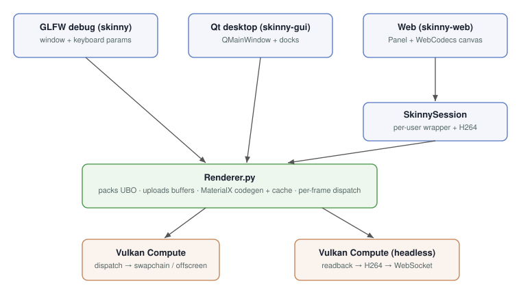
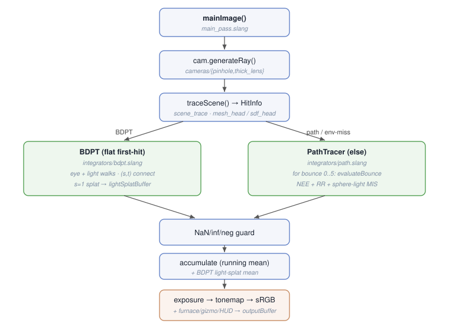

# Skinny — Architecture

Skinny is a GPU path tracer specialised for physically-based human skin
rendering. It combines a three-layer biological skin model (epidermis / dermis /
subcutaneous) with a full MaterialX-based `standard_surface` closure tree plus
arbitrary MaterialX nodegraphs compiled to per-material Slang modules. The same
renderer runs through either a one-dispatch megakernel or a staged wavefront
pipeline, on native Metal or Vulkan.

The skin-specific subsystems (three-layer biological model, §1–§6 estimator
chain, volume transport, head geometry, and MaterialX skin codegen) are
documented in [SkinRendering.md](SkinRendering.md). This file covers the generic
renderer architecture.

The renderer has **two GPU execution modes** for the *same* light-transport
integral, selected once at startup with `--execution-mode megakernel|wavefront`
and fixed for the session. Each has its own technical deep-dive:

- **[Megakernel.md](Megakernel.md)** — the default: one monolithic
  `[numthreads(8,8,1)]` dispatch of `main_pass.slang`, one thread traces a whole
  path in a register-resident bounce loop.
- **[Wavefront.md](Wavefront.md)** — the same estimator torn across many small
  per-stage / per-material kernels connected by GPU queues; better material
  coherence and small enough to compile on MoltenVK.

Both are unbiased and A/B-verified to match; see
[Wavefront.md § Megakernel vs wavefront](Wavefront.md#megakernel-vs-wavefront)
for the side-by-side comparison and the rationale for having both. The section
below describes the megakernel GPU flow in detail.

---

## Document Map

This file is the hub. Each subject below has its own document. A change updates
the document that owns the subject, not this file.

| Document | Owns |
|---|---|
| [ShaderPipeline.md](ShaderPipeline.md) | Pluggable Slang interfaces, the material and integrator pipeline, MaterialX nodegraph codegen, environment importance sampling, SlangPile |
| [SceneSystem.md](SceneSystem.md) | USD intake, scene graph, instancing, lights, textures, skinning, camera / lens / debug viewport |
| [GpuResources.md](GpuResources.md) | Descriptor binding map, GPU resource inventory, host-mirrored byte layouts, shader variant key, `FrameConstants` layout |
| [HostModules.md](HostModules.md) | Python module map, front-end bring-up, renderer carve-out pattern, the device-free pure core |
| [Backends.md](Backends.md) | Backend selection, `MetalContext`, the Vulkan path, the `gfx/` abstraction |
| [FrontEnds.md](FrontEnds.md) | Headless render API, web application, display tail (exposure, tone map, tool readback) |
| [OnlineTraining.md](OnlineTraining.md) | The online neural-training loop and the weight handoff |
| [ParityHarness.md](ParityHarness.md) | The parity matrix, the dual gate, the confirming-scene suite |
| [ImplementationMap.md](ImplementationMap.md) | The per-file listing of the Python package and the shader tree |

[README.md](README.md) indexes every reference document in `docs/`.

---

## High-Level Pipeline

Three entry points share the same renderer core:

### Step-by-step architecture sketch

The single overview below keeps the architecture sequence and its two governing
film/dispatch expressions together: front ends feed the renderer, the renderer
packs state, the selected execution mode runs on Metal or Vulkan, and the HDR
film is progressively accumulated and displayed.

`skinny-gui` and `skinny-web` share a **single widget-tree spec**
(`ui/spec.py` + `ui/build_app_ui.py`). The Qt backend
(`ui/qt/backend.py`) and the Panel backend (`ui/panel/backend.py`) walk
the same tree and instantiate their own widgets, so adding a slider in
the spec lights it up in both UIs.

### Per-Frame Render Loop (Qt desktop)

1. `MainWindow` creates a `RenderCommandQueue` plus a `QtRendererProxy`, then
   starts `RenderViewport`. The proxy is the only renderer-shaped object the GUI
   thread reads; it is backed by immutable snapshots and local optimistic state.
2. `RenderViewport` starts a Qt worker thread (`_RenderWorker`). That worker
   constructs the GPU context with `make_context(...)`, constructs `Renderer`,
   applies startup flags/restored settings, and owns cleanup (`disable_online_training`,
   `renderer.cleanup()`, `ctx.destroy()`).
3. Each worker frame drains queued commands, then calls `renderer.update(dt)` →
   online-training tick (when armed) → `renderer.render_headless()`.
4. GUI events post common renderer mutations (camera input, zoom/focus toggles,
   scene loads, parameter edits, and render-target resize) into the command queue
   instead of waiting for a render lock while a frame is in flight. High-rate
   commands such as resize and camera movement are coalesced.
5. `renderer.update(dt)` detects dirty state (camera, params, env, scene graph),
   reuploads affected buffers, and resets accumulation on change.
6. `renderer.render_headless()` packs FrameConstants + SkinParams + light +
   per-material data into the UBO, dispatches `ceil(W/8) × ceil(H/8)`, copies the
   storage image into a readback buffer, and emits raw RGBA bytes plus status
   snapshots. The Qt main thread stores those bytes in a `QImage` and paints the
   latest frame.

All five **View**-menu tool docks — Scene Graph, Material Graph, Python Material
Editor, BXDF Visualizer, and Camera Debug — are proxy-backed under this model
(change `restore-render-thread-tool-docks`): they receive the `QtRendererProxy`,
never the worker-owned `Renderer`. Reads come from a worker-built projection
(`build_scene_state` → `SceneStateSnapshot`, refreshed via `proxy.refresh_scene_state()`),
mutations post to the command queue, and each dock's GPU-producing work runs on
the worker and is marshalled back to the GUI thread by a per-dock `Signal`:
the BXDF/BSSRDF lobe evaluation (`proxy.request_bxdf_eval`), the Material Graph
preview (`proxy.render_material_preview`) and MaterialX-doc topology edits (relocated
into worker closures over `_worker_doc`/`_worker_mtlx_node`), and the Camera Debug
viewport (owned on the worker as `renderer.debug_viewport`, emitting a `DebugFrame`
each frame via `RenderViewport.debug_frame_ready`). No dock issues a GPU call or
blocks on a `Future` from the GUI thread.

### The command queue is front-end-neutral (`render_session.py`)

`RenderCommandQueue` and `QtRendererProxy` live at `src/skinny/render_session.py`,
not under `ui/qt/` — the module never imported Qt, and it now has callers outside
the Qt front-end (`skinny.ui.qt.render_session` re-exports for compatibility).
Two rules follow:

- **The queue executes commands, callers do not.** `run_pending(target, on_error=None)`
  invokes each callback and settles its reply future. `drain()` only removes
  pending commands; a caller that drains and loops the callbacks itself must
  settle every reply, or awaited calls hang to their timeout. Both the Qt worker
  and the GLFW main loop call `run_pending`.
- **Every non-owning thread marshals through it — reads included.** Off-thread
  reads race too: the scene graph is rebuilt on the streaming load thread and
  swapped into `renderer.scene_graph`, so reading it from another thread can
  observe a swap mid-flight.
- **A write through a sub-object is still a renderer mutation.**
  `setattr(renderer.clock, "playing", …)` writes no top-level attribute, so it
  slipped past the rule while doing nothing at all: the proxy holds its own
  `PlaybackClock` and absorbed it. Transport writes go through
  `QtRendererProxy.set_clock_state(verb, value)`, which updates the mirror *and*
  posts the same verb; `build_app_ui._set_clock_value` routes there whenever the
  bound object offers it. Any proxy that holds a local instance of a
  renderer-owned object has this hazard (change `review-surfaced-defects`).
- **A front-end binds the shared control tree to a marshalling proxy, never to
  the live renderer.** Binding the same setters to a proxy in one front-end and
  to the live object in another gives one set of setters two contradictory
  thread-safety contracts.
- **A front-end that offers a control served by a host callback supplies it.**
  `_add_resolution` used to fall back to calling `renderer.resize` directly when
  `AppCallbacks.resize_render_target` was absent, which silently converted a
  missing wire into an unsynchronised resize from the caller's thread. It now
  raises at tree-build time.
- **A raising command cannot retire the owning thread.** The loop that drains
  commands and advances the renderer reports the failure and continues, or stops
  the session visibly — it never leaves a session marked running with a dead
  render thread.

The GLFW front-end (`app.py`) owns a queue and calls `run_pending` once per
iteration, immediately after `glfw.poll_events()` and before `renderer.update(dt)`
— the same position the Qt worker drains at. The call is unconditional, so
ordering does not depend on optional features being enabled.

The web front-end (`web_app.py`) owns a queue per session. `SkinnySession`
drains it inside its render lock at the top of every iteration, and the sidebar
is built against `MarshalledRenderer` — a read-through, write-posting view of
the session's renderer. Unlike `QtRendererProxy` it mirrors no state (the Panel
widgets already poll the live renderer for reads), so a sub-object write cannot
be absorbed locally. Its `resize_render_target` goes to the session's own
`resize`, not `renderer.resize`, because that method holds the lock across
resize → encoder rebuild → stale-frame drain → WebSocket notify, in that order.

### MCP scene control (`mcp_server.py`, `mcp_auth.py`, `mcp_paths.py`)

Opt-in (`--mcp`, off by default), the interactive front-ends (`skinny`, `skinny-gui`
— the two that own a render-thread command queue) host an MCP server on a daemon
thread that exposes the live scene graph to an MCP client: three path-addressed
inspection/property tools, `scene_list` / `scene_get` / `scene_set`; eight
structural tools, `scene_add_model` / `scene_add_primitive` / `scene_add_light` /
`scene_remove` / `scene_save` / `scene_job_status` / `scene_add_material` /
`scene_bind_material`; and one renderer-free discovery tool, `material_list`
(changes `mcp-scene-control`, `mcp-scene-structure`, `mcp-material-authoring`).
It attaches to the running renderer; it never builds one.

The server thread holds only the proxy (Qt) or the bare queue (GLFW) — never the
`Renderer` and never the GPU context, so it cannot extend a `MetalContext`
lifetime. Reads *and* writes are marshalled through the queue and awaited with a
timeout: node resolution, validation, and dispatch all have to run on the render
thread, and the client needs a definitive applied-or-rejected answer. The cost is
that MCP writes do not coalesce (`post_with_reply` takes no `coalesce_key`), so a
client sweep is paced by the round-trip; the dock's own slider drags still
coalesce through the proxy verbs. A request that times out is cancelled, and
`run_pending` skips cancelled commands, so a write cannot land after the client
was told it failed.

Property writes route through `apply_scene_property` in `ui/scene_edit_actions.py`,
**shared with the Scene Graph dock**. Dispatch cannot be derived from a
`(path, property)` pair alone — material parameters live on Shader prims that
carry no `renderer_ref` and resolve by an ancestor walk to the enclosing Material,
and a transform component write recomposes from its sibling components. One
function, two callers, so an agent edit and a dock edit cannot drift. The dock's
file-chooser flows (HDR, lens) are the one exemption — against the proxy those
calls return a `Future`, not a bool, so they keep their own async handling; the
routing decision still lives in the shared function.

Security is four independent layers (`mcp_auth.py`): off by default; loopback bind
asserted at socket creation; `Origin`-bearing requests refused and `Host`
validated; and a persistent bearer token at `~/.skinny/mcp_token` compared
with `hmac.compare_digest`. The token file is `0600` and re-validated per read
(no-follow open, owner/mode checked on the same descriptor) **on POSIX only** —
Windows lacks those primitives, so there the file relies on profile-directory
access control; recorded as a known gap. The socket is created by the front-end, not the server
runtime, which is what makes the loopback assertion and the bind-collision path
reachable before startup reports success. uvicorn's signal handlers are explicitly
suppressed — they would otherwise overwrite `MetalContext`'s chained SIGINT/SIGTERM
teardown (see **Metal dispatch hygiene**).

v1 exposed no save/export tool and no node add/remove; `mcp-scene-structure`
provides both, so only a rendered-image tool remains excluded (an edit resets
progressive accumulation, so an immediate readback would return near-noise).

**Structural tools (`mcp-scene-structure`).** `scene_add_model` /
`scene_add_primitive` / `scene_add_light` author into the renderer's
non-destructive USD edit sublayer (see **usd-scene-editing**) the same way the
Scene Graph dock's add actions do; `scene_add_primitive` additionally authors a
dedicated `UsdShade`/`UsdPreviewSurface` material bound to the new gprim, since
an unbound prim resolves to the protected fallback material slot and could
never be re-colored. `scene_remove` deactivates (non-destructive); `scene_save`
writes the edit layer but — like the dock's own save — captures only
structural edits, not `scene_set` property overrides, which mutate in-memory
render state without touching USD.

**Material authoring (`mcp-material-authoring`).** `material_list` is a
renderer-free discovery call over `mtlx_synthesis`'s catalogs (curated preset
directory listing + gen-reflected editable inputs, model schemas, the node
whitelist, the template registry) — it never touches the render thread, so it
cannot drift from what a spec actually accepts. `scene_add_material` validates
its spec and, for a synthesized document, runs the Slang generator as a
GPU-free dry-run entirely on the MCP thread before any prim or file exists;
only the resulting stage write (typed `UsdShade.Material` holder + `.mtlx`
reference) happens inside a posted closure. A created material's result always
reports `live: false` — participation is binding-driven (design D8): a
material is loaded, rendered, and exposes its editable properties only once
`scene_bind_material` (or `scene_add_primitive`'s `material` argument) binds
it, which replaces rather than merges with any file-authored binding. Adding
the same curated preset twice returns the existing holder instead of a
duplicate (fixed element names cannot resolve to two prims); synthesized and
template materials are never deduped. A synthesized material's first bind
changes the scene's graph-set signature and rebuilds the render pipeline, so
it — more than a plain structural add — is expected to degrade to a pollable
job. `scene_add_primitive` grows an optional `material` argument (a preset/
template name, or an existing `/Materials/...` path) that replaces its inline
seeded material; it is rejected together with `color`/`roughness`/`metallic`.

Every path a structural tool touches is checked against `mcp_paths.py`'s
allowlist (`--mcp-roots` / `SKINNY_MCP_ROOTS`, default: platform temp dirs +
cwd) — a guardrail against a misdirected call within the MCP client's own trust
domain, not a sandbox. For `scene_add_model` the check runs *inside* the
posted render-thread closure, both on the argument and, via an optional
`validate(stage, added_prim)` callback `add_model` invokes post-recompose/
pre-resync, on the layers and asset attributes the reference newly pulls in
(payloads loaded and instance proxies traversed first, so both escape routes
are covered) — a violation rolls the prim back through the renderer's own
rollback path.

A model add can outlast a flat request timeout, and a cancelled-but-already-
running one would leave the client unsure whether the scene changed. Structural
tools instead wait a short (~2s) inline grace period, returning the result
directly if it lands in time or a `job_id` to poll via `scene_job_status`
otherwise — FastMCP runs tool bodies on the event loop with no thread hop, so
this is a deliberate, bounded stall rather than a background task; polling
itself never blocks.

### Per-Frame Render Loop (GLFW debug)

1. `app.main()`: GLFW poll → `commands.run_pending(renderer)` →
   `InputHandler.update(dt)` → `renderer.update(dt)` → `renderer.render()`.
   The drain is unconditional (it does not depend on `--mcp`), and sits before
   input so a command posted by another thread lands in the same frame ordering
   the Qt worker gives it.
2. `renderer.render()` presents directly via the swapchain (windowed mode).

### Per-Frame Render Loop (Web)

1. `SkinnySession._render_loop()`: background thread per session.
2. `renderer.update(dt)`: same as desktop.
3. `renderer.render_headless()`: dispatches compute, copies result to
   `ReadbackBuffer` via staging buffer, returns raw RGBA bytes.
4. `VideoEncoder.encode_h264()`: RGBA → YUV420p → H264 AVCC packets.
5. Packets pushed to `frame_queue` → Tornado `VideoStreamHandler` sends
   binary WebSocket messages → browser decodes via WebCodecs.

---

## GPU Execution Flow

The detailed per-step substructure (furnace/mesh/SDF trace dispatch, BDPT eye/light
walk + (s,t) connections + s=1 splat, the path tracer's per-bounce
`evaluateBounce` → FLAT/SKIN/DEBUG dispatch, Russian roulette, sphere-light MIS):

- **`traceScene`** — furnace → unit sphere; mesh → `marchHeadMesh()`; SDF → `marchHead()`.
- **BDPT** — eye walk (FlatMaterial) + light walk (sphere/emissive/dir) + (s,t)
  connections + light-tracer splat (s=1) → `lightSplatBuffer`.
- **PathTracer** — cutout-transparency skip loop, then `for bounce 0..5`:
  `evaluateBounce` dispatches FLAT (`allLightsNEE` + sample, optional
  `evalSceneGraph`), SKIN (`evalSkinRadiance` §1–§6), or DEBUG (`0.5 + 0.5·N`);
  Russian roulette after bounce 0; sphere-light MIS on the BSDF ray.
- **Post** — NaN/inf/neg guard → running-mean accumulation (+ BDPT light-splat
  mean, Q22.10 → float) → exposure (2^EV) → tonemap → sRGB → furnace overlay →
  gizmo line composite (binding 22) → HUD alpha → `outputBuffer`.

`evalSceneGraph(materialId, hit, ...)` is generated per material into
`shaders/generated/` by `MaterialXGenSlang` and dispatched via tag-switch
in `flat_material.slang`. See **MaterialX Nodegraph Compute Pipeline**
below.

---

## Shader Module Dependency Graph

---

## Key Invariants

- **`mmPerUnit`**: only `loadSkin` / volume code converts mm→world units.
  Estimators receive already-converted σ values.
- **Scalar block layout**: all UBOs and SSBOs use `-fvk-use-scalar-layout`.
  float3 has 4-byte alignment (no 16-byte promotion). Struct packing on the
  Python side must match exactly.
- **Progressive accumulation**: running mean in linear HDR. One NaN permanently
  poisons a pixel — guarded in `main_pass.slang` (reject NaN / inf / negative
  before accumulation). The reset trigger, `Renderer._current_state_hash`, is
  **derived from the `params.py` registry** (change
  param-registry-accumulation-reset): every `ParamSpec` with
  `resets_accumulation=True` (the default; only `tonemap_index`/`exposure` opt
  out) contributes, coerced per its kind or declared `hash_coercion` override
  (the four continuous ReSTIR count params keep their legacy `int()` cast),
  plus the named non-param contributors in `ACCUM_STATE_PROVIDERS` (camera
  signature, `mtlx_overrides` dict — covering all `mtlx.*` params wholesale —
  material version, volume-grid key, film clamp, camera mirror, USD time code,
  SPPM overrides). Adding a `ParamSpec` IS registering its reset semantics;
  the contributor-set invariant is gated hostlessly by
  `tests/test_accum_reset_registry.py`.
- **Furnace mode**: `main_pass.slang` flags energy-conservation violations
  in pink. Supports both global (`fc.furnaceMode`) and per-material (bit 10
  in `materialTypes[]`) furnace probes via `effectiveFurnaceMode()`. Every
  material must converge to L=1.0 under a white unit-sphere environment.
- **Material dispatch**: tag-switch monomorphisation in `evaluateBounce()`
  (`integrators/path.slang`) and `BDPTIntegrator` (`integrators/bdpt.slang`).
  Never existential `IMaterial`. NEE is generic (`allLightsNEE<TM>`) —
  monomorphised per material type.
- **MaterialX graph dispatch**: `evalSceneGraph(materialId, ...)` is also a
  switch statement, generated into `shaders/generated/generated_materials.slang`
  with one case per active graph hash.
- **RNG order**: skin estimators (§1–§6) are called in fixed sequence so RNG
  state stays pixel-identical across refactors.
- **BVH caching**: `mesh_cache.py` stores zstd-compressed vertex/index/BVH
  blobs keyed by content hash. Cache hit skips subdivision + BVH build.
- **SPIR-V cache**: bounded to ~32 entries via mtime-LRU eviction. Pipeline
  rebuilds skip when the graph set is content-identical; texture pool is
  repopulated after every rebuild.
- **MaterialX texture sampling**: generated graph modules must use
  `SampleLevel` (no derivatives in compute pipelines) and must guard against
  the bindless `SENTINEL` slot via `mtlx_gen_shim.slang`.
- **Single widget tree**: the Qt and Panel UIs both consume
  `ui/build_app_ui.build_main_ui`. New parameters added there appear in
  both UIs without per-backend code.

---
