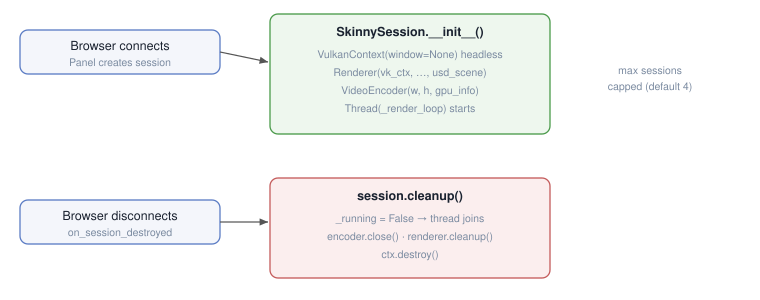

# Skinny — Front Ends and Output

This document covers the ways a caller drives the renderer and reads its
output: the headless render API, the web application, and the display tail
(exposure, tone mapping, and tool readback).

For the public Python surface see [PythonAPI.md](PythonAPI.md). For the
renderer overview see [Architecture.md](Architecture.md).

---

## Headless Render API (`skinny.headless`)

> Full signatures, return types, and examples for the whole programmatic
> surface are in **[PythonAPI.md](PythonAPI.md)**. This section is the
> architectural overview.

`skinny.headless` is the public offscreen-render interface, driving
`Renderer.set_usd_scene()` — a three-line caller of `apply_scene_update` with a
`scene_intake.adopt_scene` update — with no window or event loop. Key symbols:

- `HeadlessRenderer(w, h)` — context-manager that owns the resolved GPU context
  (`MetalContext` or `VulkanContext` — `backend=` > `SKINNY_BACKEND` > `auto`
  through the shared `select_backend`, change `headless-backend-auto`) +
  `Renderer` (built through the shared
  [bring-up builder](HostModules.md#front-end-bring-up-bringuppy-change-frontend-bringup-builder)'s
  `create` stage, so destroy-on-failure and the plan-carried build dims are the
  same as every front-end's); pipeline compiles once, then `render_to_array(stage)` /
  `render_scene(stage, path)` / `render_animation(stage, outdir)` can be
  called repeatedly with a mutated `Usd.Stage` per frame.
- Module-level `render_scene` / `render_to_array` / `render_animation` —
  convenience wrappers that open and close the GPU context for one-shot calls.
- `skinny-render` CLI entry point wraps the same API; `--animate` renders a
  frame sequence over USD timecodes.

---

## Web Application Architecture

### Overview

`skinny-web` serves a Panel (HoloViz) web application with per-user
server-side rendering. Each browser session gets its own Vulkan renderer,
H264 encoder, and render thread. The Panel/Bokeh protocol handles widget sync
and session isolation; a custom Tornado WebSocket streams encoded video.
The sidebar widget tree comes from the same `ui/build_app_ui.build_main_ui`
spec that the Qt app uses.

### Session Lifecycle



Max concurrent sessions capped (default 4) to bound GPU memory.

### Video Streaming Protocol

Binary WebSocket at `/video_ws/<session_id>`:

| Frame type | Byte 0 | Payload |
|------------|--------|---------|
| H264 keyframe | 0 | AVCC-framed NAL units |
| H264 delta | 1 | AVCC-framed NAL units |
| JPEG fallback | 2 | JPEG image |
| AVCC description | 3 | SPS/PPS for decoder init |

Header: `!BI` (1 byte type + 4 byte accum frame number) + payload.

On WebSocket open, stale frames are drained and encoder forced to emit a
keyframe so the browser decoder starts clean.

Browser-side: WebCodecs `VideoDecoder` for H264 → `<canvas>` blit. Falls back
to JPEG `` when WebCodecs unavailable.

### Hardware Abstraction (`hardware.py`)

GPU selection is vendor-aware:

```
enumerate_gpus(vk_instance) → list[GpuInfo]
select_gpu(vk_instance, preference) → GpuInfo
```

`GpuInfo.preferred_h264_encoder` maps vendor → encoder:
- Intel (0x8086) → `h264_qsv`
- NVIDIA (0x10DE) → `h264_nvenc`
- AMD (0x1002) → `h264_amf`
- Fallback → `libx264`

All entry points accept `--gpu {intel,nvidia,amd,discrete,auto}`.

### H264 Encoder (`video_encoder.py`)

Wraps PyAV for H264 encoding with hardware-aware fallback chain:

1. Try `gpu_info.preferred_h264_encoder`
2. Fall back to `libx264`
3. If all fail, JPEG-only mode

Encoder outputs **Annex B** NAL units (PyAV default), converted to **AVCC**
framing for WebCodecs compatibility. AVCC description (SPS+PPS) sent once on
WebSocket open.

Key methods:
- `encode_h264(rgba_bytes)` → list of `(is_key, avcc_data)` tuples
- `encode_jpeg(rgba_bytes, quality)` → JPEG bytes (fallback)
- `force_keyframe()` → next frame forced as IDR (called on param/camera change)

### Headless Vulkan Path

`VulkanContext(window=None)`:
- No GLFW dependency, no surface/swapchain
- Compute queue only (no present queue)
- No surface extensions in instance creation

`Renderer.render_headless()`:
- Dispatches to persistent offscreen `StorageImage` (not swapchain image)
- Barrier → `ReadbackBuffer.record_copy_from()` → fence wait → `read()`
- Returns raw RGBA bytes

The Qt entry (`skinny-gui`) runs in the same headless mode and blits the
readback into a `QImage` via `RenderViewport`.

---

## Display: Exposure, Tonemap, and Tool Readback

`main_pass.slang` post-processes the accumulated linear-HDR image:

- **Exposure** — `fc.exposure` (EV stops, applied as `2^EV`) before tonemapping.
- **Tonemap operator** — `fc.tonemapMode`: 0 = ACES filmic (Narkowicz),
  1 = Reinhard, 2 = Hable/Uncharted 2, 3 = Linear clamp. Exposure and tonemap
  are post-process knobs — changing them does **not** reset accumulation
  (the sole `resets_accumulation=False` opt-outs in the `params.py` registry).
- **Tool readback** (binding 30, `toolBuffer`) — one-shot probes that write
  per-pixel data back to the CPU: scene pick (`fc.pickArmed` + `fc.pickPixel`
  → `HitInfo`), the BXDF visualiser (`TOOL_MODE_BXDF`), and a BSSRDF probe
  (`TOOL_MODE_BSSRDF`). The CPU clears the arm flag after a single read.

---
