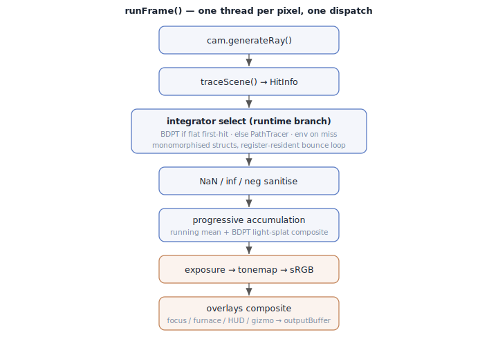

# Skinny — Megakernel Execution Mode

The **megakernel** is Skinny's default GPU execution mode: the entire render —
camera ray generation, scene traversal, material shading, the full bounce loop,
accumulation, tonemap, and overlay compositing — runs in **one monolithic
compute dispatch** of `shaders/main_pass.slang`, one thread per pixel.

It is one of two execution modes (the other is the
[wavefront](Wavefront.md) mode). Both run on native Metal and Vulkan; the mode is
selected once at startup with `--execution-mode megakernel|wavefront`
(`cli_common.py:85`) or `SKINNY_BACKEND`-adjacent config and is **fixed for the
session** — there is no runtime cycler, and it is deliberately excluded from
`_current_state_hash` (`renderer.py:1346-1348`, `6965`). The mode constants are
`EXECUTION_MEGAKERNEL = 0` / `EXECUTION_WAVEFRONT = 1` (`params.py:64-65`).

> **Terminology note.** "Megakernel" and "wavefront" are *execution modes*, not
> graphics backends. Both modes run on native Metal and Vulkan (MoltenVK when
> Vulkan is selected on macOS). The cross-mode architecture, including dispatch
> and film equations, is shown in
> [Architecture.md § Step-by-step architecture sketch](Architecture.md#step-by-step-architecture-sketch).

For *why* the wavefront mode exists alongside this one, see
[Why two execution modes](#why-two-execution-modes) below and the matching
section in [Wavefront.md](Wavefront.md).

---

## 1. Dispatch

| Aspect | Value | Reference |
|--------|-------|-----------|
| Shader entry | `mainImage` | `main_pass.slang:377-437` |
| Workgroup | `[numthreads(8,8,1)]` = 64 threads, **one thread per pixel** | `main_pass.slang`, `WORKGROUP_SIZE=8` `renderer.py:65` |
| Dispatch grid | `ceil(W/8) × ceil(H/8) × 1` | `renderer.py:7159-7173` |
| Frequency | one `vkCmdDispatch` per frame | `render()` `renderer.py:7065` |
| Parameters | single UBO (FrameConstants + SkinParams + lights), **no push constants** | `_pack_uniforms()` `renderer.py:6693+`, upload `7094` |

The pipeline is built only in megakernel mode — gated by
`megakernel = self.execution_mode_index == EXECUTION_MEGAKERNEL`
(`renderer.py:2661`); `ComputePipeline(... entry_module="main_pass",
entry_point="mainImage" ...)` compiles `main_pass.slang` → SPIR-V
(`renderer.py:2695-2723`). In wavefront mode `main_pass` is **not** compiled (a
`scene_bindings_only` build supplies just the set-0 layout, `renderer.py:2728`).

Per-frame: `vkCmdBindPipeline` → `vkCmdBindDescriptorSets(descriptor_sets[f])`
→ `vkCmdDispatch(groups_x, groups_y, 1)` → blit storage image to swapchain
(windowed) or copy to readback (headless, `render_headless` mirrors this at
`renderer.py:7367`). The same pipeline is reused synchronously for the
BXDF/BSSRDF visualiser, keyed by `toolBuffer[0]` (`renderer.py:5609-5619`,
`main_pass.slang:386-396`).

The same `toolBuffer[0].x` dispatch hijack also drives a **structural AOV** mode
(`TOOL_MODE_STRUCTURAL`, `bindings.slang`). When armed, `runFrame` writes one
`float4` per pixel — `(hit-mask, instanceId, materialId, depth)` — into
`toolBuffer` from slot `TOOL_STRUCT_AOV_BASE` (16) instead of shading, reusing
the real primary ray + `traceScene`. It feeds the Metal↔Vulkan **structural
parity** test (6.1): the structural channel is deterministic across backends
(integer ids + depth, no transcendental divergence), so it is compared
bit-exact (ids/mask) / within a tiny depth tolerance, while shaded color uses a
perceptual bar (6.2). Host entry point: `Renderer.read_structural_aov()`. The
winning TLAS instance index is carried on `HitInfo.instanceId`
(`mesh_head.slang` records it in `marchHeadMesh`).

---

## 2. Per-pixel flow (all inline in one invocation)

`main_pass.slang` imports every subsystem into the single kernel
(`main_pass.slang:14-32`): `common, bindings, interfaces, scene_trace,
environment, integrators.path, integrators.bdpt, cameras.{pinhole,thick_lens},
generated_materials, materials.flat.*, materials.skin.*, tonemap`. The body
`runFrame<TC:ICamera>` (`main_pass.slang:36-187`) executes in order:

Step-by-step with line refs:

| Step | Reference |
|------|-----------|
| `cam.generateRay(pixel, rng, lensWeight)` | `cameras/{pinhole,thick_lens}.slang` |
| `traceScene(fc, ray) → HitInfo` | `scene_trace.slang` |
| optional pick-buffer write | `main_pass.slang:46-54` |
| integrator select (BDPT if flat first-hit / else Path / env on miss) | `main_pass.slang:58-76` |
| lens throughput weight; NaN/Inf/neg sanitise | `main_pass.slang:81-88` |
| progressive accumulation (running mean) | `main_pass.slang:90-102` |
| + BDPT light-splat composite (Q22.10) | `main_pass.slang:104-118` |
| exposure (2^EV) → tonemap → sRGB | `main_pass.slang:120-121` |
| focus-plane / furnace / HUD / gizmo overlays | `main_pass.slang:129-184` |
| `outputBuffer[pixel] = display` | `main_pass.slang:186` |

The integrator and camera are **monomorphised** structs constructed in
registers (`PathTracer` `main_pass.slang:70-71`, `BDPTIntegrator<TC>` `62-66`);
`runFrame` is templated on `ICamera` so `ThickLensCamera` (when
`fc.numLensElements > 0`) vs `PinholeCamera` specialise at the call site
(`main_pass.slang:427-436`).

---

## 3. The whole path is one register-resident loop

The defining property: **one thread traces an entire light path with an
in-register `for`-loop over bounces.** In `PathTracer.estimateRadiance`
(`integrators/path.slang:124+`): `throughput`, `radiance`, the current `Ray`,
`HitInfo`, and the MIS `prevBsdfPdf` all live in registers across
`for (uint bounce = 0; bounce < MAX_BOUNCES; bounce++)` (`path.slang:148`,
`MAX_BOUNCES = 6` `path.slang:28`), with Russian roulette after bounce 0
(`path.slang:176-183`) and a cutout-transparency skip loop capped at 32
(`path.slang:141,225`).

BDPT is likewise single-thread but builds eye/light subpaths into **register
arrays** `BDPTVertex eye[BDPT_MAX_VERTS]` / `lit[...]` (`bdpt.slang:522-523`),
then connects (`connectGeneric`/`connectT1`). Light-tracer s=1 vertices are
atomic-splatted to the global `lightSplatBuffer` (binding 21, Q22.10
fixed-point, `bdpt.slang:758,801-803`).

No cross-thread path state exists — each pixel is independent. The only
persistent GPU buffers are output targets and tables: `accumBuffer`,
`outputBuffer`, `lightSplatBuffer`, `toolBuffer`, `gizmoSegments`, `hudMask`,
the UBO, material tables, lights, bindless textures, env CDFs (descriptor set 0).

### 3.1 Area-light emission: BSDF-hit vs NEE, and the specular rule

An emissive triangle (area light) can be reached two ways, and the path tracer
must count it **exactly once**:

- **Next-event estimation (NEE)** — at each surface, sample a point on the light
  and evaluate the BSDF toward it (`br.directLight`, always added). This is the
  primary, low-variance path for **non-delta** lobes. The emissive triangle is
  chosen **power-weighted** — probability `p_i = w_i / Σw`,
  `w_i = area_i × Rec.709-luminance(emission_i)` — via a binary search over a
  cumulative-power CDF packed inline in the `emissiveTriangles` records
  (`sampleEmissiveTriangle` in `scene_lights.slang`), not uniformly by index, and
  **every** emissive triangle participates (no 256-triangle cap). This is shared
  by the megakernel and the wavefront path/BDPT integrators (one `nee.slang`
  definition) and inherited by ReSTIR DI (change `emissive-mesh-nee`). The
  selection probability only changes *which* triangle is sampled; `selectionPdf`,
  the area→solid-angle conversion, and the MIS power-heuristic below all derive
  from the same `p_i`, so NEE stays unbiased and the no-double-count gate is
  untouched.
- **BSDF-sampled hit** — the bounce's sampled ray happens to land on the emitter
  (`br.bsdfSample.emission`).

The two are combined with **multiple importance sampling** so the light is counted
once, in full, regardless of its solid angle (`path.slang`, the
`if (bounce == 0u || fc.numEmissiveTriangles == 0u || spawnedBySpecular) … else …`
block):

- **bounce 0** (primary ray, no NEE counterpart yet) → add the BSDF-hit emission at
  full weight.
- **non-delta bounce** (`pdf > 0`) → NEE sampled this light with the power heuristic
  (`wNEE < 1`), so the BSDF-hit emission is added with the **complementary** weight
  `wBSDF = powerHeuristic(prevBsdfPdf, pdfLightSA)` (change
  `emissive-triangle-bsdf-mis`). `prevBsdfPdf` is the spawning bounce's solid-angle
  pdf; `pdfLightSA` is the NEE solid-angle pdf for this hit, reconstructed **without
  the emissive-buffer index** — under power-weighted selection the per-triangle area
  cancels (`p_i = area_i·lum_i / ΣW` × uniform-area `1/area_i` ⇒ area-pdf
  `lum_i / ΣW`), leaving
  `pdfLightSA = Rec.709-lum(emission)·d² / (emissiveTotalPower·cosLight)` with
  `emissiveTotalPower = ΣW` carried in `FrameConstants` (the retired `irisZ` slot).
  Previously this term was **dropped**, which biased area lights dim by `(1 − wNEE)`
  — a deficit that grows with the light's solid angle (a large window lost far more
  than a small bulb). It mirrors the sphere-light branch (`intersectSphereLights`,
  `w_bsdf = powerHeuristic(bsdfPdf, pdf_light_sa)`).
- **delta / perfectly-specular bounce** (`pdf <= 0` — a smooth dielectric's mirror
  reflect/refract) → NEE evaluates the BSDF toward the light and gets **zero** for
  a delta lobe (no NEE partner exists), so the BSDF-hit emission is added at
  **full weight (w = 1)**. `spawnedBySpecular` carries the spawning bounce's
  delta-ness forward. This is what makes the **reflection of an area light in a
  glass surface** and the **specular leg of a caustic** (floor → BSDF ray → glass
  refract → light) appear. The wavefront path applies the identical rule (see
  `docs/Wavefront.md`).

**BDPT obeys the same gate.** BDPT reaches an area light by three accumulated
strategies: `t = 1` (`connectT1`, its NEE — power-heuristic weighted, mirrors the
path tracer's NEE), `t = 0` (the eye/BSDF subpath lands on the emissive triangle,
the `z.onLight` loop in `bdpt.slang`), and `t ≥ 2` (`connectGeneric` light-bounce
connections with full `misWeight`). The `s = 1` light-tracer splat lands in a
separate buffer and is not part of the accumulation. The `t = 0` emissive hit is
the BDPT analog of the path tracer's BSDF-hit emission, so it carries the **same
gate**: add `z.throughput * z.emission` at full weight only when no NEE partner
exists — `s == 2` (z is the first hit, behind the delta camera ≡ `bounce == 0`),
`eye[s - 2].isDelta` (a delta bounce reached z ≡ `spawnedBySpecular`), or
`numEmissiveTriangles == 0`. When a NEE partner **does** exist, the `t = 0` hit
is **MIS-weighted through the shared `misWeight` partition** (change
`bdpt-emissive-hit-mis`) — the same partition `connectT1`'s `t = 1` NEE, the
`t ≥ 2` connections, and the `s = 1` splat use, so every strategy that can
generate the path shares one power-heuristic partition summing to 1. The reverse
pdfs are reconstructed at the emitter vertex without the triangle index:
`z.pdfRev = Rec709-lum(emission) / emissiveTotalPower` (the per-triangle area
cancels under the area·luminance CDF; the RGB emission is reloaded via
`bdptSurface` so the spectral build matches the host CDF) and
`prev.pdfRev = convertSAtoArea(cosOut/π, z, prev)`. Two earlier states biased
this term: adding it at full weight on top of the weighted NEE double-counted and
rendered **~1.7× brighter than pbrt** (change `bdpt-energy-convergence`, guarded
by `tests/pbrt/test_bdpt_energy.py`, which compares **un-aligned** mean energy
because the parity gate's exposure alignment hides a uniform scale), and then
**dropping** it entirely once the double-count was gated out discarded the
BSDF-sampling share and biased area lights **~3% dim** vs the path tracer
(`mat_emissive` pbrt-truth relMSE 0.1292 → 0.0538, matching the path anchor
0.0522). The `misWeight` complement is the unbiased fix.

**One MIS partition for the display (change `bdpt-mis-unification`).** The above
fixes the *accumulation*; the *display* also composites the `s = 1` light-tracer
splat (`main_pass.slang`, see §2), and that was added at full weight too —
double-counting every diffuse path the eye side already had, so the displayed BDPT
ran ~1.12× the path tracer on a pure-diffuse scene. Two changes put all strategies
into one partition: (1) `splatLightVertex` now MIS-weights each splat
(`splatMisWeight` = `misWeight` specialised to `s = 1`, light-side ratios only,
with the camera as the eye endpoint and the camera-importance reverse pdf
`We·cosCam·cosY/d²`) — full weight only where the eye side is zero (specular
caustics on a directly-seen diffuse surface), ≈0 where the eye side owns the path;
(2) `connectT1` (`t = 1` NEE) now uses `misWeight` like the `t ≥ 2` connections
instead of a standalone 2-strategy power heuristic, so `t = 1` correctly divides
by the `t ≥ 2` and `s = 1` alternatives (it previously over-weighted indirect
transport, ~2% bright). After both, BDPT tracks the path tracer (diffuse display
×1.12 → ×1.02; the small residual is BDPT legitimately including the `s = 1`
strategy the path tracer lacks). Splat camera importance is the analytic pinhole
`We`; abstracting it over `ICamera` for thick-lens parity is a follow-up. Guarded
by `test_diffuse_arealight_bdpt_display_tracks_path` (compares the **display**, not
the accumulation — the accum gates can't see the splat).

---

## 4. Selection: compile-time vs runtime

| Decision | Mechanism | Reference |
|----------|-----------|-----------|
| Integrator (path/BDPT) | **runtime** branch on `fc.integratorType` (BDPT only if flat first-hit) | `main_pass.slang:58-72` |
| Camera (pinhole/thick-lens) | **compile-time** monomorphisation, runtime tag pick | `main_pass.slang:427-436` |
| Material (flat/skin/debug/python) | **runtime** tag-switch on `materialTypes[id] & 0xFF` | `evaluateBounce()` `path.slang` |
| MaterialX nodegraphs | **compile-time** codegen into `generated_materials` at pipeline build | `vk_compute.py:538` |
| `MAX_BOUNCES`, `BDPT_MAX_VERTS`, proposal seam | **compile-time** constants/imports | `path.slang:28`, `bdpt.slang` |

Adding or removing a MaterialX graph triggers a `slangc` recompile; everything
else branches at runtime inside the one kernel.

---

## 5. Progressive accumulation

- **GPU:** running mean in `accumBuffer` keyed by `fc.accumFrame` — `n=accumFrame;
  n==0` writes the sample, else `accum=(prev*n + sample)/(n+1)`
  (`main_pass.slang:90-102`). `accumBuffer` is persistent across frames.
- **CPU:** `update()` computes `_current_state_hash()` (`renderer.py:6947-6983`)
  over camera/lights/env/model/integrator/proposal-seam/playback-time/MaterialX
  overrides. Hash changed → `accum_frame = 0` + zero the light-splat buffer; else
  `accum_frame += 1` (`renderer.py:7047-7057`). `execution_mode_index` is
  excluded (fixed for the session, `renderer.py:6965`). `frameIndex` (RNG seed,
  `createRNG(pixel, fc.frameIndex)` `main_pass.slang:401`) advances every frame
  so each accumulated sample draws fresh noise.

---

## 6. Design trade-offs

**Strengths**

- **One dispatch.** No inter-stage buffers, queues, sort, or compaction; one
  pipeline, one descriptor set. Accumulation is trivial (no path compaction).
- **Everything composites inline** — overlays, tonemap, BDPT splat — so megakernel
  and wavefront produce bit-comparable pixels (`tonemap` is shared,
  `main_pass.slang:29-32`). This is why it is the default mode (`renderer.py:1096`).
- **Low CPU overhead** — minimal command recording per frame.

**Costs (inherent to the design)**

- **Register pressure.** Skin BSSRDF + GGX + the full MaterialX graph set + BDPT
  subpath register arrays (`BDPTVertex eye[BDPT_MAX_VERTS]`) all coexist in one
  kernel, capping occupancy.
- **Divergence.** Runtime per-pixel branching on material type, integrator, and
  camera model, plus per-bounce cutout/RR loops, makes warps diverge — every lane
  pays for the most expensive branch any lane in the warp takes.
- **Compile size.** The fat kernel (skin + python + all integrators) is large; on
  MoltenVK it can trip the Metal compiler's kernel-size limit — the direct
  motivation for the wavefront mode.
- `MAX_BOUNCES = 6` is hard-capped partly to bound this kernel's cost.

---

## Why two execution modes

The megakernel is simplest and produces the reference image, but its single fat
kernel suffers warp divergence (mixed materials in a warp serialise) and high
register pressure, and on MoltenVK the monolithic `main_pass` can exceed the
Metal compiler's kernel-size limit. The **[wavefront](Wavefront.md)** mode
splits the same estimator into many small per-stage / per-material kernels
connected by GPU queues: same math, better material coherence, and each kernel
small enough to compile. The trade is memory bandwidth (path state round-trips
through VRAM between bounces) and CPU-side command-recording overhead.

Both modes are unbiased estimators of the **same** integral and are
A/B-verified to match (the wavefront kernels are verbatim relocations of the
megakernel's per-bounce body and call the same `evaluateBounce` / MIS /
proposal-seam code). Pick megakernel for simplicity and the reference path;
pick wavefront for coherence-sensitive scenes and to dodge the MoltenVK
compile limit.

See [Wavefront.md § Megakernel vs wavefront](Wavefront.md#megakernel-vs-wavefront)
for the side-by-side table.

---

## Backends: Vulkan and Metal

The megakernel runs on both backends. Vulkan loads the pre-compiled
`main_pass.spv`; the native **Metal** backend compiles `main_pass.slang`
(`mainImage`) to Metal **in-process** via SlangPy (slang-rhi, no MoltenVK, no
`.metallib`) after `emit_megakernel_sources` emits the generated material
modules, then dispatches by **binding resources by name** — the renderer's
binding map drives the same logical slots, with no Vulkan descriptor sets. The
resource layer is resolved once by `resource_module(ctx)` (`vk_compute` vs
`metal_compute`), so the renderer's construction sites are backend-agnostic; see
[Architecture.md § Backend selection](Architecture.md#backend-selection).

**MSL uniform layout (`FrameConstants fc`, binding 0).** Slang pads `float3` to
16 B on the Metal target, so the reflected MSL block is **592 B / 16-align** vs
the Vulkan scalar **512 B / 4-align** (the embedded `Camera` is 288 B vs 272 B).
`_pack_uniforms_msl` reuses the Vulkan scalar blob from `_pack_uniforms` verbatim
and relocates each field to its **reflected** MSL offset (`pipeline.uniform_layout`
— never hardcoded; e.g. `camera.position`@256, `focusPlaneOrigin`@416,
`focusPlaneNormal`@432, `zoomMin`@448, `pickPixel`@472), uploaded via `set_data`
only. Drift guards assert the field table covers the whole scalar blob and the
packed length equals the reflected struct size. The renderer picks
`_pack_uniforms` vs `_pack_uniforms_msl` by `ctx.is_metal`; the Vulkan std140
path is byte-unchanged.

Skin/std-surface params and the lights arrive as SSBOs (not part of `fc`). For
the Metal-target texture/sampler split (`commonSampler`, the discrete-map
samplers, `NRI`) see
[Architecture.md § MetalContext](Architecture.md#metalcontext-metal_contextpy-metal_computepy).

**Metal watchdog tiling (change `metal-megakernel-watchdog-tiling`).** macOS
cannot cancel another process's GPU work, so a single full-frame megakernel
command buffer that runs too long wedges the device until reboot (the
`metal-dispatch-hygiene` rule). The megakernel has no per-pixel loop to cap the
way a volume march does — its cost blows up in *breadth*: **BDPT** builds an eye
subpath and a light subpath and evaluates the full `s × t` connection matrix per
pixel (each connection a BSDF eval at both endpoints plus a shadow ray), and on a
scene bound to inlined MaterialX **graph materials** each of those evals is a
large shader. That combination tipped a full-frame 720p dispatch past the
watchdog and hung the GPU. The fix is spatial, not temporal: under `SKINNY_METAL`
the Metal megakernel frame is committed as a sequence of screen-space **row
bands** — one command buffer per band (`metal_compute.ComputePipeline.dispatch`
loops the bands; `mainImage`/`mainImageRecord` add `fc.tileOriginY`, a Metal-only
`FrameConstants` field, to the dispatch thread's `y`). Each buffer is bounded to
`width × bandHeight` pixels. The accumulation image persists across the bands of
a frame and each pixel is written once, so N-band output is **bit-identical** to
one dispatch. The band count comes from `renderer._metal_megakernel_bands()` — an
integrator-aware per-pixel budget (`_METAL_MEGAKERNEL_BAND_PIXELS`: BDPT gets a
far smaller budget than Path/SPPM) scaled by resolution, overridable via
`SKINNY_METAL_MEGAKERNEL_BANDS`. Ordinary scenes at ≤256² stay a single band, so
the parity corpus is unaffected. Vulkan always dispatches the full frame in one
buffer; the `tileOriginY` field and its read are `#if defined(SKINNY_METAL)`
gated, so the Vulkan `FrameConstants` struct and SPIR-V are byte-unchanged.

---

## Key files

| File | Role |
|------|------|
| `shaders/main_pass.slang` | entry `mainImage`, per-pixel body, overlays, tool branches |
| `shaders/integrators/path.slang` | register bounce loop, `MAX_BOUNCES=6` |
| `shaders/integrators/bdpt.slang` | subpath register arrays, light splat |
| `renderer.py:2661,2695-2723` | mode gate + megakernel pipeline build |
| `renderer.py:7159-7173` / `7367` | windowed / headless dispatch |
| `renderer.py:6693+` | UBO packing |
| `renderer.py:6947-6983`, `7047-7057` | state hash + accumulation reset |
| `params.py:64-65,79` | execution-mode constants + capability gate |
| `cli_common.py:85` | `--execution-mode` flag |
