# Skinny — Neural Directional Proposal (SplineFlow)

This document is the implementation reference for **SplineFlow**, skinny's
learned **neural directional proposal** for path guiding. It samples a bounce
direction from a position- and material-conditioned **rational-quadratic neural
spline flow** (RQ-NSF) with an *exact* solid-angle pdf, and composes it
unbiasedly with the analytic BSDF/environment proposals through the
scene-sampling seam's one-sample MIS mixture. It covers the rendering stages, the
governing equations and the exact shader symbols that realize them, the network
architecture, the size×precision study, the design choices, the controls, and the
source papers.

> **New to spline flows?** [SplineFlows.md](SplineFlows.md) is the theory
> companion — it builds the idea from first principles (normalizing flows → the
> rational-quadratic spline transform → maximum-likelihood training → sampling)
> and only then derives *why* a conditional flow is the right importance sampler
> for a renderer. Read it for the "why"; read on here for the "how it runs on the
> GPU".

> Equations are shipped as **SVG images** (the repo's GitLab does not render
> KaTeX/`$$` math reliably). The LaTeX sources live in
> `docs/diagrams/neural/equations.json`; regenerate the SVGs with
> `../restir/render.cjs` (MathJax 3, publication quality — needs Node +
> `mathjax-full`) or the dependency-free `gen_svg_equations.cjs` fallback
> (`node docs/diagrams/neural/gen_svg_equations.cjs`). Inline symbols (ω, q_ω,
> α, β, Σ) are plain Unicode.

SplineFlow plugs into the **scene-sampling proposal seam** (the `ProposalPlugin`
socket reserved by the sampling change), the sibling of the `ReusePlugin` socket
ReSTIR rides. The seam and the wavefront execution backend it runs on are
documented in [Architecture.md](Architecture.md) (descriptor binding map) and
[Wavefront.md](Wavefront.md) (the bounce-stage proposal hook); the generic
path/BDPT integrators live in [README.md](../README.md). The pre-implementation
brainstorm and decision history are archived under
`openspec/changes/archive/2026-06-06-neural-directional-proposal/` (Stage 1) and
`openspec/changes/archive/2026-06-07-neural-precision-size-study/` (Stage 2) —
**this document describes the shipped code**.

## What SplineFlow is

A path tracer's variance is dominated by how well its bounce sampler matches the
true integrand `f · L_i · cosθ`. The material's own BSDF sampler matches `f·cosθ`
but is blind to where light *actually comes from*: in a scene with concentrated
indirect illumination, most BSDF draws point at darkness and the throughput
estimate is noisy.

**Path guiding** learns the missing factor — the incident radiance `L_i` — and
biases the bounce toward it. SplineFlow does this with a **conditional normalizing
flow**: an invertible map `T_θ : [0,1]² → [0,1]²` that warps a uniform base
sample into a hemisphere direction whose density `q_ω` concentrates where
`f · L_i · cosθ` is large. Two properties make it usable in an *unbiased*
renderer:

- **Exact density, both ways.** Because the flow is invertible in closed form,
  the same weights give a forward draw (`u → ω`) *and* the exact inverse density
  (`ω → q_ω`) of any direction — the latter is what the MIS mixture needs to
  weight a direction another proposal drew.
- **Unbiased composition.** SplineFlow is never used alone. It is one technique
  in a one-sample-MIS *mixture* with the always-on BSDF proposal (and optionally
  the environment proposal); the estimator divides by the full mixture pdf, so a
  learned lobe that is wrong on some lanes raises variance but never bias.

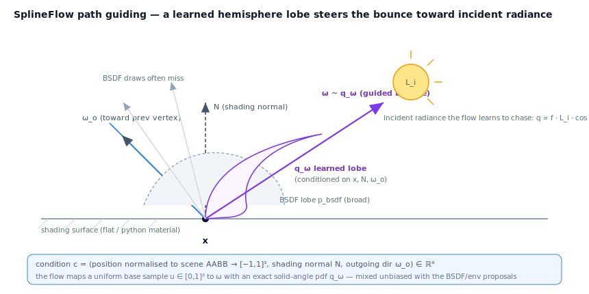

The network is **frozen and trained offline** (per scene, in the standalone
`spline_flow` PyTorch repo) from path records the renderer itself dumps; at render
time skinny only runs GPU *inference*. With the default proposal set `{bsdf}` the
mixture collapses to the material's native sampler and the image is
**byte-identical** to the pre-seam renderer.

### Scope and limits

| Property | Value |
| --- | --- |
| Backend | **Wavefront only.** The megakernel keeps the `{bsdf, env}` subset; selecting neural on the megakernel/Metal is reported unsupported (capability gate). |
| Vertices | **All flat/python bounces** (`depth ≥ 0`), upper hemisphere only — the flow's domain. |
| Materials | **Flat / standard_surface / OpenPBR / python only.** Skin / MaterialX-graph lanes set `neuralValid = false` and keep the `{bsdf, env}` subset (weights renormalise). |
| Training | **Offline** (per scene, in `spline_flow`) **or online** — an async trainer warm-starts the shipped flow and does small recency-weighted updates, with the per-cycle gradient step behind a selectable `TrainingBackend` (see below). The renderer dumps `.nrec` records and loads/hands off `.nfw1` weights. |
| Precision/size | Network size (`NF_LAYERS/BINS/HIDDEN`) and **inference** MLP precision (fp32 / fp16-storage / fp16-compute / fp8-storage) are **build-time configurable**; **training** precision (fp32 / fp16) is an independent dial. The spline core + pdf stay fp32 always. |

### Training backends & the precision matrix

Online training (change `neural-trainer-backends`) runs the per-cycle gradient
step behind a small `TrainingBackend` interface (`is_available`,
`supports_precision`, `warm_start`, `update`, `export`) so the compute framework
is swappable. `NeuralTrainer` stays the orchestrator (replay sampling →
`build_dataset_np` → backend → publish). Select it with `--neural-trainer`:

| Token | Backend | Notes |
| --- | --- | --- |
| `cpu` | `NumpyTrainingBackend` | torch-free reference oracle — forward **and** backward of the contribution-weighted MLE on the shipped flow via a tiny pure-numpy autodiff tape. The guaranteed-available fallback (a torch-free Mac trains for real, not a placeholder) and the independent numeric oracle the torch/MLX backends are checked against. fp32 only. |
| `cuda` | `TorchTrainingBackend(device=cuda)` | the torch loop on the training box; autocast-fp16 GEMMs at `--train-precision fp16`. Raises clearly if torch/CUDA are absent. |
| `mlx` | — | reserved for a later change (Apple Silicon). |
| `auto` (default) | cuda if torch+CUDA, else cpu | — |

**Train vs. infer precision are independent dials** (post-training quantization).
Training always bakes **fp32** weights — the on-disk/handoff format never changes —
so the inference precision is a separate upload-time cast + shader variant:

| | fp32 | fp16-storage | fp16-compute | fp8-storage |
| --- | --- | --- | --- | --- |
| **Inference** `NF_WT`/`NF_CT` | float/float | half/float | half/half | e4m3→float / float |
| weight GPU bytes | ×1 | ×½ | ×½ | ×¼ |
| device feature | — | 16-bit storage | `shaderFloat16` | **none** (manual decode) |
| **Training** `--train-precision` | optimizer fp32 | — | — | — |
| | fp16 | torch autocast on CUDA, else fp32 fallback | | |

Reduced precision here is **variance, not bias**: the reported solid-angle pdf is
full-precision float in every mode, so a lower-precision GEMM perturbs the
*proposal* but never the *density* — the mixture-MIS estimator stays unbiased.
fp8-storage (e4m3) is the most *portable* precision: the shader decodes the byte
to float in the scalar GEMM (`neural_flow.slang nf_decode_e4m3`), needing no
device feature, so it runs on Vulkan / Metal / MoltenVK alike.

## Running online training

The backend/precision flags above only *configure* the loop; `--online-training`
(change `online-training-trigger`, env `SKINNY_ONLINE_TRAINING`, persisted) is the
switch that **starts** it on the interactive front-ends (`skinny` GLFW and
`skinny-gui` Qt). Without it the renderer is byte-identical to an offline-bake run.

**Prerequisites** (checked at startup, refused with a clear one-line message — never
a silent no-op): `--execution-mode wavefront` **and** a neural proposal in the
mixture (`--proposals bsdf,neural` or `--proposals neural`). The record drain and
the neural pre-pass are wavefront-only, so the megakernel cannot drive the loop.

**Mac recipe** (no CUDA — the numpy reference oracle + the file handoff):

```bash
skinny-gui --execution-mode wavefront --proposals bsdf,neural \
  --online-training --neural-trainer cpu --neural-handoff file
```

`--neural-trainer auto` resolves to `cpu` on a torch-free Mac, so it works too.
The unsupported combos surface their own errors rather than starting a broken loop:
`--neural-trainer mlx` is reserved (`NotImplementedError`), and `--neural-handoff
interop` needs CUDA + `VK_KHR_external_memory` (`NotImplementedError` off CUDA).

**Reading the `[neural]` logs.** On enable the trainer prints its configuration
once and then a throttled per-cycle progress line:

- `[neural] trainer ready: backend=… arch=L…/B…/H…/cond… train_precision=…
  infer_precision=… steps/cycle=… batch=…` — the trainer was constructed; online
  training is live.
- `[neural] warm-started <backend> flow from current weights` — each cycle begins
  from the live weights (incremental update, not a from-scratch retrain).
- `[neural] trained N cycle(s) [T total] on S samples/cycle × K steps: loss=…,
  M ms/cycle` — periodic progress; `ms/cycle` is the off-render-thread training
  cost (the numpy oracle is ~seconds; CUDA is fast), surfaced so it's visible.

**The async-trainer-thread model.** `enable_online_training` starts a daemon
trainer thread that loops `online_train_and_publish` (sample the replay buffer →
`train_cycle` → `publish`) with a short sleep between cycles. The **render thread**
does the cheap, GPU-touching work — `online_training_tick()` drains a frame of path
records into the recency-weighted `ReplayBuffer` each frame, and the frame-end
double-buffer swap promotes any newly published weights and bumps the per-sample
network version. So a slow cycle never stalls the viewport: it only changes how
often new weights appear, not the frame rate. The replay buffer guards its `add`
(render thread) against `sample` (trainer thread) with a lock; every `vkQueue*`
call stays on the render thread. `disable_online_training` (called at shutdown)
signals the thread to stop and joins it.

## Stages of rendering

SplineFlow runs as a **pre-pass + seam** pair on the wavefront backend, mirroring
how the ReSTIR DI pass slots into the bounce.

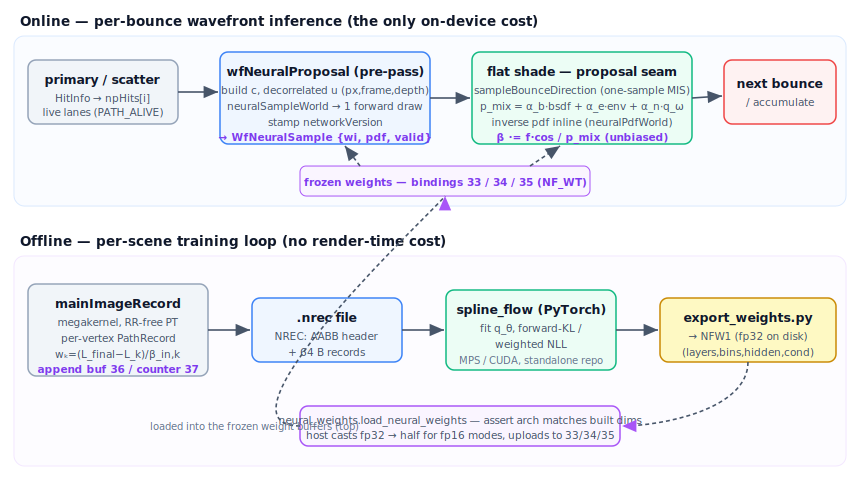

**Online (per bounce, the only on-device cost):**

1. **`wfNeuralProposal`** (`shaders/wavefront/neural_proposal_pass.slang`) — the
   forward pre-pass. Scheduled between scatter and the flat shade by
   `WavefrontPathPass.record` (after the intersect fills `npHits[]`). For each
   live lane it builds the condition from the lane's `HitInfo` + ray, draws a
   **decorrelated** base sample `u` from `(pixelIndex, frameIndex·8 + depth)` —
   *not* the shade RNG, so enabling neural never perturbs the `{bsdf}` draw path —
   calls `neuralSampleWorld`, stamps the network version, and writes one
   `WfNeuralSample {wi, pdf, version, valid}` (32 B) to set-1 binding 8.
2. **Proposal seam** (`shaders/sampling/proposal.slang`,
   `sampleBounceDirection`) — the shade kernel's bounce stage. It draws the BSDF
   candidate, then runs one-sample MIS over `{bsdf | env | neural}`: pick a
   technique ∝ α, reuse the pre-pass's neural `wi` when neural is picked, and for
   *any* chosen direction divide throughput by the **full** mixture pdf. The
   arbitrary-direction neural density is the only inline MLP eval (`neuralPdfWorld`
   — the inverse), evaluated when another technique drew the direction; the
   forward candidate's pdf is reused otherwise.

**Offline (per scene, no render-time cost):**

3. **`mainImageRecord`** (`shaders/integrators/path_record.slang`) — a second
   megakernel entry, an RR-free path tracer that traces the same `{bsdf, env}`
   paths and, for every guideable bounce, appends a `PathRecord` to a GPU buffer
   the host reads back into a `.nrec` file. Megakernel because one thread owns the
   whole path, so the tail radiance is known at loop end and attributed back from
   a local register stack.
4. **`spline_flow`** (PyTorch, standalone repo) fits `q_θ` to those records, and
   **`export_weights.py`** writes the frozen `.nfw1` weights that the renderer
   loads (`neural_weights.load_neural_weights`) and uploads to bindings 33/34/35.

### Per-lane / per-record state

```hlsl
// shaders/interfaces.slang — the pre-pass output the seam consumes
struct WfNeuralSample {
    float3 wi;        // world-space neural-drawn direction
    float  pdf;       // solid-angle pdf at wi (forward draw)
    uint   version;   // producing network version (baseline 0)
    uint   valid;     // 1 only on flat/python live lanes with pdf > 0
};

// shaders/integrators/path_record.slang — one offline training sample (64 B)
struct PathRecord {
    float3 pos;       // world hit position (trainer normalises via header AABB)
    float3 normal;    // world shading normal (= neuralCondition N)
    float3 wo;        // world outgoing dir toward the previous vertex
    float3 wiLocal;   // sampled bounce dir in flow-local (x=T, y=N, z=B), y-up
    float3 contrib;   // (L_final − L_k)/β_in,k — the RGB training weight
    uint   depth;     // bounce index (0 = primary hit)
};
```

The condition `(pos, normal, wo)` recorded offline is **byte-for-byte** the input
to the inference-time `neuralCondition`; the scene AABB rides in the `.nrec`
header so the trainer normalises position identically. `wiLocal` is projected onto
the **same** shading frame the wavefront pass builds at inference (`N` from the
hit, `T,B` from the hit tangent or `buildBasis`), so train and infer frames match
exactly — a mismatch raises variance silently rather than biasing.

## Equations

Notation: `c` is the condition; `u ∈ [0,1]²` a uniform base sample; `z` the flow
output on the unit square; `ω` the hemisphere direction; `q_□` the density on the
unit square; `q_ω` the solid-angle density (sr⁻¹); `f` the BSDF response including
the cosine; `L_i` incident radiance; `β` the path throughput. The flow hemisphere
is y-up.

### 1. Condition encoding

The 9-float condition handed to the flow — position normalised to the scene AABB,
the world shading normal, the outgoing world direction:

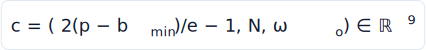

<!-- CODE:cond body -->
```slang
// from neural_proposal.slang
void neuralCondition(float3 posWorld, float3 N, float3 woWorld, out float cond[NF_COND])
{
    float3 ext = max(fc.sceneBoundsExtent, float3(1e-6f));
    float3 p = (posWorld - fc.sceneBoundsMin) / ext;   // [0,1]³
    p = p * 2.0f - 1.0f;                               // [-1,1]³
    cond[0] = p.x; cond[1] = p.y; cond[2] = p.z;
    cond[3] = N.x; cond[4] = N.y; cond[5] = N.z;
    cond[6] = woWorld.x; cond[7] = woWorld.y; cond[8] = woWorld.z;
}
```
<!-- /CODE:cond -->

| symbol | code | meaning |
| --- | --- | --- |
| p | `posWorld` | world hit position |
| b_min, e | `fc.sceneBoundsMin`, `ext` | scene AABB min + extent |
| 2(p−b_min)/e − 1 | `cond[0..2]` | position normalised to [−1,1]³ |
| N | `cond[3..5]` | world shading normal |
| ω_o | `cond[6..8]` | outgoing world direction |

### 2. Forward draw

A draw maps a uniform base sample through the conditional flow:

![z = T_θ(u; c), u ~ U([0,1]²)](diagrams/neural/flow-fwd.svg)

`T_θ` is a stack of `NF_LAYERS` coupling layers. Each layer conditions on one of
the two coordinates (plus `c`) and transforms the other with a monotone
rational-quadratic spline; consecutive layers alternate which coordinate is
transformed:

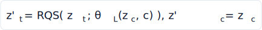

`nf_flow_forward` is the coupling-layer stack `T_θ` (alternating which coordinate
each layer transforms):

<!-- CODE:coupling sig,core -->
```slang
// from neural_flow.slang
float2 nf_flow_forward(
    StructuredBuffer<NF_WT> W, StructuredBuffer<NF_WT> B, StructuredBuffer<NfLayerHeader> H,
    float2 u, float cond[NF_COND], out float logdet)
    // …
    float2 z = u; logdet = 0.0f;
    for (int L = 0; L < NF_LAYERS; ++L)
    {
        bool even = (L % 2 == 0);                 // even: dim0 conditions, dim1 transforms
        float xcond = even ? z.x : z.y;
        float xtr   = even ? z.y : z.x;
        float params[NF_PARAMS];
        nf_mlp(W, B, H, L * 3, xcond, cond, params);
        float widths[NF_BINS]; float heights[NF_BINS]; float derivs[NF_BINS + 1];
        nf_decode(params, widths, heights, derivs);
        float ld; float ytr = nf_rqs_fwd(xtr, widths, heights, derivs, ld);
        logdet += ld;
        if (even) z.y = ytr; else z.x = ytr;
    }
    return z;
```
<!-- /CODE:coupling -->

| symbol | code | meaning |
| --- | --- | --- |
| u | `u` | uniform base sample ∈ [0,1]² |
| z | `z` | flow output on the unit square |
| L | `L` | coupling-layer index (parity picks z_c vs z_t) |
| θ_L(z_c, c) | `nf_mlp(...)` → `params` | conditioner MLP knots for layer L |
| RQS | `nf_rqs_fwd` | per-layer monotone spline transform |
| log\|det ∂z/∂u\| | `logdet` | accumulated forward log-Jacobian |

### 3. Rational-quadratic spline

Inside a bin `k` (knot `x_k`, width `w_k`, height `h_k`, boundary derivatives
`d_k, d_{k+1}`), the monotone RQ transform is

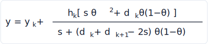

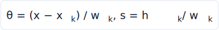

The bin widths/heights come from softmax-normalized MLP outputs (with a `1e-4`
floor) and the derivatives from softplus; the inverse is the analytic solution of
the underlying quadratic. The spline math is evaluated in **fp32 in every
precision mode**.

<!-- CODE:rqs sig,core -->
```slang
// from neural_flow.slang
float nf_rqs_fwd(float x, float widths[NF_BINS], float heights[NF_BINS],
                 float derivs[NF_BINS + 1], out float logdet)
    // …
    float num = hgt * (delta * theta * theta + d0 * t1);
    float den = delta + (d0 + d1 - 2.0f * delta) * t1;
    den = max(den, NF_EPS);
    float y = y0 + num / den;
```
<!-- /CODE:rqs -->

| symbol | code | meaning |
| --- | --- | --- |
| x | `x` | bin-local input coordinate |
| w_k | `w` | bin width |
| h_k | `hgt` | bin height |
| s = h_k/w_k | `delta` | bin slope |
| d_k, d_{k+1} | `d0`, `d1` | boundary derivatives |
| θ = (x − x_k)/w_k | `theta` | normalised position in the bin |
| y_k | `y0` | bin's output knot |
| y | `y` | spline output |

### 4. Log-det Jacobian

Because each spline is monotone and coordinates alternate, the flow's log
Jacobian determinant is the sum of the per-layer 1-D spline log-derivatives:

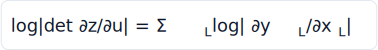

The per-spline log-derivative `log|∂y/∂x|` (computed inside `nf_rqs_fwd`); the
sum over layers Σ_L is the `logdet += ld` accumulation in `nf_flow_forward` above:

<!-- CODE:logdet deriv -->
```slang
// from neural_flow.slang
    float dn = delta * delta * (d1 * theta * theta + 2.0f * delta * t1 + d0 * (1.0f - theta) * (1.0f - theta));
    float dydx = dn / (den * den);
    logdet = log(max(dydx, NF_EPS));
```
<!-- /CODE:logdet -->

| symbol | code | meaning |
| --- | --- | --- |
| ∂y/∂x | `dydx` | derivative of one bin's RQ transform |
| log\|∂y_L/∂x_L\| | `logdet` (out of `nf_rqs_fwd`) | one layer's log-derivative |
| Σ_L | `logdet += ld` (in `nf_flow_forward`) | sum across coupling layers |

### 5. Density on the unit square

The base sample is uniform on `[0,1]²` (density 1), so by change of variables the
forward draw's density on the square is the inverse Jacobian:

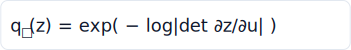

<!-- CODE:pdf-square core -->
```slang
// from neural_flow.slang
    float logdet;
    float2 z = nf_flow_forward(W, B, H, u, cond, logdet);
    float log_q_square = -logdet;                       // base pdf on unit square = 1
```
<!-- /CODE:pdf-square -->

| symbol | code | meaning |
| --- | --- | --- |
| log\|det ∂z/∂u\| | `logdet` | forward log-Jacobian from the flow |
| log q_□(z) | `log_q_square` | = −logdet (base density on the square is 1) |
| z | `z` | flow output on the unit square |

### 6. Solid-angle density

The y-up square→hemisphere map (`φ = 2πu`, `cosθ = v`) has constant Jacobian
`2π`, so the solid-angle density is

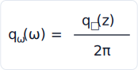

The square→hemisphere map (`nf_square_to_hemi`) and the constant-2π conversion in
`sampleNeural`:

<!-- CODE:pdf-omega map,pdf -->
```slang
// from neural_flow.slang
float3 nf_square_to_hemi(float2 z)
{
    float u = clamp(z.x, 0.0f, 1.0f);
    float v = clamp(z.y, 0.0f, 1.0f);
    float phi = 2.0f * NF_PI * u;
    float st = sqrt(max(1.0f - v * v, 0.0f));
    return float3(st * cos(phi), v, st * sin(phi));
}
    // …
    pdfOmega = exp(log_q_square - NF_LOG2PI);
```
<!-- /CODE:pdf-omega -->

| symbol | code | meaning |
| --- | --- | --- |
| φ = 2πu | `phi` | azimuth from the first square coord |
| cosθ = v | `v` | elevation from the second square coord |
| ω | return of `nf_square_to_hemi` | y-up hemisphere direction |
| q_□(z) | `exp(log_q_square)` | density on the square |
| q_ω(ω) = q_□/2π | `pdfOmega` | solid-angle density (`exp(log_q_square − log2π)`) |

### 7. Inverse density of an arbitrary direction

For a direction the flow did *not* draw (a BSDF- or env-sampled `ω`), the mixture
needs `q_ω(ω)`. Map `ω` back to the square (`z = M⁻¹(ω)`), run the flow in
reverse, and accumulate the inverse log-det:

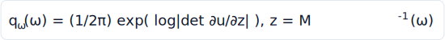

<!-- CODE:pdf-inv sig,core -->
```slang
// from neural_flow.slang
float pdfNeural(
    StructuredBuffer<NF_WT> W, StructuredBuffer<NF_WT> B, StructuredBuffer<NfLayerHeader> H,
    float cond[NF_COND], float3 wi)
    // …
    if (wi.y <= 0.0f) return 0.0f;
    float2 z = nf_hemi_to_square(wi);
    float logdet;
    nf_flow_inverse(W, B, H, z, cond, logdet);          // log|det du/dz| = log q_square
    return exp(logdet - NF_LOG2PI);
```
<!-- /CODE:pdf-inv -->

| symbol | code | meaning |
| --- | --- | --- |
| ω | `wi` | query direction (flow-local, y-up) |
| z = M⁻¹(ω) | `nf_hemi_to_square(wi)` | map the direction back to the square |
| log\|det ∂u/∂z\| | `logdet` (from `nf_flow_inverse`) | inverse log-Jacobian = log q_□ |
| q_ω(ω) | return value | (1/2π)·exp(logdet); 0 in the lower hemisphere |

### 8. Mixture pdf

The active proposals form a one-sample-MIS mixture with weights that renormalise
to Σ = 1 over the active, valid techniques:

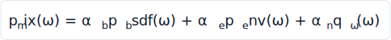

The α renormalisation (`proposalWeights`) and the mixture-pdf sum
(`mixtureProposalPdf`):

<!-- CODE:mix-pdf weights,pdf -->
```slang
// from proposal.slang
    float s = aB + aE + aN;
    if (s > 0.0) { aB /= s; aE /= s; aN /= s; }
    // …
    float pdf = aB * bsdfPdf;
    if ((aE > 0.0 || aN > 0.0) && wiT.z > 0.0)
    {
        float3 worldWi = tangentToWorld(wiT, c.T, c.B, c.N);
        if (aE > 0.0)
            pdf += aE * envPdf(worldWi);
        if (aN > 0.0)
            pdf += aN * neuralPdfWorld(c.position, c.N, c.T, c.B,
                                       tangentToWorld(c.woT, c.T, c.B, c.N), worldWi);
    }
    return pdf;
```
<!-- /CODE:mix-pdf -->

| symbol | code | meaning |
| --- | --- | --- |
| α_b, α_e, α_n | `aB`, `aE`, `aN` | bsdf / env / neural mixture weights (Σ = 1) |
| p_bsdf(ω) | `bsdfPdf` | material's own pdf |
| p_env(ω) | `envPdf(worldWi)` | environment importance-sampling pdf |
| q_ω(ω) | `neuralPdfWorld(...)` | neural inverse density (§7) |
| p_mix(ω) | `pdf` (return) | α_b·p_bsdf + α_e·p_env + α_n·q_ω |

### 9. Unbiased throughput update

Whatever technique is chosen, throughput is divided by the **full** mixture pdf —
this is what keeps the estimator unbiased:

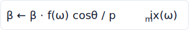

In `sampleBounceDirection`, the chosen technique's sample is reweighted by the
full mixture pdf so the estimator stays unbiased:

<!-- CODE:estimator core -->
```slang
// from proposal.slang
    outp.pdf         = mixPdf;
    outp.weight      = ev.response / mixPdf;
```
<!-- /CODE:estimator -->

| symbol | code | meaning |
| --- | --- | --- |
| p_mix(ω) | `mixPdf` | full mixture pdf at the chosen direction |
| f(ω)cosθ | `ev.response` | BSDF response incl. cosine (`mat.evaluate`) |
| f·cosθ / p_mix | `outp.weight` | the throughput multiplier β ← β·weight |

### 10. Training weight (offline)

Each recorded vertex stores the per-unit-throughput tail radiance, so a
contribution-weighted fit learns `q ∝ f · L_i · cosθ`:

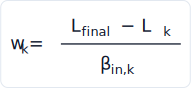

The attribution weight is computed by the shared `recordContrib` helper — the
ONE source of truth used by both record producers: the megakernel
`estimateRadianceRecord` (the offline `.nrec` dump) and the wavefront-native
emitter (`wavefront/wf_records.slang`, the live online-training drain). Each
calls it at path termination with the snapshotted `L_k`/`β_in,k` and the path's
total radiance `L_final`:

<!-- CODE:contrib core -->
```slang
// from path_record_common.slang
float3 recordContrib(float3 Lfinal, float3 L_k, float3 beta_in_k)
{
    float3 beta = max(beta_in_k, float3(1e-8));
    return max((Lfinal - L_k) / beta, float3(0.0));
}
```
<!-- /CODE:contrib -->

| symbol | code | meaning |
| --- | --- | --- |
| L_final | `Lfinal` | total path radiance |
| L_k | `L_k` | radiance gathered up to vertex k |
| β_in,k | `beta` (`beta_in_k`) | throughput entering vertex k |
| w_k = (L_final − L_k)/β_in,k | return value | RGB training weight (clamped ≥ 0) |

### 11. Training objective (offline)

The flow is fit by minimizing the contribution-weighted negative log-likelihood
(forward KL / mass-covering) over the recorded dataset `D`:

![L(θ) = −E_{(c,ω,w)~D}[ w · log q_θ(ω | c) ]](diagrams/neural/loss.svg)

> The training objective is **offline** — it lives in the standalone `spline_flow`
> trainer (PyTorch), not in any in-repo Slang shader, so there is no embedded
> snippet here. The renderer only consumes the baked weights (`.nfw1`); the
> Slang side (§1–§9) is inference-only.

## Equation → implementation map

| Equation | Symbol | File |
| --- | --- | --- |
| Condition encoding (§1) | `neuralCondition` | `sampling/neural_proposal.slang` |
| Forward draw `u → ω` (§2, §6) | `sampleNeural` / `neuralSampleWorld` | `sampling/neural_flow.slang` / `neural_proposal.slang` |
| Coupling-layer stack (§2) | `nf_flow_forward` / `nf_flow_inverse` | `sampling/neural_flow.slang` |
| Conditioner MLP (§3) | `nf_mlp` / `nf_linear` | `sampling/neural_flow.slang` |
| Knot decode (softmax/softplus) | `nf_decode` | `sampling/neural_flow.slang` |
| RQ spline forward (§3, §4) | `nf_rqs_fwd` | `sampling/neural_flow.slang` |
| RQ spline inverse (§7) | `nf_rqs_inv` | `sampling/neural_flow.slang` |
| Square ↔ hemisphere map (§6) | `nf_square_to_hemi` / `nf_hemi_to_square` | `sampling/neural_flow.slang` |
| Inverse density `ω → q_ω` (§7) | `pdfNeural` / `neuralPdfWorld` | `sampling/neural_flow.slang` / `neural_proposal.slang` |
| Mixture weights α (§8) | `proposalWeights` | `sampling/proposal.slang` |
| Mixture pdf + update (§8, §9) | `sampleBounceDirection` / `mixtureProposalPdf` | `sampling/proposal.slang` |
| Forward pre-pass (per lane) | `wfNeuralProposal` | `shaders/wavefront/neural_proposal_pass.slang` |
| Training weight (§10) | backward attribution | `shaders/integrators/path_record.slang` |
| Record dump | `estimateRadianceRecord` / `emitRecord` | `shaders/integrators/path_record.slang` |
| Weight buffers (33/34/35) | `neuralWeights` / `neuralBiases` / `neuralLayers` | `sampling/neural_proposal.slang` |
| GPU pass + buffers | `WavefrontNeuralProposalPass` | `vk_wavefront.py` |
| Host config + load/bake | `neural_config` / `_sync_neural_weights` | `renderer.py` |
| Proposal selector plugin | `NeuralProposal` | `sampling/proposals.py` |
| NFW1 weight format / loss (§11) | `NeuralWeights` / `export_weights.py` | `sampling/neural_weights.py` / `spline_flow` |
| NREC record format | `read_records` / `RECORD_DTYPE` | `sampling/path_records.py` |

## Network architecture

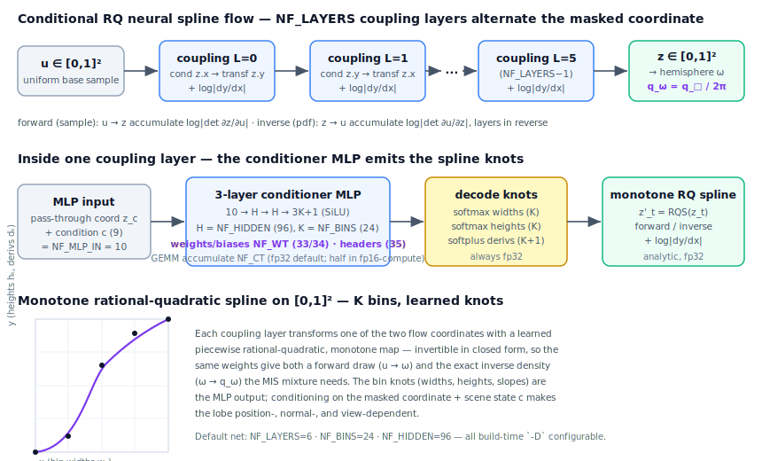

The flow is a faithful Slang port of the verified PyTorch prototype
(`spline_flow/train.py`: `ConditionalSplineFlow2D`). Per coupling layer there are
**three** `Linear` layers — `NF_MLP_IN (=1+9) → NF_HIDDEN → NF_HIDDEN →
3·NF_BINS+1` — with SiLU on the hidden layers; the final layer's `3K+1` outputs
decode to the `K` bin widths, `K` heights, and `K+1` boundary derivatives. The
default net is **6 layers · 24 bins · 96 hidden** (~103 k weights), reproduced
byte-for-byte when no `-D` override is given.

`NF_LAYERS`, `NF_BINS`, and `NF_HIDDEN` are `#ifndef`-guarded macros: `slangc -D
NF_HIDDEN=48` (etc.) selects an off-default size. The host threads the same `-D`
into every module that imports `neural_flow.slang` (the pre-pass, the inline
inverse, the record entry), folds the dims into the pipeline cache key, and the
NFW1 loader asserts the baked `(layers, bins, hidden, cond)` matches the built
dims.

## Precision & size study

Stage 2 makes the MLP's floating-point precision selectable while keeping the
spline core and the reported pdf at full precision in every mode. Two type
aliases, threaded through `-D`:

| Mode | `-D` flags | Weight storage | GEMM accumulate | Notes |
| --- | --- | --- | --- | --- |
| **fp32** (default) | *(none)* | `float` | `float` | Byte-identical to ship. |
| **fp16-storage** | `-D NF_WT=half` | `half` (½ bytes) | `float` | Halves the weight buffer + bandwidth. |
| **fp16-compute** | `-D NF_WT=half -D NF_CT=half` | `half` | `half` | + half ALU throughput (Apple Silicon). |

The RQ-spline math (softmax/cumsum/exp/log + the analytic inverse-quadratic solve)
and the returned solid-angle pdf stay `float` in **every** mode — fp16 there is
catastrophic-cancellation prone. NFW1 stays **fp32 on disk**; the host casts
fp32 → half at upload, and `vk_context` capability-gates fp16: a device lacking
`shaderFloat16` / `storageBuffer16BitAccess` silently falls back to fp32 and
reports the fallback.

### Quality-vs-cost results

A study harness sweeps a bounded size × precision grid on the Metal/MoltenVK
backend, measuring quality (size axis = held-out NLL; precision axis = fp16
pdf-parity drift) against cost (ms/frame + weight-buffer bytes), with an
in-renderer unbiased + firefly check per cell. Full results +
methodology notes: [`docs/diagrams/neural_study/RESULTS.md`](diagrams/neural_study/RESULTS.md)
(raw grid in `size_precision.csv`). Scene: flat Cornell box, 96×96, MoltenVK,
`{bsdf}` reference mean 0.00808. **21/21** cells ran (7 sizes × 3 precisions).

| L · B · H | precision | ms/frame | weight bytes | NLL | unbiased rel | firefly p99.9 |
| --- | --- | ---: | ---: | ---: | ---: | ---: |
| 6·24·48 | **fp16-compute** | **13.0** | **75 456** | −0.276 | 0.0029 | 0.0240 |
| 4·24·96 | fp16-compute | 17.3 | 137 472 | −0.281 | 0.0025 | 0.0238 |
| 6·16·96 | fp16-storage | 60.4 | 178 560 | −0.282 | 0.0024 | 0.0238 |
| 6·24·96 | fp32 | 121.6 | 412 416 | −0.279 | 0.0026 | 0.0239 |
| 6·24·144 | fp16-compute | 266.0 | 392 256 | −0.281 | 0.0019 | 0.0238 |

Findings (see the RESULTS notes for the full reasoning):

- **Every cell is unbiased** (rel-mean < 0.003) and **firefly-bounded** (p99.9 ≈
  0.024); fp16 costs no measurable quality — pdf-parity drift is ~4e-4 (storage) /
  ~1e-3 (compute) vs fp32.
- **Quality is flat across size** on this broad-indirect scene (NLL spread ~2%);
  a concentrated-indirect scene would spread NLL and raise the knee.
- **fp16 weights are exactly ½** the fp32 bytes. **Within a size**
  (the 3 precisions measured adjacently) **fp16-compute < fp16-storage < fp32** in
  6/7 sizes — the real Apple-Silicon win. *Cross-size* ms is thermally noisy (cells
  run sequentially; the GPU heats over the sweep) and is indicative only.
- **Recommended ship config: L6 · B24 · H48 @ fp16-compute** — the Pareto knee:
  the smallest footprint (75 456 B, **18%** of the fp32 baseline) within 2% of the
  best NLL, unbiased and firefly-bounded.

## Controls

SplineFlow is selected through the **proposal set**, consistent with the other
proposals (`sampling/proposals.py`):

| Control | Where | Options | Maps to | Effect |
| --- | --- | --- | --- | --- |
| **Proposal set** | `--proposals` CLI / UI selector / settings | e.g. `bsdf` · `bsdf,env` · `bsdf,neural` | `fc.proposalMask` (bits 0x1/0x2/0x4) | Which proposals mix. Triggers a wavefront pass rebuild + accumulation reset. |
| **Mixture weights** | host `proposalAlpha` | per-proposal `default_weight` | `fc.proposalAlpha.{x,y,z}` | Pre-normalisation MIS weights (α_b/α_e/α_n). |
| **Weights file** | `NeuralProposal(weights_path=…)` | `.nfw1` path / `None` | renderer `_neural_weights_path` | Per-scene net; `None` → renderer resolves per scene or bakes a dummy. |
| **Network size** | build-time `-D` | `NF_LAYERS/BINS/HIDDEN` | pipeline cache key | Off-default net dims (must match the baked weights). |
| **Precision** | `NeuralBuildConfig.precision` | fp32 · fp16-storage · fp16-compute | `-D NF_WT/NF_CT` | MLP storage/compute precision; spline + pdf stay fp32. |

The mask bits (`PROPOSAL_BSDF=0x1`, `PROPOSAL_ENV=0x2`, `PROPOSAL_NEURAL=0x4`)
mirror the Slang `PROPOSAL_*` constants in `sampling/proposal.slang`. The neural
proposal participates **only** when its bit is set *and* the lane has a valid
precomputed forward sample; otherwise its weight folds away and `{bsdf, env}`
renormalise to Σ = 1, keeping each lane unbiased. Changing the proposal set resets
progressive accumulation (folded into `_current_state_hash`).

When neural is **inactive**, the renderer binds 1-element dummy buffers at
33/34/35 (`make_dummy_weights`), and `make_dummy_weights`/`bake_dummy_weights`
produce a valid all-zero net for plumbing bring-up — an all-zero flow is the
identity-ish map and stays unbiased.

## Caveats and limits

- **Wavefront-only.** The megakernel/Metal backends keep the `{bsdf, env}` subset;
  requesting neural there is reported unsupported (capability gate, like
  wavefront-BDPT), not silently ignored.
- **Flat/python materials only.** Skin / MaterialX-graph lanes set
  `neuralValid = false` and pass through with `{bsdf, env}`.
- **Frozen / offline.** Weights are trained per scene in `spline_flow` and loaded
  read-only; there is no online/adaptive update at render time. Per-sample
  `networkVersion` stamping (baseline 0) is the foundation for a reserved Stage 3
  online-training replay buffer.
- **Condition must match the trainer byte-for-byte.** `neuralCondition` and the
  record dump's `(pos, normal, wo)` + AABB header are a shared contract; a
  mismatch raises variance silently rather than biasing.
- **Forward pre-pass amortises one draw per lane.** The arbitrary-direction
  inverse pdf is still evaluated inline in the shade kernel — the only inline MLP
  eval on the hot path.

## Verification

SplineFlow is validated against the BSDF-only / BDPT reference as ground truth:

- `tests/test_neural_parity.py` — locks the Slang port against the PyTorch
  reference: a numpy re-implementation of `neural_flow.slang` is checked against
  baked goldens (`tests/data/neural_parity/`, generated once with the `spline_flow`
  torch venv). Runs in CI with **no torch and no GPU**; the on-device variant
  drives the real `sampleNeural`/`pdfNeural` and skips where unavailable. Covers
  the §7 fp16 pdf-parity drift used as the study's precision axis.
- `tests/test_neural_headless.py` — end-to-end headless render with
  `{bsdf, neural}` active: the dummy (all-zero) net stays unbiased, and a trained
  net converges to the BSDF-only reference within noise.
- **Density integrates to one.** The flow's normalization
  (∫ q_ω dω ≈ 1 for a fixed condition) is the authoritative unbiasedness gate,
  carried over from the `spline_flow` prototype's PDF-normalization check.
- **Default parity.** `{bsdf}` is byte-identical to the pre-seam renderer (the
  pre-pass uses a decorrelated RNG and the mixture fast-path returns the material's
  native sample verbatim).

## References

1. **C. Durkan, A. Bekasov, I. Murray, G. Papamakarios.** *Neural Spline Flows.*
   NeurIPS, 2019. — the monotone rational-quadratic coupling transform (§3) and
   its closed-form inverse that this flow ports.
2. **L. Dinh, J. Sohl-Dickstein, S. Bengio.** *Density Estimation Using Real NVP.*
   ICLR, 2017. — affine/spline **coupling layers** with a tractable Jacobian (§2,
   §4); the alternating-mask architecture.
3. **T. Müller, B. McWilliams, F. Rousselle, M. Gross, J. Novák.** *Neural
   Importance Sampling.* ACM TOG 38(5), 2019. — learned importance sampling for
   light transport via normalizing flows; the path-guiding target `q ∝ f·L_i·cos`
   (§10, §11) and the unbiased MIS composition.
4. **E. Veach.** *Robust Monte Carlo Methods for Light Transport Simulation.* PhD
   thesis, Stanford University, 1997. — multiple importance sampling and the
   one-sample estimator backing the proposal mixture (§8, §9).
5. **T. Müller, M. Gross, J. Novák.** *Practical Path Guiding for Efficient
   Light-Transport Simulation.* EGSR (CGF 36(4)), 2017. — the per-scene,
   contribution-weighted path-guiding setup that the offline record→train loop
   follows.
