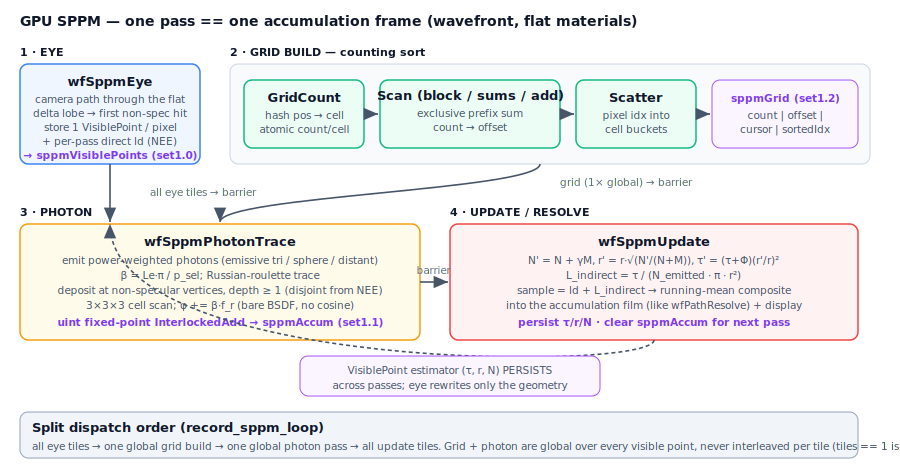
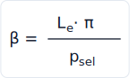
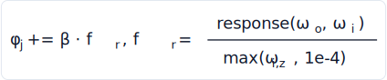
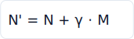
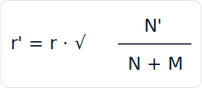
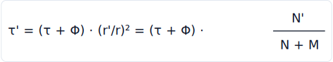
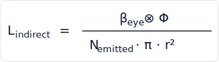
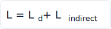

# Skinny — Photon Mapping (GPU SPPM)

This document is the implementation reference for **SPPM** (Stochastic
Progressive Photon Mapping) — skinny's third integrator and its caustic-efficient
estimator for specular→diffuse light transport (a focused highlight cast through
a glass object onto a diffuse floor, the regime where the unidirectional path
tracer and BDPT converge slowly). It covers the per-pass pipeline, the governing
equations and the exact shader symbols that realize them, the GPU buffer layout,
the pbrt importer mapping, the wavefront-only + flat-only constraints, and the
deferred phases.

This change is **PM-1**, the first change of a phased `photon-mapping`
capability. It delivers the core *surface* SPPM estimator on **flat materials
only**; the layered skin/BSSRDF photon path (PM-2) and volumetric/media photon
transport (PM-3) are deferred to follow-up changes against the same capability
spec (see [Deferred phases](#deferred-phases)).

> Equations are shipped as **SVG images** (the repo's GitLab does not render
> KaTeX/`$$` math reliably). The LaTeX sources live in
> `docs/diagrams/sppm/equations.json`; regenerate the SVGs with
> `docs/diagrams/restir/render.cjs` (MathJax 3, publication quality — needs Node
> + `mathjax-full`) or the dependency-free
> `docs/diagrams/sppm/gen_svg_equations.cjs` fallback (`node
> docs/diagrams/sppm/gen_svg_equations.cjs`). Inline symbols (r_i, N_i, τ, Φ, π)
> are plain Unicode.

SPPM rides the **wavefront execution backend** documented in
[Wavefront.md](Wavefront.md) (the SPPM stage list lives there beside the
path/BDPT tables); its set-1 descriptor bindings are in
[Architecture.md](Architecture.md) (descriptor binding map); the generic
path/BDPT integrators are in [README.md](../README.md); the pbrt `sppm` importer
mapping is in [PbrtImport.md](PbrtImport.md).

## What SPPM is

Photon mapping splits light transport into two walks that meet in the middle. An
**eye pass** walks a camera ray to a diffuse *visible point* on a surface; a
**photon pass** shoots energy-carrying particles from the lights and deposits
their flux onto every visible point within a search radius. The radiance at a
visible point is then a **density estimate** of the deposited flux over the disc
of that radius. This decoupling is what makes caustics cheap: the specular chain
is traced once from each side, and the two ends are joined by a spatial lookup
rather than by a low-probability random connection.

*Progressive* photon mapping (Hachisuka et al.) removes the memory cost and the
bias of a fixed radius: instead of storing all photons, it runs **many passes of
a fresh photon batch** and, after each pass, **shrinks every visible point's
radius** while accumulating flux, so the estimate converges to the true radiance
as the radius → 0. *Stochastic* PPM (Hachisuka & Jensen 2009) further re-samples
**one** stochastic visible point per pixel per pass, so the eye pass is a single
cheap trace and depth-of-field / glossy eye paths fall out for free.

In skinny one **SPPM pass == one progressive-accumulation frame**: the existing
accumulation loop drives the progression, and the per-pixel estimator state
(radius r_i, photon count N_i, accumulated flux τ_i) **persists across frames**
while the eye pass rewrites only the per-pass geometry. Direct lighting reuses
the existing NEE path (computed once in the eye stage); the photon term carries
only the *indirect / caustic* complement, so the two are disjoint with no
double-count.

### Scope and limits

| Property | Value |
| --- | --- |
| Integrator | **`INTEGRATOR_SPPM = 2`** (`common.slang`). The third integrator after `path` (0) and `bdpt` (1). |
| Backend | **Wavefront only**, on **both Vulkan and native Metal**. Vulkan uses `WavefrontSppmPass` (`vk_wavefront.py`); Metal uses `MetalWavefrontSppmPass` (`metal_wavefront.py`) — the kernels are Metal-portable (typed buffers, ~15/31 slots, no Metal-only gate) and the caustic parity matches across backends. The megakernel has no global photon map, so `--integrator sppm` under megakernel is **refused** with a clear message (`cli_common._validate_integrator`). |
| Materials | **Flat only** — `UsdPreviewSurface` / `standard_surface` / `OpenPBR` / Python flat materials, same gating as ReSTIR DI and neural guiding. Glass / mirror **are** flat materials in skinny (a delta lobe), so the eye and photon walks pass through them as caustic carriers; skin / MaterialX-graph / python-graph / debug receivers terminate the walk (PM-1 is the surface case). |
| Selection | `--integrator sppm` (requires `--execution-mode wavefront`; `cli_common.INTEGRATOR_INDEX["sppm"] = 2`) across the front-ends, or the pbrt importer when the scene used `Integrator "sppm"`/`"photonmap"`. |
| Direct light | Reuses stock **NEE** (the eye stage); the photon term is the indirect/caustic complement only. |

## Stages of rendering

One SPPM pass is a **four-logical-stage** pipeline over **eight kernels**, all in
`shaders/integrators/wavefront_sppm.slang` (entries `wfSppm*` — Slang's Metal
target reserves `main`). Every dispatch has a host-known count (num_pixels,
numCells, photonsEmitted) → plain dispatch, **no indirect dispatch / no Metal
CPU-readback stall**.



| Stage | Kernel(s) | Work |
|-------|-----------|------|
| **EYE** | `wfSppmEye` (over num_pixels, tiled) | Trace the camera path through the flat **delta lobe** (glass/mirror are flat delta materials) to the first non-specular flat hit. Store **one** stochastic `VisiblePoint`/pixel `{pos, ns, wo, beta, the evaluated flat BSDF}`, plus the full per-pass **direct** term `ld` (NEE at the VP + any emitter/env reached through the specular chain). Persistent `radius`/`n`/`tau` are preserved; on first activation (`n == 0`) the radius inits to `fc.sppmInitialRadius`. A pixel that escapes leaves its VP **inactive** so a stale point can't sit in the grid. |
| **GRID BUILD** | `wfSppmGridCount` → `wfSppmGridScanBlock` → `wfSppmGridScanBlockSums` → `wfSppmGridScanAdd` → `wfSppmGridScatter` | A uniform spatial **hash grid** built by **counting sort** over the active visible points: per-cell atomic count → blocked **exclusive prefix sum** (count → offset) → scatter pixel indices into their cell buckets. `numCells = next_pow2(2·num_pixels)`; `cellSize = sppmInitialRadius` (a valid upper bound on every active VP's radius, since radii only shrink — so the 3×3×3 neighbour scan never misses a photon). |
| **PHOTON** | `wfSppmPhotonTrace` (over `fc.sppmPhotonsEmitted`) | **Emit** power-weighted photons (emissive triangles via `sampleEmissiveTriangle` pSel, sphere lights, distant beam; `beta = Le·π / p_sel`), **trace** with Russian roulette, and **deposit** only at non-specular vertices with `depth ≥ 1` (so the photon term is disjoint from the NEE direct: `depth == 0` is light→VP direct that NEE owns; the SDS caustic carrier light→specular→VP still deposits). Deposit via a de-duplicated **3×3×3 neighbour-cell scan**, adding the **bare** f_r `= evaluate(woVP,wiVP).response / max(wiVP.z, 1e-4)` (no cosine — the photon-map density estimate) with portable **uint fixed-point** `InterlockedAdd` into `SppmAccum`. |
| **UPDATE** | `wfSppmUpdate` (over num_pixels, tiled) | The per-pass indirect estimate `L_indirect = Φ / (N_emitted · π · r²)` — **this pass's** deposited flux Φ at the gather radius (the radius before this pass's reduction); `sample = vp.ld + L_indirect`; **running-mean composite** into the accumulation film (exactly like `wfPathResolve`), which is what averages the per-pass estimates into the progressive result. The SPPM reduction `N' = N + γM`, `r' = r·√(N'/(N+M))` (γ = 2/3) then **advances the radius** for the next pass so the per-pass bias shrinks; display + clear the accumulator. |

### Split dispatch order

The grid + photon stages are **global** over every visible point, so they must
run **after all eye tiles** and **before any update tile** — never interleaved
per tile. `record_sppm_loop` (`wavefront_driver.py`) encodes exactly this
mandated split order (an adversarial-review requirement); `tiles == 1`
(num_pixels ≤ stream_size) is just the degenerate case:

```text
[frame 0 only]  clear the persistent visible-point buffer
phase 1   all eye tiles            (write every pixel's visible point)   → barrier
phase 2   grid build               clear → count → scan → scatter        → barrier
phase 3   photon pass              clear accum → emit / trace / deposit  → barrier
phase 4   all update tiles         reduce + resolve + composite          → barrier
```

The backend recorder (`_VkSppmRecorder` on Vulkan) supplies the path-loop
primitives (`push_tile`, `dispatch_full`, `dispatch_one`, `barrier`) plus
`dispatch_count(entry, count, group)` for the host-counted grid/photon stages and
the `clear_visible_points()` / `clear_grid()` / `clear_accum()` buffer clears
(`vkCmdFillBuffer`).

## Equations

Notation: Le is a light's emitted radiance; f_r is the bare BSDF (response
divided by the cosine, **no cosine** — the photon-map density estimate); β is the
per-photon flux; Φ is a visible point's accumulated per-pass flux; τ its
persistent flux; r its search radius; N its accumulated photon count; M its
per-pass photon count; γ the SPPM reduction parameter (2/3). lum(·) is luminance.

### 1. Photon emission

Each photon is sampled from one scene light. Group selection is uniform over the
present light groups (emissive triangle / sphere / distant); within the emissive
group, triangles are **power-weighted** (pSel, folded into the area-measure
selection pdf p_sel). For a diffuse area emitter the emission cosine cancels the
cosine sampling pdf, so the carried flux is



The `1/N_emitted` normalization (over the photons emitted this pass) is **not**
folded into β here — it is applied once in the update stage's radiance estimate.
A distant light emits a parallel beam from a bbox-covering disc, accounting the
`A_disk` factor in β (`pdfDir` is a delta, no cosine).

> **Implements:** `sppmEmitPhoton` in `wavefront_sppm.slang`
> (`beta = ls.radiance * PI / max(selA, 1e-20)` for area emitters;
> `beta = dl.rad * (PI·R²) / selPdf` for the distant beam).

| symbol | code | meaning |
| --- | --- | --- |
| Le | `ls.radiance` | sampled emitter radiance |
| p_sel | `selA` | area-measure light-selection pdf (group × within-group pSel × pdfArea) |
| β | `beta` | per-photon flux (out of `sppmEmitPhoton`) |

### 2. Photon deposit (the density estimate)

At a non-specular photon vertex (after ≥ 1 prior bounce), the photon's flux is
deposited onto every active visible point `j` within `||Δ|| ≤ r_j` and on the
same hemisphere, weighted by **that visible point's own** BSDF — the **bare**
f_r, no cosine, which is the photon-map surface density estimator:



The deposit is a portable **uint fixed-point** `InterlockedAdd` (neither
Vulkan-core nor Metal guarantees fp atomics): φ is scaled by
`SPPM_FLUX_FIXED_SCALE = 2²⁰` before the add and decoded back in the update
stage. NaN/inf/negative φ are dropped (mirroring `atomicSplatRadiance`). The
3×3×3 neighbour cells are **de-duplicated** (a `seen[27]` set) so a hash
collision can't double-deposit.

> **Implements:** `sppmDepositPhoton` in `wavefront_sppm.slang`
> (`f = mat.evaluate(woVP, wiVP).response / max(wiVP.z, 1e-4)`; `phi = beta * f`;
> `InterlockedAdd(sppmAccum[j].phi{R,G,B}, uint(phi · SPPM_FLUX_FIXED_SCALE))`).

| symbol | code | meaning |
| --- | --- | --- |
| f_r | `f` | bare BSDF response ÷ cosine at the visible point |
| β | `beta` | incoming photon flux |
| φ_j | `sppmAccum[j].phi{R,G,B}` | per-pass deposited flux (fixed-point) |
| M_j | `sppmAccum[j].m` | per-pass photon count at this point |

### 3. The SPPM reduction (per pass)

After the photon pass, each active visible point reduces its persistent estimator
(Hachisuka & Jensen 2009): the radius shrinks by the photon-count ratio, the
accumulated flux is rescaled by the same ratio so the density estimate stays
consistent, and the count advances by γ·M. With γ = 2/3:







`(r'/r)² = N'/(N+M)`, so τ is rescaled with a single multiply. A pass with no
photons (`M == 0`) leaves the estimator untouched.

> **Implements:** `sppmUpdate` in `integrators/sppm_state.slang`
> (`nNew = nOld + gamma·mf`; `ratio = nNew / (nOld + mf)`;
> `vp.tau = (vp.tau + phi) * ratio`; `vp.radius *= sqrt(ratio)`; `vp.n = nNew`).

| symbol | code | meaning |
| --- | --- | --- |
| N / N' | `vp.n` / `nNew` | accumulated photon count (float, for γ) |
| M | `m` (`acc.m`) | per-pass photon count at this point |
| r / r' | `vp.radius` | search radius (monotonically non-increasing) |
| τ / τ' | `vp.tau` | persistent accumulated flux |
| Φ | `phi` (`sppmDecodeFlux(acc)`) | per-pass decoded flux |
| γ | `gamma` (= 2/3) | SPPM reduction parameter |

### 4. The radiance estimate and composite

The per-pass indirect radiance at a visible point is the photon-map density
estimate — **this pass's** deposited flux Φ over the disc, normalized by the
photons emitted this pass, at the radius the photons gathered within:



> **Why per-pass Φ, not accumulated τ.** skinny composites the per-pass estimate
> into the accumulation film with a **running mean** (below), so the film is what
> averages the passes into the progressive result. Using the *accumulated* τ here
> *and* film-averaging would count the flux twice (an early bug that rendered
> caustics ~14× too bright). So the displayed estimate is the **per-pass** Φ at
> the **pre-reduction** gather radius; the SPPM `N`/`r` reduction still runs to
> **advance the radius** each pass, which shrinks the per-pass bias (bias → 0 as
> r → 0). This is consistent: each pass is an independent density estimate at a
> shrinking radius, and the running mean both averages them and reduces variance.

The composited per-pixel sample adds the per-pass direct (computed once in the
eye stage — NEE at the VP plus any emitter/env through the specular chain) to the
indirect estimate:



`sample` is sanitized (NaN/inf/negative → 0) and folded into the accumulation
film with the same **running mean** every wavefront resolve kernel uses
(`(prev·n + sample)/(n+1)`), then written to the display via `wfWriteDisplay`.

> **Implements:** `wfSppmUpdate` in `wavefront_sppm.slang` (`phi =
> sppmDecodeFlux(acc)`; `lIndirect = phi / (max(fc.sppmPhotonsEmitted,1)·π·rGather²)`
> with `rGather = vp.radius` before the reduction; `sppmUpdate(vp, phi, …)`
> advances the radius; `sample = vp.ld + lIndirect`; running-mean composite into
> `accumBuffer`; `wfWriteDisplay`).

| symbol | code | meaning |
| --- | --- | --- |
| Φ | `sppmDecodeFlux(acc)` | this pass's deposited flux (decoded from the fixed-point accumulator) |
| N_emitted | `fc.sppmPhotonsEmitted` | photons emitted this pass (the estimator divisor) |
| r | `vp.radius` | gather radius (before this pass's reduction) |
| L_d | `vp.ld` | per-pass direct (NEE + specular-chain emitters) |
| L_indirect | `lIndirect` | photon-map indirect estimate |

### Spatial-hash grid

The grid is a uniform spatial hash. Its cell count is the next power of two ≥
2·W·H (so the hash masks with `& (numCells − 1)`):


The integer cell coordinate is `floor((pos − boundsMin) / cellSize)` with
`cellSize = sppmInitialRadius`; the hash mixes the coordinate with the standard
`(73856093, 19349663, 83492791)` primes through `pcgHash`. The host mirror is
`wavefront_layout.sppm_grid_cell_count`, locked against the Slang
`sppmGridCellCount` by `tests/test_sppm_state.py`.

> **Implements:** `sppmGridCellCount` / `sppmCellCoord` / `sppmCellHash` in
> `integrators/sppm_state.slang`, shared by the eye / grid / photon stages.

## Per-pixel state

Two GPU-internal scratch structs, one element **per pixel** (sized by num_pixels,
the *persistent* per-pixel estimator — **not** `stream_size`), allocated but never
packed by the host (like the wavefront records). `tests/test_sppm_state.py` locks
both struct layouts.

```slang
// integrators/sppm_state.slang  (scalar = 152 B Vulkan, MSL = 192 B)
struct VisiblePoint {
    float3 pos;            // world hit position           (rewritten each pass)
    float3 ns;             // world shading normal, post normal-map (each pass)
    float3 wo;             // world outgoing dir toward the camera (this pass)
    float3 beta;           // eye throughput EXCLUDING the VP BSDF (this pass)
    float3 ld;             // per-pass direct (NEE + specular-chain emitters)
    float3 albedo;         // ── evaluated flat BSDF: FlatHitMat (minus emission) + F0
    float3 F0;             //    so the photon deposit rebuilds FlatMaterial and
    float3 coatColor;      //    evaluates f_r with NO texture refetch / graph
    float  roughness;      //    re-run / double normal-map (pbrt's store-the-BSDF
    float  metallic;       //    approach)
    float  specular;
    float  ior;
    float  opacity;
    float  coat;
    float  coatRoughness;
    float  coatIOR;
    float3 tau;            // accumulated reflected flux   (PERSISTS)
    uint   flags;          // bit0 = VP_ACTIVE
    float  radius;         // current search radius r_i    (PERSISTS)
    float  n;              // accumulated photon count N_i (PERSISTS; float for γ)
};

// Per-pass photon-deposit accumulator (separate buffer, atomically written).
struct SppmAccum {        // scalar = 16 B, MSL = 16 B
    uint phiR, phiG, phiB; // fixed-point per-pass flux (÷ SPPM_FLUX_FIXED_SCALE = 2²⁰)
    uint m;                // photons deposited into this point this pass (M_i)
};
```

The visible point embeds the **evaluated** flat BSDF (the `albedo..coatIOR` block
mirrors `FlatHitMat` minus emission, plus `F0`), not reconstruction inputs:
`fetchFlatHitData` re-applies the normal map and re-runs the MaterialX graph, so
storing the shading normal alone would double-apply the normal map and re-running
the graph per deposit would be expensive. `sppmStoreVisiblePoint` (eye stage)
stores the evaluated material; `sppmLoadMaterial` (photon stage) rebuilds the
`FlatMaterial` for the bare-f_r evaluation with no refetch. Splitting the atomic
flux into a separate `SppmAccum` keeps the deposit portable (uint fixed-point —
neither backend guarantees fp atomics) and keeps the hot `VisiblePoint` free of
atomically-mutated fields.

## GPU buffers and bindings

SPPM is a distinct wavefront pass (`WavefrontSppmPass`, `vk_wavefront.py`) with
its **own set 1** (it does not share the path pass's stream state). The four
buffers are **typed structured buffers** — not the `ByteAddressBuffer` fold the
blueprint first proposed: a SPPM kernel references only ~15/31 Metal buffer slots
(it never compiles the neural weights), so the typed buffers fit with headroom,
stay type-safe, and need **no `SKINNY_METAL_SPPM` gate**.

| Set 1 binding | Buffer | Type | Content |
|---|---|---|---|
| 0 | `sppmVisiblePoints` | `RWStructuredBuffer<VisiblePoint>` | `[num_pixels]` — the **persistent** per-pixel estimator (geometry + evaluated BSDF + per-pass direct + τ/r/N) |
| 1 | `sppmAccum` | `RWStructuredBuffer<SppmAccum>` | `[num_pixels]` — per-pass fixed-point atomic flux accumulator, cleared each pass |
| 2 | `sppmGrid` | `RWStructuredBuffer<uint>` | four contiguous sub-ranges over `numCells`: `gridCount` \| `gridOffset` \| `gridCursor` \| `sortedIdx` |
| 3 | `sppmScanScratch` | `RWStructuredBuffer<uint>` | `ceil(numCells / 256)` block sums for the parallel prefix scan |

Set 0 is the renderer's shared megakernel scene set (it provides `fc` with the
SPPM `FrameConstants` tail plus scene geometry / materials / lights). The
12-byte push constant is the same `{streamBase, shadeSlot(unused), streamSize}`
tile layout the path pass uses.

### FrameConstants tail

Four fields are appended to `FrameConstants` (`common.slang`), packed by both
`_pack_uniforms` and `_pack_uniforms_msl` via `_FC_SCALAR_FIELDS`, read only by
the SPPM kernels (`integratorType == 2`); +24 B, within the 768 B UBO (the
import-time `_VK_UNIFORM_BUFFER_BYTES` assert self-guards):

| Field | Type | Meaning |
|---|---|---|
| `sppmInitialRadius` | `float` | initial per-pixel search radius r₀ — the pbrt `radius` param if imported, else ≈ **0.1 % of the scene bbox diagonal** (`max(diag·0.001, 1e-4)`) |
| `sppmCellSize` | `float` | spatial-hash cell size (== `sppmInitialRadius`, a valid upper bound as radii shrink) |
| `sppmGridRes` | `uint3` | per-axis grid resolution — packed but **unused** by the kernels (they hash from `width*height`) |
| `sppmPhotonsEmitted` | `uint` | photons emitted per pass (the `1/N_emitted` estimator divisor); default `num_pixels` (one photon/pixel), or the `--sppm-photons-per-pass` / pbrt `photonsperiteration` override |

The radius / photon tuning is added to `_current_state_hash` so changing it
resets accumulation cleanly. `--sppm-radius` overrides r₀; `--sppm-photons-per-pass`
overrides the photon count.

## Host wiring

| Site | File | Role |
|---|---|---|
| `WavefrontSppmPass` + `_VkSppmRecorder` | `vk_wavefront.py` | compile the 8 entries, the 4-buffer set-1 layout, real `vkCmdDispatch`, `vkCmdFillBuffer` clears; allocate the state buffer by num_pixels |
| `record_sppm_loop` | `wavefront_driver.py` | the mandated split order (all-eye → one-grid → one-photon → all-update); `tiles == 1` degenerate case |
| `_record_wavefront_dispatch` (`integrator_index == 2` branch) | `renderer.py` | dispatch the SPPM pass; compute `sppmInitialRadius` from the pbrt `radius` else the bbox heuristic; default photons/pass = num_pixels |
| `sppm_buffer_sizes` / `sppm_grid_buffer_sizes` / `sppm_grid_cell_count` | `wavefront_layout.py` | host buffer sizing + the cell-count mirror |
| `INTEGRATOR_INDEX["sppm"] = 2`, `--integrator sppm`, `--sppm-radius`, `--sppm-photons-per-pass`, the wavefront gate | `cli_common.py` | selection + incompatibility gating (refuses megakernel) |

## pbrt importer mapping

skinny's pbrt v4 importer already recorded `Integrator "sppm"` in metadata but
mapped it to nothing — sppm scenes silently rendered on the path tracer. PM-1
closes that: `Integrator "sppm"` / `"photonmap"` is now recognized and **mapped**
(reported `exact`, not `skipped`).

- `metadata.scene_metadata` records a normalized skinny selection under
  `customLayerData["pbrt"]["skinny"] = {integrator: "sppm", radius?, photons?}`
  alongside the exact pbrt integrator spec — `radius` seeds r₀,
  `photonsperiteration` the photons-per-pass override.
- `api.sppm_selection(stage)` reads that selection back (or `None` for any other
  integrator), so a loader or the parity harness can pick the SPPM integrator and
  seed its initial radius / photon count without re-parsing pbrt param names.
- `api.import_pbrt` reports `integrator:sppm → "mapped to skinny SPPM (wavefront,
  flat materials)"`.

See [PbrtImport.md § pbrt metadata carry](PbrtImport.md#pbrt-metadata-carry).

## Verification

On Vulkan (Apple M5 Pro), a Cornell-box scene renders an **SPPM / path energy
ratio of 1.008** — neither double-counting the direct term nor missing the
indirect/caustic complement, confirming the NEE-owns-direct / photon-owns-indirect
split. The caustic parity gate (a glass object over a diffuse plane, rendered
under pbrt v4 `sppm` as the reference EXR and compared via `parity.py`) exercises
the specular→diffuse regime SPPM is built for.

## Deferred phases

PM-1 is the **surface (flat-material)** SPPM estimator. Two follow-up changes
extend the same `photon-mapping` capability spec; each is its own reviewable
implementation plan and its own research problem:

- **PM-2 — skin / BSSRDF photon path.** The layered skin estimator chain
  (subsurface scattering, the §1–§6 BSSRDF estimator) is untouched in PM-1; a
  diffusion / photon-beam deposit onto the skin layers is deferred.
- **PM-3 — volumetric / media photon transport.** Photon transport through
  participating media (the delta-tracked volume path, Henyey-Greenstein phase) is
  deferred.

Until then, a non-flat first hit (skin / python / debug) terminates the eye and
photon walks inactive, and media are not part of the photon transport.

## Papers and references

| Area | Reference |
|------|-----------|
| Photon mapping | Jensen, "Global Illumination using Photon Maps", EGWR 1996 |
| Progressive photon mapping | Hachisuka, Ogaki, Jensen, "Progressive Photon Mapping", SIGGRAPH Asia 2008 |
| Stochastic progressive photon mapping | Hachisuka, Jensen, "Stochastic Progressive Photon Mapping", SIGGRAPH Asia 2009 |
