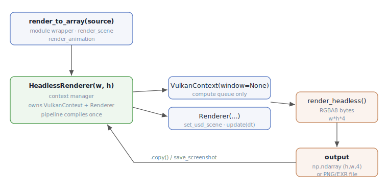

# Skinny — Python API Reference

This document is the developer reference for Skinny's **public Python API**:
the headless render interface, the `Renderer` programmatic surface, scene
loading, parameters, and the persistence/plugin helpers. For architecture and
GPU internals see [Architecture.md](Architecture.md); for the two GPU execution
modes see [Megakernel.md](Megakernel.md) / [Wavefront.md](Wavefront.md).

- **Package:** `skinny` (`src/skinny/`), `__version__ = "0.1.0"`, `requires-python >= 3.11`.
- **Most users want** `skinny.headless` — render a USD scene to a NumPy array or
  image file with no window. Everything else is the live-app surface.

> **Build prerequisite.** The Slang generator `PyMaterialXGenSlang` is **not** in
> the PyPI MaterialX wheel — build MaterialX from source with
> `-DMATERIALX_BUILD_PYTHON=ON -DMATERIALX_BUILD_GEN_SLANG=ON`. See `README.md`.
> Vulkan also needs the SDK on `DYLD_LIBRARY_PATH` (`VULKAN_SDK/lib`).

---

## 1. Console entry points

Declared in `pyproject.toml` `[project.scripts]`:

| Script | Target | Purpose |
|--------|--------|---------|
| `skinny` | `skinny.app:main` (`app.py:450`) | GLFW shader-debug window |
| `skinny-gui` | `skinny.ui.qt.app:main` | Qt desktop app |
| `skinny-web` | `skinny.web_app:main` | Panel web app (per-session server render) |
| `skinny-render` | `skinny.headless:main` (`headless.py:329`) | offscreen CLI renderer |

The top-level `skinny` package defines no `__all__`; import submodules directly
(`from skinny import headless`, `from skinny.renderer import Renderer`).

---

## 2. Headless render API — `skinny.headless`

The public offscreen interface. Accepts a USD file path **or** an already-open
`Usd.Stage`, holds the GPU context across calls, and returns RGBA8 pixels.



```python
Source = Union[str, Path, "Usd.Stage", object]   # headless.py:24
```

### One-shot module wrappers

Each opens a `HeadlessRenderer`, renders, and tears the context down — convenient
for a single image:

```python
def render_to_array(source, *, width=1024, height=1024, gpu=None, **kw) -> np.ndarray   # :272
def render_scene(source, output, *, width=1024, height=1024, gpu=None, **kw) -> None    # :278
def render_animation(source, outdir, *, width=1024, height=1024, gpu=None, **kw) -> list # :284
```

```python
import skinny.headless as sk

# RGBA8 array, shape (height, width, 4), dtype uint8
img = sk.render_to_array("assets/three_materials_demo.usda",
                         width=1280, height=720, samples=128, integrator="bdpt")

# write straight to a file (format inferred from extension)
sk.render_scene("scene.usda", "out.png", samples=256, tonemap="aces", exposure=0.5)
sk.render_scene("scene.usda", "out.exr")   # linear HDR from the accum buffer
```

### `HeadlessRenderer` — persistent context

Reuse one GPU context for many renders (pipeline compiles once). Use as a
context manager.

```python
class HeadlessRenderer:                                                  # :125
    def __init__(self, width, height, *, gpu=None,
                 execution_mode="megakernel", bdpt_walk="fused",
                 proposals=None, reuse=None): ...                        # :136
    def __enter__(self) -> "HeadlessRenderer": ...                       # :163
    def __exit__(self, *exc) -> None: ...                               # :166
    def cleanup(self) -> None: ...                                       # :169
    def render_to_array(self, source, *, samples=64, time=None, **opts) -> np.ndarray   # :192
    def render_scene(self, source, output, *, samples=64, time=None,
                     format=None, **opts) -> None                        # :205
    def render_animation(self, source, outdir, *, samples=64,
                         frames=None, fps=None, ext="png", **opts) -> list # :221
```

| Method | Returns | Notes |
|--------|---------|-------|
| `render_to_array` | `np.ndarray` `(H, W, 4)` uint8 RGBA8 (a `.copy()`) | tonemapped/sRGB display pixels |
| `render_scene` | `None` | writes a file via `save_screenshot`; LDR `{png,jpeg,bmp}` or HDR `{exr,hdr}` |
| `render_animation` | `list[Path]` | one file per timecode, `frame_{i:0Nd}.{ext}`; `fps` accepted but unused |

```python
with sk.HeadlessRenderer(1024, 1024, execution_mode="wavefront") as r:
    a = r.render_to_array("scene.usda", samples=64)
    b = r.render_to_array("scene.usda", samples=64, integrator="bdpt")  # A/B, same context
    r.render_animation("anim.usda", "frames/", frames=(0, 48), samples=32)
```

`render_to_array` raises `RuntimeError` if the pipeline failed to compile
(`self.renderer.pipeline is None`). `render_animation` raises `ValueError` if
`time`/`format` are passed through `**opts`.

### `RenderOptions` — per-render knobs

`**opts` on every render call are resolved against this dataclass:

```python
@dataclass
class RenderOptions:                                  # :32
    samples: int = 64
    integrator: str = "path"        # "path" | "bdpt"
    exposure: float = 0.0           # EV stops, 2^EV
    tonemap: str = "aces"           # aces | reinhard | hable | linear
    env_intensity: Optional[float] = None
    direct_light: bool = True       # False → IBL only
    time: object = None             # None | int | float | Usd.TimeCode
```

`_INTEGRATORS = {"path": 0, "bdpt": 1}`, `_TONEMAPS = {"aces":0,"reinhard":1,"hable":2,"linear":3}`.

### `skinny-render` CLI

```
skinny-render SOURCE [-o OUT] [--animate --outdir DIR --frames S:E[:STEP] --fps F]
              [--width W] [--height H] [--samples N]
              [--tonemap {aces,reinhard,hable,linear}] [--exposure EV]
              [--env-intensity X] [--no-direct] [--format FMT] [--ext EXT] [--gpu G]
              [--integrator {path,bdpt}] [--execution-mode {megakernel,wavefront}]
              [--bdpt-walk {fused,eye,eye_light}] [--proposals ...] [--reuse ...]
```

`main(argv=None) -> int` returns `0` ok / `1` on error. `--frames S:E[:STEP]`
parsed by `_parse_frames`. Shared render flags injected by
`cli_common.add_render_flags`.

---

## 3. `Renderer` — programmatic surface (`skinny.renderer`)

The renderer owns all GPU state and per-frame dispatch. `skinny.headless` wraps
it; drive it directly for custom loops (the live front-ends do).

### Construction

```python
class Renderer:                                       # :908
    WAVEFRONT_BDPT_SUPPORTED = True
    def __init__(self, vk_ctx: VulkanContext, shader_dir: Path,
                 hdr_dir: Path | None = None, tattoo_dir: Path | None = None,
                 usd_scene_path: Path | None = None,
                 use_usd_mtlx_plugin: bool = False,
                 execution_mode: str = "megakernel",
                 bdpt_walk: str = "fused") -> None: ... # :917
```

`execution_mode` (`"megakernel"` | `"wavefront"`) and `bdpt_walk`
(`"fused"` | `"eye"` | `"eye_light"`) are **fixed for the renderer's lifetime** —
they are excluded from the accumulation state hash.

### Frame loop & output

| Method | Signature | Notes |
|--------|-----------|-------|
| `update(dt)` | `(self, dt: float) -> None` (`:6985`) | advance animation/camera, detect dirty state, reset accumulation |
| `render()` | `(self) -> None` (`:7065`) | windowed: dispatch + present to swapchain |
| `render_headless()` | `(self) -> bytes` (`:7289`) | **returns raw RGBA8 `bytes`, length `width*height*4`** (tonemapped/sRGB) |
| `save_screenshot(path_or_file, fmt)` | `-> None` (`:7631`) | `png`/`jpeg`/`bmp` → LDR; `exr`/`hdr` → linear HDR from accum buffer |
| `cleanup()` | `(self) -> None` (`:7692`) | release GPU resources |

> There is **no** `render_offscreen` method — the offscreen primitive is
> `render_headless()` returning `bytes`.

Progressive accumulation: `update()` resets `accum_frame` to 0 whenever
`_current_state_hash()` changes (camera, params, env, integrator, proposal seam,
playback time, …), otherwise increments it. So mutating a public attribute
mid-loop gives a clean A/B — pump `update(dt)` until converged, then read.

```python
from skinny.vk_context import VulkanContext
from skinny.renderer import Renderer
from pathlib import Path

ctx = VulkanContext(window=None, width=1024, height=1024)
r = Renderer(ctx, Path("src/skinny/shaders"), usd_scene_path=Path("scene.usda"))
for _ in range(64):
    r.update(1/60)
rgba = r.render_headless()          # bytes, 1024*1024*4
r.cleanup(); ctx.destroy()
```

### Scene swap & editing

```python
def set_usd_scene(self, scene: "Scene", stage=None) -> None             # :4125
def add_model(self, usd_path, parent_prim_path="/World",
              name=None, transform=None) -> str                         # :4298
def remove_node(self, prim_path: str) -> None                           # :4349
def set_transform(self, prim_path: str, matrix) -> None                 # :4365
def save_edits(self, path: str | None = None) -> str                    # :4383
def list_nodes(self) -> list[dict]                                      # :4398
```

- `set_usd_scene` is the synchronous headless scene-swap. It does **not** build
  the scene-graph model, so the edit API below is unavailable after a bare swap.
- The edit API (`add_model` / `remove_node` / `set_transform` / `save_edits` /
  `list_nodes`) requires a **USD stage with an attached edit layer** (the
  interactive load path); each raises `RuntimeError` otherwise. `add_model`
  returns the new prim path (USD only — OBJ raises `ValueError`); `remove_node`
  deactivates non-destructively; `save_edits` defaults to `<scene>.edits.usda`;
  `list_nodes` returns `[{"path", "type", "active"}, …]`.

### Public attributes set programmatically

`integrator_index` (0 path / 1 bdpt), `tonemap_index` (0 ACES…3 linear),
`exposure` (EV), `direct_light_index` (0 on / 1 off), `env_intensity`,
`proposal_preset_index`, `reuse_index`. Mode lists:
`integrator_modes = ["Path","BDPT"]`, `tonemap_modes = ["ACES","Reinhard","Hable","Linear"]`,
`proposal_preset_modes`, `reuse_modes = ["None"]`.

### `SkinParameters` dataclass (`renderer.py:504`)

The physically-based skin model; `pack()` serialises to the 80-byte std140
`SkinParams` Slang struct. Fields (defaults): `melanin_fraction=0.15`,
`epidermis_thickness_mm=0.1`, `hemoglobin_fraction=0.05`,
`blood_oxygenation=0.75`, `dermis_thickness_mm=1.0`, `subcut_thickness_mm=3.0`,
`scattering_coefficient=[3.7,4.4,5.05]`, `anisotropy_g=0.8`, `roughness=0.35`,
`ior=1.4`, `pore_density`, `pore_depth`, `hair_density`, `hair_tilt`.

### Cameras

`OrbitCamera` (`:708`) and `FreeCamera` (`:804`) are both always live;
`camera_mode` (`"orbit"` | `"free"` | `"usd"`) selects which feeds the UBO.
`OrbitCamera`: `orbit(dx,dy)`, `set_distance(v)`, `zoom(d)`, `pan(dx,dy)`,
`position` (property), `view_matrix()`. `Renderer.toggle_camera_mode()` (`:1324`)
transfers the viewpoint between orbit and free.

---

## 4. `VulkanContext` (`skinny.vk_context`)

```python
class VulkanContext:                                  # :27
    VALIDATION_LAYERS = ["VK_LAYER_KHRONOS_validation"]
    def __init__(self, window=None, width=1280, height=720, *,
                 enable_validation=True, gpu_preference=None) -> None    # :32
    def destroy(self) -> None                                           # :356
```

`window=None` → headless: no surface/swapchain, `present_queue = None`,
compute queue only. Exposes `.width`, `.height`, `.device`, `.physical_device`,
`.gpu_info`, `.compute_queue`, `.command_pool`. `destroy()` waits idle and tears
everything down. (The wavefront path keys off `hasattr(ctx, "compute_queue")`.)

---

## 5. Parameters (`skinny.params`)

Adjustable parameters are addressed by a **`path` string** resolved on the
`Renderer` instance, so UIs and presets can set anything generically.

```python
@dataclass
class ParamSpec:                                      # :40
    name: str
    path: str                       # e.g. "mtlx.skin_bsdf_roughness"
    kind: str                       # "continuous" | "discrete"
    step: float = 0.0
    lo: float = 0.0
    hi: float = 0.0
    choice_source: str | None = None  # discrete: renderer attribute holding the choice list
```

### `path` resolution (`_get_nested` / `_set_nested`, `params.py:214` / `:255`)

> These two are **module-private functions** in `params.py` (not `Renderer`
> methods), but they are the load-bearing mechanism behind every slider/preset.

- `"mtlx.<field>"` → `renderer.mtlx_overrides[field]` (scalar), falling back to
  the active material's uniform-block default.
- `"mtlx.<field>.<idx>"` → one vector component of `mtlx_overrides[field]`.
- `"<a>.<b>"` → plain `getattr` chain (e.g. `"skin.melanin_fraction"`).

Legacy `skin.*` paths alias to `mtlx.*` (`_SKIN_TO_MTLX`); linked fields gang via
`_GANGED_MTLX_FIELDS`.

### Building the live list

```python
STATIC_PARAMS: list[ParamSpec]                # :101
ALL_PARAMS = STATIC_PARAMS                     # :155  (back-compat alias; re-imported by app.py)
def build_dynamic_params(renderer) -> list[ParamSpec]   # :181  (material-driven)
def build_all_params(renderer) -> list[ParamSpec]       # :209  (static + dynamic)
```

Representative paths: `"env_intensity"`, `"exposure"`, `"integrator_index"`,
`"tonemap_index"`, `"direct_light_index"`, `"model_index"`, `"tattoo_density"`,
`"mtlx.layer_top_melanin"`, `"mtlx.layer_middle_hemoglobin"`,
`"mtlx.skin_bsdf_roughness"`, `"light_elevation"`, `"light_intensity"`.

### Execution-mode & integrator constants

```python
EXECUTION_MEGAKERNEL = 0    # :64
EXECUTION_WAVEFRONT  = 1    # :65
def clamp_mode_index(index, n_modes) -> int                              # :68
def effective_execution_mode(selected_index, integrator_index,
                             wavefront_bdpt_supported) -> int            # :79
```

Integrator indices `0 = path`, `1 = bdpt` (consistent with
`cli_common.INTEGRATOR_INDEX`). Resolution presets:
`RESOLUTION_PRESETS: list[tuple[str,int,int]]` (`:18`) +
`find_resolution_preset_index(width, height)` (`:32`).

### Shared CLI helpers (`skinny.cli_common`)

```python
INTEGRATOR_INDEX = {"path": 0, "bdpt": 1}             # :21
WALK_CHOICES = ("fused", "eye", "eye_light")          # :25
def resolve_walk(value: str) -> str                   # :29
def add_render_flags(parser, *, integrator=True, execution=True,
                     walk=True, proposals=True, reuse=True) -> None      # :42
```

---

## 6. Scene loading (`skinny.usd_loader`)

```python
def load_scene_from_usd(stage_path, *, time=None, use_usd_mtlx_plugin=False) -> Scene    # :1970
def load_scene_from_stage(stage, *, time=None, use_usd_mtlx_plugin=False) -> Scene       # :1998
def prepare_usd_streaming(stage_path, *, time=None, use_usd_mtlx_plugin=False
    ) -> tuple[Scene, list[tuple[MeshSource, np.ndarray, int]]]                          # :2026
def build_animation_index(stage) -> AnimationIndex                                       # :1542
def build_playback_clock(stage, index)                                                   # :1591
def extract_skeletal_bindings(stage) -> SkeletalScene                                    # :1761
def extract_ui_controls(stage) -> list[ControlSpec]                                      # :1822
def resolve_control_binding(renderer, spec)                                              # :1873
def summarize(scene) -> str                                                              # :2044
```

`load_scene_from_usd` is the blocking path loader; `load_scene_from_stage` takes
a caller-owned (possibly mutated) stage — the entry headless callers use to swap
scenes. Public dataclasses: `AnimationIndex` (`.has_animation()`),
`SkinnedMeshBinding`, `SkeletalScene` (`.has_skinning()`), `ControlSpec`.

```python
from pxr import Usd
from skinny import usd_loader

stage = Usd.Stage.Open("scene.usda")
scene = usd_loader.load_scene_from_stage(stage)
renderer.set_usd_scene(scene, stage=stage)
```

---

## 7. Settings & presets

### `skinny.settings` — `~/.skinny/`

```python
def ensure_dirs() -> None                             # :41
def load_settings() -> dict[str, Any]                 # :49
def save_settings(data: dict[str, Any]) -> None       # :60   (atomic tmp + os.replace)
def get_last_dir(category) -> str                     # :86
def record_last_dir(category, directory) -> None      # :99
def load_user_presets() -> list[Preset]               # :129
def save_user_preset(name, values) -> Path            # :153
def delete_user_preset(name) -> bool                  # :168
```

Constants: `SETTINGS_DIR` (`~/.skinny`), `PRESETS_DIR`, `MESH_CACHE_DIR`,
`SETTINGS_FILE`. `settings.json` holds window geometry + parameter snapshot +
camera; user presets are one JSON per file.

### `skinny.presets`

```python
@dataclass(frozen=True)
class Preset:                                          # :27
    name: str
    values: dict[str, float] = field(default_factory=dict)
    is_builtin: bool = True

PRESETS: list[Preset]                                  # :67  (Fitzpatrick I–VI × Female/Male)
def apply_preset(renderer, preset: Preset) -> None     # :72  (writes values via _set_nested)
```

---

## 8. Plugin & backend sub-APIs (`__all__`-exporting modules)

These submodules expose a curated `__all__` (the top-level package does not):

| Module | Exports |
|--------|---------|
| `skinny.sampling` (`__init__.py:19`) | `AttachPoint`, `SamplingPlugin`, `ProposalPlugin`, `ReusePlugin`, `BsdfProposal`, `EnvImportanceProposal`, `NeuralProposal`, `IdentityReuse`, `PROPOSAL_PLUGINS`, `REUSE_PLUGINS`, `parse_proposals`, `parse_reuse`, `proposal_mask_and_alpha` |
| `skinny.gfx` (`__init__.py:76`) | backend abstraction — `Backend`, `Device`, `Buffer`, `ComputePipeline`, `DescriptorLayout`, `Format`, `Extent2D/3D`, … |
| `skinny.gfx.vulkan` (`__init__.py:22`) | `VulkanBackend`, `VulkanDevice`, `VulkanBuffer`, `VulkanImage`, `VulkanCommandList`, `VulkanQueue`, `VulkanFence`, `VulkanSemaphore`, `VulkanSampler`, `VulkanShaderModule`, `VulkanPresenter` |
| `skinny.gfx.metal` (`__init__.py:43`) | `MetalBackend` (stub; MoltenVK still uses the Vulkan backend) |
| `skinny.slangpile` (`__init__.py:48`) | Python→Slang transpiler DSL — `shader`, `struct`, `compile_module`, `build_module`, `load_module`, scalar types |

The **scene-sampling seam** (`skinny.sampling`) is where ReSTIR / neural
proposal & reuse plug in; see the proposal-mixture discussion in
[Wavefront.md § Proposal / scene-sampling seam](Wavefront.md#7-proposal--scene-sampling-seam).

---

## 9. Quick reference — common tasks

| Task | Call |
|------|------|
| Render a USD file to a NumPy array | `skinny.headless.render_to_array(path, width=W, height=H)` |
| Render to PNG/EXR | `skinny.headless.render_scene(path, "out.png")` |
| A/B two integrators, one GPU context | `with HeadlessRenderer(W,H) as r: r.render_to_array(s, integrator=...)` |
| Render an animation sequence | `r.render_animation(path, "frames/", frames=(0,48))` |
| Custom frame loop | `VulkanContext(window=None)` → `Renderer(...)` → `update(dt)`×N → `render_headless()` |
| Isolate IBL (no direct lights) | `direct_light=False` / `renderer.direct_light_index = 1` |
| Linear-HDR pixels (not tonemapped) | read the accumulation buffer / `save_screenshot(..., "exr")` |
| Apply a skin preset | `presets.apply_preset(renderer, presets.PRESETS[i])` |
| Set any parameter generically | `params._set_nested(renderer, "mtlx.skin_bsdf_roughness", 0.4)` |

See `tests/test_headless.py` (`TestMaterialXGraphDemoRender`) for a complete
headless USD render example.
