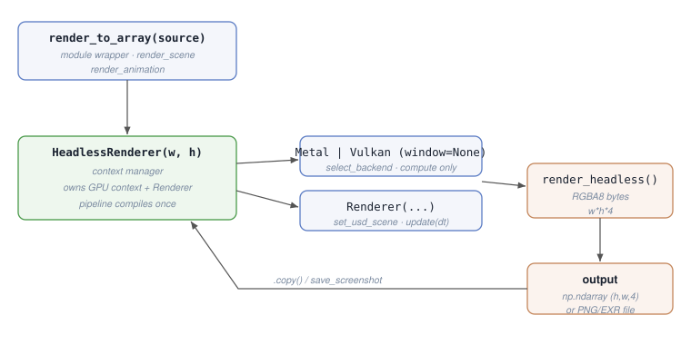

# Skinny — Python API Reference

This document is the developer reference for Skinny's **public Python API**:
the headless render interface, the `Renderer` programmatic surface, scene
loading, parameters, and the persistence/plugin helpers. For architecture and
GPU internals see [Architecture.md](Architecture.md); for the two GPU execution
modes see [Megakernel.md](Megakernel.md) / [Wavefront.md](Wavefront.md).

- **Package:** `skinny` (`src/skinny/`), `__version__ = "0.1.0"`, `requires-python >= 3.11`.
- **Most users want** `skinny.headless` — render a USD scene to a NumPy array or
  image file with no window. Everything else is the live-app surface.

> **Build prerequisite.** The Slang generator `PyMaterialXGenSlang` is **not** in
> the PyPI MaterialX wheel. On a supported platform the prebuilt wheels carry it;
> otherwise build MaterialX from source with `-DMATERIALX_BUILD_PYTHON=ON
> -DMATERIALX_BUILD_GEN_SLANG=ON` — see [Install.md](Install.md).
> A **Vulkan loader library** is also required — and that holds **even for a
> Metal-backend render**: `renderer.py` imports `vulkan` at module load, and the
> binding `dlopen`s `libvulkan.so.1` / `vulkan-1.dll` / `libvulkan.dylib`,
> raising `Cannot find Vulkan SDK version` without one. Choosing Metal picks the
> *device*, not the import graph; lifting that module-load import is a separate
> follow-up. On macOS that means the LunarG SDK (MoltenVK) with
> `$VULKAN_SDK/lib` on `DYLD_LIBRARY_PATH`; see [Install.md](Install.md).

---

## 1. Console entry points

Declared in `pyproject.toml` `[project.scripts]`:

| Script | Target | Purpose |
|--------|--------|---------|
| `skinny` | `skinny.app:main` (`app.py:450`) | GLFW shader-debug window |
| `skinny-gui` | `skinny.ui.qt.app:main` | Qt desktop app |
| `skinny-web` | `skinny.web_app:main` | Panel web app (per-session server render) |
| `skinny-render` | `skinny.headless:main` (`headless.py:329`) | offscreen CLI renderer |
| `skinny-import-pbrt` | `skinny.pbrt.cli:main` | convert a pbrt v4 scene to USD |

The top-level `skinny` package defines no `__all__`; import submodules directly
(`from skinny import headless`, `from skinny.renderer import Renderer`).

### `skinny.pbrt` — pbrt v4 importer

`import_pbrt(path, out=None, materialx=False) -> (Usd.Stage, Report)` parses a
pbrt v4 scene and emits a USD stage loadable by `usd_loader`; `out` also writes a
`.usda`/`.usd`. With `materialx=True` it additionally writes a `<out>.mtlx`
sidecar of `standard_surface` materials (referenced from the stage; the
`skinny-import-pbrt -mtlx` flag). The returned `Report` classifies each construct
as exact / approx / skipped. See [PbrtImport.md](PbrtImport.md) for the full
mapping and the parity matrix.

`skinny.pbrt.materials.resolve_material(pbrt_material, *, emissive_rgb=None,
textures=None, base_dir=None, flavor) -> ResolvedMaterial` is the single owner of
pbrt-param interpretation (`flavor` is `materials.USD` or `materials.MTLX`). The
returned `ResolvedMaterial` carries `lobes` (an **ordered** target-neutral map:
`base_color`, `roughness` as a `ResolvedRoughness`, `metallic`, `ior`,
`transmission`, `coat_*`, `subsurface*`, `emission_rgb`, the `subsurface_sigma_*`
override keys), `status`, and `notes`.

`skinny.pbrt.materials.map_material_mtlx(pbrt_material, *, emissive_rgb=None,
textures=None, base_dir=None) -> (inputs, tex_inputs, status, notes)` is the
sibling of `map_material` that targets Autodesk `standard_surface` input names
(filling `transmission`/`coat`/`subsurface`/`specular_anisotropy`/`thin_walled`
that UsdPreviewSurface drops). Both are thin emit adapters over
`resolve_material` and perform no `ParamSet` reads of their own. `skinny.pbrt.mtlx_emit.write_mtlx_document(...)` /
`author_mtlx_reference(...)` author the `.mtlx` document and the stage reference
the loader resolves.

`skinny.pbrt.spectral` is the numpy mirror of the hero-wavelength spectral
estimator (change `spectral-rendering`). `d65_normalized() -> np.ndarray` returns
the CIE D65 SPD scaled to unit luminance — pbrt's whitepoint illuminant, and the
exact curve the renderer uploads to the GPU (binding 47) so the shader's
`upsampleIlluminant` matches this mirror. `upsample_illuminant(rgb, lam)`
implements pbrt's `RGBIlluminantSpectrum` — `scale·sigmoid(rgb/scale)·D65_norm`
with `scale = 2·max(rgb)` — so HDR emitters (values > 1) stay in the sigmoid's
`[0,1]` gamut while keeping their magnitude, and a unit RGB illuminant resolves
to unit radiance (its reflectance sibling is `upsample_reflectance(rgb, lam)`).

---

## 2. Headless render API — `skinny.headless`

The public offscreen interface. Accepts a USD file path **or** an already-open
`Usd.Stage`, holds the GPU context across calls, and returns RGBA8 pixels.

The backend is **resolved, not assumed** (change `headless-backend-auto`): the
`backend=` argument goes through the same
[`select_backend`](Backends.md) every other front-end uses, so precedence is
`backend=` > `SKINNY_BACKEND` > `auto`, and `auto` picks native Metal on an
Apple-Silicon host. Leaving the argument unset therefore renders on Metal here
and on Vulkan elsewhere. Pass `backend="vulkan"` to pin the MoltenVK path. No
persisted setting participates — the direct API is non-interactive, like
`skinny-render`. The Vulkan SDK library path is still required to *import* the
renderer on either backend (see the build-prerequisite note above).



```python
Source = Union[str, Path, "Usd.Stage", object]   # headless.py:24
```

### One-shot module wrappers

Each opens a `HeadlessRenderer`, renders, and tears the context down — convenient
for a single image:

```python
def render_to_array(source, *, width=1024, height=1024, gpu=None, **kw) -> np.ndarray   # :272
def render_scene(source, output, *, width=1024, height=1024, gpu=None, **kw) -> None    # :278
def render_animation(source, outdir, *, width=1024, height=1024, gpu=None, **kw) -> list # :284
```

```python
import skinny.headless as sk

# RGBA8 array, shape (height, width, 4), dtype uint8
img = sk.render_to_array("assets/three_materials_demo.usda",
                         width=1280, height=720, samples=128, integrator="bdpt")

# write straight to a file (format inferred from extension)
sk.render_scene("scene.usda", "out.png", samples=256, tonemap="aces", exposure=0.5)
sk.render_scene("scene.usda", "out.exr")   # linear HDR from the accum buffer
```

### `HeadlessRenderer` — persistent context

Reuse one GPU context for many renders (pipeline compiles once). Use as a
context manager.

```python
class HeadlessRenderer:                                                  # :128
    def __init__(self, width, height, *, gpu=None,
                 plan=None,                    # a skinny.bringup.BringupPlan
                 backend=None,                  # None → SKINNY_BACKEND → auto
                 execution_mode="megakernel", bdpt_walk="fused",
                 proposals=None, reuse=None, lobe_samplers=None,
                 encoding=None, spectral=False): ...                     # :139
    def __enter__(self) -> "HeadlessRenderer": ...                       # :188
    def __exit__(self, *exc) -> None: ...                               # :191
    def cleanup(self) -> None: ...                                       # :194
    def render_to_array(self, source, *, samples=64, time=None, **opts) -> np.ndarray   # :229
    def render_scene(self, source, output, *, samples=64, time=None,
                     format=None, **opts) -> None                        # :245
    def render_animation(self, source, outdir, *, samples=64,
                         frames=None, fps=None, ext="png", **opts) -> list # :263
```

| Method | Returns | Notes |
|--------|---------|-------|
| `render_to_array` | `np.ndarray` `(H, W, 4)` uint8 RGBA8 (a `.copy()`) | tonemapped/sRGB display pixels |
| `render_scene` | `None` | writes a file via `save_screenshot`; LDR `{png,jpeg,bmp}` or HDR `{exr,hdr}` |
| `render_animation` | `list[Path]` | one file per timecode, `frame_{i:0Nd}.{ext}`; `fps` accepted but unused |

`plan` is the `skinny-render` CLI's path: `main()` runs the shared bring-up
guards (`skinny.bringup.plan_bringup`) and hands the resulting `BringupPlan`
in, so the context and `Renderer` are built by `plan.create(...)`. Direct
Python callers leave it `None` and pass the individual kwargs — those become a
plan internally, so there is one construction path either way (see
[HostModules.md § Front-end bring-up](HostModules.md#front-end-bring-up-bringuppy-change-frontend-bringup-builder)).
On that direct path `HeadlessRenderer` runs the one bring-up step the kwargs
would otherwise skip, `select_backend` — so the backend is resolved exactly once
either way, and `backend="auto"` is legal here as on the CLI.

```python
with sk.HeadlessRenderer(1024, 1024, execution_mode="wavefront") as r:
    a = r.render_to_array("scene.usda", samples=64)
    b = r.render_to_array("scene.usda", samples=64, integrator="bdpt")  # A/B, same context
    r.render_animation("anim.usda", "frames/", frames=(0, 48), samples=32)
```

`render_to_array` raises `RuntimeError` if the pipeline failed to compile
(`self.renderer.pipeline is None`). `render_animation` raises `ValueError` if
`time`/`format` are passed through `**opts`.

### `RenderOptions` — per-render knobs

`**opts` on every render call are resolved against this dataclass:

```python
@dataclass
class RenderOptions:                                  # :32
    samples: int = 64
    integrator: str = "path"        # "path" | "bdpt"
    exposure: float = 0.0           # EV stops, 2^EV
    tonemap: str = "aces"           # aces | reinhard | hable | linear
    env_intensity: Optional[float] = None  # fallback IBL only
    direct_light: bool = True       # fallback DistantLight only
    time: object = None             # None | int | float | Usd.TimeCode
```

`_INTEGRATORS = {"path": 0, "bdpt": 1}`, `_TONEMAPS = {"aces":0,"reinhard":1,"hable":2,"linear":3}`.

`env_intensity` and `direct_light` configure Skinny's fallback pair only. If the
active USD scene contains any authored light or emissive material, the values
are retained for a later fallback scene but cannot alter current authored
lighting. A light-less scene enables the default DistantLight and built-in IBL
together; `direct_light=False` may then disable the fallback DistantLight.

### `skinny-render` CLI

```
skinny-render SOURCE [-o OUT] [--animate --outdir DIR --frames S:E[:STEP] --fps F]
              [--width W] [--height H] [--samples N]
              [--tonemap {aces,reinhard,hable,linear}] [--exposure EV]
              [--env-intensity X] [--no-direct] [--format FMT] [--ext EXT] [--gpu G]
              [--integrator {path,bdpt}] [--execution-mode {megakernel,wavefront}]
              [--bdpt-walk {fused,eye,eye_light}] [--proposals ...] [--reuse ...]
```

`main(argv=None) -> int` returns `0` ok / `1` on error. `--frames S:E[:STEP]`
parsed by `_parse_frames`. Shared render flags injected by
`cli_common.add_render_flags`.

---

## 3. `Renderer` — programmatic surface (`skinny.renderer`)

The renderer owns all GPU state and per-frame dispatch. `skinny.headless` wraps
it; drive it directly for custom loops (the live front-ends do).

### Construction

```python
class Renderer:                                       # :908
    WAVEFRONT_BDPT_SUPPORTED = True
    def __init__(self, vk_ctx: VulkanContext, shader_dir: Path,
                 hdr_dir: Path | None = None, tattoo_dir: Path | None = None,
                 usd_scene_path: Path | None = None,
                 use_usd_mtlx_plugin: bool = False,
                 execution_mode: str = "megakernel",
                 bdpt_walk: str = "fused",
                 neural_config: NeuralBuildConfig | None = None) -> None: ... # :917
```

`execution_mode` (`"megakernel"` | `"wavefront"`) and `bdpt_walk`
(`"fused"` | `"eye"` | `"eye_light"`) are **fixed for the renderer's lifetime** —
they are excluded from the accumulation state hash.

`neural_config` (`skinny.sampling.neural_weights.NeuralBuildConfig`, default
`None` ⇒ the shipped `fp32 @ 6/24/96`) selects the neural proposal's **size +
precision** for the renderer's lifetime (the size×precision study builds a fresh
renderer per grid cell). It is also fixed for the lifetime; on a device lacking
fp16 it falls back to fp32 (logged). See [Neural build config](#neural-build-config).

#### Neural build config

`NeuralBuildConfig` + `NeuralPrecision` (`skinny.sampling.neural_weights`) are the
single source of truth for the neural proposal's build-time size + precision
(study `neural-precision-size-study`):

```python
from skinny.sampling.neural_weights import NeuralBuildConfig, NeuralPrecision

NeuralBuildConfig()                                   # shipped fp32 @ 6/24/96 (default)
NeuralBuildConfig(precision=NeuralPrecision.FP16_STORAGE)   # half weights, float GEMM
NeuralBuildConfig(layers=4, bins=16, hidden=48)             # a smaller net
```

| Member | Notes |
|--------|-------|
| `NeuralBuildConfig(layers=6, bins=24, hidden=96, precision=FP32)` | frozen dataclass; the default reproduces the shipped net |
| `.slang_defines() -> tuple[str, ...]` | the `slangc -D` tokens; **empty for the default** (⇒ byte-identical compiles) |
| `.cache_tag -> str` | slug folded into the wavefront `.spv` name so configs don't collide |
| `.arch -> (layers, bins, hidden, cond)` | the NFW1 architecture the loader validates |
| `NeuralPrecision.{FP32, FP16_STORAGE, FP16_COMPUTE, FP8_STORAGE}` | `.weight_half` / `.compute_half` / `.weight_fp8` + `.storage_bytes` (4/2/1) drive the upload dtype + the `NF_WT`/`NF_CT`/`NF_FP8` defines |
| `NeuralWeights.weight_bytes_for(precision)` / `.bias_bytes_for(...)` | fp32 NFW1 → the upload bytes (half for the fp16 modes; e4m3 packed in `uint` words for `FP8_STORAGE`, a quarter of fp32) |
| `f32_to_e4m3(arr)` / `e4m3_to_f32(bytes)` (`skinny.sampling.neural_weights`) | the e4m3 (OCP E4M3FN) codec mirrored bit-for-bit by `neural_flow.slang nf_decode_e4m3` (the fp8-storage decode) |

#### Training backends

`skinny.sampling.training_backends` is the pluggable per-cycle **training-compute**
seam behind the online trainer (change `neural-trainer-backends`). `NeuralTrainer`
stays the orchestrator; the backend owns only the gradient step.

```python
from skinny.sampling.training_backends import (
    make_training_backend, build_dataset_np,
    NumpyTrainingBackend, TorchTrainingBackend, MlxTrainingBackend)

make_training_backend("auto")     # precedence cuda > mlx > cpu (best available)
make_training_backend("cpu")      # NumpyTrainingBackend — torch-free, always available
make_training_backend("cuda")     # TorchTrainingBackend(device="cuda"); raises if absent
make_training_backend("mlx")      # MlxTrainingBackend — Apple MLX on Metal; raises off Apple Silicon
```

| Member | Notes |
|--------|-------|
| `TrainingBackend` (ABC) | `is_available` / `supports_precision(p, device)` / `warm_start(weights, cfg)` / `update(cond, z, w) -> float\|None` / `export() -> NeuralWeights`; stateful across cycles (warm model + optimizer) |
| `make_training_backend(kind="auto", *, device="auto", train_precision="fp32", spline_flow_path=None)` | token → backend (`cpu`→numpy, `cuda`→torch, `mlx`→MLX on Apple-Silicon Metal); `auto` precedence `cuda > mlx > cpu`; unavailable explicit token raises clearly |
| `TRAINING_BACKENDS` | name-keyed token table (`cpu` / `cuda` / `mlx`) |
| `NumpyTrainingBackend` | torch-free reference oracle: forward + backward of the contribution-weighted MLE via a tiny pure-numpy autodiff tape; fp32 only |
| `TorchTrainingBackend(device="cpu\|mps\|cuda")` | the torch loop; CUDA autocast-fp16 at `train_precision="fp16"`; in-memory bake |
| `MlxTrainingBackend` | Apple MLX GPU loop on Apple-Silicon Metal (optional `[mlx]` extra); mirrors the numpy oracle's flow math with MLX autodiff + hand-rolled bias-corrected Adam; `train_precision="fp16"` = float16 compute over fp32 masters with runtime fp32 fall-back; in-memory fp32 bake |
| `build_dataset_np(batch, bounds) -> (cond, z, w)` | the shared numpy dataset contract (contiguous float32), consumed by every backend |
| `TrainerConfig.backend` / `.train_precision` | select the backend (`cpu\|cuda\|mlx\|auto`) and the optimizer precision (`fp32\|fp16`); `arch.precision` is the independent inference precision |

#### Online training driver

`Renderer` exposes the online-training lifecycle the front-ends drive (change
`online-training-trigger`). `enable_online_training` builds the
`ReplayBuffer` + `NeuralTrainer` + `NeuralWeightPublisher` and **starts a daemon
trainer thread** that loops `online_train_and_publish` off the render thread;
`disable_online_training` signals it to stop and joins it. The render loop calls
`online_training_tick()` once per frame; the frame-end swap inside
`render()` / `render_headless()` promotes newly published weights.

| Method | Signature | Notes |
|--------|-----------|-------|
| `can_online_train()` | `(self) -> tuple[bool, str]` | prerequisite gate: `(True, "")` only when the execution mode is wavefront **and** a neural proposal is active; otherwise `(False, reason)` naming the missing prerequisite. The front-ends refuse loudly on `False`, never a silent no-op |
| `enable_online_training(*, handoff=None, trainer_backend=None, train_precision=None, replay=None, trainer=None, capacity=1_000_000, **publisher_kwargs)` | `-> NeuralWeightPublisher` | builds the replay buffer + trainer + publisher, sets `_online_training`, resolves the record source, and starts the background trainer thread. `handoff`/`trainer_backend`/`train_precision` override the renderer's `--neural-handoff`/`--neural-trainer`/`--train-precision`. Surfaces the existing `mlx`/`interop` errors |
| `online_training_tick()` | `(self) -> int` | per-frame driver: drains GPU path records into the replay buffer on the **render thread** and returns the count; a no-op returning `0` when training is off or the scene isn't built yet. Returns promptly — the per-cycle training runs on the trainer thread |
| `disable_online_training()` | `(self) -> None` | clears `_online_training` and stops + joins the trainer thread; safe when never enabled |
| `online_training_active` (property) | `-> bool` | whether the loop is on |

`sampling.neural_handoff.make_publisher(kind, **kwargs) -> NeuralWeightPublisher`
is the factory behind the `handoff` value: `"file"` → `FileWeightPublisher`,
`"shared"` → `SharedWeightPublisher` (in-process CPU double-buffer in RAM, no disk
and no GPU-interop, any platform; change `shared-neural-handoff`), `"interop"` →
the per-backend GPU publisher. `shared` takes only `initial` / `expect_arch` (no
buffer/semaphore kwargs). The in-memory copy uses the new
`sampling.neural_weights.serialize_neural_weights(nw) -> bytes` /
`deserialize_neural_weights(data, expect=None) -> NeuralWeights` pair, which
`write_neural_weights` / `load_neural_weights` now wrap (NFW1 on-disk format
unchanged).

### Frame loop & output

| Method | Signature | Notes |
|--------|-----------|-------|
| `update(dt)` | `(self, dt: float) -> None` (`:6985`) | advance animation/camera, detect dirty state, reset accumulation |
| `render()` | `(self) -> None` (`:7065`) | windowed: dispatch + present to swapchain |
| `render_headless()` | `(self) -> bytes` (`:7289`) | **returns raw RGBA8 `bytes`, length `width*height*4`** (tonemapped/sRGB) |
| `read_accumulation_hdr()` | `(self) -> tuple[np.ndarray, int]` (`:8363`) | linear-HDR readback: `(H, W, 4)` float32 accum buffer + sample count; divide array by count for mean radiance. **Vulkan + Metal** (Metal drains the rgba32_float texture directly — no transfer/fence) |
| `read_structural_aov()` | `(self) -> np.ndarray` | dispatch one `TOOL_MODE_STRUCTURAL` frame and read the per-primary-ray structural channel: `(H, W, 4)` float32 = `(hit_mask, instance_id, material_id, depth)`. Deterministic across backends — backs the Metal↔Vulkan structural-parity test (6.1). Requires a built megakernel pipeline; resolution must fit the tool buffer (raises otherwise). **Vulkan + Metal** |
| `resize(width, height)` | `(self, int, int) -> None` (`:8265`) | change render resolution at runtime (clamped ≥64, workgroup-aligned); recreates offscreen/accum/HUD images, resets accumulation. **Vulkan + Metal** |
| `save_screenshot(path_or_file, fmt)` | `-> None` (`:7631`) | `png`/`jpeg`/`bmp` → LDR; `exr`/`hdr` → linear HDR from accum buffer |
| `dump_path_records(out_path, *, num_frames=256, ...)` | `-> int` | offline neural training-record dump → a `.nrec` file (per-vertex `(pos, N, wo, wiLocal, contribution)` via the `mainImageRecord` megakernel entry); returns the record count. Feeds `spline_flow/render_records.py`. |
| `cleanup()` | `(self) -> None` (`:7692`) | release GPU resources |

> There is **no** `render_offscreen` method — the offscreen primitive is
> `render_headless()` returning `bytes`.

Progressive accumulation: `update()` resets `accum_frame` to 0 whenever
`_current_state_hash()` changes (camera, params, env, integrator, proposal seam,
playback time, …), otherwise increments it. So mutating a public attribute
mid-loop gives a clean A/B — pump `update(dt)` until converged, then read.

```python
from skinny.vk_context import VulkanContext
from skinny.renderer import Renderer
from pathlib import Path

ctx = VulkanContext(window=None, width=1024, height=1024)
r = Renderer(ctx, Path("src/skinny/shaders"), usd_scene_path=Path("scene.usda"))
for _ in range(64):
    r.update(1/60)
rgba = r.render_headless()          # bytes, 1024*1024*4
r.cleanup(); ctx.destroy()
```

### Scene swap & editing

```python
def set_usd_scene(self, scene: "Scene", stage=None) -> None             # :5827
def add_model(self, usd_path, parent_prim_path="/World",
              name=None, transform=None) -> str                         # :6012
def add_light(self, light_type, parent_prim_path="/World",
              name=None, transform=None) -> str                         # :6063
def remove_node(self, prim_path: str) -> None                           # :6145
def set_transform(self, prim_path: str, matrix) -> None                 # :6161
def save_edits(self, path: str | None = None) -> str                    # :6191
def list_nodes(self) -> list[dict]                                      # :6206
def add_material(self, name, *, mtlx_path=None, preview_params=None,
                  session_dir=None, on_rollback=None) -> str            # :6411
def bind_material(self, prim_path: str, material_path: str) -> None     # :6492
def apply_material_override(self, material_id, key, value) -> None      # :7381
def apply_material_overrides(self, material_id, values: dict) -> None   # :7407
```

- `set_usd_scene` is the synchronous headless scene-swap. It does **not** build
  the scene-graph model, so the edit API below is unavailable after a bare swap.
- The edit API (`add_model` / `add_light` / `remove_node` / `set_transform` /
  `save_edits` / `list_nodes` / `add_material` / `bind_material`) requires a
  **USD stage with an attached edit layer** (the interactive load path); each
  raises `RuntimeError` otherwise. `add_model` returns the new prim path (USD
  only — OBJ raises `ValueError`). `add_light` accepts `DistantLight`,
  `SphereLight`, `DomeLight`, `RectLight`, or `DiskLight`, returns a unique
  prim path, authors explicit defaults, and immediately resyncs the scene.
  `remove_node` deactivates non-destructively; `save_edits` defaults to
  `<scene>.edits.usda`; `list_nodes` returns `[{"path", "type", "active"}, …]`.
- `add_material` (mcp-material-authoring, design D2) authors a typed
  `UsdShade.Material` holder under `/Materials` in the session edit layer:
  exactly one of `mtlx_path` (an absolute `.mtlx` reference — curated preset
  or synthesized document; the holder name must equal `name` exactly, the D6
  naming contract the loader's binding resolution requires) or
  `preview_params` (an inline `UsdPreviewSurface`, holder name uniquified) is
  given. `session_dir`/`on_rollback` let a synthesized document's session
  `.mtlx` file participate in `save_edits` classification and rollback without
  coupling the renderer to `mtlx_synthesis`. The material is created but
  **not live** — not loaded, rendered, or editable — until a geometry prim
  binds it (design D8); returns the holder prim path.
- `bind_material` (design D6) validates both paths — `prim_path` must be a
  bindable `Gprim`, `material_path` must exist and be either
  `Material`-typed or carry a `.mtlx` reference — then authors an explicit
  binding-relationship target (set, not prepended) so the session binding
  *replaces* rather than merges with any file-authored one under LIVRPS, and
  resyncs, which loads the newly bound material and restarts accumulation.
- `apply_material_override` mutates one `parameter_overrides` key on a scene
  material and re-uploads (used by control-panel slider drags).
  `apply_material_overrides` (design D5, the fan-out write path for a
  synthesized material's logical inputs, which a generator dry-run may map to
  several generated uniform names) applies a whole `{key: value}` dict in one
  pass, re-uploading and bumping `_material_version` exactly once for the
  batch rather than once per key.

### Public attributes set programmatically

`integrator_index` (0 path / 1 bdpt), `tonemap_index` (0 ACES…3 linear),
`exposure` (EV), `direct_light_index` (0 on / 1 off), `env_intensity`,
`proposal_preset_index`, `reuse_index`. `film` is a `FilmParameters` dataclass
(`film.iso=100`, `film.exposure_time=1.0`, change `pbrt-radiometric-parity`): the
pbrt film exposure controls read from the authored camera (`skinny:film:*`); their
imaging ratio `exposure_time·iso/100` is a live linear output scale (multiplies the
linear-HDR read; folded into the display exposure). Retunable via the `film.iso` /
`film.exposure_time` params; a change resets accumulation. Mode lists:
`integrator_modes = ["Path","BDPT"]`, `tonemap_modes = ["ACES","Reinhard","Hable","Linear"]`,
`proposal_preset_modes`, `reuse_modes = ["None"]`.

`renderer.uses_default_lights` reports the active lighting authority.
`direct_light_index` and `env_intensity` affect only the synthesized fallback
pair; authored USD lighting remains controlled by its USD light/material state.

### `SkinParameters` dataclass (`skin_params.py`)

The physically-based skin model; `pack()` serialises to the 80-byte std140
`SkinParams` Slang struct. Fields (defaults): `melanin_fraction=0.15`,
`epidermis_thickness_mm=0.1`, `hemoglobin_fraction=0.05`,
`blood_oxygenation=0.75`, `dermis_thickness_mm=1.0`, `subcut_thickness_mm=3.0`,
`scattering_coefficient=[3.7,4.4,5.05]`, `anisotropy_g=0.8`, `roughness=0.35`,
`ior=1.4`, `pore_density`, `pore_depth`, `hair_density`, `hair_tilt`.

It lives in `skinny.skin_params`, a module that imports no GPU package (change
`renderer-pure-core-extraction`). `from skinny.renderer import SkinParameters`
still works — `renderer` re-exports every moved name — but importing from the
owning module needs no GPU package.

### Cameras

`OrbitCamera` and `FreeCamera` live in `skinny.camera`, which imports no GPU
package (change `renderer-pure-core-extraction`); `skinny.renderer` re-exports
both. They are both always live;
`camera_mode` (`"orbit"` | `"free"` | `"usd"`) selects which feeds the UBO.
`OrbitCamera`: `orbit(dx,dy)`, `set_distance(v)`, `zoom(d)`, `pan(dx,dy)`,
`position` (property), `view_matrix()`. `Renderer.toggle_camera_mode()` (`:1324`)
transfers the viewpoint between orbit and free.

---

## 4. `VulkanContext` (`skinny.vk_context`)

```python
class VulkanContext:                                  # :27
    VALIDATION_LAYERS = ["VK_LAYER_KHRONOS_validation"]
    def __init__(self, window=None, width=1280, height=720, *,
                 enable_validation=True, gpu_preference=None) -> None    # :32
    def wait_idle(self) -> None                                         # :477
    def destroy(self) -> None                                           # :356
```

`window=None` → headless: no surface/swapchain, `present_queue = None`,
compute queue only. Exposes `.width`, `.height`, `.device`, `.physical_device`,
`.gpu_info`, `.compute_queue`, `.command_pool`. `destroy()` waits idle and tears
everything down. (The wavefront path reads the declared capability
`gpu_backend.capabilities(ctx).has_descriptor_sets` — **never**
`hasattr(ctx, "compute_queue")`, which is unconditionally true because
`MetalContext.compute_queue` is `None` rather than absent.)

`wait_idle()` is the backend-neutral device drain (`vkDeviceWaitIdle` on Vulkan,
`Device.wait_for_idle` on the Metal twin `MetalContext`); the renderer calls
`ctx.wait_idle()` before tearing down a pipeline so neither backend reaches for a
Vulkan-only symbol on a rebuild.

---

## 5. Parameters (`skinny.params`)

Adjustable parameters are addressed by a **`path` string** resolved on the
`Renderer` instance, so UIs and presets can set anything generically.

```python
@dataclass
class ParamSpec:                                      # :41
    name: str
    path: str                       # e.g. "mtlx.skin_bsdf_roughness"
    kind: str                       # "continuous" | "discrete"
    step: float = 0.0
    lo: float = 0.0
    hi: float = 0.0
    choice_source: str | None = None  # discrete: renderer attribute holding the choice list
    resets_accumulation: bool = True
    hash_coercion: Callable[[object], object] | None = None
    proxy_default: float | None = None  # GUI-proxy pre-snapshot placeholder (None → lo); not the renderer's init value
```

`Renderer._current_state_hash()` derives its parameter-backed contributors from
the `ParamSpec` entries whose `resets_accumulation` flag is true. Continuous
parameters contribute as `float`, discrete parameters as `int`, unless
`hash_coercion` supplies a legacy-compatible override. Non-parameter state is
registered through the frozen `AccumStateProvider` records in
`ACCUM_STATE_PROVIDERS`; a provider may use `covers_prefix` to cover a family of
parameter paths, as the `mtlx_overrides` provider does for `mtlx.*`.

### `path` resolution (`_get_nested` / `_set_nested`, `params.py:348` / `:389`)

> These two are **module-private functions** in `params.py` (not `Renderer`
> methods), but they are the load-bearing mechanism behind every slider/preset.

- `"mtlx.<field>"` → `renderer.mtlx_overrides[field]` (scalar), falling back to
  the active material's uniform-block default.
- `"mtlx.<field>.<idx>"` → one vector component of `mtlx_overrides[field]`.
- `"<a>.<b>"` → plain `getattr` chain (e.g. `"skin.melanin_fraction"`).

Legacy `skin.*` paths alias to `mtlx.*` (`_SKIN_TO_MTLX`); linked fields gang via
`_GANGED_MTLX_FIELDS`.

### Building the live list

```python
STATIC_PARAMS: list[ParamSpec]                # :101
ALL_PARAMS = STATIC_PARAMS                     # :155  (back-compat alias; re-imported by app.py)
def build_dynamic_params(renderer) -> list[ParamSpec]   # :181  (material-driven)
def build_all_params(renderer) -> list[ParamSpec]       # :209  (static + dynamic)
```

Representative paths: `"env_intensity"`, `"exposure"`, `"integrator_index"`,
`"tonemap_index"`, `"direct_light_index"`, `"model_index"`, `"tattoo_density"`,
`"mtlx.layer_top_melanin"`, `"mtlx.layer_middle_hemoglobin"`,
`"mtlx.skin_bsdf_roughness"`, `"light_elevation"`, `"light_intensity"`.

### Execution-mode & integrator constants

```python
EXECUTION_MEGAKERNEL = 0    # :64
EXECUTION_WAVEFRONT  = 1    # :65
def clamp_mode_index(index, n_modes) -> int                              # :68
def effective_execution_mode(selected_index, integrator_index,
                             wavefront_bdpt_supported) -> int            # :79
```

Integrator indices `0 = path`, `1 = bdpt` (consistent with
`cli_common.INTEGRATOR_INDEX`). Resolution presets:
`RESOLUTION_PRESETS: list[tuple[str,int,int]]` (`:18`) +
`find_resolution_preset_index(width, height)` (`:32`).

### Shared CLI helpers (`skinny.cli_common`)

```python
INTEGRATOR_INDEX = {"path": 0, "bdpt": 1}             # :21
WALK_CHOICES = ("fused", "eye", "eye_light")          # :25
def resolve_walk(value: str) -> str                   # :29
def add_render_flags(parser, *, integrator=True, execution=True,
                     walk=True, proposals=True, reuse=True) -> None      # :42
```

---

## 6. Scene loading (`skinny.usd_loader`)

```python
def load_scene_from_usd(stage_path, *, time=None, use_usd_mtlx_plugin=False) -> Scene
def load_scene_from_stage(stage, *, time=None, use_usd_mtlx_plugin=False) -> Scene
def build_animation_index(stage) -> AnimationIndex
def build_playback_clock(stage, index)
def extract_skeletal_bindings(stage) -> SkeletalScene
def extract_ui_controls(stage) -> list[ControlSpec]
def compute_joint_matrices(binding, time, skel_to_world=None, up_axis_rt4=None)
def prim_has_mtlx_reference(stage, prim_path) -> bool
def summarize(scene) -> str
```

`load_scene_from_usd` is the blocking path loader; `load_scene_from_stage` takes
a caller-owned (possibly mutated) stage — the entry headless callers use to swap
scenes. Public dataclasses: `AnimationIndex` (`.has_animation()`),
`SkinnedMeshBinding`, `SkeletalScene` (`.has_skinning()`), `ControlSpec`.

```python
from pxr import Usd
from skinny import usd_loader

stage = Usd.Stage.Open("scene.usda")
scene = usd_loader.load_scene_from_stage(stage)
renderer.set_usd_scene(scene, stage=stage)
```

`resolve_control_binding(renderer, spec)` was **removed** from this module by
change `scene-intake-interface`. It took a renderer and wrote to it; the two
halves now live in `skinny.scene_intake` and `skinny.usd_controls` below.

---

## 6a. Scene intake (`skinny.scene_intake`, `skinny.usd_controls`)

The one interface from a USD stage to the renderer. Intake returns values and
holds no renderer reference; `Renderer.apply_scene_update` is the only path
that adopts one.

```python
def read_stage(stage_path, *, use_usd_mtlx_plugin=False, build_graph=True) -> SceneUpdate
def read_open_stage(stage, *, time=None, use_usd_mtlx_plugin=False,
                    allow_empty=False, build_graph=True, replaces=None) -> SceneUpdate
def adopt_scene(scene, *, stage=None) -> SceneUpdate
def bake_pending(pending_prims, *, max_workers=4)          # yields MeshInstance
def read_at_time(stage, time_code, *, up_axis_rt=None, xform_paths=None,
                 want_lights=True, want_camera=True) -> TimeSample
def deform_skinned_mesh(binding, source, time) -> MeshSource
def dome_light_intensity(prim) -> float
def read_lens_file(path) -> LensSystem | None
def resolve_control_binding(spec, *, scene=None, stage=None) -> ControlBinding
```

`SceneUpdate` has one constructor per trigger — `streamed`, `adopted`,
`resynced`, `replacing` — and the four readers above build them; do not fill
its per-trigger fields by hand. `TimeSample.read_lights` / `.read_camera` say
whether that part of the stage was read at all, which is not the same as the
lists coming back empty.

`read_at_time` accepts a frame number or a `Usd.TimeCode`. Pass the sentinel,
not a float, for the default time: `Usd.TimeCode.Default().GetValue()` is NaN.

```python
from pxr import Usd
from skinny import scene_intake

stage = Usd.Stage.Open("scene.usda")
renderer.apply_scene_update(scene_intake.read_open_stage(stage))

sample = scene_intake.read_at_time(stage, 12.0, up_axis_rt=renderer._usd_up_axis_rt)
print(sample.camera_override, len(sample.lights_dir))
```

Applying a control binding is the renderer's half:

```python
def accessors_for(renderer, binding) -> tuple[getter, setter]
def control_accessors(renderer, spec) -> tuple[getter, setter]
```

```python
from skinny.usd_controls import control_accessors

getter, setter = control_accessors(renderer, spec)   # renderer may be a proxy
setter(0.5)
```

`skinny.usd_controls` imports no GPU package, so a UI or a test binds controls
without importing `skinny.renderer`.

`Renderer` gained `apply_scene_update(update)` and a `scene_version` property —
the explicit change token that replaced `id(renderer._usd_scene)`, bumped once
per applied update.

---

## 6b. Render-thread marshalling & MCP control

### `skinny.render_session` — command queue + renderer proxy

Front-end-neutral (imports no GUI toolkit). `skinny.ui.qt.render_session`
re-exports every name for backwards compatibility.

```python
class RenderCommand                                   # frozen: callback, coalesce_key, reply
class RenderCommandQueue:
    def post(callback, *, coalesce_key=None) -> None          # last-write-wins coalescing
    def post_with_reply(callback) -> Future[Any]              # no coalesce_key by design
    def drain() -> list[RenderCommand]                        # removes only — does NOT execute
    def run_pending(target, *, on_error=None) -> None         # executes AND settles replies
    def __len__() -> int

class QtRendererProxy                                 # GUI-thread facade; all verbs post
def build_scene_state(renderer) -> SceneStateSnapshot # detached copy + both version counters
```

Call `run_pending`, not `drain`: a caller that drains and loops the callbacks
itself must settle every `reply` future, or awaited commands hang to their
timeout. Any thread that does not own the renderer must marshal through this
queue — **including for reads**, since the scene graph is rebuilt on the
streaming load thread and swapped in.

### `skinny.ui.scene_edit_actions` — shared property dispatch

```python
def apply_scene_property(renderer, node, prop, value, *, graph=None) -> str | None
def find_material_ref(graph, node) -> RendererRef | None
```

`apply_scene_property` returns `None` when routed, or a reason string when not.
Used by both the Qt Scene Graph dock and the MCP server so the two cannot drift
— with one exemption: the dock's *file-chooser* flows (HDR, lens) keep their own
dialog and async error handling, because against `QtRendererProxy` those calls
return a `Future` rather than a bool. The routing decision still lives here, so a
client reaches the same verb.
Routing depends on the resolved property and node, **not** on `(path, name)`:
material parameters sit on Shader prims with no `renderer_ref` and resolve by
ancestor walk; a transform component recomposes from its siblings.

### `skinny.mcp_server` / `skinny.mcp_auth` / `skinny.mcp_paths` — MCP control surface

Requires the `[mcp]` extra. Opt-in via `--mcp` on `skinny` (GLFW) or
`skinny-gui` (Qt) — the only two front-ends that host a render-thread command
queue for it; `skinny-web` and `skinny-render` suppress the flag entirely.

```python
# skinny.mcp_server
class SceneToolError(Exception)
class SceneTools:                                     # proxy or bare queue
    def scene_list(path="/", depth=2, kind=None) -> dict
    def scene_get(path) -> dict
    def scene_set(path, property, value) -> dict
    # Structural tools (mcp-scene-structure): each returns
    # {"status": "done", "path": ..., **versions} once the render-thread work
    # finishes, or {"status": "pending", "job_id": ...} if it outlasts a ~2s
    # inline grace period -- poll scene_job_status for the eventual result.
    def scene_add_model(usd_path, name=None, parent=None,
                         translate=None, rotate_euler_deg=None, scale=None,
                         matrix=None) -> dict
    # glb-asset-import: convert a GLB to USD (built-in pure-Python converter,
    # pygltflib + pxr; macOS/Linux/Windows) and reference it in one call. Both
    # glb_path and the resolved out_dir must resolve inside the allowed roots;
    # the produced .usdc is handed to scene_add_model (same subtree validation
    # + job degradation). out_dir defaults to <stem>_usd beside the GLB; an
    # existing conversion is refused unless overwrite=True. Conversion runs
    # synchronously on the tool thread (a large GLB blocks this call for its
    # duration -- the pollable job covers only the add). An out-of-scope glTF
    # feature (Draco, sparse accessors, skinning, animation) errors by name.
    def scene_import_glb(glb_path, name=None, parent=None, out_dir=None,
                         overwrite=False, translate=None, rotate_euler_deg=None,
                         scale=None, matrix=None) -> dict
    def scene_add_primitive(type, color=None, roughness=None, metallic=None,
                             material=None, name=None, parent=None,
                             translate=None, rotate_euler_deg=None, scale=None,
                             matrix=None) -> dict          # Sphere/Cube/Cylinder/Cone/Capsule/Plane
    def scene_add_light(light_type, intensity=None, color=None,
                         name=None, parent=None,
                         translate=None, rotate_euler_deg=None, scale=None,
                         matrix=None) -> dict              # DistantLight/SphereLight/DomeLight/RectLight/DiskLight
    def scene_remove(path) -> dict                        # non-destructive deactivation
    def scene_save(path) -> dict                           # path required; structural edits only, see caveat below
    def scene_job_status(job_id) -> dict                   # never blocks; pending/done/failed
    # Material authoring (mcp-material-authoring): material_list is renderer-free
    # (touches only mtlx_synthesis, never the render thread); the other two are
    # structural tools with the same {"status": ..., **versions} envelope above.
    def material_list() -> dict                           # presets/models/graph_nodes/templates catalogs
    def scene_add_material(spec, name=None) -> dict        # {"preset"|"model"|"template": ...} -> {"path", "live": False, ...}
    def scene_bind_material(prim_path, material_path) -> dict  # binds/rebinds; the moment a material goes live
def build_app(tools, token, port)                     # guarded ASGI app
def serve(proxy_or_queue, port, sock, roots=None) -> Thread  # daemon; installs NO signal handlers
def start(proxy_or_queue, port, roots=None) -> Thread | None # None if the port is taken

# skinny.mcp_auth
TOKEN_FILE, LOOPBACK_HOST
def load_or_create_token(path=None) -> str            # see platform note below; SKINNY_MCP_TOKEN override
def token_is_from_env() -> bool                       # True when the env override supplies it
def bind_loopback_socket(port) -> socket.socket       # asserts loopback
def check_request(headers, token, port) -> str | None # None allows; Origin/Host/token guards
def registration_command(port) -> str                 # references the token file, not its value

# skinny.mcp_paths — filesystem allowlist for the structural tools
def resolve_roots(cli_value, env=None) -> list[str]   # --mcp-roots > SKINNY_MCP_ROOTS > temp dirs + cwd
def check_path(path, roots) -> str | None             # None allows; else a reason naming path + roots
def validate_added_subtree(stage, prim, pre_layers, roots) -> None  # raises ValueError on an escape

# skinny.glb_import — pure-Python GLB→USD converter (backs scene_import_glb)
class GlbImportError(Exception)                       # malformed GLB or unsupported glTF feature
def convert_glb_to_usd(glb_path, out_dir, *, overwrite=False) -> Path  # → the authored .usdc
# Scope: single-asset generator output (TRELLIS.2 & co.) — meshes with
# POSITION/NORMAL/TEXCOORD_0, embedded PNG/JPEG/WebP images, pbrMetallicRoughness.
# Node transforms, instancing, morph targets, skinning, animation, Draco/meshopt/
# quantization, sparse accessors, and external image URIs are refused by name.
# Normal/emissive/occlusion textures and secondary UV sets are not imported.
```

**Token file, platform note.** On POSIX the file is created mode `0600` and
re-validated on every read — no-follow open, with owner and mode checked by
`fstat` on that same descriptor. **Windows lacks those primitives**
(`O_NOFOLLOW`, `getuid`), so there the checks are skipped and the token is only
as protected as the profile directory holding it. Recorded as a known platform
gap rather than implied to be equivalent. Publication is always an atomic
exclusive `os.link`; there is no non-exclusive fallback, so a filesystem without
hard links refuses to start and directs the operator to `SKINNY_MCP_TOKEN`.

**Filesystem allowlist.** Every path a structural tool touches — a model
reference, a save destination, an asset-typed `scene_set` write (texture/lens
files) — must resolve (through symlinks) inside the configured roots, default
`[tempfile.gettempdir(), "/tmp", cwd]` (both temp spellings matter: they differ
on macOS), overridable with `--mcp-roots dir[,dir...]` or `SKINNY_MCP_ROOTS`.
For `scene_add_model` the check extends past the argument: after the reference
composes and its payloads load, every newly introduced USD layer and every
resolved asset attribute in the added subtree must also stay inside the
roots, or the add is rolled back. This is a guardrail against a misdirected
tool call within one trust domain (the MCP client is a local agent with its
own file access already) — not a sandbox against an adversarial client.

**Material authoring (mcp-material-authoring).** `scene_add_material`'s `spec`
is exactly one of `{"preset": name}` (curated corpus under
`assets/Usd-Mtlx-Example/materials/`, server-resolved by dict lookup, never a
client path), `{"model": "preview"|"standard_surface", "params": {...},
"graph": {...}?}`, or `{"template": name, "params": {...}}` — see
`skinny.mtlx_synthesis.NODE_WHITELIST` for the gen-proven nodegraph node types
(`checker`/`checkerboard` is not in it — this MaterialX build names the node
`checkerboard`, so the literal `checker` fails its dry-run and the node and
its would-be template are both dropped) and `mtlx_synthesis.TEMPLATES` for the
server-owned procedural recipes (`noise`, `marble_veins`). Validation and, for
a synthesized document, a GPU-free Slang generator dry-run run entirely on the
call before any prim or file is written. The result always reports
`"live": False`: a material is loaded, rendered, and editable only once
`scene_bind_material` (or `scene_add_primitive`'s `material` argument) binds
it. Re-adding the same preset returns the existing `/Materials` holder
(dedup); synthesized/template materials are never deduped. A synthesized
material's first bind changes the render pipeline's graph-set signature and
is expected to degrade to a pollable job more often than a plain add.

**Partial save.** `scene_save` persists the USD edit layer, so it captures
structural edits — adds, removes, transforms — but **not** property edits made
via `scene_set`, which mutate in-memory render state without authoring to USD.
This mirrors the graphical editor's own save action.

## 7. Settings & presets

### `skinny.settings` — `~/.skinny/`

```python
def ensure_dirs() -> None                             # :41
def load_settings() -> dict[str, Any]                 # :49
def save_settings(data: dict[str, Any]) -> None       # :60   (merge, then atomic tmp + os.replace)
def get_last_dir(category) -> str                     # :102
def record_last_dir(category, directory) -> None      # :115
def last_dirs_snapshot() -> dict[str, str]            # :130
def load_user_presets() -> list[Preset]               # :145
```

Constants: `SETTINGS_DIR` (`~/.skinny`), `PRESETS_DIR`, `MESH_CACHE_DIR`,
`SETTINGS_FILE`. `settings.json` holds window geometry + parameter snapshot +
camera; user presets are one JSON per file.

`save_settings` **merges** the supplied keys into the file on disk (change
`session-settings-owner`). A writer can only add or update its own keys, so a
front-end can no longer delete another front-end's state by exiting. A missing or
corrupt file loads as `{}`, so the write replaces it rather than propagating it.
`skinny.session_snapshot` owns which keys exist.

Presets are read-only: no front-end writes or deletes a preset file, so
`save_user_preset` and `delete_user_preset` are deleted (change
`session-settings-owner`). Drop a JSON file in `~/.skinny/presets/` and
`load_user_presets` reads it.

### `skinny.session_snapshot` — the persisted session schema

```python
SHARED_KEYS: frozenset[str]        # renderer-owned: params, camera, gizmo_mode, backend,
                                   # encoding, sppm_glossy_roughness, neural_handoff,
                                   # neural_trainer, train_precision, online_training
GLFW_KEYS: frozenset[str]          # `skinny`-owned: vulkan_window
QT_KEYS: frozenset[str]            # `skinny-gui`-owned: open_docks, last_dirs,
                                   # section_states, qt_geometry, qt_dock_state
CONTRIBUTED_KEYS = GLFW_KEYS | QT_KEYS
DECLARED_KEYS = SHARED_KEYS | CONTRIBUTED_KEYS
PERSISTED_FLAGS: dict[str, tuple[str, str, Any]]      # key → (flag, env var, validator)

def capture_shared(renderer, *, backend: str) -> dict  # every renderer-owned key
def restore_shared(renderer, data) -> None             # params + camera + gizmo mode
def restore_params(renderer, data) -> None             # parameters alone
def capture_camera(renderer) -> dict
def restore_camera(renderer, saved_cam) -> None
def restore_gizmo_mode(renderer, saved_mode) -> None
def contribute(shared, contributed, *, owned) -> dict  # refuses a key `owned` does not declare
def resolve_persisted_flag(key, cli_value, saved, *, argv=None, environ=None)
```

Both interactive front-ends consume this module; neither authors the dict. Call
`capture_shared` with a live renderer, on the thread that owns it —
`skinny-gui` calls it inside a render-thread request. Rules the module enforces:

- **Parameters are captured unfiltered** (`build_all_params`). Visibility governs
  what a front-end displays, never what the snapshot stores.
- **One camera restore rule.** A persisted orbit distance beyond the cap raises
  `max_distance` to fit it. No front-end clamps the distance.
- **Restore steps are fault-isolated.** Parameters, camera and gizmo mode restore
  independently, so a settings file that breaks one still returns the others.
- **`contribute` refuses any key its `owned` section does not declare** —
  per-front-end, not against the union, because the owning front-end would erase a
  foreign key on its next exit. Declare a new key in `GLFW_KEYS` or `QT_KEYS`
  first.
- **`backend` and `encoding` are declared here but restored by
  `plan_bringup(persisted=…)`**: they are session-fixed bring-up inputs, read
  before a renderer exists. This module owns the key; `bringup.py` owns what a
  startup value does.
- **`resolve_persisted_flag` is the one precedence rule** for the flags
  `cli_common` documents as persisted: an explicit CLI flag or environment
  variable wins, else the persisted value, else the argparse default.

### `skinny.presets`

```python
@dataclass(frozen=True)
class Preset:                                          # :27
    name: str
    values: dict[str, float] = field(default_factory=dict)
    is_builtin: bool = True

PRESETS: list[Preset]                                  # :67  (Fitzpatrick I–VI × Female/Male)
def apply_preset(renderer, preset: Preset) -> None     # :72  (writes values via set_param_value)
```

---

## 8. Plugin & backend sub-APIs (`__all__`-exporting modules)

These submodules expose a curated `__all__` (the top-level package does not):

| Module | Exports |
|--------|---------|
| `skinny.sampling` (`__init__.py:19`) | `AttachPoint`, `SamplingPlugin`, `ProposalPlugin`, `ReusePlugin`, `BsdfProposal`, `EnvImportanceProposal`, `NeuralProposal`, `IdentityReuse`, `PROPOSAL_PLUGINS`, `REUSE_PLUGINS`, `parse_proposals`, `parse_reuse`, `proposal_mask_and_alpha` |
| `skinny.sampling.path_records` | neural training-record (`.nrec`) format — `RECORD_DTYPE`, `RECORD_STRIDE`, `pack_header`, `read_records` (shared with the offline `spline_flow` trainer) |
| `skinny.sampling.training_backends` | pluggable online training-compute backends — `TrainingBackend`, `NumpyTrainingBackend`, `TorchTrainingBackend`, `MlxTrainingBackend`, `make_training_backend`, `TRAINING_BACKENDS`, `build_dataset_np` |
| `skinny.gfx` (`__init__.py:76`) | backend abstraction — `Backend`, `Device`, `Buffer`, `ComputePipeline`, `DescriptorLayout`, `Format`, `Extent2D/3D`, … |
| `skinny.gfx.vulkan` (`__init__.py:22`) | `VulkanBackend`, `VulkanDevice`, `VulkanBuffer`, `VulkanImage`, `VulkanCommandList`, `VulkanQueue`, `VulkanFence`, `VulkanSemaphore`, `VulkanSampler`, `VulkanShaderModule`, `VulkanPresenter` |
| `skinny.gfx.metal` (`__init__.py:43`) | `MetalBackend` (stub; MoltenVK still uses the Vulkan backend) |
| `skinny.slangpile` (`__init__.py:48`) | Python→Slang transpiler DSL — `shader`, `struct`, `compile_module`, `build_module`, `load_module`, scalar types |

The **scene-sampling seam** (`skinny.sampling`) is where ReSTIR / neural
proposal & reuse plug in; see the proposal-mixture discussion in
[Wavefront.md § Proposal / scene-sampling seam](Wavefront.md#7-proposal--scene-sampling-seam).

---

## 9. Quick reference — common tasks

| Task | Call |
|------|------|
| Render a USD file to a NumPy array | `skinny.headless.render_to_array(path, width=W, height=H)` |
| Render to PNG/EXR | `skinny.headless.render_scene(path, "out.png")` |
| A/B two integrators, one GPU context | `with HeadlessRenderer(W,H) as r: r.render_to_array(s, integrator=...)` |
| Render an animation sequence | `r.render_animation(path, "frames/", frames=(0,48))` |
| Custom frame loop | `VulkanContext(window=None)` → `Renderer(...)` → `update(dt)`×N → `render_headless()` |
| Isolate IBL (no direct lights) | `direct_light=False` / `renderer.direct_light_index = 1` |
| Linear-HDR pixels (not tonemapped) | read the accumulation buffer / `save_screenshot(..., "exr")` |
| Apply a skin preset | `presets.apply_preset(renderer, presets.PRESETS[i])` |
| Set any parameter generically | `params.set_param_value(renderer, "mtlx.skin_bsdf_roughness", 0.4)` — routes through the target's `set_path` when it has one, so it is correct against a marshalling proxy as well as a live renderer. `_set_nested` resolves intermediate objects itself and reaches *through* a proxy; prefer it only when you hold the renderer on its owning thread. |

See `tests/test_headless.py` (`TestMaterialXGraphDemoRender`) for a complete
headless USD render example.
