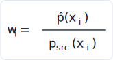
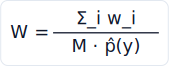
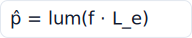
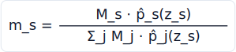
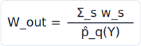
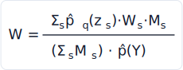

# Skinny — ReSTIR DI

This document is the implementation reference for **ReSTIR DI** (Reservoir-based
SpatioTemporal Importance Resampling for **Direct Illumination**) — skinny's
first non-identity *reuse* mode and the variance-reduction estimator for
primary-hit direct lighting. It covers the rendering stages, the governing
equations and the exact shader symbols that realize them, the design choices, the
GUI controls, and the source papers.

> Equations are shipped as **SVG images** (the repo's GitLab does not render
> KaTeX/`$$` math reliably). The LaTeX sources live in
> `docs/diagrams/restir/equations.json`; regenerate the SVGs with
> `render.cjs` (MathJax 3, publication quality — needs Node + `mathjax-full`) or
> the dependency-free `gen_svg_equations.cjs` fallback. Inline symbols (p̂, ΣM, …)
> are plain Unicode.

ReSTIR plugs into the **scene-sampling reuse seam** (the `ReusePlugin` socket
reserved by the sampling change). The seam and the wavefront execution backend it
rides on are documented in [Architecture.md](Architecture.md) (descriptor
binding map) and [Wavefront.md](Wavefront.md) (the bounce-0 reuse hook); the
generic path/BDPT integrators live in [README.md](../README.md). The
pre-implementation brainstorm and its decision history are archived at
`docs/superpowers/specs/2026-06-02-restir-di-design.md` — **this document
describes the shipped code**, which deviates from that brainstorm in a few places
(noted below).

## What ReSTIR DI is

Stock next-event estimation (NEE) draws a fresh light sample per pixel per frame
and immediately pays a shadow ray for it. When a scene has many emissive
triangles or a large area light, most of those samples are poor (wrong light,
occluded, grazing), so the direct-lighting estimate is noisy and shadow rays are
wasted on bad candidates.

ReSTIR DI instead keeps a **reservoir** per pixel — a single surviving light
sample distilled from a stream of candidates by *resampled importance sampling*
(RIS) — and then **reuses** that reservoir across screen-space neighbours (and,
optionally, across accumulation frames). Two ideas make it cheap and effective:

- **Deferred visibility.** Candidates are scored by an *unshadowed* target p̂;
  only the single survivor pays a shadow ray. A pixel evaluates dozens of
  candidates for the price of one shadow ray.
- **Spatial reuse.** A pixel borrows its neighbours' surviving samples, so the
  effective candidate count per pixel grows far beyond what it sampled itself —
  the variance reduction.

ReSTIR DI **converges to the same direct-lighting integral as stock NEE** (it is
unbiased in the default regime) while reaching a given noise level at a lower
sample count.

### Scope and limits

| Property | Value |
| --- | --- |
| Backend | **Wavefront only.** Megakernel and Metal fall back to identity (stock NEE) — `reuseMode` folds to 0 in `renderer._pack_uniforms`. |
| Vertices | **Primary hit only** (`depth == 0`). Secondary path vertices (`depth ≥ 1`) keep stock NEE. |
| Materials | **Flat / standard_surface / OpenPBR only.** `restirLoadLane` gates on `MATERIAL_TYPE_FLAT`; skin / MaterialX-graph / python-material lanes pass through to stock NEE. |
| Light types | Sphere + emissive-triangle + environment in the unified RIS; **directional (delta) lights are plain NEE** outside the RIS. |
| Default regime | **Spatial only** (unbiased GRIS). Temporal regimes are selectable but progressive-limited (see [Caveats](#caveats-and-limits)). |

## Stages of rendering

ReSTIR runs as a three-pass burst at **bounce 0**, scheduled by the wavefront
path pass's reuse hook (`vk_wavefront.WavefrontPathPass.record` → `RestirDiPass.
record_primary_direct`) *after* the primary intersect populates `wfHits[]` and
*before* the shade kernel runs. Because ReSTIR now owns primary direct, the shade
kernel's depth-0 direct terms are **gated off** (see [Canonical
integration](#canonical-integration)).


The three passes (`restir/restir_primary.slang`, dispatched in order with a
memory barrier between each by `RestirDiPass.record_primary_direct`):

1. **`restirFill`** — initial RIS. For each live flat primary-hit lane, stream
   M_light light-sampled + M_bsdf BSDF-sampled candidates through a reservoir
   using the *unshadowed* target p̂. Writes `reservoirA[i]` and the G-buffer
   record `{pos, normal}[i]`. No shadow rays.
2. **`restirSpatial`** — spatiotemporal merge. Combine the pixel's own reservoir
   with up to `spatialK` domain-checked screen neighbours (from `reservoirA`) and,
   if the temporal flag is set, last frame's reservoir (from `reservoirB`). The
   default is the **unbiased GRIS** combination; a **biased ΣM** toggle is the
   faster alternative. Writes `reservoirB[i]`.
3. **`restirResolve`** — shade. Read the merged `reservoirB[i]`, cast **one
   shadow ray** for the surviving sample, and add f·V·W (plus directional NEE)
   into the path-state radiance.

`reservoirB` **persists across accumulation frames**, so the next frame's
`restirSpatial` can read it as temporal history (M-capped). The reservoir buffers
are double-buffered (`A`/`B` ping-pong); the G-buffer backs the spatial-neighbour
domain check.

### Per-pixel state

```hlsl
// restir/reservoir.slang
struct LightSampleRef {       // unified over all RIS light types
    uint   packed;            // lightType:2 | lightId:30
    float2 uv;                // point-on-light param, or octahedral env direction
};
struct Reservoir {
    LightSampleRef y;         // surviving sample
    float wSum;               // sum of RIS weights seen
    float W;                  // contribution weight = wSum / (M * pHat(y))
    uint  M;                  // candidate count (capped for temporal reuse)
    float pHat;               // cached target pHat(y)
};
struct GBuf { float3 pos; float3 normal; };   // restir/restir_primary.slang
```

A `LightSampleRef` is a **reproducible, shading-point-independent** reference: for
sphere/triangle lights the `uv` maps to a fixed world point (recoverable even
from a BSDF ray hit via `sphereUVFromPoint`); for the environment the `uv` is the
octahedral-encoded direction (`octEncode`/`octDecode`). This independence is what
lets resolve and spatial/temporal reuse re-derive the *same* light at *any* pixel
— the **DI reconnection**.

## Equations

Notation: f is the BSDF response including the cosine term
(`mat.evaluate(wo, wi).response`); Le is the light's emitted radiance; V is binary
visibility; lum(·) is luminance. All directions are at the primary shading point.

### 1. Resampled importance sampling (RIS)

Candidates xᵢ are drawn from a source pdf p_src. Each carries a resampling weight
and a target value:



The reservoir keeps **one** survivor y, selected with probability proportional to
wᵢ (streaming weighted reservoir sampling). After the stream the **unbiased
contribution weight** is



and the estimate of the integral is f(y)·W — unbiased for any M whenever p̂ > 0
wherever the true integrand f ≠ 0. *(Talbot et al. 2005; Bitterli et al. 2020.)*

> **Implements:** `reservoirUpdate` (the `rand * wSum < w` survivor test) and
> `reservoirFinalize` (`W = wSum / (M·p̂)`) in `restir/reservoir.slang`.

### 2. The target function p̂ (unshadowed, unweighted)

skinny's RIS owns *all* of primary direct (canonical integration, Decision 5), so
the target is the unshadowed, **MIS-unweighted** light contribution:



Visibility V is deliberately **not** in p̂ — it is deferred to the single
resolve-time shadow ray. p̂ is a scalar (luminance) so the reservoir stores one
float; the resolve multiplies the cached RGB integrand f·Le by V·W.

> **Implements:** `restirEvalRef` in `restir/light_ris.slang`
> (`c.integrand = b.response * Le; c.pHat = lum(c.integrand)`).

### 3. The mixture source pdf (light + BSDF candidates)

`restirFill` mixes two candidate techniques — light sampling and BSDF sampling —
into one estimator. By the balance heuristic *(Veach 1997)* the correct source
pdf for a candidate direction ωᵢ is the **mixture pdf** over both techniques:

![p_mix(omega_i) = (M_light·p_light + M_bsdf·p_bsdf·[->sphere|env]) / (M_light + M_bsdf)](diagrams/restir/pmix.svg)

- p_light(ωᵢ) = p_light^Ω / n_tech — a single light technique is chosen uniformly
  among the n_tech active ones (sphere count + a triangle slot + an env slot), so
  its pdf is divided by n_tech.
- The area-light solid-angle pdf is the area pdf converted by the geometry term:
  p_light^Ω = d²·p_area / cosθ_light. For the environment,
  p_light^Ω = `envPdf(ωᵢ)` (the importance-sampling cell distribution).
- p_bsdf(ωᵢ) is the proposal-mixture pdf (`mixtureProposalPdf`), and it is only
  included for candidates the BSDF technique can actually hit — **sphere and env**
  (`isSE`). Emissive triangles are NEE-only in the stock renderer (no BSDF-tri MIS
  term), so they are sampled by the light technique only; the estimator stays
  unbiased (any unbiased estimator converges to the same integral).

Each candidate's RIS weight is then w = p̂ / p_mix.

> **Implements:** `_mixPdf` and the `w = c.pHat / src` lines in
> `restirFillReservoir` (`restir/light_ris.slang`). Every drawn candidate counts
> toward M, including invalid/occluded ones (which stream with w = 0).

### 4. Combining reservoirs (the merge)

Two reservoirs combine by treating one as a single *supercandidate*. Source
`src` merged into `dst` contributes


where p̂_dst is `src`'s surviving sample re-evaluated **in `dst`'s domain** (its
shading point + material). Combining reservoirs this way is the unbiased
multi-reservoir RIS combination *(Bitterli 2020, Alg. 4)*: each source contributes
its W·M·p̂, the survivor is chosen ∝ those weights, and finalize yields the
combined contribution weight over ΣM samples.

> **Implements:** `reservoirMerge` in `restir/reservoir.slang`. This is the
> building block; `restirSpatial` uses the explicit per-source form below so it
> can apply per-domain MIS weights.

### 5. Unbiased spatiotemporal combination (GRIS)

The naive ΣM merge over neighbours is biased: a sample that many neighbours could
have produced is over-counted, which on glossy surfaces lets spatial→temporal
feedback over-brighten the image (measured up to ~48% vs path tracing). The fix is
the **generalized balance heuristic** *(Lin et al. 2022, GRIS)*. Each source
sample z_s is combined with the MIS weight



where p̂_j(z_s) is z_s's target re-evaluated in **source j's own domain** (its
shading point + material, re-loaded from `wfHits[j]`). The per-source resampling
weight at the canonical pixel q is


the survivor Y is chosen ∝ w_s, and the output contribution weight is



where the m_s already normalize, so there is no 1/M and no 1/Z factor.

**Reconnection Jacobian.** Reusing a neighbour's sample at this pixel is a *shift
map*; GRIS weights it by the shift's Jacobian. For DI the shift reuses the **same
world light point** (the `uv` is shading-point-independent), so the shift is the
identity and **the Jacobian is 1**; the geometry/BSDF change between domains is
captured entirely by the per-domain p̂ re-evaluation.

> **Implements:** the unbiased branch of `restirSpatial` in
> `restir/restir_primary.slang` — the `D[a] += sM[j]*p` denominator loop (load
> each source domain once, evaluate every sample in it) and the
> `m_s = sM[a]*pOwn[a]/D[a]; w_s = m_s*pCanon[a]*sW[a]` combine loop.

### 6. Biased combination (ΣM toggle)

The `biased` toggle replaces GRIS with the simple ΣM combination *(Bitterli 2020,
Alg. 4)* — each source weighted by p̂_q(z_s)·W_s·M_s, normalized by ΣM:



It skips the O(K²) per-domain p̂ re-evaluation (the GRIS denominator), so it is
faster, but biased — discontinuity darkening on spatial-only, and over-brightening
with temporal on glossy via the feedback the m_s would have bounded.

> **Implements:** the `RESTIR_FLAG_BIASED` branch of `restirSpatial`.

### 7. Resolve and directional lights

Resolve casts one shadow ray for the survivor and adds the RGB estimate; the
cached unweighted integrand f·Le is multiplied by V·W:


Directional (delta) lights are handled separately by plain NEE **outside** the
RIS (no MIS, they cannot be BSDF-sampled):


> **Implements:** `restirResolveReservoir` (area: `visibleSegment`; env:
> `visibleDirectional`) and `restirDirectional` in `restir/light_ris.slang`,
> summed in `restirResolve`.

## Equation → implementation map

| Equation | Symbol | File |
| --- | --- | --- |
| RIS survivor `rand·wSum < w` | `reservoirUpdate` | `restir/reservoir.slang` |
| Contribution weight `W = wSum/(M·p̂)` | `reservoirFinalize` | `restir/reservoir.slang` |
| Supercandidate merge `w = p̂·W·M` | `reservoirMerge` | `restir/reservoir.slang` |
| Target `p̂ = lum(f·Le)` | `restirEvalRef` | `restir/light_ris.slang` |
| Mixture source pdf `p_mix` | `_mixPdf` | `restir/light_ris.slang` |
| Area→SA pdf `d²·p_area/cosθ` | `restirEvalRef` | `restir/light_ris.slang` |
| Initial RIS (light + BSDF candidates) | `restirFillReservoir` | `restir/light_ris.slang` |
| Resolve `f·V·W` | `restirResolveReservoir` | `restir/light_ris.slang` |
| Directional NEE (outside RIS) | `restirDirectional` | `restir/light_ris.slang` |
| Light-ref encode/recover | `octEncode`/`octDecode`, `sphereUVFromPoint` | `restir/light_ris.slang` |
| Fill pass (per lane) | `restirFill` | `restir/restir_primary.slang` |
| GRIS `m_s` + biased ΣM | `restirSpatial` | `restir/restir_primary.slang` |
| Resolve pass (shadow ray + add) | `restirResolve` | `restir/restir_primary.slang` |
| Lane setup / material gate | `restirLoadLane` | `restir/restir_primary.slang` |
| Depth-0 light-NEE gate | `reuseDirect` | `sampling/reuse.slang` |
| Depth-0 BSDF-sphere gate | `restirOwns` (`wf_shade_common.slang:126`) | `shaders/wavefront/wf_shade_common.slang` |
| Depth-0 env-miss gate | env-miss skip (`wavefront_path.slang:129`) | `shaders/wavefront/wavefront_path.slang` |
| GPU pass set + buffers | `RestirDiPass` | `vk_wavefront.py` |
| Host config + flags | `_restir_build_config` | `renderer.py` |
| Reuse selector plugin | `RestirDiReuse` | `sampling/reuse.py` |

## Design choices

Six decisions were locked during the brainstorm; the shipped code follows them
with the deviations noted.

1. **Regimes — nested, all selectable.** `spatial` (on/off) × `temporal` (off /
   progressive / reprojected). Spatial-only and progressive-temporal fit skinny's
   progressive accumulator with no new infrastructure; **reprojected temporal**
   needs motion vectors + a prev-frame G-buffer and is **deferred to a follow-on
   change** (reserved in the selector).
2. **Scope — primary-hit, screen-space.** Per-pixel reservoirs at the primary
   visible point (the main visual). Secondary vertices have no screen-space pixel,
   so indirect bounces keep stock NEE.
3. **Light domain — unified.** One reservoir resamples sphere + emissive-triangle
   + env; a sample is `(lightType, lightId, point-on-light)`. Directional lights
   are delta → plain NEE outside the RIS.
4. **Bias — unbiased default + biased toggle.** Default to the unbiased
   combination; expose `biased` as a faster toggle. Matches the renderer's other
   unbiasedness gates (furnace mode, the parity tests).
5. **Integration — canonical, RIS owns primary direct.** Candidate generation
   mixes light- and BSDF-sampled candidates; the path tracer skips its depth-0
   light/sphere/env direct terms (ReSTIR counted them). The proposal mixture still
   drives the bounce *direction* for indirect.
6. **Backend — wavefront-only.** Multi-pass reuse can't live in the megakernel;
   selecting ReSTIR + megakernel/Metal falls back to identity (capability gate,
   like wavefront-BDPT).

<a id="canonical-integration"></a>

### Canonical integration (RIS owns primary direct)

Because the RIS counts *all* of primary direct, the path tracer's own depth-0
direct terms must be suppressed to avoid double-counting:

- **Light-NEE half:** `reuseDirect` (`sampling/reuse.slang`) returns zero at
  `depth == 0` under `reuseMode == RESTIR_DI`.
- **BSDF-sampled sphere hit:** gated by `restirOwns` in `wf_shade_common.slang:126`
  (`reuseMode == 1 && depth == 0 && !transmitted`).
- **BSDF-sampled env miss:** the depth-0-spawned ray's env-miss direct term is
  skipped in `wavefront_path.slang:129`.

`depth ≥ 1` vertices are untouched (stock NEE + the proposal mixture). Identity
reuse (`reuse=none`) keeps the pre-ReSTIR behaviour exactly.

### Shipped deviations

- **Canonical integration (Decision 5) shipped fully.** The earlier merged
  starting point was a light-only RIS composing with shade's still-active BSDF
  half; it was replaced by the canonical form with the unweighted target and the
  mixture source pdf, and the depth-0 BSDF-sphere/env-miss terms gated off.
- **Unbiased = GRIS, not the bare 1/Z.** The brainstorm anticipated a 1/Z
  domain-count normalization; the implementation uses the stronger GRIS balance
  heuristic m_s (§5), which bounds the glossy spatial→temporal feedback the naive
  ΣM let explode. No fat G-buffer is needed — each source's material is re-loaded
  from `wfHits[j]`.
- **Default regime = Spatial only.** On the progressive accumulator, temporal
  reuse double-counts correlated history; spatial GRIS is the unbiased,
  variance-reducing default (see [Caveats](#caveats-and-limits)).
- **Env refs are octahedral.** Environment candidates store the direction
  octahedral-encoded in `LightSampleRef.uv`, so an env sample is as reproducible
  as an area-light point.
- **Separate RNG stream.** `restirFill` seeds its RNG from
  `pcgHash(rngState ^ 0x9e3779b9)` so it does not consume the shade kernel's
  cursor.

## GUI controls

ReSTIR's controls live in a **dedicated `ReSTIR` group**, defined once in the
shared control tree (`ui/build_app_ui.py`: `_classify` buckets
`reuse_index` + any `restir_*` path into the group) and inherited identically by
the windowed app, the Qt GUI, the web/Panel server, and the debug viewport. The
group is always present (it carries the `Reuse` enabler) and sits right after the
`Render` group. The seven tuning controls are only effective when `Reuse =
ReSTIR DI`.

| Control | Param path | Range / options | Maps to | Effect |
| --- | --- | --- | --- | --- |
| **Reuse** | `reuse_index` | None · ReSTIR DI | `fc.reuseMode` (0 / 1) | Selects identity vs ReSTIR. Triggers a wavefront pass rebuild. |
| **ReSTIR regime** | `restir_regime_index` | Spatial only · Spatial + Temporal · Temporal only | `flags` bit0/bit1 via `_RESTIR_REGIME_FLAGS = [0x1, 0x3, 0x2]` | Which reuse axes are active. Triggers a pass rebuild. |
| **ReSTIR combine** | `restir_biased` | Unbiased (GRIS) · Biased (ΣM) | `flags` OR 0x4 when biased | GRIS vs ΣM combination (§5 vs §6). |
| **ReSTIR M light** | `restir_m_light` | 1 – 64 | `rpc.mLight` (M_light) | Light-sampled candidates per pixel in fill. |
| **ReSTIR M bsdf** | `restir_m_bsdf` | 0 – 8 | `rpc.mBsdf` (M_bsdf) | BSDF-sampled candidates per pixel in fill. |
| **ReSTIR neighbours** | `restir_spatial_k` | 0 – 8 | `rpc.spatialK` | Spatial neighbours merged in `restirSpatial`. |
| **ReSTIR radius** | `restir_spatial_radius` | 1 – 64 | `rpc.spatialRadius` (screen px) | Neighbour search radius. |
| **ReSTIR M cap** | `restir_m_cap` | 1 – 64 | `rpc.mCap` (M_cap) | Temporal history cap (limits prev-frame M). |

The full push constant is `RestirPC` (36 B scalar:
`streamSize, flags, mLight, spatialK, spatialRadius, normalThresh, depthThresh,
mCap, mBsdf`), packed by `RestirDiPass.record_primary_direct`. The
domain-rejection thresholds `normalThresh` (0.9) and `depthThresh` (0.1) are
config defaults on `RestirDiReuse`, not GUI-exposed.

**Live vs rebuild.** The tuning controls (`mLight`, `mBsdf`, `spatialK`,
`spatialRadius`, `mCap`, `biased`) are push-constant only — the renderer refreshes
`RestirDiPass.config` from `_restir_build_config` each frame, so changes take
effect **without a pass rebuild**. The `Reuse` mode and the `regime` are part of
the pass-rebuild key (the seam's pass-structural contract). **Every** change —
mode, regime, or any tuning value — resets progressive accumulation (folded into
`_current_state_hash`), so the new configuration converges cleanly.

## Caveats and limits

- **Wavefront-only.** Megakernel and Metal silently fall back to identity (stock
  NEE); `reuseMode` folds to 0 in `_pack_uniforms` on those backends.
- **Flat materials only.** `restirLoadLane` accepts only `MATERIAL_TYPE_FLAT`
  primary hits; skin / MaterialX-graph / python-material lanes pass through
  `restirSpatial` untouched and shade with stock NEE.
- **Temporal on a progressive accumulator double-counts.** skinny accumulates by
  averaging frames; carrying a reservoir across frames feeds correlated history
  back in, so the bias grows with M_cap and shows on glossy surfaces. The
  "temporal beats spatial" property belongs to the real-time **reprojected**
  regime (the P3 follow-on), not the progressive accumulator. **Spatial-only
  (unbiased GRIS) is the default and the recommended regime.**
- **Reprojected temporal is reserved.** Selecting it falls back to a supported
  regime until the motion-vector subsystem lands.

## Verification

ReSTIR DI is validated against stock NEE as the reference:

- `tests/test_restir.py` — the RIS core (`reservoirUpdate`/`Finalize` selection ∝
  weight and W) unit-tested in isolation via the synthetic harness.
- `tests/test_restir_lights.py` — unified light-domain candidate generation.
- `tests/test_restir_render.py` — converges to the `reuse=none` reference on
  emissive / area-light scenes (the unbiased gate).
- `tests/test_restir_variance.py` + `assets/restir_variance_demo.usda` — variance
  reduction: ~30% lower RMSE than NEE at equal low sample count.

The unbiased spatial regime has been A/B-verified against megakernel path
tracing, BDPT, and wavefront NEE on `cornell_box_sphere`, `cornell_box_emissive`,
and `three_materials` (glossy) — all agree in converged radiance.

## References

1. **J. Talbot, D. Cline, P. Egbert.** *Importance Resampling for Global
   Illumination.* Eurographics Symposium on Rendering, 2005. — RIS, the
   per-candidate weight w_i = p̂/p_src and the contribution weight
   W = Σ_i w_i/(M·p̂) (§1).
2. **B. Bitterli, C. Wyman, M. Pharr, P. Shirley, A. Lefohn, W. Jarosz.**
   *Spatiotemporal Reservoir Resampling for Real-Time Ray Tracing with Dynamic
   Direct Lighting.* ACM TOG (SIGGRAPH) 39(4), 2020. — ReSTIR DI; streaming
   weighted reservoir sampling and the multi-reservoir RIS combination (Alg. 4)
   (§1, §4, §6).
3. **D. Lin, M. Kettunen, B. Bitterli, J. Pantaleoni, C. Wyman, C. Yuksel.**
   *Generalized Resampled Importance Sampling: Foundations of ReSTIR.* ACM TOG
   (SIGGRAPH) 41(4), 2022. — GRIS; the generalized balance-heuristic MIS weight
   m_s and the reconnection/shift Jacobian (here identity for DI) (§5).
4. **E. Veach.** *Robust Monte Carlo Methods for Light Transport Simulation.*
   PhD thesis, Stanford University, 1997. — multiple importance sampling and the
   balance heuristic backing the light + BSDF mixture source pdf (§3).
5. **C. Wyman, M. Kettunen, D. Lin, B. Bitterli, et al.** *A Gentle Introduction
   to ReSTIR: Path Reuse in Real-Time.* ACM SIGGRAPH Courses, 2023. — an
   approachable derivation of the above; recommended further reading.
