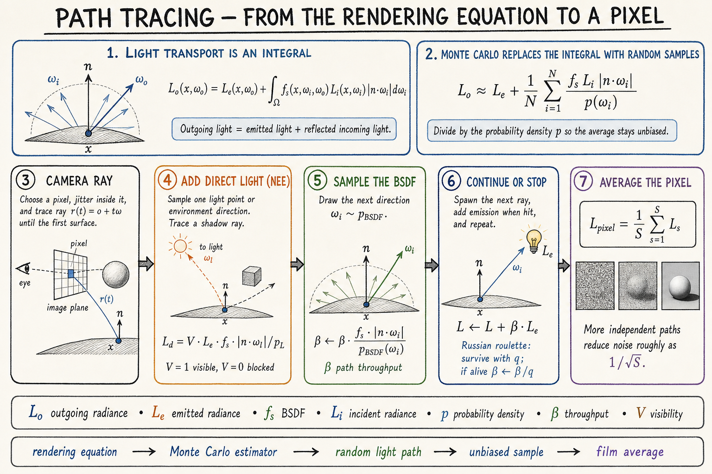
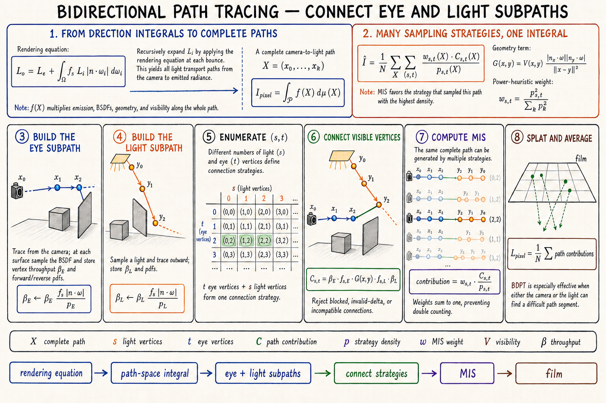
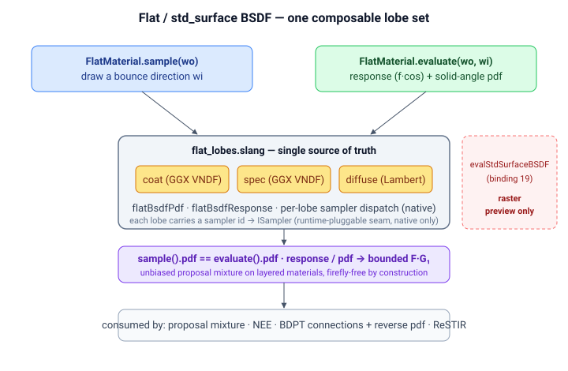

# Skinny — Shader Pipeline

This document covers the shader-side extension seams: the pluggable Slang
interfaces, how a material and an integrator are selected per pixel, how a
MaterialX nodegraph becomes a Slang module, environment importance sampling,
and the embedded Python→Slang code generator.

For the renderer overview see [Architecture.md](Architecture.md).

---

## Pluggable Interface Architecture

All interfaces live in `shaders/interfaces.slang`. Per-material furnace
probes use `effectiveFurnaceMode()` from `bindings.slang`. Dispatch
strategies are chosen to avoid existential warp serialisation on GPUs.

### ICamera

Ray generation is split out behind a tiny interface in `interfaces.slang`:

```
generateRay(fc, pixel, rng) → Ray
```

| Implementation | File | Notes |
|---|---|---|
| `PinholeCamera` | `cameras/pinhole.slang` | Standard projective ray gen |
| `ThickLensCamera` | `cameras/thick_lens.slang` | PBRT-v3 RealisticCamera port; per-pixel exit-pupil bounds packed by `lens_optics.py` |

### ISampler

```
sample(float3 wo, float2 uv) → float3
pdf(float3 wi, float3 wo)    → float
```

Tangent-space sampler (N = +Z). Callers transform world↔tangent. Sampler
state (roughness, g, etc.) is stored in struct fields. Generic parameter on
estimators — compile-time monomorphised, zero runtime cost.

| Implementation | File | Purpose |
|---|---|---|
| `GGXSampler` | `samplers/ggx.slang` | Microfacet specular importance sampling — GGX **visible** normals (VNDF, Heitz 2018/2023); weight reduces to F·G₁, killing the grazing-angle spec fireflies of classical D(H) sampling |
| `LambertSampler` | `samplers/lambert.slang` | Cosine-hemisphere diffuse sampling |
| `UniformSphereSampler` | `samplers/uniform_sphere.slang` | MIS companion sampler |
| `HenyeyGreensteinSampler` | `samplers/henyey_greenstein.slang` | Phase-function importance sampling |

MIS utilities in `samplers/mis_combine.slang`: `misPrimaryWeight<TA,TB>`,
`misCompanionWeight<TA,TB>` (power heuristic).

### IMaterial

```
sample(float3 wo, inout RNG rng)  → BSDFSample
evaluate(float3 wo, float3 wi)    → BSDFEval
```

All directions in tangent space (N=+Z). `BSDFSample` carries `wi`, `weight`
(BSDF×cos/pdf), `pdf`, `emission`, `valid`, and `transmitted` (refraction
flag). `BSDFEval` returns `response` (f×cos) and `pdf`. Tag-switch
monomorphisation in `evaluateBounce()` (`integrators/path.slang`). Never
used as existential — divergent material hits in a warp would serialise.

Skin uses its own 6-estimator chain and returns full radiance via
`BounceResult.fullRadiance`; `bsdfSample.valid = false` terminates bouncing.

| Implementation | File | Type Code |
|---|---|---|
| `SkinMaterial` | `materials/skin/skin_material.slang` | 0 (default) — self-integrating, returns full radiance |
| `FlatMaterial` | `materials/flat/flat_material.slang` | 1 — opacity/refraction, coat, spec/diff MIS, optional MaterialX graph eval |
| `DebugNormalMaterial` | `materials/debug_normal_material.slang` | 2 — normal visualisation |
| Python material | `mtlx/genslang/python_materials/*.py` → generated dispatch | 3 — SlangPile-authored `IMaterial`, id in bits 24–31, switch-dispatched by `vk_compute._emit_python_dispatcher` |
| Subsurface (volumetric) | `materials/subsurface/{subsurface_walk.slang, medium.slang}` | 4 — pbrt `subsurface`: dielectric boundary + homogeneous interior medium, self-integrating volumetric random walk (returns full radiance, like skin) |

Material type encoding in `materialTypes[id]` (binding 16):
- bits 0–7: type code (0 skin, 1 flat, 2 debug-normal, 3 python)
- bits 8–9: scatter mode for skin (bit 0 = BSSRDF, bit 1 = volume)
- bit 10: per-material furnace mode (energy-conservation probe)
- bits 16–23: MaterialX graph slot (`MATERIAL_GRAPH_SHIFT`; 0 = none)
- bits 24–31: Python-material id (`MATERIAL_PYMAT_SHIFT`; index into the
  `vk_compute._emit_python_dispatcher` switch, consulted only when
  type == python)

### ILight

```
samplePoint(float3 shadingPos, float2 u) → LightSample
pdfSolidAngle(float3 shadingPos, float3 direction) → float
```

`LightSample` carries: `point`, `normal`, `radiance`, `pdfArea`, `valid`.
Delta lights (directional) set `pdfArea = 0` as a sentinel — callers skip
geometry-term conversion.

| Implementation | File | Notes |
|---|---|---|
| `SphereLightImpl` | `lights/sphere_light.slang` | Uniform surface sample, ray-sphere for `pdfSolidAngle` |
| `EmissiveTriangleLightImpl` | `lights/emissive_triangle_light.slang` | Barycentric sample; **power-weighted** selection PDF `p_i = w_i / Σw` (`w_i = area × Rec.709-luminance(emission)`) drawn via the inline cumulative-power CDF (change `emissive-mesh-nee`) |
| `DirectionalLightImpl` | `lights/directional_light.slang` | Delta distribution adapter |

### IIntegrator

```
estimateRadiance(Ray ray, HitInfo firstHit, inout RNG rng) → float3
```

Four integrators are user-visible through `fc.integratorType`. Path and BDPT
directly implement `IIntegrator`; SPPM is a staged photon-mapping estimator, and
MLT wraps the BDPT target in persistent primary-sample-space Markov chains.

#### Path tracing



- **`PathTracer`** — 6-bounce loop with Russian roulette, cutout
  transparency traversal, per-bounce NEE via generic `allLightsNEE<TM>()`,
  and sphere-light MIS on BSDF-sampled rays. Material dispatch in
  `evaluateBounce()` returns `BounceResult` (direct light + full radiance
  + BSDF sample with world-space direction).
- **`BDPTIntegrator`** — bidirectional path tracer (Veach §10).
  4-vertex eye + light subpaths, connections that evaluate the real
  `standard_surface` BSDF (`FlatMaterial.evaluate`), environment
  importance sampling matched to the path tracer's env NEE, and
  light-tracer splatting (s=1) for caustics via atomic adds to
  `lightSplatBuffer` (binding 21, Q22.10 fixed-point). Eye-side emissive
  NEE (`connectT1`) selects the emissive triangle through the same
  **power-weighted** `sampleEmissiveTriangle` cumulative-power CDF as the
  path tracer's `nee.slang`, so the draw matches the `pSel`-based
  `pdfArea`; selecting uniformly while dividing by that pdf biased the
  indirect emissive *fill* dark on many-triangle meshes (change
  `bdpt-emissive-fill-gap`). Flat materials only; skin hits fall through
  to PathTracer.

#### Bidirectional path tracing



| Implementation | File | Mode |
|---|---|---|
| `PathTracer` | `integrators/path.slang` | `INTEGRATOR_PATH` (0) |
| `BDPTIntegrator` | `integrators/bdpt.slang` | `INTEGRATOR_BDPT` (1) |
| SPPM staged estimator | `integrators/wavefront_sppm.slang` | `INTEGRATOR_SPPM` (2), wavefront only — [PhotonMapping.md](PhotonMapping.md) |
| PSSMLT over BDPT | `wavefront/wavefront_mlt.slang` | `INTEGRATOR_MLT` (3), wavefront only — [MetropolisLightTransport.md](MetropolisLightTransport.md) |

### Adding a New Material (Two-File Add)

1. Create `shaders/materials/my_material.slang` —
   `struct MyMat : IMaterial { sample(), evaluate() }` + `loadMyMat(HitInfo)`.
2. In `integrators/path.slang` — add `import materials.my_material;` and a
   `case` in `evaluateBounce()`.
3. In `renderer.py` — add `MATERIAL_TYPE_MYMAT = N` constant + packing branch.

---

## Material & Integrator Pipeline

The skin material (`SkinMaterial`, type code 0) is self-integrating: a
six-estimator chain over a three-layer biological optics model. Its internals —
the layer model, the §1–§6 estimator order, volume transport, and the MaterialX
skin codegen — are documented in [SkinRendering.md](SkinRendering.md). The flat
material and the bidirectional integrator below are general-purpose.

### Flat Material BSDF (`materials/flat/flat_material.slang` + `flat_lobes.slang`)



Implements `IMaterial` — `sample()` (draw a bounce direction) and `evaluate()`
(response + solid-angle pdf, consumed by NEE, BDPT connections + reverse pdfs,
ReSTIR, and the directional-proposal mixture). Both walk **one** lobe set
(`{coat, spec, diffuse}`) over a single param source, so `sample().pdf ==
evaluate().pdf` structurally and `evaluate().response / evaluate().pdf` reduces to
the bounded native per-lobe weight (`F·G₁` for the GGX lobes, the diffuse albedo
term for Lambert). This makes one canonical BSDF for the path tracer **and** BDPT
in **both** megakernel and wavefront modes. The lobe model lives in
`flat_lobes.slang` (`flatBsdfPdf`, `flatBsdfResponse`, the per-lobe sampler
dispatch); `flat_material.slang` assembles it. BSDF layers:

- Opacity / refraction (Fresnel-weighted reflect/refract split; delta lobe).
  Cutout vs alpha-blend opacity are split: cutout discards below
  `opacityThreshold`, alpha-blend attenuates — matching UsdPreviewSurface
  semantics. The refracted (delta-transmission) branch tints throughput by
  **`transmissionColor`** (colored smooth glass) rather than the base albedo;
  it stays a delta event (`pdf = 0`), so there is no MIS/Jacobian change
- Clear coat (GGX VNDF, coat-color tinting). The coat lobe-selection
  probability `pCoat = coat · fresnelDielectric(NdotV, 1/coatIOR)` takes the
  **entering** relative index (the view ray meets the coat from air), matching
  the opacity/refraction branch (`entering ? 1/ior : ior`) and the subsurface
  boundary. Passing `coatIOR` raw is the coat→air direction and triggers
  spurious total internal reflection past ~42° from normal — `pCoat` saturates
  to 1 and zeroes the base lobes, cratering a coated diffuse to a dark region
  (fixed in `fix-flat-coat-fresnel-eta`)
- Specular / diffuse MIS split (Schlick F0, luminance-weighted probability) —
  GGX specular uses VNDF sampling (`samplers/ggx.slang`), diffuse is Oren-Nayar
  (Lambert when `diffuseRoughness = 0`). The GGX spec response is multiplied by
  **`specularColor`** (a response-only tint; pdf unchanged, white ⇒ no change),
  and the diffuse lobe scales its Lambert response by an Oren-Nayar factor
  (`orenNayarFactor` in `flat_lobes.slang`) driven by **`diffuseRoughness`**.
  The Oren-Nayar term modifies the *response only* — sampling stays cosine, so
  the diffuse pdf (and hence `sample().pdf == evaluate().pdf`) is unchanged.
  These three `standard_surface` inputs were previously dead; consuming them
  fills the existing `{coat, spec, diffuse, delta-transmission}` lobe set
  **without** adding a lobe and **without** calling `evalStdSurfaceBSDF` (still
  preview-only). They are packed into `FlatMaterialParams` (binding 13) with
  back-compat fallbacks in `pack_flat_material` — `transmission_color ←
  diffuseColor`, `specular_color ← white`, `diffuse_roughness ← 0` — so an
  absent input reproduces the prior behavior exactly (pbrt parity corpus and
  existing UsdPreviewSurface renders are byte-unchanged). The flat-bsdf-lobes
  invariants (single pdf, bounded weight, no clamp, unbiased mixture) hold by
  construction since the changes are weight/response-only
- **Per-lobe runtime-pluggable sampler seam** — each lobe resolves a sampler id
  to a draw/density strategy, defaulting to native (2023 spherical-cap VNDF for
  coat/spec, cosine for diffuse). The host registry (`sampling/lobe_samplers.py`)
  also ships the Heitz-2018 basis-form VNDF (coat/spec — a different warp of the
  *same* GGX visible-normal distribution, so its pdf is shared and parity is
  structural) and uniform-hemisphere (diffuse). `sample()` and `evaluate()` read
  the same per-lobe id from `fc.flatLobeSamplers`, so pdf agreement — hence
  unbiasedness and the bounded `F·G₁` weight — holds for *any* registered
  strategy; only `flatLobeSamplers`' diffuse byte changes a pdf (cosine vs
  uniform). Selectable per lobe via `--lobe-samplers` / the GUI. Adding a strategy
  is a dispatch case in `flat_lobes.slang` + a registry entry — `sample()` /
  `evaluate()` stay untouched
- Cutout alpha masking via `isCutoutTransparent()` (in `flat_shading.slang`)
- **UsdPreviewSurface textures** — per-input channel selection (`channelMask`),
  normal-map `scale`/`bias` (`normalScale`/`normalBias`, for OpenGL vs DirectX
  Y convention), and wrap modes flow from each material's `TextureBinding`
  (binding 14 bindless textures)
- **MaterialX graph evaluation** when `materialTypes[id]` packs a graph
  slot — `evalSceneGraphBaseColor(materialId, hit, ...)` (generated module)
  drives the lobe model's albedo before the BSDF math runs

The full MaterialX `std_surface` closure (`evalStdSurfaceBSDF`, binding-19
`StdSurfaceParams`) is **no longer** used by the path-traced / BDPT estimator — it
is retained only for the raster `preview_pass`. Unifying `evaluate()` onto the
same lobe model `sample()` draws from removed the proposal-mixture bias on layered
coat+metal materials (brass under the BSDF+Env / Env presets).

### Python Material (`materials` type code 3)

SlangPile-authored materials (`mtlx/genslang/python_materials/*.py`) compile to
`IMaterial` structs. Their per-material id is packed into bits 24–31 of
`materialTypes[id]`; `vk_compute._emit_python_dispatcher` generates a
switch that routes `pythonMaterialId(matId)` to the right struct. Edited live
through the Qt material editor.

### Bidirectional Path Tracer (`integrators/bdpt.slang`)

Veach §10 BDPT with V1 simplifications for shader compile time:

- **Subpaths**: eye walk + light walk, each capped at 4 vertices
- **Connections**: (s ≥ 1, t ≥ 1) evaluate the real `standard_surface`
  BSDF via `FlatMaterial.evaluate()` (not the earlier Lambertian f ≈
  albedo/π approximation); `FlatMaterial.sample()` drives walk bounces
- **Environment**: env-miss and s=0 contributions use the same
  importance-sampled environment distribution + MIS as the path tracer,
  so BDPT and path-traced IBL converge to the same image
- **Light tracer** (s = 1): non-delta light vertices projected onto camera,
  atomic-added to `lightSplatBuffer` (binding 21, Q22.10 fixed-point per
  R/G/B channel). `main_pass.slang` composites the running mean after
  accumulation
- **Scope**: flat-material first-hit only; skin/debug hits fall through to
  PathTracer
- **MIS**: balance heuristic over all (s, t) strategies per path length;
  `convertSAtoArea()` handles geometry-term conversion

---

## MaterialX Nodegraph Compute Pipeline

> **Build prerequisite:** the Slang generator (`PyMaterialXGenSlang`) is **not**
> in the PyPI MaterialX wheel — you must build MaterialX from source with
> `-DMATERIALX_BUILD_PYTHON=ON -DMATERIALX_BUILD_GEN_SLANG=ON` and install the
> resulting `python/` tree into your venv. The whole pipeline below depends on
> it; see the *MaterialX from source* section in `README.md` for the full
> recipe.

Arbitrary MaterialX nodegraphs (e.g. marble, wood, brass — see
`assets/three_materials_demo.usda`) are compiled to per-material Slang
modules at scene-load time and again whenever a graph signature changes.


Details: filename inputs are replaced with bindless slot indices via `TexturePool`
(binding 14); `evalSceneGraph_<hash>(hit, params)` is switch-dispatched by
`generated_materials.slang`; the SPV cache key is `source hash + entry point`
(≤32 entries); the texture pool is repopulated after each rebuild.

Key invariants:

- **`mtlx_gen_shim.slang`** wraps `SamplerTexture2D` so generated modules
  see `Texture2D + SamplerState`-style methods backed by binding-14
  bindless lookups. Sentinel slot `0xFFFFFFFFu` returns transparent black
  to avoid sampling unbound descriptors.
- **`SampleLevel` only** in generated modules — compute pipelines have no
  derivatives.
- **Slang fallback** on graph compile failure preserves the flat
  base_color so the scene still renders; an infinite slangc retry is
  guarded by skipping rebuilds for known-broken graph signatures.
- **`makeBSDF` + dual-author overrides**: `standard_surface` parameters
  authored both as nodes and as direct inputs are merged so graph-uniform
  sliders in the sidebar drive both code paths.
- **Vertex-input (`vd.*`) rewrite**: `MaterialXGenSlang` reads geometry from a
  `vd` vertex-data struct that the per-material fragment does not have, so
  `_emit_graph_fragment` rewrites each `vd.*` reference to the fragment's
  parameters: `P_in` (position), `N_in` (normal), `T_in` (tangent), and the
  default UV set → `UV_in`. The default UV set appears in two forms — the
  explicit `<geompropvalue geomprop="UVMap">` (`vd.i_geomprop_UVMap`) and the
  default `<texcoord>` (`vd.texcoord_0`, emitted when an `<image>` has no
  explicit texcoord input) — both map to `UV_in`. Any `vd.*` left unhandled
  (secondary UV sets, vertex colors) makes the emitter return no fragment so the
  material falls back to the flat / std_surface path, rather than emitting a
  module with an undefined identifier that aborts compilation.

`MaterialLibrary` (`materialx_runtime.py`) owns the document, the
`MaterialXGenSlang` shadergen instance, the per-material reflection of
the uniform block, and the `pack_material_values()` byte serialiser.

---

## Environment Importance Sampling (`environment.slang`)

A 2D piecewise-constant distribution over the equirect environment map drives
next-event estimation toward bright sky/sun directions instead of relying on a
BSDF ray happening to land on them — the fix for specular environment
fireflies. The distribution is built CPU-side in
`environment.build_env_distribution()` (sin θ-weighted luminance) and uploaded
as **one** combined CDF buffer `envDistCdf` at binding 31 (change
`combine-graph-param-buffers` — folding the former 31/32 pair frees a Metal
buffer slot for the neural + online-training wavefront build):

- elements `[0, ENV_H+1)` — row marginal CDF (`ENV_H + 1` floats)
- elements `[ENV_COND_CDF_BASE, …)` — per-row conditional CDF
  (`H × (W + 1)` floats), where `ENV_COND_CDF_BASE = ENV_H + 1`

`sampleEnvDir(u, intensity)` importance-samples a direction + solid-angle PDF;
`envPdf(dir)` returns the PDF of an arbitrary direction so BSDF-sampled
env-miss hits can be MIS-weighted against env NEE. `ENV_DIST_W = 1024`,
`ENV_DIST_H = 512` must match `ENV_WIDTH`/`ENV_HEIGHT` in `environment.py`.
Both the path tracer and BDPT consume this distribution so their IBL
converges to the same image.

---

## SlangPile — Embedded Python→Slang Codegen

Located in `src/skinny/slangpile/`. Python functions decorated with `@sp.shader`
are transpiled to Slang source code. Used for rapid material prototyping — not
a build-time requirement (generated `.slang` files are checked into git).

### Modules

| File | Purpose |
|------|---------|
| `api.py` | `@shader`, `extern()`, `compile_module()`, `build_module()`, `load_module()` |
| `types.py` | `SlangType` hierarchy — scalars, vectors (float2/3/4), matrices |
| `registry.py` | Global shader/extern function registries |
| `runtime.py` | `SlangPyModule`, `RuntimeConfig`, `call_shader()` |
| `compiler/module.py` | AST-walking transpiler: `ModuleCompiler` + `FunctionEmitter` |
| `diagnostics.py` | `Diagnostic`, `SlangPileError` |
| `verification.py` | `slangc` invocation wrapper for syntax checking |
| `cli.py` | CLI: `build`, `check`, `verify` subcommands |

### Codegen Hook

`ComputePipeline._run_codegen()` (in `vk_compute.py`) runs before every
`_compile_slang()`. Walks `mtlx/genslang/python_materials/*.py`, calls
`build_module()`, writes to `mtlx/genslang/generated_*.slang` plus a
`slangpile_manifest.json`. Failures are non-fatal (debug log only).

---
