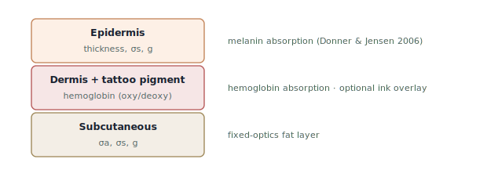
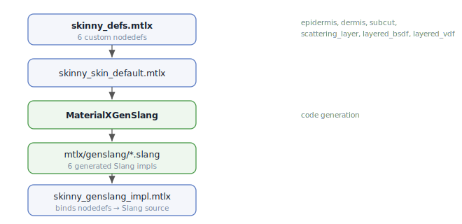

# Skinny — Skin Rendering

Skinny began as a human-skin rendering testbed and retains first-class skin
support. This document collects the skin-specific pieces of the renderer: the
three-layer biological optics model, the custom MaterialX skin nodedefs and
their Slang code generation, the six-estimator skin orchestrator, volume
transport through the layered medium, the head geometry that skin is shaded on,
and the related assets, shaders, and references.

The generic pipeline (arbitrary MaterialX nodegraphs, flat/standard_surface
materials, path/BDPT integrators, cameras, backends, web mode) is documented in
[README.md](../README.md) and [Architecture.md](Architecture.md).

## Features

- **Three-layer skin optics** — epidermis (melanin), dermis (hemoglobin + ink),
  subcutaneous fat, each with independent absorption, scattering, thickness, and
  anisotropy
- **MaterialX skin material pipeline** — custom `ND_skinny_skin_*` layer nodedefs
  plus a `ND_skinny_layered_skin_stack` combiner, code-generated to Slang via
  `MaterialXGenSlang`
- **Scattering modes** — BSSRDF + Volume, BSSRDF only, Volume only, or Off,
  selectable per scene
- **Fitzpatrick I–VI presets** — male/female variants covering the clinical
  skin-colour axis
- **Detail layer** — statistical pores and vellus hair sheen
- **Tattoo support** — alpha-driven ink density in the dermis layer

## Rendering Modes — Scattering

| Mode | Description |
|------|-------------|
| BSSRDF + Volume | Both subsurface estimators active |
| BSSRDF only | Smooth layered diffuse response |
| Volume only | Delta-tracked transport through layered medium |
| Off | Surface-only shading |

## MaterialX Skin Model

Skinny defines custom MaterialX nodedefs in `src/skinny/mtlx/`:

### Layer nodedefs (each produces a `scatteringlayer`)

- **`ND_skinny_skin_epidermis`** — melanin absorption + scattering
- **`ND_skinny_skin_dermis`** — hemoglobin + blood oxygenation + optional ink
- **`ND_skinny_skin_subcut`** — fixed-physics fat layer
- **`ND_skinny_scattering_layer`** — generic escape hatch for non-skin media

### Stack nodedef

- **`ND_skinny_layered_skin_stack`** — combines three layers into
  `surfaceshader` + `volumeshader` outputs with GGX specular, detail
  (pores/hair), and per-layer volume transport

### Slang implementations

Function-form Slang implementations live in `src/skinny/mtlx/genslang/` and are
referenced by `<implementation target="genslang">` tags in the nodedef files.

## Skin Material Pipeline

### Three-Layer Biological Model (`materials/skin/skin_bssrdf.slang`)

`SkinLayerStack` (3 × `SkinLayer`) built from `MtlxSkinParams` (164 bytes, 27
fields). Each layer has: σa, σs, thickness, g (anisotropy), IOR.

Key functions:
- `melaninAbsorption(melanin)` — wavelength-dependent absorption
- `hemoglobinAbsorption(hemoglobin, oxygenation)` — oxy/deoxy spectral mix
- `evaluateSubsurfaceScattering()` — Christensen-Burley diffusion BSSRDF
- `evaluateSkinSpecular()` — GGX specular (VNDF visible-normal sampling,
  `samplers/ggx.slang`) with Schlick fresnel

### Skin Material Orchestrator (`materials/skin/skin_material.slang`)

`SkinMaterial` is material type code 0 (the default). Unlike the flat
`IMaterial` implementations, it is self-integrating: it returns full radiance
via `BounceResult.fullRadiance`, and `bsdfSample.valid = false` terminates
bouncing. It chains 6 estimator terms in fixed RNG order (skin estimators §1–§6
are called in fixed sequence so RNG state stays pixel-identical across
refactors):

| Term | Estimator | File |
|------|-----------|------|
| §1 | Direct + area + emissive lights | `materials/skin/skin_direct.slang` |
| §2 | IBL specular (GGX sampling) | `materials/skin/skin_ibl_specular.slang` |
| §3 | IBL diffuse via BSSRDF | `materials/skin/skin_ibl_diffuse.slang` |
| §4 | Volume march (delta tracking) | `materials/skin/skin_volume.slang` |
| §5 | Thin-geometry translucency | `materials/skin/skin_transmission.slang` |
| §6 | Vellus hair sheen | `materials/skin/skin_hair_sheen.slang` |

`buildSkinShading()` (in `materials/skin/skin_shading.slang`) handles detail
maps (normal, roughness, displacement from bindings 9–11), tattoo ink
(binding 8), and pore perturbation (Worley noise from `detail.slang`).

The IBL estimators (§2/§3) draw environment directions from the shared
environment importance-sampling distribution (sin θ-weighted equirect CDFs,
bindings 31/32) with MIS, so bright sky/sun directions are found directly
rather than via chance BSDF bounces — see *Environment Importance Sampling* in
[Architecture.md](Architecture.md).

## Volume Rendering (`volume_render.slang`)

Delta-tracking (Woodcock tracking) through heterogeneous skin:

- `layerAtDepth(depth, stack)` — depth-stratified σa/σs/g lookup
- Henyey-Greenstein phase function + importance sampler
- `MAX_VOLUME_STEPS = 128`, `VOLUME_DEFAULT_BOUNCES = 8`
- `mmPerUnit` converts between mm-valued optical coefficients and world-unit
  ray distances (FrameConstants offset +156)

## MaterialX Skin Integration

`MaterialLibrary` (`materialx_runtime.py`):
- Loads stdlib + skinny custom libraries
- Runs `MaterialXGenSlang` to produce Slang source from material graph
- Reflects uniform block → `MtlxSkinParams` struct (164 B, 27 fields)
- `pack_material_values()` serialises param overrides to GPU-ready bytes
- Caches `CompiledMaterial` so `generate_for_compute` reuses the last
  compile when uniforms change without graph topology changes

Generated genslang files:
- `skinny_skin_epidermis_genslang.slang`
- `skinny_skin_dermis_genslang.slang`
- `skinny_skin_subcut_genslang.slang`
- `skinny_scattering_layer_genslang.slang`
- `skinny_skin_layered_bsdf_genslang.slang`
- `skinny_skin_layered_vdf_genslang.slang`

## Head Geometry

Skin is shaded on a head surface, supplied either by the built-in analytic SDF
head or by an imported mesh.

### SDF Head (`sdf_head.slang`)

Loomis-proportioned head from SDF primitives (sphere, ellipsoid, capsule,
round box) combined with smooth boolean operators. Sphere-traced with
gradient-based normals. Approximate bounds: x ∈ [-0.85, +0.85],
y ∈ [-0.97, +1.05], z ∈ [-0.90, +1.00].

### Mesh Head (`mesh_head.slang`)

Two-level acceleration structure:
- **TLAS**: loop over `Instance` records (144 B each: two 4×4 matrices +
  BLAS offsets + materialId)
- **BLAS**: SAH BVH per mesh, `BVH_LEAF_SIZE = 4` triangles per leaf
- **MeshVertex**: 32 B (float3 pos + u + float3 nrm + v)
- **BvhNode**: 32 B (AABB + left/count + right/first)
- Ray-triangle: Möller-Trumbore. Ray-AABB: slab test.

`traceScene()` (`scene_trace.slang`) dispatches to `marchHeadMesh()` (mesh BVH
traversal) or `marchHead()` (SDF sphere tracing), or a unit sphere in furnace
mode.

### Head Models (asset discovery)

The analytic fallback is the SDF head above. Additional mesh heads are
discovered from `heads/`:

- Each subdirectory containing an `.obj` becomes one model
- Loose top-level `.obj` files are also loaded
- Texture maps are matched by filename keyword:
  `normal`/`nrm`/`nor`, `rough`/`roughness`, `displacement`/`disp`/`height`/`bump`

Displacement can be baked into the mesh after midpoint subdivision.

## Tattoos (asset)

Tattoo images in `tattoos/`. Alpha drives ink density; RGB drives pigment
colour contribution in the dermis.

## Skin Shaders

| File | Purpose |
|------|---------|
| `volume_render.slang` | Delta-tracked volume transport through layered medium |
| `mesh_head.slang` | BVH traversal and ray/triangle intersection |
| `sdf_head.slang` | Analytic SDF head |
| `materials/skin/skin_material.slang` | Skin shading entry point (specular + BSSRDF + volume dispatch) |
| `materials/skin/skin_bssrdf.slang` | Layered skin optics, BSSRDF, GGX specular |
| `materials/skin/skin_shading.slang` | Skin data loading, detail maps, tattoo |
| `materials/skin/skin_direct.slang` | §1 direct + area + emissive light estimator |
| `materials/skin/skin_ibl_specular.slang` | §2 IBL specular estimator |
| `materials/skin/skin_ibl_diffuse.slang` | §3 IBL diffuse estimator |
| `materials/skin/skin_volume.slang` | §4 volume march estimator |
| `materials/skin/skin_transmission.slang` | §5 thin-geometry translucency |
| `materials/skin/skin_hair_sheen.slang` | §6 vellus hair sheen |
| `materials/skin/detail.slang` | Statistical pores and vellus hair sheen helpers |

## Papers and References

| Area | Files | Reference |
|------|-------|-----------|
| Subsurface transport | `materials/skin/skin_bssrdf.slang` | Jensen, Marschner, Levoy, Hanrahan, "A Practical Model for Subsurface Light Transport", SIGGRAPH 2001 |
| Quantized diffusion | `materials/skin/skin_bssrdf.slang` | d'Eon and Irving, "A Quantized-Diffusion Model for Rendering Translucent Materials", SIGGRAPH/TOG 2011 |
| Normalized diffusion | `materials/skin/skin_bssrdf.slang` | Christensen and Burley, "Approximate Reflectance Profiles for Efficient Subsurface Scattering", Disney/SIGGRAPH 2015 |
| Human skin optics | `materials/skin/skin_bssrdf.slang`, `presets.py` | Donner and Jensen, "A Spectral BSSRDF for Shading Human Skin", EGSR 2006 |
| Real-time skin pipeline | `renderer.py`, `mesh_head.slang`, `sdf_head.slang` | d'Eon and Luebke, "Advanced Techniques for Realistic Real-Time Skin Rendering", GPU Gems 3 Ch. 14, 2007 |
| Henyey-Greenstein phase | `volume_render.slang` | Henyey and Greenstein, "Diffuse Radiation in the Galaxy", 1941 |
| Delta/Woodcock tracking | `volume_render.slang` | Woodcock et al., "Techniques Used in the GEM Code for Monte Carlo Neutronics Calculations", 1965 |
| Ray/triangle intersection | `mesh_head.slang` | Moeller and Trumbore, "Fast, Minimum Storage Ray/Triangle Intersection", 1997 |
