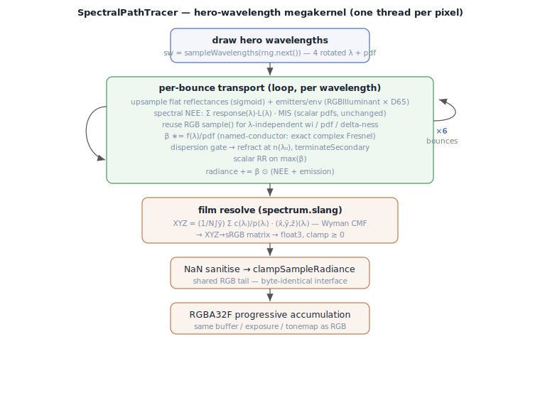
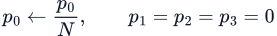
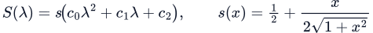
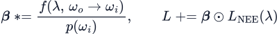
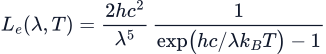
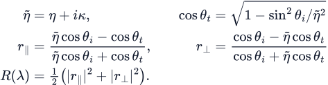
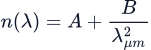
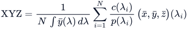
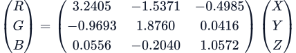

# Skinny — Spectral Rendering

This document is the implementation reference for skinny's **hero-wavelength
spectral** path (change `spectral-rendering`, activated with `--spectral`). It
covers the estimator, the RGB→spectrum upsampling model, the exact spectral
sources (blackbody, illuminant SPD, conductor Fresnel, glass dispersion), and the
film resolve back to linear sRGB, with the governing equations and the exact
shader/numpy symbols that realize them.

> **State.** `skinny.spectral_capability.SPECTRAL_IMPLEMENTED` is `True`: an
> in-envelope `--spectral` run is accepted on every front-end and
> `parity.combo_is_valid` admits it into the rendered set; out-of-envelope combos
> are still refused at startup (never silently rendered as RGB). The megakernel
> path/BDPT transport is GPU-validated; the **wavefront** transport for all three
> integrators (change `spectral-wavefront`) is wired + CPU-verified + merged, and
> its **GPU self-consistency + prism/pbrt-truth gates are now measured on Metal**
> across the confirming-suite spectral scenes (change spectral-wavefront
> GPU-validation): the spectral matrix gate passes for the emissive / caustic /
> BK7-dispersion-prism / OpenPBR gold·copper·glass·plastic discriminators, with
> the per-combo spectral pbrt-truth `baselines` and the spectral wave↔mega
> self-consistency floor (`spectral_self_consistency`) recorded harness-first from
> the GPU measurement. Still pending: the wavefront **white-furnace** spectral
> closure gate, the `SPPM_FLUX_FIXED_SCALE` numpy re-measure, and the full-corpus
> (non-suite) spectral sweep. See the
> [README compatibility matrix](../README.md) and
> [CLAUDE.md](../CLAUDE.md) for the current state and scope guards.

> Equations are shipped as **SVG images** (the repo's GitLab does not render
> KaTeX/`$$` math reliably). The LaTeX sources live in
> `docs/diagrams/spectral/equations.json`; regenerate the SVGs with
> `node docs/diagrams/spectral/render.cjs docs/diagrams/spectral/equations.json
> docs/diagrams/spectral` (MathJax 3, publication quality — needs Node +
> `mathjax-full`). Inline symbols (λ, p̂, ȳ, σ_t) are plain Unicode.

Everything here mirrors the checked-in **numpy reference** — the GPU kernel is
validated GPU≡numpy in `tests/kernels/test_spectrum_kernels.py`:

| Layer | File |
| --- | --- |
| GPU spectral core | `src/skinny/shaders/spectrum.slang` |
| GPU spectral integrator | `src/skinny/shaders/integrators/path_spectral.slang` |
| numpy estimator mirror | `src/skinny/pbrt/spectral.py` |
| vendored pbrt tables + upsampling | `src/skinny/pbrt/data/spectral_tables.py` |
| CMF / Planck / sRGB primitives | `src/skinny/pbrt/spectra.py` |

The descriptor bindings (45–47 `spectralScale`/`spectralData`/`spectralD65`, plus
48 `spectralMetals`), the spectral compile variant, and the shader module map are
documented in [Architecture.md § Descriptor Binding Map](Architecture.md#descriptor-binding-map)
and [Architecture.md § Modules](Architecture.md#modules) — this document does not
duplicate them.

## What hero-wavelength spectral is

A path tracer transports **radiance**. In an RGB renderer that radiance is a
3-vector and every product (BSDF × light, throughput × environment) is a
component-wise RGB multiply — which is only an approximation of the true spectral
product ∫ f(λ)·L(λ) dλ. It cannot express **metamerism** (two spectra that match
under one light and diverge under another), **dispersion** (a wavelength-dependent
index of refraction), or the exact **complex-index Fresnel** of a real metal.

skinny's spectral path replaces the RGB 3-vector with a small bundle of
**monochromatic samples**. At the start of each camera path it draws **N = 4**
wavelengths (a *hero* wavelength plus 3 rotated companions), transports each one
monochromatically through the whole path, and Monte-Carlo integrates the result
against the CIE colour-matching functions at the film. RGB inputs (albedos,
emitters, the environment map) are **upsampled** to plausible reflectance /
illuminant spectra on the fly, and named metals / glasses use their real spectral
data. The result is energy-consistent with RGB on neutral scenes but reproduces
metameric colour bleed, dispersion, and exact conductor tint.

This is the *hero-wavelength* method of Wilkie et al. (2014) over pbrt's
wavelength machinery (Pharr, Jakob & Humphreys, PBR 4th ed., ch. 4): one sample
`u` seeds all N wavelengths, so a single stratified draw covers the visible band
and the companions share the same path geometry.

### Scope and limits (v1)

| Property | Value |
| --- | --- |
| Integrator | **Path, BDPT, and SPPM.** Path/BDPT run under both execution modes; SPPM is wavefront-only (no megakernel photon pass). See [Bidirectional transport](#bidirectional-transport-bdpt) and [Wavefront spectral transport](#wavefront-spectral-transport). |
| Execution mode | **Megakernel and wavefront.** Wavefront carries hero-λ transport for all three integrators (change `spectral-wavefront`, wired + CPU-verified + merged); spectral environment-proposal convergence is GPU-gated in both modes. |
| Materials | **Flat only** (`UsdPreviewSurface` / `standard_surface` / `OpenPBR` / Python-material flats). Skin / subsurface / heterogeneous-volume scenes are refused at startup; a non-flat hit inside the loop terminates the path rather than mis-shade. |
| Proposals / reuse | Spectral **path** supports analytic `bsdf`, `bsdf,env`, and `env` proposals in megakernel + wavefront. BDPT/SPPM keep native sampling. ReSTIR reuse and the neural proposal are refused. |
| Wavelengths | **4** hero-rotated, drawn from pbrt's visible-λ importance pdf. |
| Film | CIE resolve (Wyman CMF) into the **existing RGBA32F accumulation** — exposure / tonemap / readback are untouched. |
| Backends | Vulkan and native Metal, at parity (compile-time `-DSKINNY_SPECTRAL` on both). |

The spectral transport is a **deliberately separate integrator**
(`SpectralPathTracer`), not a widening of the shared RGB carriers: turning
`BSDFSample` / `LightSample` / `BounceResult` into `float4` would break every
`float3` assignment across the flat / skin / python / BDPT / record tree. Instead
`SpectralPathTracer` carries a `float4` `Spectrum` throughput/radiance itself and
reuses the shared directional-proposal seam for wavelength-independent geometry
(the sampled direction `wi`, its solid-angle mixture pdf, and delta-ness),
recolouring the chosen direction per wavelength. The RGB build never imports
`spectrum.slang` or `path_spectral.slang`, so its SPIR-V is **byte-unchanged**.

## The hero-wavelength estimator

### 1. Sampling the wavelengths

A single uniform sample `u ∈ [0,1)` is warped to a wavelength by pbrt's
`SampleVisibleWavelengths`, whose target density concentrates samples around the
luminance peak (~538 nm) where the eye is most sensitive:

with the matching importance pdf (zero outside the visible band):

![p(lambda) = 0.0039398042 / cosh^2(0.0072(lambda − 538)), lambda in [360,830] nm](diagrams/spectral/lambda-pdf.svg)

The **hero rotation** draws all N wavelengths from the *same* `u` by offsetting it
by `i/N` and wrapping into `[0,1)` — one stratified draw covers the whole band and
every companion shares the path's geometry:

> **Implements:** `sampleVisibleWavelength` / `visibleWavelengthPdf` /
> `sampleWavelengths` in `spectrum.slang`; `sample_visible_wavelength` /
> `visible_wavelength_pdf` / `sample_wavelengths` in `spectral.py`. The hero draw is
> the **first** consumption of the pixel RNG in `SpectralPathTracer.estimateRadiance`
> (`sw = sampleWavelengths(rng.next())`) — the RGB build has no such draw, so its
> RNG stream and SPIR-V are unchanged.

| symbol | code | meaning |
| --- | --- | --- |
| u | `rng.next()` | one uniform sample per path |
| λᵢ | `sw.lambda[i]` | the i-th hero-rotated wavelength (nm) |
| p(λᵢ) | `sw.pdf[i]` | its sampling pdf (0 ⇒ terminated) |
| N | `4` (`SPECTRUM_N`) | wavelengths per path |

### 2. Secondary termination (for dispersion)

A **dispersive** interaction (a refraction whose direction depends on λ) is
incoherent with a shared bundle: the companions would each bend a different way.
pbrt's `TerminateSecondary` collapses the bundle to the hero wavelength — it zeros
the companion pdfs and divides the hero pdf by N so the estimator stays unbiased
(the hero now stands in for the whole bundle):

Because a companion contributes `value·(1/pdf)` and its `pdf` is now 0, the film
resolve (§6) simply drops it via its `pdf > 0 ? 1/pdf : 0` guard. A
**non-dispersive** path (constant-IOR glass, no glass at all) never terminates and
keeps all 4 wavelengths — this is the unbiasedness guarantee tested in the mirror.

> **Implements:** `terminateSecondary` / `secondaryTerminated` in `spectrum.slang`;
> `terminate_secondary` / `SampledWavelengths.secondary_terminated` in `spectral.py`.

## The upsampling model (RGB → spectrum)

An RGB scene input has no spectrum; skinny reconstructs a plausible one on the fly
with the **Jakob & Hanika (2019)** sigmoid model, using **pbrt's exact
`sRGBToSpectrumTable`** (vendored verbatim as `rgb2spec_srgb.npz`, RES = 64). A
reflectance is a smooth bounded spectrum

whose 3 coefficients `(c₀,c₁,c₂)` come from a **trilinear lookup** into the table,
keyed on the RGB triple (pbrt's `RGBToSpectrumTable::operator()`). A uniform RGB
takes pbrt's closed-form branch, and the r ∈ {0,1} endpoints ride the IEEE ±∞
limit into the sigmoid's {0,1} saturation (a finite ±1e9 reproduces it) — this is
what lets a white furnace close (a naïve `c₂ = 0` would reflect 50 %).

### Reflectance vs. illuminant

A **surface reflectance** (albedo, specular / coat colour, glass tint) is the raw
sigmoid, evaluated at each hero wavelength:

An **emitter** (light radiance, environment, flat emission) is pbrt's
`RGBIlluminantSpectrum` — the sigmoid **shape** multiplied by the CIE **D65**
reference illuminant and a scale that keeps HDR emitters inside the sigmoid gamut:

The `scale = 2·max(rgb)` normalisation matters: a plain clamp of a bright light
into `[0,1]` would collapse it to white and lose its intensity. D65 is uploaded
**pre-normalized to unit luminance** (`spectral.d65_normalized()`), so a unit RGB
illuminant resolves to unit radiance and the shader matches the mirror bit-for-bit.
(An earlier un-normalized D65 made a white light resolve ≈ 49× too bright.)

> **Implements:** `sigmoidPoly` / `rgbSigmoidCoeffs` / `upsampleReflectance` /
> `upsampleIlluminant` in `spectrum.slang`; `sigmoid_poly` /
> `rgb_to_sigmoid_coeffs` in `spectral_tables.py` and `upsample_reflectance` /
> `upsample_illuminant` / `d65_normalized` in `spectral.py`. On the GPU the coefficient
> table (`spectralData`), its RES node array (`spectralScale`), and D65 (`spectralD65`)
> are storage buffers at bindings 46 / 45 / 47 (spectral-build-only). Inside the
> integrator the fetches are shared per hit via `SpectralFlatColors` /
> `upsampleFlatColors` so the sigmoid lookup runs once per hit, not once per light.

| symbol | code | meaning |
| --- | --- | --- |
| S(λ) | `sigmoidPoly(co, lam)` | sigmoid-polynomial reflectance at λ |
| c | `rgbSigmoidCoeffs(rgb, …)` | the 3 sigmoid coefficients from the table |
| σ (scale) | `sc = 2·max(rgb)` | HDR-preserving illuminant scale |
| D65(λ) | `sampleCurve5nm(lam, d65, …)` | unit-luminance D65 SPD, 5 nm grid |

## Per-wavelength transport

The bounce loop is a standard unidirectional path tracer, but throughput and
radiance are `Spectrum` (a `float4` bundle) and every material/light product is
formed **per wavelength**. Proposal *geometry* (`wi`, the full mixture pdf, and
delta-ness) comes from `sampleBounceDirection` — it is wavelength-independent —
and only the **response** is recoloured. With the default BSDF proposal this
collapses to the material's native sample; with `bsdf,env` it becomes a
one-sample-MIS mixture:

- **NEE** (`spectralAllLightsNEE`) mirrors the RGB `allLightsNEE`, but forms the
  `response(λ)·L(λ)` product per wavelength (each RGB light / env radiance
  upsampled as an illuminant). Every **scalar** factor — the area→solid-angle
  pdf, the MIS power heuristic, the mixture proposal pdf — is the **same** value
  the RGB NEE uses (`mixtureProposalPdf` on the RGB material), so direct and
  indirect stay MIS-consistent.
- **Environment proposal** (`--proposals bsdf,env` or `env`) reuses the existing
  environment CDF and `envPdf`; it adds no spectral buffer, descriptor, or pass.
  A continuous proposal mixture uses the opacity-aware
  `flatResponseNEE / mixturePdf` per wavelength because `mat.evaluate()` includes
  the stochastic surface-branch opacity in its density. The BSDF-only fast path
  retains the original conditional `flatResponseS / samplePdf` estimator.
  The generating mixture density is carried into environment-miss,
  emissive-hit, and sphere-hit MIS. The megakernel and wavefront spectral path
  use the same proposal contract.
- **Russian roulette** and **MIS** stay scalar: they weight the whole bundle at
  once (RR keys off `max(β)` across the 4 lanes).
- **Emission** at a flat hit is MIS-gated exactly as the RGB path
  (`emissive-triangle-bsdf-hit-mis`), using the RGB emission's luminance for the
  light-sampling pdf.

`materials/flat/flat_lobes.slang::flatBsdfResponseSpectral` is the per-λ mirror of
`flatBsdfResponse`: colored reflectances are passed pre-upsampled, the Schlick
term evaluates per-λ on `F0`, and every scalar lobe weight is identical to the RGB
material. Dividing by the shared proposal seam's returned density gives the
spectral one-sample-MIS weight.

The per-λ NEE machinery (`SpectralFlatColors`, `upsampleFlatColors`,
`flatResponseS/NEE`, `spectralAllLightsNEE`) lives in
`integrators/spectral_flat_common.slang` — shared verbatim by the path and
bidirectional spectral integrators so both recolour identically.

## Bidirectional transport (BDPT)

`--spectral --integrator bdpt` runs `SpectralBDPTIntegrator`
(`integrators/bdpt_spectral.slang`), the bidirectional analogue of
`SpectralPathTracer` and the same relationship to the RGB `BDPTIntegrator` that
the spectral path tracer has to the RGB one: a **separate** integrator carrying
`Spectrum` throughput/emission that reuses the RGB machinery for everything
wavelength-independent. The split is exact:

- **Colour** (`Spectrum`) — the eye/light subpath throughputs, vertex emission,
  every connection contribution, and the light-tracer splat. Endpoint responses
  use the same `flatResponseNEE` (`f·cos·opacity` per λ) as the path integrator;
  light radiance upsamples as an illuminant (or takes the exact Planck / authored
  SPD, [Exact spectral sources](#exact-spectral-sources)).
- **Geometry / pdf / MIS** (scalar) — sampled directions, solid-angle pdfs, the
  area↔solid-angle conversions, and the full power-heuristic MIS partition are
  the **RGB** values. A `SpectralBDPTVertex` projects to a colour-free
  `BDPTVertex` (`asRgb`) and calls `bdpt.slang`'s `misWeight` / `splatMisWeight` /
  `convertSAtoArea` / `bdptSurface` **directly** — there is exactly one MIS
  implementation, so spectral and RGB BDPT can never disagree on weighting.

All five strategy families transport spectrally: the eye random walk, the light
random walk (whose origin seeds the blackbody Planck SPD at emissive-triangle
origins), s≥2/t=0 emissive-vertex hits, t=1 NEE (`connectT1S`), t≥2 generic
connections (`connectGenericS`), and the s=1 camera splat (`splatLightVertexS`).
Directional lights spawn no light subpath (delta), so authored-SPD distant lights
and environment metamerism reach the image via t=1 NEE and the eye walk — exactly
as in RGB BDPT.

**Shared wavelengths and dispersion order.** The 4 hero wavelengths are drawn
**once** per pixel path and shared across both subpaths — required so a connection
forms the per-λ product `f_eye(λ)·G·f_light(λ)·L(λ)`. Evaluation order is pinned:
eye walk → light walk → splats → connections. A hero-λ dispersion collapse
(`terminateSecondary`, the same Cauchy `n(λ₀)` rule as the path tracer, on either
subpath) therefore narrows every subsequent strategy; on a dispersion-dominated
scene this raises spectral variance (unbiased, matching the known hero-wavelength
behaviour — pbrt-v4 has no BDPT, so there is no direct reference for the
bidirectional collapse).

**Splat resolve.** The s=1 light-tracer contribution is a `Spectrum`; it is
resolved through the CIE film resolve to linear sRGB **before** the atomic add
into `lightSplatBuffer`, so the splat buffer format and compositing are untouched.
The resolve applies the gamut clamp per splat (clamp-per-splat ≠ clamp-of-sum),
which biases out-of-gamut hero-collapsed dispersion splats — an accepted v1
choice, consistent with the eye side's per-sample clamp. If the dispersion-caustic
gate shows hue/energy bias, the escalation is signed-XYZ splat accumulation
(3-wide, converted at composite).

The RGB build never imports `bdpt_spectral.slang`; `main_pass.slang` dispatches it
only under `-DSKINNY_SPECTRAL` when `fc.integratorType == INTEGRATOR_BDPT` on a
flat first hit (a non-flat first hit falls through to the path tracer's flat-only
guard, as the RGB `useBdpt` falls to the path tracer).

## Wavefront spectral transport

`--spectral --execution-mode wavefront` carries the same hero-wavelength
transport through the staged wavefront integrators — **path, BDPT, and SPPM**
(change `spectral-wavefront`). It is the transport counterpart of the megakernel
integrators above, so the per-λ NEE, per-λ emission / Planck, upsampling, and
CIE film resolve are the **same math**; see
[Wavefront.md § Spectral](Wavefront.md#8-spectral---spectral-hero-wavelength)
for the staged mechanics and record-stride details.

> **Status: wired + CPU-verified + merged; GPU self-consistency + prism gates
> now measured on Metal.** The RGB SPIR-V byte-identity (all 28 wavefront kernels
> + megakernel), the spectral-compile-clean check, and the host-buffer-stride
> guards are proven hostlessly (179+ tests, codex pre-merge review clean after a
> host-stride fix). The **GPU self-consistency + prism/pbrt-truth gates are now
> measured** (change spectral-wavefront GPU-validation): the confirming-suite
> spectral matrix gate (`tests/pbrt/test_suite.py::test_suite_matrix_gate`) passes
> on Metal for path/bdpt/sppm × wavefront across the spectral discriminators. A
> key GPU finding: **spectral wavefront is NOT bit-identical to the megakernel**
> (unlike RGB, where mega≡wave is exact) — it threads the hero wavelengths through
> the staged records and draws a different sample sequence, so spectral wave↔mega
> is a decorrelated-but-*unbiased* MC delta (≈0 on smooth scenes, ~0.06–0.08
> relMSE on caustic/dispersion at 256 spp; the means agree). That floor is
> recorded per-scene as `spectral_self_consistency` (separate from the RGB gate,
> which stays bit-identity-tight). Still pending: the wavefront **white-furnace**
> spectral closure gate, the `SPPM_FLUX_FIXED_SCALE` numpy re-measure, and the
> full-corpus (non-suite) spectral sweep.

The wavefront records carry the spectral bundle only under
`#if defined(SKINNY_SPECTRAL)`: `WavefrontPathState.throughput/radiance`,
`WfBdptAux` / `BDPTVertex` color roles, and `SppmAccum` become the `Spectrum`
typealias (`float3` RGB / `float4` spectral) and `SampledWavelengths sw` is
appended, so the RGB build is byte-identical. Path recolors in `wfFinishShade`
(`spectralAllLightsNEE` + hero-λ Cauchy dispersion) and resolves in
`wfPathResolve`; BDPT reuses the scalar `misWeight` via the color-free `asRgb`
projection and resolves the s=1 splat before the atomic add — one MIS
implementation shared with the megakernel.

**SPPM per-pass wavelengths (design D5).** SPPM draws **one shared
hero-wavelength set per pass** (`sppmPassWavelengths`) so a pass's photons and
its eye visible points agree on λ — the per-λ product φ = β ⊗ f_r is coherent.
The per-pass φ is resolved λ → linear sRGB **before** it folds into the
progressive estimator, and `VisiblePoint.tau` stays a **spectral-invariant
3-wide** quantity. **v1 limit: no dispersion in the SPPM photon / eye
carriers** — a hero-λ collapse would break the per-pass photon/visible-point
wavelength coherence; path and BDPT do carry hero-λ dispersion.

## Exact spectral sources

RGB upsampling is a fallback; where the scene carries a *real* spectral identity,
the importer preserves it on `skinnyOverrides` and the GPU consumes it directly.

### Blackbody emitters (Planck)

A pbrt `blackbody` emitter preserves its temperature `T`. The emission at each
hero wavelength is the (relative) Planck spectral radiance:

The Planck SPD carries the blackbody **chromaticity** on its own; a separate
scalar fixes only the **luminance** so the hero-λ resolve reproduces the material's
authored linear-sRGB emission `c_RGB`:

`Y_target` is the Rec.709 luminance of the emission, which for a linear-sRGB colour
equals its CIE Y under D65 (the Y row of the sRGB→XYZ matrix); the `∫ȳ dλ` factor
puts the raw Planck luminance into the film resolve's normalization (§6). *(Numpy
prep landed as `spectral.blackbody_emission` / `blackbody_scale`; the GPU consumer
re-hooks to the emissive-triangle path — pbrt blackbody area lights import as
emissive triangles, task 6.1.)*

### Conductor Fresnel (complex index)

A named metal (`au`/`ag`/`al`/`cu`/`cuzn`/`mgo`/`tio2`) preserves its identity on
`skinnyOverrides["conductor_metal"]`; its complex index η̃ = η + iκ is looked up per
hero wavelength from the vendored eta/k curves (`spectralMetals`, binding 48, 5 nm
grid) and the specular lobe uses pbrt's exact unpolarized `FrComplex` instead of a
scalar Schlick approximation:

This gives a real metal its correct wavelength-dependent tint (validated: gold
renders warmer / more saturated than its RGB Schlick approximation).

> **Implements:** `namedMetalEtaK` + `fresnelConductor` in `flat_shading.slang`
> (used by `flatBsdfResponseSpectral` when `FlatMaterialParams.conductorMetalId ≠ 0`);
> `fresnel_conductor` / `named_metal_eta_k` in `spectral.py`.

### Named-spectrum coverage

pbrt addresses its built-in spectra by name (`"spectrum eta" "glass-BK7"`,
`"spectrum L" "stdillum-A"`). The importer resolves every scene-addressable one,
from data vendored verbatim out of pbrt-v4 by `_extract_pbrt_spectra.py`:

| Family | Covered | Resolves to |
|---|---|---|
| Glasses (7) | `glass-BK7`, `-BAF10`, `-FK51A`, `-LASF9`, `-F5`, `-F10`, `-F11` | per-glass Cauchy `(A, B)` + d-line IOR |
| Metals (7) | `metal-Ag`, `-Al`, `-Au`, `-Cu`, `-CuZn`, `-MgO`, `-TiO2` (`-eta`/`-k`) | vendored eta/k curves + RGB reflectance |
| Illuminants (16) | `stdillum-A`, `-D50`, `-D65`, `-F1`…`-F12`, `illum-acesD60` | unit-luminance chromaticity + 95-sample SPD |

pbrt's `canon_*` / `ilford_*` named spectra are **camera sensor responses**, not
scene spectra, and are out of scope here (they belong with film-sensor work).

A metal's id is a byte offset into the `spectralMetals` upload
(`(metalId-1)·SPECTRAL_METAL_STRIDE`), so ids are **append-only** — renumbering
one silently swaps materials in every existing scene. `SPECTRAL_METAL_COUNT`
(`bindings.slang`) bounds the named-conductor gate and must equal the number of
uploaded metals, or the ones past the bound fall back to RGB Schlick instead of
their vendored eta/k. The id map `skinny.pbrt.data.CONDUCTOR_METAL_ID` is the
single source of truth — the importer's recognised-name set and the renderer's
upload order both derive from it, and a hostless test pins the shader constant to
its length.

Three limits worth knowing:

* **Inline `spectrum` values on *materials* are not preserved.** Only lights have
  an SPD path, so a material's authored SPD would be an override nothing reads.
  Material reflectance spectrally upsamples from its RGB reduction (the existing
  equal-energy simplification). Named metals/glasses are unaffected — they carry
  their identity through `conductor_metal` / `glass_dispersion`.

* **Unknown names are reported, not silently substituted.** An unrecognised
  `glass-*` renders as BK7 and an unrecognised `metal-*` as copper — but each
  records an APPROX import note naming the substitution. A name that is really a
  *file* reference (pbrt reads a file when a name misses its table; skinny has no
  reader) is reported as such rather than mistaken for an unknown glass.
* **SPD binding is distant-light-only.** A named illuminant yields the correct
  chromaticity on *every* light type, but only distant lights bind an SPD
  (binding 50). Point/spot/infinite/area lights spectrally upsample from that RGB
  — the same treatment an inline `spectrum L` gets on those lights. Area lights
  carry only a blackbody `(temperature, scale)` pair (binding 49), so there is
  nowhere to put an SPD without a record-layout change.

### Glass dispersion (Cauchy)

Each named glass carries its **own** Cauchy coefficients, least-squares fit to
pbrt's tabulated eta over 360–830 nm (`_extract_pbrt_spectra.fit_cauchy`;
regenerate the literals with `--print-tables`). The index falls with wavelength
(normal dispersion, blue index > red):

The 2-term form is deliberate. A third term (`+ C/λ⁴`) was measured and does not
pay: on the worst glass (F11) it moves the max residual 7.5e-3 → 6.1e-3, and on
LASF9 it gets *worse* — the residual is piecewise-linear interpolation error in
pbrt's own sparse table, not a missing Cauchy order. It would also cost a
`FlatMaterialParams` layout change to carry the extra coefficient. Fit residual
by glass runs from 3e-4 (BK7) to 7.5e-3 (F11); the raw curves are vendored in
`spectral_curves.npz` so `tests/pbrt/test_spectral_data.py` re-checks the fit
hostlessly. If a glass ever needs better than ~0.4% index accuracy, the upgrade
path is a tabulated GPU curve, not a third coefficient.

The scalar d-line (589.3 nm) index is what the **RGB** build renders a named glass
with — so `glass-LASF9` is n=1.850 in both builds, and the two agree at the d-line,
differing only by dispersion. (Before the `pbrt-named-spectra` change the RGB build
rendered *every* named glass at the generic 1.5 default.)

The Cauchy `A` rides the material's `ior` lane and `B` the spare
`FlatMaterialParams._normalBiasPad.w` (`glassCauchyB`) — **no new buffer**. After
the RGB `sample()` produces a **delta refraction**, the integrator re-refracts the
hero wavelength at `n(λ₀)` and terminates the secondaries. The gate that decides
whether to disperse is:

The `ω_o^z·ω_i^z < 0` test detects a refraction geometrically (wi and wo on
opposite sides of the interface) — this catches **both** the entering and the
exiting refraction (the exit has `wi.z > 0`, so a `transmitted` flag alone would
miss it). Constant-IOR glass (`B = 0`) fails the gate, keeps all 4 wavelengths, and
stays unbiased; a hero-λ total-internal-reflection falls back to an (achromatic)
reflection.

> **Implements:** the dispersion block in `path_spectral.slang`
> (`SpectralPathTracer.estimateRadiance`, gated on `glassCauchyB`); `cauchy_ior` /
> `should_terminate_secondary` in `spectral.py`; `named_glass_cauchy` /
> `named_glass_ior` in `spectral_tables.py`.

## The film resolve (spectrum → linear sRGB)

At path termination the N monochromatic radiances are Monte-Carlo integrated
against the CIE 1931 colour-matching functions — skinny uses the **Wyman-Sloan-
Shirley (2013)** analytic multi-Gaussian fit `cie_xyz_bar`, shared by the importer,
this mirror, and the shader so all three agree on one CMF:

The `∫ȳ dλ` divisor (`CIE_Y_INTEGRAL = 106.9229674725`, baked to match the numpy
mirror) is the CMF normalization; the `1/N Σ (·)/p(λᵢ)` is the wavelength
Monte-Carlo estimator, with a terminated companion (`p = 0`) contributing nothing.
The XYZ triple is then the standard linear sRGB (D65) matrix, clamped ≥ 0:

`SpectralPathTracer.estimateRadiance` resolves to a `float3` **internally** at
return (`spectrumResolveToLinearSRGB(sw, radiance)`), so the `IIntegrator`
interface and the `main_pass.slang` tail (NaN sanitise / `clampSampleRadiance` /
accumulation) stay `float3` and byte-identical to the RGB path — the spectral
bundle never escapes the integrator.

> **Implements:** `cieXYZBar` / `xyzToLinearSRGB` / `sampledSpectrumToXYZ` /
> `spectrumResolveToLinearSRGB` in `spectrum.slang`; `cie_xyz_bar` /
> `xyz_to_linear_srgb` in `spectra.py` and `spectrum_to_xyz` /
> `resolve_to_linear_srgb` in `spectral.py`.

| symbol | code | meaning |
| --- | --- | --- |
| c(λᵢ) | `values[i]` | radiance at hero wavelength λᵢ |
| (x̄,ȳ,z̄) | `cieXYZBar(lam)` | Wyman CMF fit |
| ∫ȳ dλ | `CIE_Y_INTEGRAL` | CMF normalization (106.9229674725) |
| M | `xyzToLinearSRGB` | XYZ → linear-sRGB (D65) matrix |

## Equation → implementation map

| Equation | Symbol | File |
| --- | --- | --- |
| Visible-λ warp `λ(u)` | `sampleVisibleWavelength` | `spectrum.slang` |
| Visible-λ pdf `p(λ)` | `visibleWavelengthPdf` | `spectrum.slang` |
| Hero rotation `λᵢ = λ({u+i/N})` | `sampleWavelengths` | `spectrum.slang` |
| Secondary termination | `terminateSecondary` | `spectrum.slang` |
| Sigmoid reflectance `S(λ)` | `sigmoidPoly` / `rgbSigmoidCoeffs` | `spectrum.slang` |
| Reflectance upsample | `upsampleReflectance` | `spectrum.slang` |
| Illuminant upsample (× D65) | `upsampleIlluminant` | `spectrum.slang` |
| Per-λ flat response | `flatBsdfResponseSpectral` | `materials/flat/flat_lobes.slang` |
| Spectral NEE | `spectralAllLightsNEE` | `integrators/path_spectral.slang` |
| Bounce loop / throughput | `SpectralPathTracer.estimateRadiance` | `integrators/path_spectral.slang` |
| Blackbody Planck + scale | `blackbody_emission` / `blackbody_scale` | `pbrt/spectral.py` |
| Conductor Fresnel `R(λ)` | `fresnelConductor` / `namedMetalEtaK` | `materials/flat/flat_shading.slang` |
| Cauchy IOR + dispersion gate | dispersion block | `integrators/path_spectral.slang` |
| CIE resolve `XYZ` | `sampledSpectrumToXYZ` | `spectrum.slang` |
| XYZ → sRGB | `xyzToLinearSRGB` | `spectrum.slang` |
| Host buffers + `--spectral` wiring | `renderer._spectral` block | `renderer.py` |
| Capability gate | `SPECTRAL_IMPLEMENTED` | `spectral_capability.py` |
| Parity axis | `spectral_envelope` / `combo_is_valid` | `pbrt/parity.py` |

## Verification

- **GPU ≡ numpy** — `tests/kernels/test_spectrum_kernels.py` (gpu-marked) compares
  the `spectrum.slang` harness wrappers to `spectral.py` for wavelength sampling,
  secondary termination, reflectance/illuminant upsampling (incl. HDR + chromatic),
  and the film resolve; max rel err ≈ 1e-6.
- **Compile gate** — `tests/test_spectrum_compile.py` proves both the RGB and
  `-DSKINNY_SPECTRAL` variants typecheck to SPIR-V.
- **Data round-trips** — `tests/pbrt/test_spectral_data.py` (upsample→CIE
  round-trip, D65 chromaticity, metal/glass sanity) and
  `tests/pbrt/test_spectral_payload.py` (import payload preservation; RGB-only
  scenes author no new payload).
- **Byte-identity** — the default (no-define) build's RGB render of `int_bleed` is
  unchanged by the spectral `#if` blocks (identical mean 0.31306 across A/B runs).
- **Energy / furnace** — `int_bleed` renders energy-consistent under `--spectral`
  (spectral mean 0.31343 vs RGB 0.31306) with plausible metameric colour bleed;
  `furnace_lambert` closes under the uniformity gate.

## References

1. **A. Wilkie, S. Nawaz, M. Droske, A. Weidlich, J. Hanika.** *Hero Wavelength
   Spectral Sampling.* Computer Graphics Forum (EGSR) 33(4), 2014. — the hero /
   rotated-companion wavelength method (§1–§2).
2. **W. Jakob, J. Hanika.** *A Low-Dimensional Function Space for Efficient
   Spectral Upsampling.* Computer Graphics Forum (Eurographics) 38(2), 2019. — the
   sigmoid RGB→spectrum reflectance model and its coefficient table (the upsampling
   model).
3. **M. Pharr, W. Jakob, G. Humphreys.** *Physically Based Rendering: From Theory
   to Implementation*, 4th ed., 2023 (ch. 4 *Radiometry, Spectra, and Color*). —
   `SampleVisibleWavelengths` / `VisibleWavelengthsPDF`, `RGBAlbedoSpectrum` /
   `RGBIlluminantSpectrum`, `RGBToSpectrumTable`, `FrComplex`, and the film XYZ
   resolve; skinny's tables are vendored verbatim from pbrt-v4.
4. **C. Wyman, P.-P. Sloan, P. Shirley.** *Simple Analytic Approximations to the
   CIE XYZ Color Matching Functions.* Journal of Computer Graphics Techniques
   2(2), 2013. — the multi-Gaussian CMF fit used in the film resolve (§6).
5. **CIE.** *Colorimetry*, 15:2004; **IEC 61966-2-1** (sRGB). — the D65 whitepoint,
   the CIE 1931 observer, and the XYZ→sRGB primaries.
