# Spline Flows — From Density Estimation to Path Guiding

This is a **theory** companion to [NeuralGuiding.md](NeuralGuiding.md). Where that
document is the implementation reference for skinny's shipped **SplineFlow**
proposal — the shader symbols, descriptor bindings, network sizes, and the
record→train→bake loop — this one builds the idea up from first principles: what a
normalizing flow *is*, why the **rational-quadratic neural spline flow** (RQ-NSF)
of Durkan et al. is a good one, how it is trained, how you draw samples from it,
and only then *why* the same object turns out to be the right tool for importance
sampling in a renderer. Read this for the "why"; read NeuralGuiding.md for the
"how it runs on the GPU".

> Equations ship as **SVG images** — the repo's GitLab does not render
> KaTeX/`$$` math reliably. The LaTeX sources live in
> `docs/diagrams/spline_flow/equations.json`; regenerate the committed SVGs with
> the dependency-free `node docs/diagrams/spline_flow/gen_svg_equations.cjs`
> (or the publication-quality MathJax path, `docs/diagrams/restir/render.cjs`
> over this topic's JSON). Inline single symbols (ω, θ, ξ, δ, π, Σ) are plain
> Unicode; code identifiers (`nf_rqs_fwd`, `q_θ`) stay in backticks.

## 1. The problem: two things you want from a distribution

Almost everything probabilistic comes down to two operations on a density `p(x)`:

- **Evaluate** it — given a point `x`, return `p(x)` (or `log p(x)`). Needed to
  fit a model to data, to score a hypothesis, to weight a Monte Carlo sample.
- **Sample** it — produce a fresh `x ~ p`. Needed to simulate, to generate, to
  draw the next bounce direction in a path tracer.

Most model families give you one of these cheaply and make the other expensive or
approximate:

| Family | Evaluate `p(x)` | Sample `x ~ p` |
| --- | --- | --- |
| Energy-based / unnormalized | up to a constant only | MCMC, slow |
| VAE | lower bound only (ELBO) | easy |
| GAN | **not available** | easy |
| Autoregressive | exact | sequential, `O(D)` passes |
| Histogram / mixture | exact | easy, but rigid / curse of dimension |
| **Normalizing flow** | **exact** | **easy** |

A normalizing flow is the family that gives you **both, exactly, from the same set
of weights**. That is the property a renderer needs, and it is why flows — and in
particular spline flows — are the backbone of neural importance sampling.

## 2. Normalizing flows

The idea is a change of variables. Start from a **base** random variable `u` with a
density `p_u` you can both sample and evaluate trivially — a uniform on the unit
cube, or a standard Gaussian. Push it through an **invertible, differentiable** map
`T_θ` (a *diffeomorphism*) to get the variable you care about:

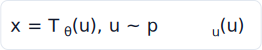

Because `T_θ` is a bijection, the probability mass is merely *rearranged*, not
created or destroyed. The change-of-variables formula turns that conservation of
mass into an exact density for `x`:

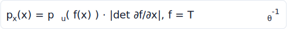

where `f = T_θ⁻¹` is the inverse map and the Jacobian determinant `|det ∂f/∂x|`
is the local volume-scaling factor that keeps the density normalized. In practice
we work in log space — products of small numbers underflow, and the training loss
is a log-likelihood anyway:

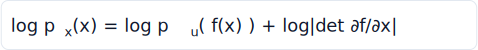

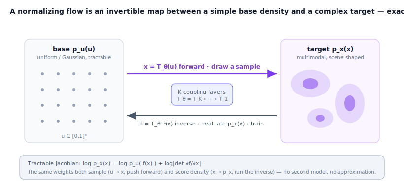

The two directions of the same map serve the two operations from §1:

- **Forward** `u → x` (`T_θ`) is **sampling**: draw `u ~ p_u`, return `x = T_θ(u)`.
- **Inverse** `x → u` (`f = T_θ⁻¹`) is **evaluation**: map a query point back to the
  base and read off `log p_x(x)` from the formula above.

### Composition

A single bijection is rarely expressive enough. The win is that bijections
**compose**, and the log-determinant of a composition is just the sum of the
per-layer log-determinants (chain rule for determinants):

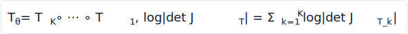

So a deep flow is a *stack* of simple invertible layers. Each layer must satisfy
exactly two practical constraints, and the whole design problem is meeting them
together:

1. **Invertible**, ideally in closed form, so both directions are cheap.
2. A Jacobian determinant that is **cheap to compute** — a general `D×D`
   determinant is `O(D³)`, which would kill the idea.

The architectures below are all different answers to "how do I get an expressive
invertible layer whose Jacobian is cheap?"

## 3. Coupling layers

The **coupling layer** (Dinh et al., RealNVP) is the cleanest answer, and the one
spline flows are built on. Split the `D` coordinates into two halves. Pass the
first half through **unchanged**. Transform the second half **element-wise** with a
1-D bijection `τ`, whose parameters are predicted by an arbitrary neural network
`Θ` that looks *only* at the untouched first half (plus any conditioning `c`):

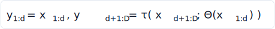

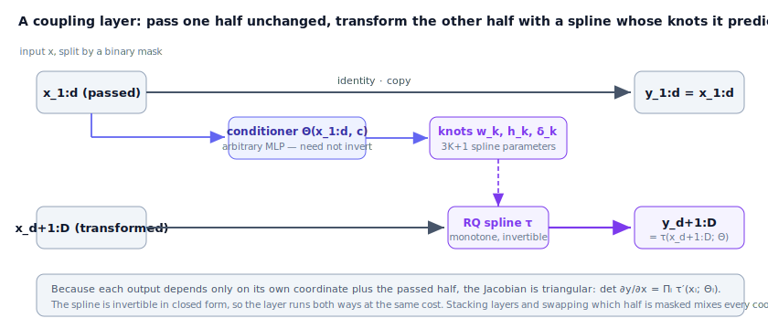

Three things fall out of this structure, and together they are why coupling layers
dominate:

- **Trivial inversion.** Given the output, the first half is already the input;
  feed it to `Θ` to recover the exact parameters, then invert each scalar `τ`.
  The expensive network `Θ` is **only ever evaluated in the forward direction** —
  it never has to be inverted, so it can be any network you like.
- **Triangular Jacobian.** Each output coordinate depends only on its own input
  coordinate (and the passed half, which is held fixed when differentiating the
  transformed block). The Jacobian is triangular, so its determinant is just the
  product of the diagonal — the per-element derivatives of `τ`:

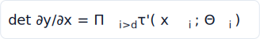

- **Full coupling by alternation.** One layer leaves half the coordinates
  untouched. Stack several and **swap which half is masked** each layer (the
  alternating mask), and every coordinate ends up transformed as a function of
  every other. In skinny's 2-D directional flow this is literally "even layers
  condition on dim 0 and transform dim 1, odd layers do the reverse"
  (`nf_flow_forward` in `neural_flow.slang`).

The only remaining freedom is the **scalar transform `τ`**. RealNVP used an
**affine** map, `τ(x) = a·x + b`. It is invertible and has a trivial derivative,
but it is weak: an affine coupling can only *shear* the density, so a single layer
cannot turn a unimodal slice into a multimodal one. You need many layers to build
multimodality, and even then sharp, multi-lobed targets are hard. That weakness is
exactly what the spline transform fixes.

> **Autoregressive flows** (MAF, IAF) are the close cousin: instead of two halves,
> coordinate `i` is transformed conditioned on *all* coordinates `< i`. They are
> more expressive per parameter but asymmetric — one direction is a single network
> pass, the other is `D` sequential passes. Coupling layers trade a little
> expressiveness for **both directions being a single cheap pass**, which is what a
> renderer that needs fast sampling *and* fast density wants. The spline transform
> below drops into either masking scheme unchanged.

## 4. The rational-quadratic spline transform

Durkan et al., *Neural Spline Flows* (2019), replace the affine `τ` with a
**monotonic rational-quadratic spline** — a piecewise function, each piece a ratio
of two quadratics. This is the single idea this document (and skinny's flow) is
named after, so it is worth getting concrete.

A spline transform maps an interval `[−B, B]` to itself using `K` **bins**. The bin
boundaries are `K+1` **knots** `(x_k, y_k)`; inside bin `k` the map is

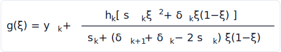

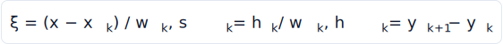

where `ξ ∈ [0,1]` is the position within the bin, `w_k` and `h_k` are the bin's
width and height, `s_k = h_k/w_k` is the secant slope across the bin, and `δ_k,
δ_{k+1}` are the function's **derivatives at the two knots**. Gregory and
Delbourgo showed this rational-quadratic form is the natural monotone interpolant
given values and derivatives at the knots.

**Why this particular form earns its place:**

- **Monotone ⇒ invertible.** If all the knot derivatives are positive, the spline
  is strictly increasing, hence a bijection. Inverting it means solving the
  rational-quadratic `y(ξ) = y*` for `ξ` — a single **quadratic equation with a
  closed-form root**. No iteration, both directions analytic. skinny's
  `nf_rqs_fwd` / `nf_rqs_inv` are exactly this forward map and its quadratic
  solve.
- **Expressive per layer.** Unlike the affine map, *one* spline layer with enough
  bins can already be sharply multimodal — it can stretch some regions and
  compress others arbitrarily. Far fewer layers are needed for a hard target.
- **Cheap, exact Jacobian.** The derivative `g'(ξ)` needed for the log-det has a
  clean closed form (and is the per-layer term summed in §2's composition):

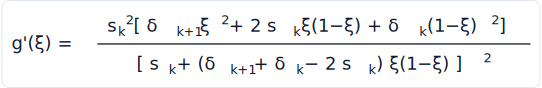

**Parameterization (how a network can emit a *valid* spline).** The conditioner
`Θ` outputs `3K+1` raw numbers per transformed coordinate: `K` widths, `K`
heights, `K+1` derivatives. Raw numbers will not in general define a monotone map,
so they are passed through fixed activations that *guarantee* validity:

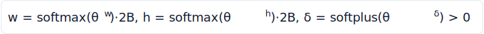

- **Widths and heights** go through a **softmax** (so they are positive and the
  widths sum to the domain `2B`, the heights to the range `2B`) — the knots stay
  ordered and inside the box, with a small floor (`1e-4` in skinny) so no bin
  collapses.
- **Derivatives** go through a **softplus** so they are strictly positive — the
  monotonicity guarantee.

**Linear tails.** Outside `[−B, B]` the transform is set to the **identity** (slope
1), so the flow behaves sensibly on the unbounded real line while the interesting,
learned shaping happens inside the box. (skinny side-steps the tail entirely: its
domain is the unit square `[0,1]²`, which the spline maps onto itself — see §7.)

The net effect: a **single rational-quadratic coupling layer** is dramatically more
flexible than a stack of affine ones, while keeping the exact-density, both-ways,
cheap-Jacobian properties intact. That is the whole pitch of spline flows.

## 5. Training a flow

Because the flow gives an **exact** density, training is just **maximum
likelihood** — no adversary, no variational bound, no surrogate. Given a dataset
`{x_n}` drawn from some true `p*`, maximize the log-likelihood the model assigns to
it, which is identically minimizing the **forward KL divergence** between the data
and the model:

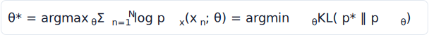

Substituting the flow's log-density (§2), the per-sample loss is fully explicit and
differentiable in the weights `θ`:

```python
# one training step (schematic — the real trainer is the spline_flow repo)
u, logdet = flow.inverse(x, c)          # run x back to the base, accumulate log|det ∂f/∂x|
log_p = base.log_prob(u) + logdet       # = log p_u(f(x)) + log|det ∂f/∂x|
loss  = -(weight * log_p).mean()        # weighted negative log-likelihood
loss.backward();  opt.step()            # SGD on θ through Θ and the spline
```

Two subtleties decide which *direction* of the flow training stresses, and they
matter for the rendering application:

- **Density estimation (forward KL, "mass-covering").** You have *samples* and want
  a density. The loss needs `f = T_θ⁻¹` (data → base), so training and density
  evaluation both run the **inverse**. The minimizer spreads probability to cover
  *all* the data — it would rather put mass where there is none than miss a mode.
  This is the regime for path guiding: the renderer hands the trainer
  *samples of light-carrying directions* and wants a density that covers them.
- **Variational / sampling (reverse KL, "mode-seeking").** You have a target you
  can *evaluate* (up to a constant) and want to *sample* it. The loss needs the
  **forward** map and tends to lock onto a subset of modes.

Coupling-based spline flows are cheap in **both** directions, so they serve either
regime; skinny trains in the forward-KL/density-estimation regime.

**Conditional flows.** Nothing above changes if every layer's conditioner also sees
a **conditioning vector `c`**. The density is now `p_x(x | c)`:

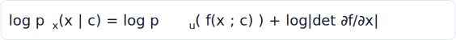

This is what makes a flow useful in rendering: one trained network represents a
*whole family* of distributions, indexed by `c`. In skinny, `c` is the 9-float
shading state (position normalized to the scene AABB, shading normal, outgoing
direction) — so a single flow encodes a different guiding distribution at every
point and orientation in the scene (`neuralCondition`, §1 of NeuralGuiding.md).

## 6. Sampling from a trained flow

Sampling is the forward map and nothing else:

1. Draw a base sample `u ~ p_u` (uniform / Gaussian — cheap, decorrelated).
2. Push it forward, `x = T_θ(u; c)`, accumulating the log-det along the way.
3. The density of the draw is **free**: `log p_x(x) = −log|det ∂T_θ/∂u|` (the base
   density is constant), no inverse pass required.

Three properties make this ideal for a Monte Carlo estimator:

- **Exact pdf of the draw**, in the same pass — you never sample a direction whose
  probability you cannot state.
- **Exact pdf of *any* point**, via one inverse pass — so you can also score a
  direction that some *other* sampler proposed (this is what MIS needs in §7).
- **Reparameterizable** — `x` is a smooth function of `u` and `θ`, so the sampler
  itself is differentiable, which a fully end-to-end pipeline can exploit.

## 7. Why this belongs in a renderer

Now the payoff. A physically based renderer estimates, at each shading point, the
reflected radiance integral with Monte Carlo:

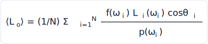

Each sample's variance is governed by how well the sampling density `p(ω)` matches
the **integrand** `f · L_i · cosθ`. The textbook result is that variance is
**zero** when the pdf is exactly proportional to the integrand:

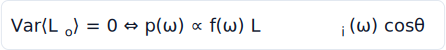

The catch: the material's BSDF sampler only knows `f · cosθ`. It is **blind to
`L_i`** — where light actually comes from. In a scene where indirect illumination
is concentrated (a bright wall, a door into a lit room), most BSDF draws point at
darkness and the estimator is noisy. The missing factor `L_i` is **scene-dependent,
high-dimensional, and only known by sampling** — exactly the kind of distribution
§1 said is hard to represent.

**Path guiding** learns that missing factor. We want a per-shading-point density
over directions that concentrates where `f · L_i · cosθ` is large, and to *sample*
it. Restate the renderer's needs against §1's checklist:

- It must be **sampled** efficiently (one draw per bounce, millions of times). ✔ flow forward pass
- Its **pdf must be available exactly** — both for the estimator's denominator and
  so it can be **combined unbiasedly** with the BSDF sampler via MIS. ✔ flow log-det
- It must be **conditioned** on the shading point and material. ✔ conditional flow
- It must be expressive enough for **sharp, multimodal** incident radiance. ✔ spline transform

A conditional rational-quadratic spline flow ticks every box — which is precisely
why Müller et al.'s *Neural Importance Sampling* built path guiding on flows, and
why skinny's SplineFlow is one. A discrete alternative exists — *Practical Path
Guiding* fits an adaptive `SD`-tree histogram instead of a flow; it is simpler and
training-free per query but coarser and axis-aligned. The flow trades that
simplicity for a smooth, exact, conditional density.


### Directions live on a square

The flow's natural domain is a box; directions live on a hemisphere. skinny's flow
warps the **unit square `[0,1]²`** and then maps the square to the upper hemisphere
with the **Lambert azimuthal equal-area** chart (a Shirley concentric square→disk
followed by the lift `cosθ = 1 − r²`, `r = |disk|`), whose Jacobian is the
constant `2π`. Being equal-area, the solid-angle density is just the square
density over `2π` — no spline tails needed, the square maps onto itself — and the
chart is seam-free with the pole at the disk centre, an easier target than the
cylindrical map it replaced (study `directional-flow-param-study`,
`ParametrizationResults.md`). The full chain (`nf_square_to_hemi`, the `2π`
factor, the inverse `nf_hemi_to_square`) is §6–§7 of NeuralGuiding.md.

### Unbiasedness: a wrong flow only costs variance

A learned sampler that is *wrong* on some lanes must never **bias** the image. The
guarantee comes from **multiple importance sampling**: the flow is never used
alone. It is one technique in a one-sample-MIS **mixture** with the always-on BSDF
proposal (and optionally the environment proposal):

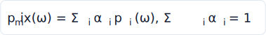

Whatever technique is chosen, the throughput is divided by the **full mixture pdf**.
A flow lobe pointed at the wrong place just makes some samples less efficient — it
raises variance, never bias. This is the safety net that lets you deploy a learned,
imperfect sampler in a *correct* renderer (NeuralGuiding.md §8–§9).

### Learning `q ∝ f · L_i · cosθ` from the renderer's own paths

How do you get *samples* of the target to run the §5 maximum-likelihood fit? The
renderer traces ordinary paths and, at each guideable vertex, records the direction
it took together with the **radiance that path went on to carry, per unit
throughput** — the contribution. Training is then the §5 weighted negative
log-likelihood with those contributions as weights:

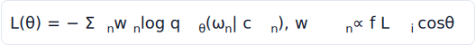

Weighting each recorded direction by how much light it delivered makes the
maximum-likelihood solution converge to `q_θ ∝ f · L_i · cosθ` — the zero-variance
target. The recording, the backward radiance attribution, and the exact training
weight `w_k = (L_final − L_k)/β_in,k` are §10–§11 of NeuralGuiding.md; the fit
itself runs offline in the standalone `spline_flow` PyTorch trainer, and the frozen
weights are baked into the renderer.

## 8. Design choices and practical notes

- **Depth vs bins.** Two knobs trade expressiveness for cost: the number of
  coupling **layers** (`NF_LAYERS`) and **bins per spline** (`NF_BINS`). Because a
  single spline layer is already multimodal, spline flows need far fewer layers
  than affine flows for the same target. skinny's default is 6 layers · 24 bins
  (see NeuralGuiding.md's size study, which finds quality is roughly flat across
  size on broad-indirect scenes and would only spread on concentrated-indirect
  ones).
- **Numerical care.** The spline core — softmax/cumsum for the knots, the
  rational-quadratic evaluation, and especially the analytic quadratic *inverse* —
  is **catastrophic-cancellation prone** and is kept in **fp32 in every precision
  mode**, even when the conditioner MLP runs in fp16. A flow whose pdf is slightly
  wrong is no longer exactly normalized, which would quietly break the
  unbiasedness argument.
- **Density must integrate to one.** The authoritative correctness check on any
  flow is `∫ q_ω dω ≈ 1` for a fixed condition. If a code change breaks
  normalization, the estimator is silently biased; skinny carries this PDF-
  normalization test over from the prototype as its unbiasedness gate.
- **Offline vs online.** skinny trains the flow **offline, per scene**, and runs
  read-only inference at render time. Online/adaptive training — refitting the flow
  *during* rendering as paths accumulate — is the natural next step and is the
  reserved Stage 3 in NeuralGuiding.md (the per-sample `networkVersion` stamping is
  its foundation).

## References

1. **C. Durkan, A. Bekasov, I. Murray, G. Papamakarios.** *Neural Spline Flows.*
   NeurIPS, 2019. [arXiv:1906.04032](https://arxiv.org/abs/1906.04032) — the
   monotone rational-quadratic coupling/autoregressive transform of §4 and its
   closed-form inverse.
2. **L. Dinh, J. Sohl-Dickstein, S. Bengio.** *Density Estimation Using Real NVP.*
   ICLR, 2017. — affine **coupling layers** with a triangular Jacobian and the
   alternating-mask architecture (§3).
3. **D. Rezende, S. Mohamed.** *Variational Inference with Normalizing Flows.*
   ICML, 2015. — the normalizing-flow framing of §2.
4. **G. Papamakarios, E. Nalisnick, D. Rezende, S. Mohamed, B. Lakshminarayanan.**
   *Normalizing Flows for Probabilistic Modeling and Inference.* JMLR, 2021. — the
   survey; the forward- vs reverse-KL training regimes of §5.
5. **G. Papamakarios, T. Pavlakou, I. Murray.** *Masked Autoregressive Flow for
   Density Estimation.* NeurIPS, 2017. — the autoregressive cousin noted in §3.
6. **T. Müller, B. McWilliams, F. Rousselle, M. Gross, J. Novák.** *Neural
   Importance Sampling.* ACM TOG 38(5), 2019. — learned importance sampling for
   light transport via flows; the path-guiding target `q ∝ f·L_i·cosθ` (§7).
7. **T. Müller, M. Gross, J. Novák.** *Practical Path Guiding for Efficient
   Light-Transport Simulation.* EGSR (CGF 36(4)), 2017. — the discrete `SD`-tree
   alternative and the contribution-weighted setup (§7).
8. **E. Veach.** *Robust Monte Carlo Methods for Light Transport Simulation.* PhD
   thesis, Stanford, 1997. — multiple importance sampling and the one-sample
   estimator backing the proposal mixture (§7).
9. **J. A. Gregory, R. Delbourgo.** *Piecewise Rational Quadratic Interpolation to
   Monotonic Data.* IMA J. Numerical Analysis, 1982. — the monotone
   rational-quadratic interpolant underlying §4.

---

See **[NeuralGuiding.md](NeuralGuiding.md)** for how every equation here is
realized in Slang and wired into the wavefront renderer, the network architecture,
the precision/size study, and the controls.
