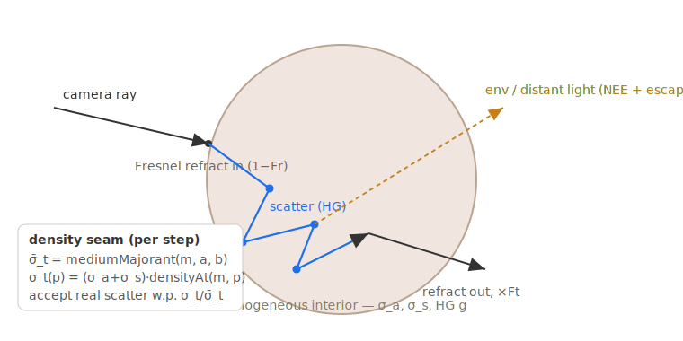

# Volumetric Subsurface Scattering

pbrt's `Material "subsurface"` (e.g. the `sssdragon`'s `Skin1` dragon) is a
**random walk in a homogeneous interior medium behind a smooth dielectric
boundary**. skinny reproduces that as a dedicated material type
(`MATERIAL_TYPE_SUBSURFACE`, type code 4) rather than the separable diffusion
BSSRDF the skin path uses. Before this change a pbrt `subsurface` material was
lowered to the flat material with `opacity = 0` and rendered as **clear glass**;
it now renders as a soft, light-diffusing (milky) translucent solid.

This is the physically-correct ground truth pbrt's tabulated dipole BSSRDF
approximates (they agree in the diffusive, high-albedo limit), so it tracks pbrt
closely but is **not bit-parity** with the dipole — see [Verification](#verification).

## The interior random walk

`subsurfaceRadiance(...)` in `materials/subsurface/subsurface_walk.slang` is
self-integrating (returns full radiance and terminates the bounce loop, like the
skin path). At a hit it:

1. **Boundary (Fresnel split).** Reflectance `Fr = fresnelDielectric(N·V, 1/η)`.
   The reflected fraction `Fr` samples the environment in the mirror direction
   (surface specular); the refracted fraction `1−Fr` enters the interior with the
   ray bent by `refractInto`.
2. **1-D slab random walk.** The interior is modelled as a homogeneous slab of
   perpendicular thickness `T` (from `hit.backT`, the closed-mesh back face).
   `zMM` tracks the perpendicular depth of the current vertex. Each step marches
   to **whichever face the ray heads toward** (`mu = dot(dir, −N)`), so the walk
   can actually *exit* the slab.
3. **Null-collision (Woodcock) tracking** per segment, in
   `traverseMediumSegment`: free-flight against the majorant `σ̄_t`, then accept a
   real scatter with probability `σ_t(p)/σ̄_t` (throughput `σ_s/σ_t`, a
   Henyey-Greenstein continuation) or a null collision. The medium is read **only
   through the density seam** (see below).
4. **Lighting.** Direct light from a single analytic distant light via per-scatter
   NEE (refracted out through the boundary, `Ft = 1 − Fresnel`); the **environment
   on escape** — when a segment leaves the slab the ray carries `throughput ·
   env(dir) · Ft`. Direct (NEE) and environment (escape) are disjoint sources, so
   they never double-count and the walk is **energy-conserving** (furnace
   `σ_a → 0` returns ~unity).
5. **Russian roulette** bounds the walk; throughput is `float3` (per-channel σ),
   the pdf scalar.

It runs in **both execution modes** (megakernel + wavefront) and on **both
backends** (Vulkan + native Metal): a single `case MATERIAL_TYPE_SUBSURFACE` in
`integrators/path.slang` `evaluateBounce()` serves the megakernel **and** the
wavefront catch-all kernel. BDPT excludes it (flat-only eye walk), exactly like
skin.

### The density seam (forward compatibility)

The walk reads the medium through exactly two functions in
`materials/subsurface/medium.slang`, each a `switch` on a `kind` tag:

- `densityAt(Medium m, p) → float` — local density multiplier (`1.0` for
  `MEDIUM_HOMOGENEOUS`).
- `mediumMajorant(Medium m, a, b) → float3` — majorant `σ̄_t` (`σ_a+σ_s` for
  homogeneous).

Because null-collision tracking **is** the heterogeneous algorithm (a constant
density is its degenerate case), a future NanoVDB grid is a new `kind` plus two
`case` bodies — the walk, NEE, RR, and integrator wiring are untouched. The
`Medium` is **handle-referenced** (`resolveMedium(matId)`), `MEDIUM_NANOVDB` is
reserved, and the boundary crossing is parameterized by mode (dielectric refract
vs index-matched) — so heterogeneous, free-standing `MediumInterface` media (e.g.
the pbrt `disney-cloud`) drop in additively. Those, plus area/emissive lights
*inside* the medium, are deliberate follow-ups.

## Coefficient derivation (importer)

The importer derives `(σ_a, σ_s, g, η)` in pbrt's own precedence
(`skinny/pbrt/subsurface.py`, `materials.py`):

1. explicit `sigma_a` + `sigma_s` (mm⁻¹) → used directly (× `scale`);
2. else a named preset (`"Skin1"`, …) → pbrt's measured
   `GetMediumScatteringProperties` table;
3. else `reflectance` + `mfp` → invert the diffuse albedo (Jensen/Christensen),
   `σ_t = 1/mfp`, `σ_s = α·σ_t`, `σ_a = σ_t − σ_s`.

The `-mtlx` / `standard_surface` inputs map to the **same** coefficients —
`subsurface_color` → albedo, `subsurface_radius` → per-channel mfp,
`subsurface_scale` → `1/mfp` scale, `subsurface_anisotropy` → `g` — so native-USD
and `-mtlx` imports agree.

**Unit storage.** pbrt media coefficients are mm⁻¹ interpreted *per scene unit*
(optical depth `τ = σ·L`). The walk, however, computes
`τ = σ_packed · L_world · mmPerUnit`, and an imported pbrt stage declares
`metersPerUnit = 1.0` (`emit.PBRT_STAGE_METERS_PER_UNIT`) → loader
`mm_per_unit = 1000`. So `media.subsurface_overrides` stores the coefficients
**per world unit**: the pbrt mm⁻¹ values divided by `mm_per_unit` (1000), so
`σ_packed · mmPerUnit` recovers pbrt's coefficients and the interior is at its
true geometric optical depth. Without this the dragon is ~1000× too dense and
renders opaque gold/brown instead of translucent. (Full pixel-mean parity with a
pbrt reference additionally needs the env-light application and high-optical-depth
walk fidelity — a separate follow-up.)

The coefficients ride on `skinnyOverrides` customData (`subsurface_sigma_a`,
`subsurface_sigma_s`, `subsurface_g`, and `ior` for the boundary η) → merged into
`Material.parameter_overrides`. The renderer packs them **inline** into
`FlatMaterialParams` (binding 13, bytes `σ_a`@160, `g`@172, `σ_s`@176,
`mediumKind`@188 — η reuses `ior`@60) so no new SSBO is needed under Metal's
31-buffer cap, and tags `MATERIAL_TYPE_SUBSURFACE` whenever `subsurface_sigma_*`
is non-zero. True `dielectric` glass (no `subsurface_sigma_*`) stays on the flat
path, untouched.

The loader's subsurface→opacity bridge (`_derive_opacity_from_subsurface`, which
drops `opacity` to `0` so the flat refraction branch fires for a pbrt subsurface
boundary) is gated on the **same** `subsurface_sigma_*` test
(`_has_subsurface_medium`, mirroring `_material_is_subsurface`). A plain Autodesk
`standard_surface` `subsurface` *weight* with no interior medium — e.g. the
`three_materials_demo` marble (`subsurface = 0.4`, no σ) — is a diffuse-SSS
shading term, so it keeps `opacity = 1` and renders as an opaque lit diffuse
surface. Without this gate it was forced to `opacity = 0` and refracted the
environment as clear glass (the "marble totally broken" regression).

## Verification

| Gate | Result |
|---|---|
| Furnace / energy (`σ_a → 0`, constant env → unity) | 0.996 |
| PT ≡ BDPT (SSS sphere) | relMSE 0.0058 |
| Metal ↔ Vulkan (wavefront) | relMSE 0.0175 |
| Back-compat (true `dielectric` glass stays flat) | unchanged |
| pbrt-v4 corpus `subsurface_infinite` (dipole vs walk, IBL-lit) | relMSE 0.079 |

pbrt's `subsurface` is a tabulated dipole BSSRDF and skinny's is a 3-D random
walk, so the corpus parity is qualitative (both milky), with a loose tolerance —
see `tests/pbrt/corpus/manifest.json`.
