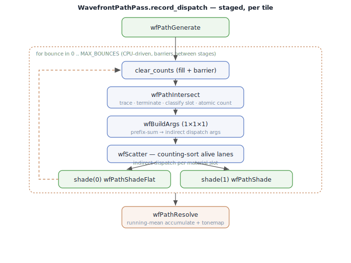
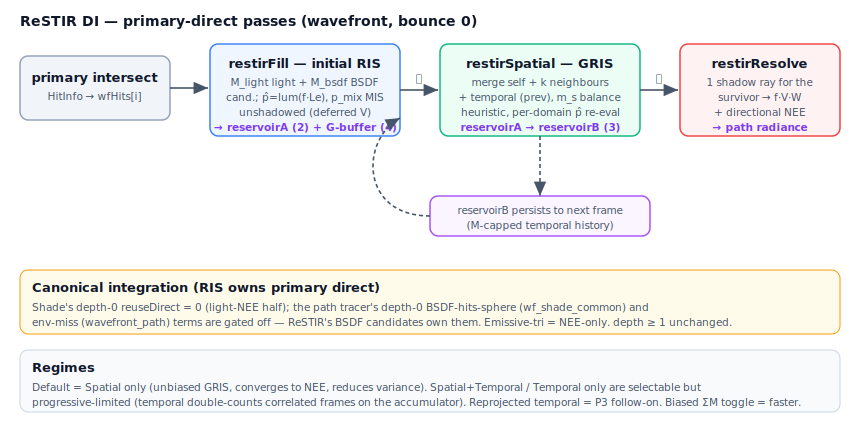

# Skinny — Wavefront Execution Mode

The **wavefront** mode renders the *same* light-transport integral as the
[megakernel](Megakernel.md), but tears the per-pixel bounce loop apart across
**many small compute dispatches** connected by GPU-resident queues. Rays in
flight are kept as a stream of state records in VRAM; each bounce runs as a
sequence of stages (generate → intersect → build-args → scatter → shade →
resolve), and lanes are bucketed by material so each shade dispatch hits one
coherent material branch.

It is one of two execution modes (`EXECUTION_WAVEFRONT = 1`, `params.py:65`),
selected once at startup with `--execution-mode wavefront`
(`cli_common.py:85`) and **fixed for the session**. Both modes run on Vulkan
(MoltenVK on macOS) — "wavefront" is an execution strategy, not a separate
graphics API. The implementation lives in `vk_wavefront.py`,
`wavefront_layout.py`, and `shaders/wavefront/`.

For the high-level contrast with the megakernel see
[Megakernel vs wavefront](#megakernel-vs-wavefront) below.

---

## 1. Orchestration (`vk_wavefront.py`)

Three Python pass classes own their GPU resources and record their entire
staged dispatch loop into the frame command buffer (modelled on
`vk_skinning.SkinningPasses`). The render gate replaces the megakernel's single
dispatch:

- **Gate** (`renderer.py:7147-7158`, headless `7367-7377`): when
  `effective_execution_mode_index == EXECUTION_WAVEFRONT`, call
  `staged.record_dispatch(cmd, descriptor_sets[f])` instead of `vkCmdDispatch`.
- **Selection:** `integrator_index == 1` → `_ensure_wavefront_bdpt_pass()`; else
  `_ensure_wavefront_path_pass()`; if no scene yet → `WavefrontEnvPass`
  (env-only fallback). `WAVEFRONT_BDPT_SUPPORTED = True` (`renderer.py:915`), so
  wavefront BDPT is live and no longer falls back to the megakernel.
- **Lifecycle:** passes build lazily and cache on dims —
  `_ensure_wavefront_path_pass` keys on `(width, height, build_catchall)`
  (`renderer.py:1424-1462`), `_ensure_wavefront_bdpt_pass` on `(width, height)`
  (`1475-1507`). Both reuse the megakernel's set-0 layout via
  `self._scene_set0_layout` (`renderer.py:1351-1356`) — wavefront binds the
  **same scene descriptor set 0**, so the UBO, materials, lights, textures, and
  env CDFs are shared verbatim.

> Vulkan-only: gated on `hasattr(ctx, "compute_queue")` (`renderer.py:1090`,
> `1399`). There is no CPU fallback for the wavefront path.

### Path stages (`WavefrontPathPass`, `vk_wavefront.py:464-679`)

Constants: `_GROUP = 64` (`[numthreads(64,1,1)]`), `MAX_BOUNCES = 6` (lockstep
`WF_MAX_BOUNCES`, `wf_shade_common.slang:17`), `STREAM_CAP = 1<<20`,
`NUM_SLOTS = 2`, `HIT_STRIDE = 96`. Six/seven kernels are compiled from
`wavefront_path.slang` to per-entry `.spv` (`_wfpath_*`). The `record_dispatch`
loop (`vk_wavefront.py:603-667`), tiled by `stream_base` until `num_pixels`:

Stage detail:

| Stage | Work |
|-------|------|
| `wfPathGenerate` | seed camera ray + path state (full stream) |
| `clear_counts()` | `vkCmdFillBuffer` zero `slot_count` + `slot_cursor` (+ barrier) |
| `wfPathIntersect` | trace, cutout-skip, miss/env terminate, classify by material slot, `InterlockedAdd(wfSlotCount[slot])` |
| `wfBuildArgs` | `vkCmdDispatch(1,1,1)`: prefix-sum counts → offsets, write `VkDispatchIndirectCommand` per slot |
| `wfScatter` | counting-sort alive lanes into per-slot queue slices |
| `shade(0, wfPathShadeFlat)` | `vkCmdDispatchIndirect(indirect, slot*12)` — flat + MaterialX |
| `shade(1, wfPathShade)` | `vkCmdDispatchIndirect(indirect, 1*12)` — skin/python/debug (only if `build_catchall`; push `shadeSlot` at offset 4) |
| `wfPathResolve` | running-mean accumulation + tonemap display (full stream) |

The bounce loop (`clear_counts` → … → `shade`) repeats `MAX_BOUNCES` times,
CPU-driven with barriers between stages.

`mem_barrier()` (COMPUTE→COMPUTE | DRAW_INDIRECT) separates each stage. Push
constant `WfTilePC {streamBase, shadeSlot, streamSize}` (12 B,
`wf_shade_common.slang:31`). Pipeline layout = `[set0 scene, set1 path-state]`
+ 12 B push (`vk_wavefront.py:542-547`).

### BDPT stages (`WavefrontBdptPass`, `vk_wavefront.py:781-1068`)

Constants: `BDPT_MAX_VERTS = 7`, `VERTEX_STRIDE = 128`, `AUX_STRIDE = 128`,
`NUM_SLOTS = 2` (`SLOT_NEE=0`, `SLOT_FULL=1`), `STREAM_CAP = 1<<18`,
`EYE_BOUNCES = 5`, `LIGHT_BOUNCES = 6`. Three `walk_mode`s
(`vk_wavefront.py:810`, picked per session) control only subpath construction;
the connect+resolve tail is shared:

- **`fused`** (default): one `wfBdptWalk` (eye + light + s=1 splat).
- **`eye`**: staged eye walk (`wfBdptGenEye` + loop `wfBdptBounceEye`) +
  `wfBdptLightTail` (fused light + splat).
- **`eye_light`**: fully staged eye + light walks (`wfBdptGenLight`/
  `wfBdptBounceLight`) + standalone `wfBdptSplat`.

`record_dispatch` (`vk_wavefront.py:952-1056`) per tile: `build_subpaths()` →
`compact("wfBdptClassify")` → `indirect(SLOT_NEE, wfBdptConnectNee)` →
`indirect(SLOT_FULL, wfBdptConnectFull)` → `wfBdptResolve`. The staged
eye/light walks reuse the same counting-sort machinery
(`wfBdptWalkClassify` → buildargs → scatter → indirect `wfBdptBounceEye/Light`)
per bounce. `clear_counts()` here adds an extra COMPUTE→TRANSFER WAR barrier
(`vk_wavefront.py:981-986`) absent in the path pass, guarding prior
indirect-dispatch reads of `slot_count` against the fill.

---

## 2. Stream state & material bucketing

**Path-state record** `WavefrontPathState` (`wavefront_state.slang:15-26`,
Python mirror `wavefront_layout.py:28-46`): **AoS**, scalar layout, **68 B
stride** — `rayOrigin/rayDir/throughput/radiance` (4× float3) +
`pixelIndex/rngState/depth/flags` (uint) + `bsdfPdf` (float). `flags` bits:
`PATH_FLAG_ALIVE=1`, `PATH_FLAG_SPECULAR=2`. `tests/test_wavefront_state.py`
locks the Slang struct ↔ Python table.

> The record is intentionally AoS, **not** SoA (`wavefront_state.slang:8-9`):
> convert hot fields to SoA only if profiling shows a bandwidth bottleneck. The
> *queues* are SoA `uint` arrays; the per-lane path record is AoS.

**Set-1 buffers** (`wf_shade_common.slang:34-42`): `wfState`(0),
`wfHits`(1, `HitInfo`), then the counting-sort queue buffers — `wfLaneSlot`(2,
slot per lane), `wfSlotCount`(3, `[NUM_SLOTS]`), `wfSlotOffset`(4, queue base
per slot), `wfSlotQueue`(5, grouped lane indices), `wfSlotCursor`(6, scatter
cursor), `wfIndirectArgs`(7, `[NUM_SLOTS*3]`). Allocated in
`WavefrontPathPass.__init__` (`vk_wavefront.py:520-527`); `indirect` buffer
created with `INDIRECT_BUFFER` usage.

**Material bucketing = 2 slots, not per-material** — `wfSlotForType`
(`wf_shade_common.slang:47`): `MATERIAL_TYPE_FLAT → WF_SLOT_FLAT(0)`, everything
else → `WF_SLOT_OTHER(1)`. Slot 0 = `wfPathShadeFlat` (flat + MaterialX graph),
slot 1 = `wfPathShade` (heavy catch-all: skin / BSSRDF / python / debug).
`wfQueueLane(slot, qpos)` resolves the stream slot or `0xFFFFFFFF` past the
slice (`wf_shade_common.slang:52-56`).

> The standalone `compaction.slang`, `scatter.slang`, `build_args.slang`,
> `shade_Marble_3D/Tiled_Brass/Tiled_Wood.slang`, and `indirect_paint.slang`
> are **de-risk / verification carriers** and an *alternate* per-material
> partition (`ShadePassGroup`, `renderer.py:1602`), **not** the live path-tracer
> hot loop. The live loop uses the 2-slot in-shader counting sort embedded in
> `wavefront_path.slang`. The per-material `shade_*` kernels are albedo-only
> debug visualisers (`accumBuffer[pixel] = base_color`).

---

## 3. How a bounce is split (vs the megakernel loop)

The megakernel runs generate→trace→shade→bounce in registers, one thread per
pixel ([Megakernel.md §3](Megakernel.md)). The wavefront relocates the **same
loop body verbatim** across dispatches, round-tripping `WavefrontPathState`
through VRAM between bounces. Each kernel calls the same
`evaluateBounce` / `evaluateFlatBounce` and the same MIS, so it is an unbiased
estimator of the same integral (A/B-verified).

Key differences in the mechanism:

- **No ping-pong double-buffer.** Lanes stay in fixed stream slots
  `[0, stream_size)`; liveness is the `PATH_FLAG_ALIVE` bit. Dead lanes are
  skipped by the alive check in each kernel and excluded from the per-bounce
  counting sort (scatter enqueues only alive lanes, `wavefront_path.slang:180`).
- **The "queue" is per-bounce material routing, not inter-bounce compaction.**
  There is no cross-bounce stream compaction in the live loop (standalone
  `compaction.slang` is unused there).
- **Bounce control flow lives on the CPU** — `MAX_BOUNCES` fixed iterations with
  barriers, recorded into the command buffer.
- `wfFinishShade` (`wf_shade_common.slang:70-136`) is the material-independent
  bounce tail (accumulate, RR, spawn next ray, sphere-light MIS, store/terminate)
  shared by both shade kernels.

---

## 4. BDPT wavefront stages (`wavefront_bdpt.slang`)

Aux record `WfBdptAux` carries `eyeLen/lightLen/escaped/radiance/pixel/rngState`
plus transient eye-walk state. Set 1: `wfEye`(0), `wfLight`(1), `wfAux`(2),
queue buffers 3-8. Kernels:

| Kernel | Role | Line |
|--------|------|------|
| `wfBdptWalk` | fused eye + light walk + s=1 splat | `:109` |
| `wfBdptGenEye` / `wfBdptBounceEye` | staged eye walk (verbatim `randomWalk` body), indirect over slot 0 | `:335` / `:489` |
| `wfBdptWalkClassify` | flag live (`ewFlags & ALIVE`) lanes for next bounce | `:468` |
| `wfBdptGenLight` / `wfBdptBounceLight` | symmetric light walk | `:676` / `:715` |
| `wfBdptLightTail` | fused light + splat (`eye` mode) | `:273` |
| `wfBdptSplat` | standalone s=1 splat (`eyeLen≥2 && lightLen≥2`) | `:851` |
| `wfBdptClassify` | route by subpath shape → finalize escaped / SLOT_FULL / SLOT_NEE | `:879` |
| `wfBdptBuildArgs` / `wfBdptScatter` | counting sort | `:907` / `:925` |
| `wfBdptConnectNee` | emissive + `connectT1` only | `:1004` |
| `wfBdptConnectFull` | adds t≥2 `connectGeneric` + `misWeight` | `:1017` |
| `wfBdptResolve` | running mean of the **eye-side** estimate into `accumBuffer` | `:1027` |

The connect estimator is reused verbatim from `integrators/bdpt.slang`
(`randomWalk`, `connectT1`, `connectGeneric`, `misWeight`, `splatLightWalk`,
`bdptEnvNEE`). The NEE/FULL split skips the heavy O(s·t) generic+MIS double loop
for NEE-only lanes. The s=1 light splat accumulates separately in
`lightSplatBuffer` (composited only on display, never into `accumBuffer`), so
headless A/B compares the eye-side estimate only (`:1042-1047`).

---

## 5. Material-sorted shading & codegen

The **live path uses no per-material codegen** — just 2 fixed slots (flat vs
catch-all). The per-material codegen is the *alternate* `ShadePassGroup`
partition: `emit_wavefront_shade_module` (`vk_compute.py:302-345`) emits one
`shade_<name>.slang` per `GraphFragment`, importing only `generated.<name>_graph`
so each is an independent compilation unit; `compile_shade_module_cached`
(`vk_wavefront.py:79-129`) is a per-module content-hash SPIR-V LRU cache keyed
on entry + flags + module source + graph deps + `shared_shader_hash` (which
excludes `generated/` and `wavefront/shade_*`, so adding one material misses
only that key). This is the **MoltenVK compile win**: each shade kernel is
small instead of one monolithic switch.

`flat_bounce.slang::evaluateFlatBounce` is the `MATERIAL_TYPE_FLAT` branch of
`evaluateBounce` standalone (imports only flat material + NEE +
`sampling.proposal`), keeping `wfPathShadeFlat` small.
`scatter.slang`/`build_args.slang`/`compaction.slang` are reusable
counting-sort/compaction primitives (used by the de-risk `IndirectPaintPass`,
mirrored inline in the live kernels).

---

## 6. Indirect args & queue counters

- **Persistent stream, not persistent threads:** fixed `stream_size` slots,
  tiled over pixels; no atomic work-stealing.
- **Counters:** `wfSlotCount` (atomic-incremented in intersect/classify),
  `wfSlotCursor` (atomic write cursor in scatter), `wfSlotOffset` (prefix-sum
  bases). `slot_count` + `slot_cursor` zeroed each bounce via `vkCmdFillBuffer`
  (`vk_wavefront.py:622-632`).
- **Indirect dispatch:** `wfBuildArgs` writes a `VkDispatchIndirectCommand` per
  slot; shade/connect kernels run via `vkCmdDispatchIndirect(indirect, slot*12)`
  so each covers exactly `ceil(count/64)` groups (empty slots dispatch 0
  groups). Barriers carry `DRAW_INDIRECT_BIT` + `INDIRECT_COMMAND_READ_BIT` so
  build-args writes are visible to the dispatch (`vk_wavefront.py:609-620`).
  `indirect_paint.slang` + `IndirectPaintPass` verify indirect == direct
  equivalence.

---

## 7. Proposal / scene-sampling seam

The seam (`sampling/proposal.slang`: `sampleBounceDirection` /
`mixtureProposalPdf`) is driven by `fc.proposalMask` + `fc.proposalAlpha` packed
into the **shared scene UBO (set 0, binding 0)** at `renderer.py:6839-6840`.
Because the wavefront passes bind set 0 verbatim, they read the **same `fc`
UBO** — the seam is active in wavefront mode with **no wavefront-specific
plumbing**. `flat_bounce.slang:44-50` calls `sampleBounceDirection` through the
seam; the catch-all routes through `integrators.path::evaluateBounce` which also
uses it (commit `5e17c8f`: "route wavefront flat-shade through the proposal seam
+ wavefront parity"). The default BSDF-only mask collapses to the material's
native `sample()` for bit-exact parity. Shipped proposal bits: `0x1` BSDF
(always on), `0x2` environment importance, `0x4` **neural** (the learned
spline-flow proposal below). `proposalWeights()` renormalises the active bits'
selection weights to Σ = 1 per lane, so any subset stays unbiased.

### Proposal seam: neural directional proposal (proposal bit2, wavefront-only)

The **neural directional proposal** (`--proposals bsdf,neural`, proposal bit
`0x4`) is a learned, position-conditioned **rational-quadratic neural spline
flow** that proposes the BSDF bounce direction toward the incident-light-aware
integrand and reports an **exact solid-angle pdf**. The net is **frozen,
offline-trained per scene** (in a standalone `spline_flow` PyTorch repo) and
**wavefront-only**: the MLP is infeasible inline in the megakernel under
MoltenVK's big-kernel limit, so the megakernel **strips the bit** and falls back
to its analytic proposal subset (renormalising `{bsdf, env}` to Σ = 1), mirroring
the [ReSTIR DI → identity](#reuse-seam-restir-di-reusemode--1-wavefront-only)
capability gate. Selecting it on the megakernel warns once rather than silently
dropping the request.

The seam stays **provably unbiased regardless of the net's quality** (one-sample
MIS divides throughput by the full mixture pdf), so an untrained / dummy net only
costs variance — never bias. That is exactly what the current Stage-1 milestone
verifies before any training.

**Option A — pre-pass + inline inverse.** Rather than evaluate the MLP inside the
hot bounce kernel, the forward draw is amortised across the live lanes by a
**compute pre-pass**:

- **`WavefrontNeuralProposalPass`** (`shaders/wavefront/neural_proposal_pass.slang`
  → `wfNeuralProposal`) runs once per live lane each bounce, scheduled **between
  scatter and shade** (the same slot the ReSTIR DI burst uses). It reads the
  lane's `HitInfo` + path state, builds the condition, draws **one forward** flow
  sample, and writes a per-lane `WfNeuralSample {wi, pdf, version, valid}` (32 B)
  to **set-1 binding 8** (`wfNeural`, owned by `WavefrontPathPass`). The base
  sample is hashed from the global pixel + frame + bounce — **independent of the
  shade kernel's RNG stream**, so enabling neural never perturbs the
  `{bsdf}`/`{bsdf,env}` draw paths.
- The **flat wavefront shade kernel** reads that record and mixes the precomputed
  forward direction into the bounce via one-sample MIS (`flat_bounce.slang` →
  `sampleBounceDirection`). Neural is scoped to the **lean flat** shade kernel
  only — the skin / catch-all kernels never run it.
- The **inverse** pdf — needed for *arbitrary* directions the flow did not draw
  (NEE light directions, BSDF-/env-selected bounce directions) — is evaluated
  **inline** in the flat shade (`neuralPdfWorld` in `sampling/neural_proposal.slang`,
  called from `sampling/proposal.slang` + `nee.slang`), because those directions
  are RNG-drawn in-kernel and cannot be precomputed. The inverse is the only
  inline MLP eval, and its three weight buffers (bindings 33/34/35) are always
  bound so the static reference resolves on every pipeline, including the
  megakernel (seeded with an all-zero dummy net until activation).

**Unbiasedness.** `proposalWeights()` (`sampling/proposal.slang`) gives the
per-lane effective one-sample-MIS weights: neural participates **only when its
bit is set AND the lane has a precomputed sample** (`neuralValid` — true only on
flat wavefront lanes); otherwise `{bsdf, env}` renormalise to Σ = 1. The **same**
effective weights + the inline inverse drive both the bounce-mixture pdf and the
NEE companion pdf (`mixtureProposalPdf`), so direct and indirect lighting stay
MIS-consistent. A `neuralActive` bool is threaded through
`sampling/reuse.slang` / `nee.slang` so the NEE companion includes the neural
term **exactly on neural lanes**.

**Condition encoding (canonical).** The condition handed to the flow is 9-dim,
raw-concatenated (no hashgrid) and **must match the offline trainer byte-for-byte**
(a mismatch raises variance silently, never bias):
`c = [ (pos − bboxMin)/bboxExtent·2 − 1  (∈ [−1,1]³), shadingNormal.xyz,
outgoingWorldDir.xyz ]`. The scene AABB (`fc.sceneBoundsMin` /
`sceneBoundsExtent`) rides in the UBO tail (read only when neural is active). The
flow hemisphere is y-up in the shading frame. The math itself lives in
`shaders/sampling/neural_flow.slang` (coupling layers, RQ-spline forward/inverse,
MLP, log-det); `neural_proposal.slang` is the thin renderer adapter (weight
buffers, world↔flow-local frame map). Fixed architecture: 6 layers, 24 spline
bins, hidden 96, condition 9.

**Weights file (NFW1).** Per-scene weights are baked to a little-endian `NFW1`
binary (`uint32 magic=0x4E465731, version=1; uint32 layers,bins,hidden,cond;`
then a `NfLayerHeader` table `(weightOffset, biasOffset, inDim, outDim)`, the
flat `f32` weights, and the flat `f32` biases), loaded host-side by
`src/skinny/sampling/neural_weights.py` and uploaded to bindings 33/34/35
(`NeuralProposal` plugin in `sampling/proposals.py`). `make_dummy_weights()`
bakes the all-zero bring-up net.

**Parity regression.** `tests/test_neural_parity.py` locks the Slang port
against the PyTorch reference: it re-implements `neural_flow.slang` in numpy off
the *same* flat `NFW1` layout (`headers/weights/biases`) and asserts the forward
`(wi, solid-angle pdf)` and the inverse pdf match committed PyTorch goldens
(`tests/data/neural_parity/`, baked once by `generate_goldens.py` with the
`spline_flow` torch venv). It runs in CI with **no torch and no GPU**; the proven
bar is `|Δwi| < 1e-4` / relative pdf `< 1e-3` (achieved `~4e-6` / `~5e-5`, with a
machine-precision forward↔inverse round-trip). An optional slangpy test dispatches
the real `sampleNeural`/`pdfNeural` for the true on-device gate and skips where the
typed header buffer cannot bind (then GPU parity rides on the headless bring-up).

**Offline pipeline + status.** Stage 1 (this change): the renderer dumps
per-vertex `(position, normal, wo, wi, contribution)` records; those train a flow
in `spline_flow` under the **identical** condition encoding; the result bakes to
`NFW1` and loads at runtime. **Landed so far:** the full plumbing — pre-pass,
weight buffers, the MIS mixture, and the dummy-net bring-up that proves the seam
unbiased. **Pending:** per-scene training of a real net and the equal-time
quality gate (variance reduction vs `{bsdf}`/`{bsdf,env}` at matched cost).
Online / dynamic training (the per-sample `neuralNetworkVersion` hook is reserved
for it) is a later Stage-2 change.

**Host wiring.** Weight buffers + `WavefrontNeuralProposalPass` are built lazily
in wavefront mode (mirroring `RestirDiPass`) in `renderer.py` / `vk_wavefront.py`.
The GUI preset is **"BSDF + Neural"** (`proposal_preset_index`, persisted; env
`SKINNY_PROPOSALS=bsdf,neural`); changing it resets progressive accumulation.

### Reuse seam: ReSTIR DI (`reuseMode == 1`, wavefront-only)

The reuse hook (the other half of the scene-sampling seam) is realized by
**ReSTIR DI** — reservoir spatiotemporal resampling of **primary-hit** direct
lighting. `reuse=none` (identity) forwards to stock NEE; `reuse=ReSTIR DI` is
**wavefront-only** (multi-pass) and capability-gates to identity on
megakernel/Metal (`reuseMode` folds to 0 in `_pack_uniforms`). This section is the
wavefront-integration summary; the **full reference** — equations, the
equation→shader map, design choices, and every GUI control — is in
**[ReSTIR.md](ReSTIR.md)**.

- **GPU side** (`vk_wavefront.RestirDiPass`): three pipelines compiled from
  `restir/restir_primary.slang` — `restirFill` → `restirSpatial` → `restirResolve`
  — over **set 1** = the shared path-state (0) + hit (1) buffers plus ReSTIR-owned
  **ping-pong reservoirs A/B (2,3)** + a **G-buffer (4)** (pos+normal). A 36-B
  push constant (`RestirPC`) carries the config (flags: bit0 spatial / bit1
  temporal / bit2 biased, plus `mLight`/`mBsdf`/`spatialK`/`radius`/thresholds/`mCap`).
- **Schedule:** `WavefrontPathPass.record_dispatch` calls `record_primary_direct`
  at **bounce 0**, after the primary intersect and before shade (and restores the
  `wfTile` push constants — ReSTIR binds an incompatible pipeline layout). Shade's
  depth-0 `reuseDirect` is gated to 0 so ReSTIR is the sole primary-NEE source; the
  result is added into the path-state radiance, and `wfPathResolve` flushes it as
  usual.
- **Canonical integration (RIS owns primary direct):** `restirFill` runs an initial
  RIS over the **unified light set** with both LIGHT- and BSDF-sampled candidates.
  The target is the UNWEIGHTED `p̂ = luminance(f·Le)`; the technique MIS lives in the
  balance-heuristic mixture source pdf `p_mix = (M_light·p_light + M_bsdf·p_bsdf)/M`.
  Light candidates draw sphere / emissive-triangle / env ~ uniform over the active
  techniques; BSDF candidates trace the proposal direction to the sphere lights / env
  (sphere hits recover a reproducible uv, env stores an octahedral direction). The
  path tracer's own depth-0 BSDF-hits-sphere (`wf_shade_common`) and env-miss
  (`wavefront_path`) terms are **gated off** so they are not double-counted. Emissive
  triangles are NEE-only (the stock renderer has no BSDF-tri MIS) → light-technique
  only. Directional (delta) lights are plain NEE outside the RIS. `restirResolve`
  casts one shadow ray for the survivor → `f·V·W`. **Converges to `reuse=none`** on
  cornell_box_sphere/emissive + three_materials (glossy), A/B-verified against
  megakernel-PT / BDPT / wavefront-NEE (all agree).
- **Unbiased spatiotemporal combination (GRIS):** `restirSpatial` merges self +
  k domain-checked screen-neighbours + last frame's reservoir using the
  **generalized balance heuristic** — each source's MIS weight
  `m_s = M_s·p̂_s(z_s) / Σ_j M_j·p̂_j(z_s)` re-evaluates the survivor's target in
  every source's OWN domain (the source lane's material/frame re-loaded from
  `wfHits[j]` via `restirLoadLane`; the DI same-light-point reconnection has
  Jacobian 1). This bounds the spatial→temporal feedback that the old biased (ΣM)
  combination let explode on glossy surfaces. A **biased toggle** (`flags` bit2)
  selects the faster ΣM combination (skips the O(k²) re-eval; bounded on spatial,
  over-brightens with temporal on glossy).
- **Regime selector + tuning:** `restir_regime_index` → `_disc("ReSTIR regime", …)`
  (default **Spatial only** / Spatial+Temporal / Temporal only), plus live
  push-constant tuning (`_disc`/`_cont`: combine, M_light, M_bsdf, neighbours,
  radius, M_cap) refreshed each frame with no pass rebuild. All reset accumulation.
- **Progressive-regime note:** on skinny's progressive accumulator, temporal reuse
  **double-counts correlated history** (it fights the accumulator's own frame
  averaging) — bias scales with `M_cap` and shows on glossy surfaces — so the default
  is spatial-only. Proper deep temporal is the real-time **reprojected** regime (a
  P3 follow-on; reserved in the selector). Spatial reuse is unbiased (GRIS) and
  reduces variance on many-light scenes (`assets/restir_variance_demo.usda`,
  `tests/test_restir_variance.py`: ~30% lower RMSE than NEE at equal low spp).

---

## Megakernel vs wavefront

| Axis | [Megakernel](Megakernel.md) | Wavefront |
|------|------------|-----------|
| Dispatches / frame | **1** (`vkCmdDispatch`) | ~5 stages × 6 bounces × tiles + resolve |
| Path loop | register-resident `for` loop, one thread/pixel | torn across kernels; state in VRAM |
| Path state | registers (per thread) | `WavefrontPathState` 68 B AoS in VRAM, ×stream |
| Material handling | runtime tag-switch per pixel (divergent) | counting-sort into 2 slots, indirect per-slot dispatch (coherent) |
| Inter-stage data | none | queue buffers + indirect args, round-tripped each bounce |
| Divergence | high (mixed materials serialise in a warp) | reduced (shade dispatch hits one material branch) |
| Register pressure | high (one fat kernel) | lower (small per-stage kernels) |
| Memory bandwidth | low (registers) | higher (VRAM state round-trip) |
| CPU overhead | minimal command recording | heavy command recording, per-bounce fills/barriers |
| Compile size | one large kernel — can trip MoltenVK Metal limit | many small kernels — sidesteps the limit |
| Accumulation | inline in `main_pass` | `wfPathResolve` / `wfBdptResolve` |
| VRAM vs resolution | output buffers scale with W×H | path stream capped + tiled, independent of resolution |

**Why both exist.** The megakernel is the simple reference path, but its single
fat kernel suffers warp divergence and register pressure, and on MoltenVK can
exceed the Metal compiler's kernel-size limit. The wavefront mode splits the
same estimator into small per-stage / per-material kernels connected by GPU
queues: same math, better material coherence, each kernel small enough to
compile. The cost is memory bandwidth (state round-trips through VRAM every
bounce) and CPU-side command-recording overhead. `build_catchall=False` skips
the heavy catch-all kernel entirely for flat-only scenes — the cheapest
MoltenVK-compile case.

Both are **unbiased estimators of the same integral** and A/B-verified to match:
the wavefront kernels are verbatim relocations of the megakernel's per-bounce
body calling the same `evaluateBounce` / MIS / proposal-seam code.

---

## Key files

| File | Role |
|------|------|
| `vk_wavefront.py` | orchestration, all 3 pass classes, per-stage dispatch |
| `wavefront_layout.py` | state stride + queue sizing (Python mirror) |
| `shaders/wavefront/wavefront_path.slang` | path kernels (`_wfpath_*`) |
| `shaders/wavefront/wavefront_bdpt.slang` | BDPT kernels (`_wfbdpt_*`) |
| `shaders/wavefront/wf_shade_common.slang` | set-1 bindings + `wfFinishShade` + slot routing |
| `shaders/wavefront/flat_bounce.slang` | flat-slot shade body |
| `shaders/wavefront/wavefront_state.slang` | `WavefrontPathState` record |
| `shaders/wavefront/{build_args,scatter,compaction,indirect_paint}.slang` | counting-sort / verification primitives |
| `shaders/sampling/proposal.slang` | proposal seam (shared with megakernel); `proposalWeights` / `sampleBounceDirection` / `mixtureProposalPdf` + the neural inline inverse |
| `shaders/sampling/reuse.slang` | reuse seam (`reuseDirect`: identity ⇒ NEE; ReSTIR gate; `neuralActive` thread to the NEE companion) |
| `shaders/sampling/{neural_flow,neural_proposal}.slang` | neural proposal: pure spline flow (fwd/inverse) / renderer adapter (weight buffers 33/34/35, condition + world map) |
| `shaders/wavefront/neural_proposal_pass.slang` (`wfNeuralProposal`) | neural pre-pass — one forward sample per live lane → `wfNeural` (set-1 binding 8) |
| `vk_wavefront.py` (`WavefrontNeuralProposalPass`) | neural pre-pass set (scene set 0 + own 3-binding set 1); scheduled scatter→shade |
| `sampling/{proposals.py,neural_weights.py}` | `NeuralProposal` plugin / NFW1 weight loader + dummy baker |
| `shaders/restir/{reservoir,light_ris,restir_primary}.slang` | ReSTIR DI: reservoir core / unified-light-domain RIS (light+BSDF candidates) + resolve / fill→spatial(GRIS)→resolve passes |
| `shaders/wavefront/{wf_shade_common,wavefront_path}.slang` | depth-0 BSDF-hits-sphere / env-miss gates (ReSTIR owns primary direct) |
| `vk_wavefront.py` (`RestirDiPass`) | ReSTIR DI pass set (reservoirs A/B + G-buffer, bounce-0 hook, 36-B RestirPC) |
| `vk_compute.py:302-345` | per-material wavefront shade codegen |
| `renderer.py:7147-7158` / `7367-7377` | wavefront render gate (windowed / headless) |
| `renderer.py:1424-1462` / `1475-1507` | path / BDPT pass lifecycle |
| `renderer.py:915` | `WAVEFRONT_BDPT_SUPPORTED` |
| `tests/test_wavefront_state.py` | struct-layout lock |
